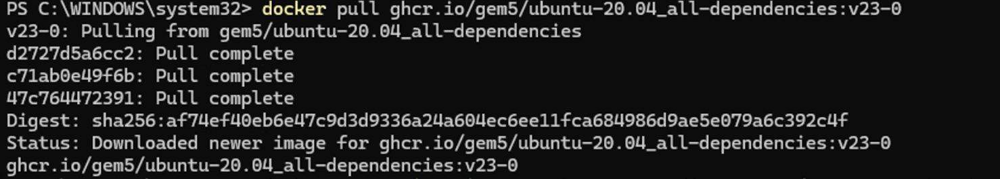
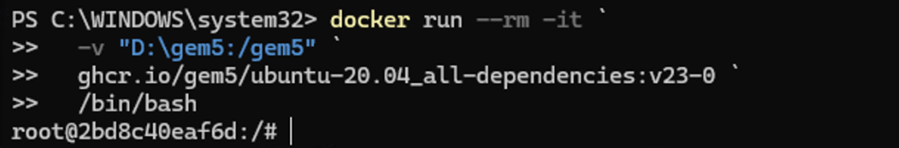
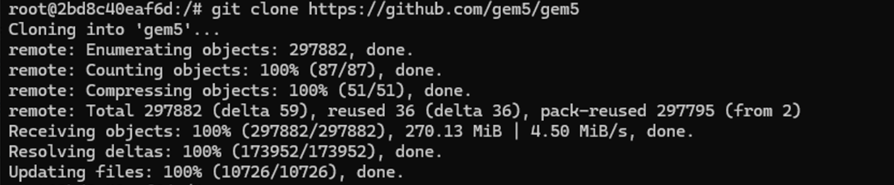
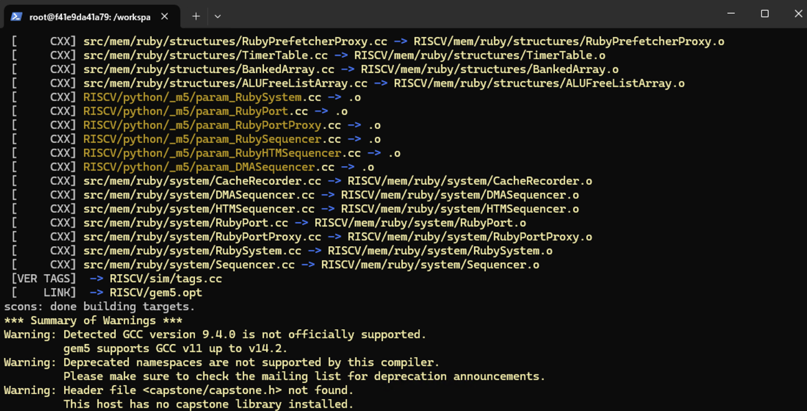
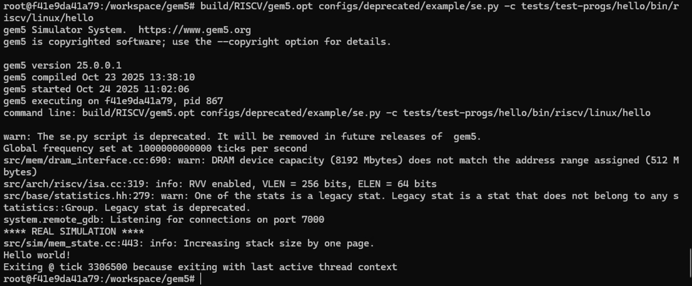
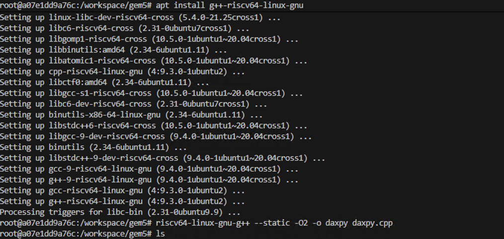
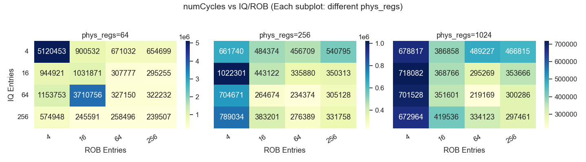
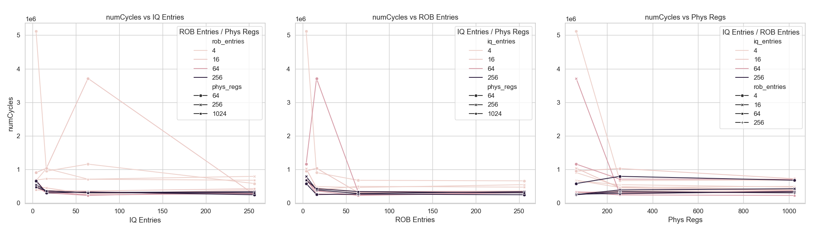
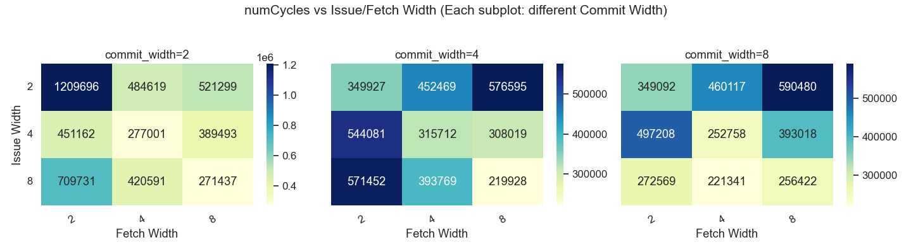
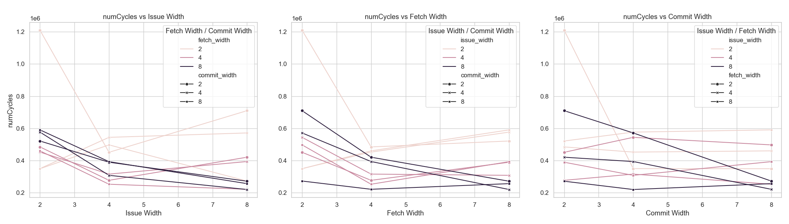

<div align="center">
    

<br><br><br>
</div>
<div style="font-size:1.6em; font-weight:normal; line-height:1.6;">
<div style="text-align:center; font-size:2.9em; font-weight:normal; letter-spacing:0.1em;">实验作业报告</div>
<br/>
<br>
<div style="text-align:center; font-size:1.3em; line-height:1.8;">
  <table style="margin: 0 auto; font-size:1.1em;">
  <tr><td align="right">实验：</td><td align="left">计算机体系结构</td></tr>
  <tr><td align="right">学号：</td><td align="left">23320093</td></tr>
  <tr><td align="right">姓名：</td><td align="left">林宏宇</td></tr>
  <tr><td align="right">专业：</td><td align="left">计算机科学与技术</td></tr>
  <tr><td align="right">班级：</td><td align="left">计科1班</td></tr>
  <tr><td align="right">指导教师：</td><td align="left">胡淼</td></tr>
  <tr><td align="right"style="border-bottom:1px solid #000;">实验日期：</td><td align="left" style="border-bottom:1px solid #000;">2025年10月24日</td></tr>
  </table>
</div>
</div>

<div STYLE="page-break-after: always;"></div>

# 数据库系统实验报告

本次作业将带领你使用 gem5 平台，完成一个基于 Tomasulo 算法的乱序 CPU（O3 CPU）仿真实验。你需要在本地编译部署 gem5，将一份 C++ 源代码编译为 RISC-V 二进制文件，并用 gem5 的 O3 CPU 配置对其进行仿真，调整关键参数，分析对系统性能的影响。

## ✏️ 作业要求

### 实验内容

#### 必做内容
1. 按照实验步骤 3 的要求，遍历参数组合进行仿真实验，记录每次仿真的 system.cpu.numCycles 数据，并以表格或可视化图表的方式呈现在实验报告中。
  - 提示：手动执行所有实验较为繁琐，建议编写自动化脚本辅助完成。
2. 结合仿真数据，分析 IQ 条目数和 ROB 条目数这两个参数对 CPU 模拟运行总时钟数的影响。
  - 例如，随着这两个参数的增大，CPU 运行的总时钟数是增加还是减少？通过调整这两个参数来减少总时钟数是否存在瓶颈？为什么？
  - 提示：可结合理论课 Tomasulo 算法的知识进行分析。

#### 选做内容
1. 分析物理整数寄存器数目对 O3 CPU 性能的影响。若无限制扩大物理整数寄存器数目，性能提升是否存在瓶颈？为什么？
  - 提示：可参考 resources 目录下 DynamicScheduling.pdf 关于重命名的内容，以及 daxpy.cpp 代码。
2. 尝试修改 O3CPU.py 代码，调整 O3 CPU 其他设置，分析更多因素对 CPU 仿真性能的影响。

### 实验报告

实验报告模板不限。需包含以下内容：
- 实验过程介绍，关键步骤（如 gem5 部署验证、daxpy.cpp 编译、仿真启动/结束等）需配图展示命令与结果。
- 如有额外代码文件，请附于报告，并简要说明其作用。
- 实验步骤 3 要求的全部实验内容。

### 报告提交
- 提交 PDF 版本实验报告
- 命名为“[姓名]-[学号]-lab1.pdf”，如“张三-23000001-lab1.pdf”
- 如有代码文件，请与报告一同打包为 zip 压缩包，命名为“[姓名]-[学号]-lab1.zip”
- DDL：10.26 23:59 前提交至超算习堂。

## 📋 实验内容

### 实验环境
- 设备 Windows11
- WSL2
- ubuntu
- 平台 Docker Desktop

### 第一步：使用 Docker 部署 gem5 模拟器

#### 1. 拉取 Ubuntu 镜像

```bash
docker pull ghcr.io/gem5/ubuntu-20.04_all-dependencies:v23-0
```

#### 2. 运行镜像

```bash
docker run --rm -it -v "D:\gem5:/workspace" ghcr.io/gem5/ubuntu-20.04_all-dependencies:v23-0 /bin/bash
```
> 建议使用明确的挂载路径，避免路径中的反斜杠问题。

#### 3. 克隆 gem5 代码

```bash
cd /workspace  # 进入挂载目录
git clone https://github.com/gem5/gem5
```

#### 4. 使用 scons 进行构建

```bash
cd /gem5  # 使用明确的挂载路径
python3 -m pip install kconfiglib  # 安装缺失的依赖
scons build/RISCV/gem5.opt -j 4
```

> **注意：**
> 1. 如遇内存不足报错，可通过 `.wslconfig` 文件增加 WSL2 内存限制。
> 2. 修改 `.wslconfig` 后需执行 `wsl --shutdown` 并重启 Docker Desktop。

`.wslconfig` 示例：
```ini
[wsl2]
memory=12GB   # 限制虚拟机内存为 12GB
process=4     # 限制虚拟机使用 4 个 CPU 核心
```

> **报错示例（内存不足）：**
> ```
> [    LINK]  -> ALL/gem5.opt
> collect2: fatal error: ld terminated with signal 9 [Killed]
> compilation terminated.
> scons: *** [build/ALL/gem5.opt] Error 1
> scons: building terminated because of errors.
> *** Summary of Warnings ***
> Warning: Detected GCC version 9.4.0 is not officially supported.
>          gem5 supports GCC v11 up to v14.2.
> Warning: Deprecated namespaces are not supported by this compiler.
>          Please make sure to check the mailing list for deprecation announcements.
> Warning: Header file <capstone/capstone.h> not found.
>          This host has no capstone library installed.
> ```

再次运行后，若输出如下即为成功：

```text
scons: done building targets.
```


#### 5. 构建完成后测试 hello world

```bash
build/RISCV/gem5.opt configs/deprecated/example/se.py -c tests/test-progs/hello/bin/riscv/linux/hello
```


### 第二步：编译 daxpy.cpp 为 RISC-V 二进制文件

#### 1. 安装必要工具

> Docker 容器默认以 root 用户运行，无需 sudo。

```bash
apt update
apt install g++-riscv64-linux-gnu   # 安装 RISC-V 交叉编译工具
apt install vim                     # 安装 vim 编辑器
```

#### 2. 编辑并保存 daxpy.cpp 代码

```bash
vim daxpy.cpp
```

在 vim 中：
- 按 `i` 进入插入模式，粘贴 C++ 代码
- 按 `Esc` 退出插入模式
- 输入 `:wq` 保存并退出

#### 3. 编译生成 RISC-V 可执行文件

```bash
riscv64-linux-gnu-g++ --static -O2 -o daxpy daxpy.cpp
```




### 第三步：运行 gem5 仿真并参数遍历

本步骤将使用 `O3CPU.py` 仿真配置文件，模拟 RISC-V 架构的 O3 CPU 运行上一步生成的二进制文件，并通过自动化脚本批量遍历参数组合，收集性能数据。

#### 1. 参数说明

| 参数名称              | 说明                 | 取值范围             |
|-----------------------|----------------------|----------------------|
| num-phys-int-regs     | 物理整数寄存器数目   | 64, 256, 1024        |
| num-iq-entries        | IQ 条目数            | 4, 16, 64, 256       |
| num-rob-entries       | ROB 条目数           | 4, 16, 64, 256       |

#### 2. 仿真命令格式

仿真命令格式如下，通过调整参数即可实现不同配置的仿真：

```bash
[gem5.opt 路径] --outdir=[结果保存目录] [python 配置文件] \
  -c [daxpy 二进制文件] \
  --num-phys-int-regs=[物理整数寄存器数] \
  --num-iq-entries=[IQ 条目数] \
  --num-rob-entries=[ROB 条目数]
```

示例：

```bash
build/RISCV/gem5.opt --outdir=results_256_64_192 O3CPU.py -c daxpy \
  --num-phys-int-regs=256 --num-iq-entries=64 --num-rob-entries=192
```

> 仿真结果将保存在 `--outdir` 指定目录下的 `stats.txt` 文件中。

#### 3. 关注的性能指标

在 `stats.txt` 文件中，建议关注以下 CPU 仿真性能指标：

| 指标名称                              | 说明                                   |
|----------------------------------------|----------------------------------------|
| system.cpu.numCycles                   | CPU 模拟运行的总时钟数                 |
| system.cpu.rename.ROBFullEvents        | 由于 ROB 已满导致的重命名阶段堵塞      |
| system.cpu.rename.IQFullEvents         | 由于 IQ 已满导致的重命名阶段堵塞       |
| system.cpu.rename.fullRegistersEvents  | 由于物理寄存器耗尽导致的重命名阶段堵塞 |

#### 4. 自动化仿真脚本

为高效遍历所有参数组合，可使用如下自动化脚本：

```python
# run_all.py
import os
import itertools

# 参数取值
phys_regs = [64, 256, 1024]
iq_entries = [4, 16, 64, 256]
rob_entries = [4, 16, 64, 256]

# 路径配置
gem5_bin = "build/RISCV/gem5.opt"
config_py = "O3CPU.py"
binary = "daxpy"

# 遍历所有参数组合并运行仿真
for p, iq, rob in itertools.product(phys_regs, iq_entries, rob_entries):
  outdir = f"results_{p}_{iq}_{rob}"
  cmd = f"{gem5_bin} --remote-gdb-port=-1 --outdir={outdir} {config_py} -c {binary} --num-phys-int-regs={p} --num-iq-entries={iq} --num-rob-entries={rob}"
  print(f"Running: {cmd}")
  os.system(cmd)
```

#### 5. 结果提取脚本

自动提取所有仿真结果目录下的关键性能指标，并汇总到 `summary.txt`：

```python
# analyze_results.py
import os
import glob

# 需要提取的指标
metrics = [
  "system.cpu.numCycles",
  "system.cpu.rename.ROBFullEvents",
  "system.cpu.rename.IQFullEvents",
  "system.cpu.rename.fullRegistersEvents"
]

output_file = "summary.txt"
result_files = sorted(glob.glob("results_*_*_*/stats.txt"))

with open(output_file, "w") as fout:
  # 写表头
  fout.write("phys_regs,iq_entries,rob_entries," + ",".join(metrics) + "\n")
  for filepath in result_files:
    # 提取参数
    parts = filepath.split("/")[0].split("_")
    phys_regs, iq_entries, rob_entries = parts[1], parts[2], parts[3]
    # 读取 stats.txt
    values = {m: "NA" for m in metrics}
    with open(filepath, "r") as fin:
      for line in fin:
        for m in metrics:
          if line.startswith(m):
            values[m] = line.split()[1]
    fout.write(f"{phys_regs},{iq_entries},{rob_entries}," + ",".join([values[m] for m in metrics]) + "\n")

print(f"结果已写入 {output_file}")
```

#### 6. 执行流程

```bash
# 运行所有仿真实验
python3 run_all.py
# 读取结果并生成 summary.txt
python3 analyze_results.py
# 查看结果
cat summary.txt
```

#### 7. 结果呈现
本实验通过自动化脚本批量遍历参数组合，收集了不同 IQ 条目数、ROB 条目数、物理寄存器数下的 CPU 总时钟数（system.cpu.numCycles）等指标。主要结果如下：

1. **数据可视化**

（1）**numCycles 热力图**

下图展示了 IQ 条目数与 ROB 条目数对 CPU 总时钟数的影响（每个子图为不同物理寄存器数 phys_regs）：



（2）**numCycles 分组折线图**

下图分别展示了 numCycles 随 IQ 条目数、ROB 条目数、物理寄存器数变化的趋势：



2. **原始数据表格**

部分实验结果如下（详见 附件summary.txt）：

| phys_regs | iq_entries | rob_entries | numCycles |
|-----------|------------|-------------|-----------|
| 64        | 4          | 4           | 5120453   |
| 64        | 16         | 16          | 1031871   |
| 256       | 64         | 64          | 234374    |
| 1024      | 256        | 256         | 297461    |
| ...       | ...        | ...         | ...       |

#### 8. 解答问题

IQ 条目数和 ROB 条目数对 CPU 总时钟数的影响分析

1. 随着 IQ 条目数和 ROB 条目数的增加，CPU 总时钟数（numCycles）整体呈下降趋势。这是因为更大的 IQ 和 ROB 能容纳更多在执行中的指令，减少流水线阻塞，提高指令级并行度。

2. 当 IQ 或 ROB 较小时，numCycles 明显较高，说明 CPU 经常因资源受限而停顿（可在热力图高值区域直观体现）。

3. 随着 IQ 和 ROB 继续增大，numCycles 的下降幅度逐渐减小并趋于平稳，说明资源扩展带来的收益递减，最终会受限于其他瓶颈（如数据相关、寄存器数等）。

4. 因此，单纯增大 IQ 和 ROB 并不能无限降低总时钟数，合理配置可在硬件成本和性能收益之间取得平衡。

5. 上述结论与 Tomasulo 算法理论一致：乱序执行结构的容量提升能显著提升性能，但存在边际收益递减和系统瓶颈。

#### 9.（选做）分析物理整数寄存器数目对 O3 CPU 性能的影响

通过实验可观察到：

1. 随着物理整数寄存器数目的增加，O3 CPU 的总时钟数（numCycles）整体呈下降趋势，性能得到提升。这是因为更多的物理寄存器可以减少寄存器重命名阶段的资源冲突，降低流水线因寄存器耗尽而阻塞的概率。

2. 当物理寄存器数较小时，system.cpu.rename.fullRegistersEvents 事件频繁，说明寄存器耗尽成为主要瓶颈，导致乱序执行能力受限。

3. 但当物理寄存器数增加到一定程度后，numCycles 的下降幅度逐渐减小并趋于平稳，fullRegistersEvents 事件也趋近于零。此时，性能瓶颈转向 IQ/ROB 容量、数据相关性等其他结构，继续增加寄存器数对性能提升作用有限。

4. 这与 Tomasulo 算法理论一致：寄存器重命名机制能有效消除写后读/写后写冒险，但寄存器资源不是唯一瓶颈，系统最终会受限于指令窗口、流水线宽度、内存带宽等。

5. 因此，物理寄存器数目并非越大越好，应结合实际 workload 和硬件资源综合权衡。

> 结论：无限制扩大物理整数寄存器数目，性能提升存在明显瓶颈。合理配置寄存器数可消除相关阻塞，但最终性能还需多方面协同优化。

### 选做内容

本部分进一步探索 O3 CPU 其他参数（如 issue width、fetch width、commit width）对性能的影响，采用与基础实验类似的自动化流程。

#### 1. O3CPU.py关键修改
``` python
parser = argparse.ArgumentParser()
def add_options(parser):
    parser.add_argument("-c", "--cmd", required=True, help="The binary to run.")
    parser.add_argument("--num-rob-entries", type=int, default=192)
    parser.add_argument("--num-iq-entries", type=int, default=64)
    parser.add_argument("--num-phys-int-regs", type=int, default=256)
    parser.add_argument("--issue-width", type=int, default=8, help="CPU issue width")
    parser.add_argument("--fetch-width", type=int, default=8, help="CPU fetch width")
    parser.add_argument("--commit-width", type=int, default=8, help="CPU commit width")
add_options(parser)
args = parser.parse_args()
```
``` python
# Set CPU parameters
system.cpu.numROBEntries = args.num_rob_entries
system.cpu.numIQEntries = args.num_iq_entries
system.cpu.numPhysIntRegs = args.num_phys_int_regs
system.cpu.numPhysFloatRegs = 64
system.cpu.issueWidth = args.issue_width
system.cpu.fetchWidth = args.fetch_width
system.cpu.commitWidth = args.commit_width
```
#### 2. 自动化仿真脚本

```python
# run_all_pro.py
import os
import itertools

# 固定部分参数
phys_int_regs = [64]
iq_entries = [16]
rob_entries = [64]
# 变化参数
issue_widths = [2, 4, 8]
fetch_widths = [2, 4, 8]
commit_widths = [2, 4, 8]

gem5_bin = "build/RISCV/gem5.opt"
config_py = "O3CPU_pro.py"
binary = "daxpy"

for preg, iq, rob, iw, fw, cw in itertools.product(phys_int_regs, iq_entries, rob_entries, issue_widths, fetch_widths, commit_widths):
  outdir = f"results_{preg}_{iq}_{rob}_{iw}_{fw}_{cw}"
  cmd = (
    f"{gem5_bin} --remote-gdb-port=-1 --outdir={outdir} {config_py} "
    f"-c {binary} "
    f"--num-phys-int-regs={preg} --num-iq-entries={iq} --num-rob-entries={rob} "
    f"--issue-width={iw} --fetch-width={fw} --commit-width={cw}"
  )
  print(f"Running: {cmd}")
  os.system(cmd)
```

#### 3. 结果提取脚本

```python
# analyze_results_pro.py
import os
import glob

metrics = [
  "system.cpu.numCycles",
  "system.cpu.rename.ROBFullEvents",
  "system.cpu.rename.IQFullEvents",
  "system.cpu.rename.fullRegistersEvents"
]

output_file = "summary_pro.txt"
result_files = sorted(glob.glob("results_*_*_*_*_*_*/stats.txt"))

with open(output_file, "w") as fout:
  fout.write("phys_int_regs,iq_entries,rob_entries,issue_width,fetch_width,commit_width," + ",".join(metrics) + "\n")
  for filepath in result_files:
    parts = filepath.split("/")[0].split("_")
    phys_int_regs, iq_entries, rob_entries, issue_width, fetch_width, commit_width = parts[1:7]
    values = {m: "NA" for m in metrics}
    with open(filepath, "r") as fin:
      for line in fin:
        for m in metrics:
          if line.startswith(m):
            values[m] = line.split()[1]
    fout.write(f"{phys_int_regs},{iq_entries},{rob_entries},{issue_width},{fetch_width},{commit_width}," + ",".join([values[m] for m in metrics]) + "\n")
print(f"结果已写入 {output_file}")
```

#### 4. 参数说明

| 参数名称         | 说明             | 取值范围   |
|------------------|------------------|------------|
| issue_width      | 发射宽度         | 2, 4, 8    |
| fetch_width      | 取指宽度         | 2, 4, 8    |
| commit_width     | 提交宽度         | 2, 4, 8    |
| phys_int_regs    | 物理整数寄存器   | 64         |
| iq_entries       | IQ 条目数        | 16         |
| rob_entries      | ROB 条目数       | 64         |

#### 5. 结果呈现

1. **数据可视化**

（1）**numCycles 热力图**

下图展示了 issue width 与 fetch width 对 CPU 总时钟数的影响（每个子图为不同 commit width）：



（2）**numCycles 分组折线图**

下图分别展示了 numCycles 随 issue width、fetch width、commit width 变化的趋势：



2. **原始数据表格**

部分实验结果如下（详见 summary_pro.txt）：

| issue_width | fetch_width | commit_width | numCycles |
|-------------|-------------|-------------|-----------|
| 2           | 2           | 2           | 1209696   |
| 4           | 4           | 4           | 315712    |
| 8           | 8           | 8           | 256422    |
| ...         | ...         | ...         | ...       |

#### 6. 解答问题

**issue width、fetch width、commit width 对 CPU 总时钟数的影响分析**

1. 随着 issue width、fetch width、commit width 的增加，CPU 总时钟数（numCycles）整体呈下降趋势，说明流水线宽度的提升有助于提升乱序 CPU 的指令吞吐能力。
2. 当这些宽度较小时，numCycles 明显较高，说明流水线并行度受限，系统吞吐能力不足。
3. 当宽度增大到一定程度后，numCycles 的下降幅度逐渐减小并趋于平稳，说明性能瓶颈转向其他资源（如 IQ/ROB/寄存器数、数据相关等）。
4. 因此，合理配置流水线宽度参数，可在硬件复杂度和性能之间取得平衡。

上述结论与乱序执行 CPU 的理论分析一致：流水线宽度提升能显著提升性能，但存在边际收益递减和系统瓶颈。


## 💡 实验总结

本次实验以 gem5 平台为基础，系统性地探索了乱序执行 CPU（O3 CPU）关键结构参数对系统性能的影响。通过自动化脚本批量遍历参数组合，利用可视化手段直观展示了 IQ 条目数、ROB 条目数、物理寄存器数、流水线宽度等对 CPU 总时钟数的影响规律。

主要收获与体会如下：

1. **理论与工程结合**：实验将理论课中 Tomasulo 算法、乱序执行、寄存器重命名等知识与实际仿真平台结合，帮助理解现代高性能处理器的设计原理。
2. **自动化与数据分析能力提升**：通过 Python 脚本实现参数自动遍历、结果提取与可视化，极大提升了实验效率和数据洞察力。
3. **性能瓶颈与优化认知**：实验结果表明，提升 IQ/ROB/寄存器/流水线宽度等资源可显著提升乱序 CPU 性能，但各结构存在边际收益递减，系统最终受限于多种瓶颈，需综合权衡设计。
4. **工程实践意义**：本实验流程和方法可推广到更复杂的体系结构设计、参数调优和性能分析任务中，具备较强的工程应用价值。

通过本次实验，我不仅加深了对乱序执行 CPU 结构和性能瓶颈的理解，也掌握了自动化实验、数据可视化和系统分析的基本方法，为后续深入研究和工程实践打下了坚实基础。

---

## 📚 参考资料
- [gem5 官方文档](https://www.gem5.org/)
- 《作业1》实验指导书
- 《计算机体系结构》课件

## 附件
1. daxpy.cpp 源代码
2. O3CPU.py 仿真配置文件
3. run_all.py 自动化仿真脚本
4. analyze_results.py 结果提取脚本
5. summary.txt 实验结果汇总
6. O3CPU_pro.py 选做内容仿真配置文件
7. run_all_pro.py 选做内容自动化仿真脚本
8. analyze_results_pro.py 选做内容结果提取脚本
9. summary_pro.txt 选做内容实验结果汇总
10. heatmap_numCycles.png numCycles 热力图
11. line_numCycles.png numCycles 分组折线图
12. heatmap_numCycles_pro.png 选做内容 numCycles 热力图
13. line_numCycles_pro.png 选做内容 numCycles 分组折线图
14. draw.py 可视化脚本
15. draw_pro.py 选做内容可视化脚本
16. images文件夹 实验过程截图
17. 其他项目运行所需配置文件