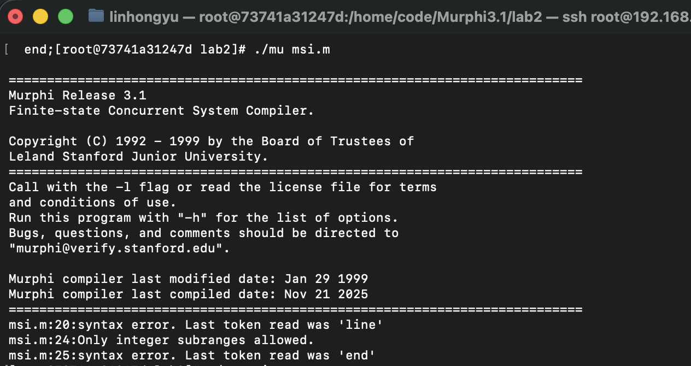
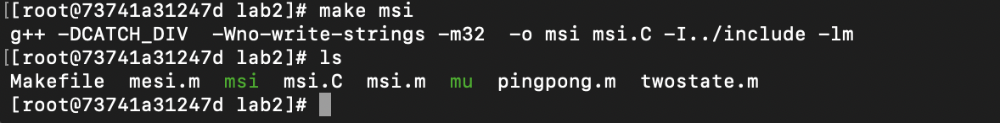
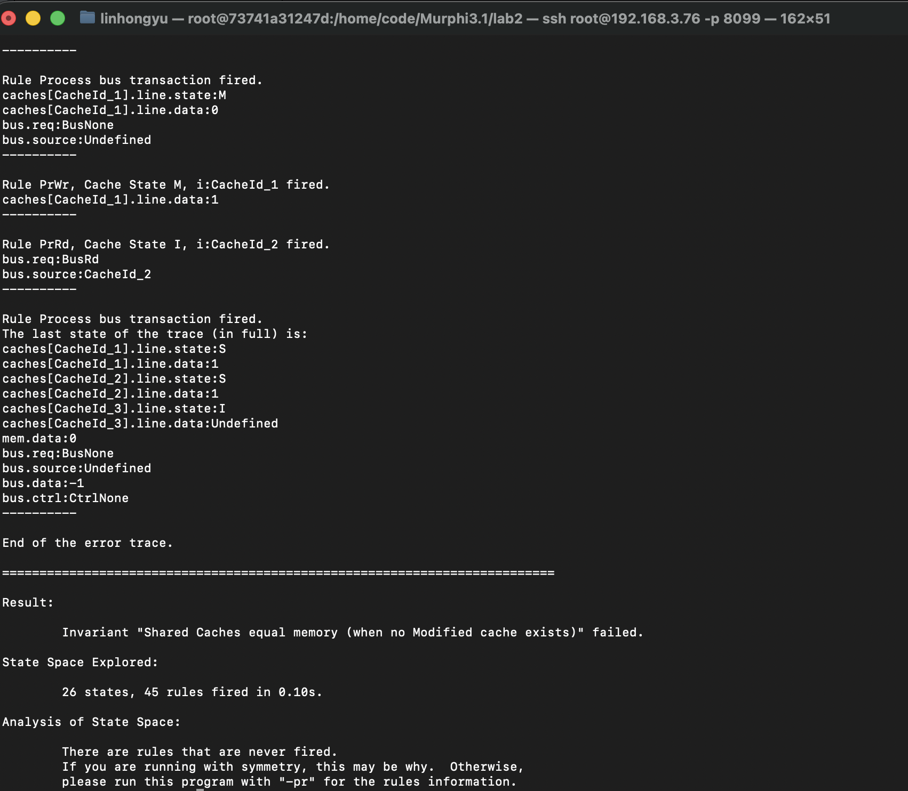
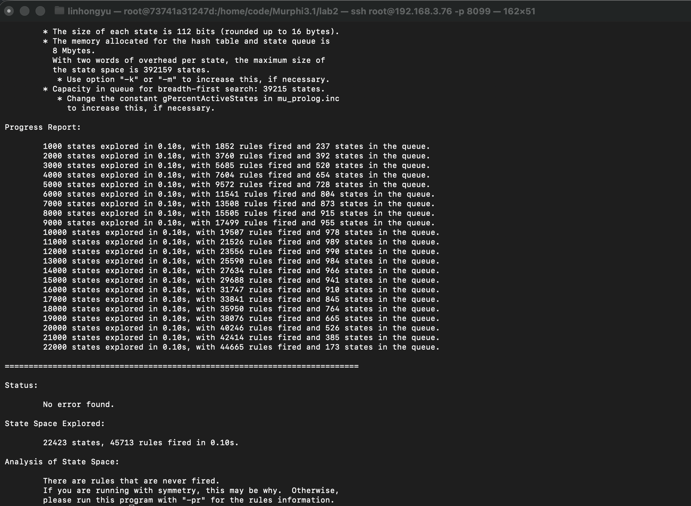
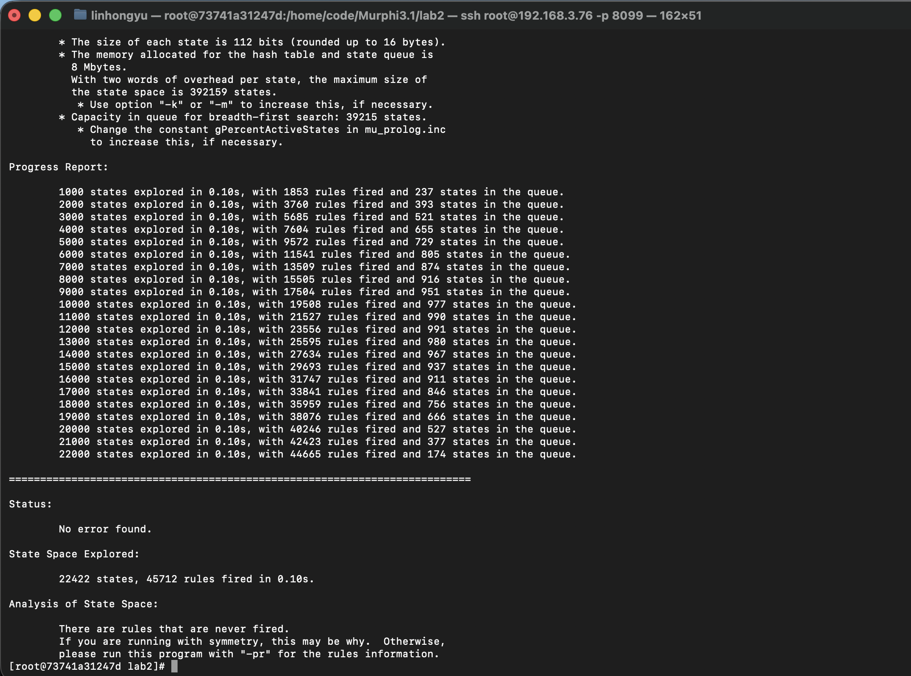

<div align="center">
    

<br><br><br>
</div>
<div style="font-size:1.6em; font-weight:normal; line-height:1.6;">
<div style="text-align:center; font-size:2.9em; font-weight:normal; letter-spacing:0.1em;">实验作业报告</div>
<br/>
<br>
<div style="text-align:center; font-size:1.3em; line-height:1.8;">
  <table style="margin: 0 auto; font-size:1.1em;">
  <tr><td align="right">实验：</td><td align="left">计算机体系结构</td></tr>
  <tr><td align="right">学号：</td><td align="left">23320093</td></tr>
  <tr><td align="right">姓名：</td><td align="left">林宏宇</td></tr>
  <tr><td align="right">专业：</td><td align="left">计算机科学与技术</td></tr>
  <tr><td align="right">班级：</td><td align="left">计科1班</td></tr>
  <tr><td align="right">指导教师：</td><td align="left">胡淼</td></tr>
  <tr><td align="right"style="border-bottom:1px solid #000;">实验日期：</td><td align="left" style="border-bottom:1px solid #000;">2025年12月1日</td></tr>
  </table>
</div>
</div>

<div STYLE="page-break-after: always;"></div>

# 计算机体系结构报告

## ✏️ 作业要求

### 提交内容

最终提交的文件应包括以下两部分：

#### 实验报告（PDF 格式）
- 命名格式：[姓名]-[学号]-lab2.pdf ，例如：张三-23000001-lab2.pdf  
- 报告内容应包括：
   - Cache 状态变换表格；
   - 协议关键实现代码及说明；
   - 执行 ./msi 命令后的输出内容，显示未发现错误，同时包含已探索的状态数量以及运行时间；
   - 思考题。

#### Murphi 源代码文件
- 文件名：msi.m 和 mesi.m(选做)
- 代码需能通过 Murphi 编译和运行，且逻辑与报告内容一致。

### 打包

请将上述文件打包成一个 ZIP 压缩包，命名格式为：[姓名]-[学号]-lab2.zip 

### 提交方式

请将作业提交至超算习堂。

### 提交截止时间

12月7日 23:59分前。

## 一、在进行协议编写之前，请根据你对 MSI 协议的理解，填写下面的 Cache 状态变化表格。

### MSI协议说明

在本次实验中，你将使用形式化验证工具 Murphi 实现并验证一个基于侦听的 MSI 缓存一致性协议。该协议应具备以下特征：

#### 1.基于广播的共享总线结构
- 协议通过一条共享总线（Bus）实现缓存与内存之间的通信。
- 任何读/写请求都会在总线上广播，所有缓存同时进行监听并响应。
#### 2.多缓存系统结构
- 系统包含 3 个缓存（Cache），每个缓存属于不同的处理器。
- 每个缓存只包含 1 个大小为 1 个内存单元的缓存行（为简化验证），但能够模拟读写行为。
- 各缓存通过一致性协议保持对同一内存块数据的一致视图。
#### 3.共享主存模块
- 系统中仅包含唯一的主存模块，内含 1 个内存单元（为简化验证）。
- 当总线上没有缓存响应数据时，由主存向请求方提供数据。
#### 4.三种缓存状态
- M（Modified）：缓存拥有数据的唯一有效副本，数据可能与内存不一致。
- S（Shared）：缓存拥有数据的共享副本，数据与内存一致。
- I（Invalid）：缓存行无效，需从其他缓存或内存获取最新数据。
#### 5.处理器行为建模
- 处理器可发出读（PrRd）和写（PrWr）请求。
- 若请求命中缓存，直接在缓存中读写；若缺失，则在总线上广播请求。
#### 6.两类总线事务
- BusRd：由读缺失触发，请求共享数据副本。
- BusRdX：由写缺失或写升级触发，请求独占数据副本。
#### 7.缓存侦听机制
- 所有缓存控制器通过侦听总线信号来感知其他缓存的请求，并对总线请求做出响应。
- 假设内存控制器对总线事务的响应晚于各缓存的 snooper，即优先由缓存响应总线请求，若无缓存响应则由内存处理。

### Cache 状态变化表格

#### CPU 操作引发的 Cache 状态变换表

| 当前Cache状态 | CPU操作 | 触发的总线事务 | 转移后的Cache状态 |
| ------------ | ------ | ------------ | --------------- |
|M|	PrRd	| 无	| M|
|M|	PrWr	| 无	| M|
|S|	PrRd	| 无	| S|
|S|	PrWr	| BusRdX	| M|
|I|	PrRd	| BusRd	| S|
|I|	PrWr	| BusRdX	| M|

#### 总线事务引发的 Cache 状态变换表

|当前Cache状态|侦听到的总线事务|Cache执行的操作|转移后的Cache状态|
|------------|--------------|--------------|---------------|
|M|	BusRd	| 写回内存，变为共享	| S|
|M|	BusRdX	| 写回内存，失效	| I|
|S|	BusRd	| 保持共享	| S|
|S|	BusRdX	| 失效	| I|
|I|	BusRd	| 无操作	| I|
|I|	BusRdX	| 无操作	| I|

### 表格答案说明：

#### 在 M 状态时
- 当有处理器读PrRd事件时，因为为读事件，且M代表当前cache的数据是要比其他的新，所以直接命中，不影响其他cache。所以进入M状态
- 当有处理器写PrWr事件时，同样也是因为当前cache是最新的，所以直接更新写，对其他cache不产生影响，所以还是进入M状态。
- 当接收到总线上有读BusRd的事件时，因为在M状态，数据是最新的，提供数据，所以产生FLUSH事件，最后进入S状态。
- 当接收到总线上有互斥读BusRdX的事件时，因为在M状态，说明要修改这个数据了，所以需要把数据写回内存，然后把自己无效掉，进入I状态。

#### 在 S 状态时：
- 当有处理器读PrRd事件时，因为数据就在本cache内且是最新的所以直接命中，还是S状态。
- 当有处理器写PrWr事件时，调用总线互斥读BusRdX事件（目的是告诉其他cache要修改这个cache,其他先都无效掉），当更新数据后，需要进入M状态，告知这是最新的数据，主存中的数据也是过时的。
- 当接收到总线上有读BusRd的事件时，当在共享态接受到其他的总线读信息时，与当前无关，所以还是S状态。
- 当接收到总线上有互斥读BusRdX的事件时，因为其他要修改这个数据了，所以需要把自己无效掉，进入I状态。

#### 在 I 状态时：
- 当有处理器读PrRd事件时，就会发生cache miss这样就会装入新数据，但此时其他的cache可能有也可能没有，所以进入S状态，当然需要总线读事件的支持，所以触发总线读事件BusRd
- 当有处理器写PrWr事件时，会导致cache miss，调用总线互斥读BusRdX事件（目的是告诉其他cache要修改这个cache,其他先都无效掉），把要写入的数据装入cache(这是由于采用写直达且不分配策略)，然后再修改，这时就会进入M状态
- 当接收到总线上有读BusRd的事件时，因为本来就是无效的，所以无操作，还是I状态
- 当接收到总线上有互斥读BusRdX的事件时，因为本来就是无效的，所以无操作，还是I状态

## 二、在提供的  msi.m 代码框架基础上，依据 Cache 状态变换表，补充并完善 MSI 协议的关键逻辑实现，并使用 Murphi 对协议模型进行验证，以确保协议满足一致性不变式

> 实验环境: docker 部署 centos7 

### Step 0. 构建Murphi验证环境
```bash
# 1.首先安装所需依赖：
sudo apt update
sudo apt install build-essential flex bison g++-multilib

# 2.将压缩包传输到系统上
scp -P 8099 "/Users/linhongyu/Documents/书架/计算机体系结构/hw2/Murphi3.1.tar.gz" root@192.168.3.76:/home/code/

# 3.解压并编译 Murphi 源码：
tar -xvzf Murphi3.1.tar.gz
cd Murphi3.1/src
make mu

# 4.make mu 失败: 安装所需工具 缺少32位开发环境（Makefile使用了-m32参数）
yum install -y gcc gcc-c++ make
yum install -y glibc-devel.i686 libgcc.i686 libstdc++.i686

# 5.验证 Murphi 正确性：
cd ./ex/sci
./mu sci.m
make sci
./sci

Status:
        No error found.

State Space Explored:
        18193 states, 60455 rules fired in 0.44s.

Analysis of State Space:
        There are rules that are never fired.
        If you are running with symmetry, this may be why.  Otherwise,
        please run this program with "-pr" for the rules information.
```

### Step 1. 补充并完善协议的关键逻辑实现

>代码位于 Murphi3.1/lab2 目录中的`msi.m`

#### 1.1 代码框架分析

`msi.m` 文件是 Murphi 协议验证工具的源代码，定义了 MSI 缓存一致性协议的形式化模型。

| 组成部分 | 功能说明 | 代码行数 |
|---------|---------|---------|
| 常量与类型定义 | 定义系统规模、状态枚举、数据结构 | 1-36 |
| 全局变量 | 缓存数组、内存、总线状态 | 37-39 |
| 辅助函数 | `CountModifiedCache()` 统计M状态缓存数 | 41-51 |
| Snoop过程 | 实现总线侦听逻辑（核心TODO） | 53-81 |
| 处理器读规则 | PrRd在M/S/I状态的行为（TODO） | 83-115 |
| 处理器写规则 | PrWr在M/S/I状态的行为（TODO） | 117-145 |
| 总线事务处理 | 协调侦听、内存响应、状态更新（TODO） | 147-175 |
| 初始化状态 | 定义系统初始状态 | 177-192 |
| 一致性不变式 | 4个关键不变式验证 | 194-223 |

#### 1.2 关键代码片段

**类型定义（核心数据结构）**
```murphi
type
  StateType : enum {M, S, I};                    -- MSI三状态
  CacheId   : scalarset(NUM_CACHE);              -- 支持对称性约简
  
  CacheLine : record
    state : StateType;
    data  : 0..15;
  end;
  
  Bus : record
    req     : BusReqType;                         -- BusNone/BusRd/BusRdX
    source  : CacheId;
    data    : -1..15;
    ctrl    : BusCtrlType;                        -- CtrlNone/CtrlFlush
  end;
```

**总线侦听过程（需实现TODO）**
```murphi
procedure Snoop(i: CacheId);
begin
  if bus.req = BusRd then
    switch caches[i].line.state
      case M: /* TODO: 提供数据，写回内存，转S */
      case S: /* TODO: 保持S */
      case I: /* TODO: 无操作 */
    endswitch;
  elsif bus.req = BusRdX then
    switch caches[i].line.state
      case M: /* TODO: 提供数据，写回内存，转I */
      case S: /* TODO: 转I */
      case I: /* TODO: 无操作 */
    endswitch;
  endif;
end;
```

**总线事务处理（三阶段流程）**
```murphi
rule "Process bus transaction"
  bus.req != BusNone
==> begin
  -- 阶段1：侦听
  for i : CacheId do
    if i != bus.source then Snoop(i); endif;
  endfor;

  -- 阶段2：内存响应（TODO: 根据bus.ctrl判断是否由内存提供数据）
  
  -- 阶段3：清理总线
  bus.req := BusNone;
  undefine bus.source;
  bus.data := -1;
  bus.ctrl := CtrlNone;
end;
```

**一致性不变式（验证目标）**
```murphi
invariant "Only one Cache may be Modified"
  CountModifiedCache() <= 1;

invariant "Modified Cache implies no Shared Cache"
  (CountModifiedCache() = 1) ->
  forall i : CacheId do
    caches[i].line.state != S
  end;

invariant "Shared Caches equal memory (when no Modified cache exists)"
  (CountModifiedCache() = 0) -> 
  forall i : CacheId do
    (caches[i].line.state = S) -> (caches[i].line.data = mem.data)
  end;
```

#### 1.3 实现要点

| 关注点 | 说明 |
|--------|------|
| **状态转换原子性** | 每个规则执行是原子的，避免中间状态 |
| **总线协议顺序** | 先侦听（Snoop）后响应（内存），避免竞争 |
| **数据一致性** | M状态写回时必须更新内存和bus.data |
| **幂等性** | 同一操作多次执行结果一致 |

#### 1.4 TODO部分代码实现

根据MSI协议状态转换表，需要实现以下几个关键部分：

**BusRd事务处理**：

```murphi
if bus.req = BusRd then
  switch caches[i].line.state
    case M:
      -- M状态收到BusRd：提供数据并转为S状态，同时写回内存
      bus.data := caches[i].line.data;
      bus.ctrl := CtrlFlush;
      caches[i].line.state := S;
      mem.data := caches[i].line.data;

    case S:
      -- S状态收到BusRd：保持S状态，无操作
      -- 多个S状态的缓存可以共存

    case I:
      -- I状态收到BusRd：无操作
  endswitch;
```

**实现要点**：
- M状态缓存收到BusRd时，必须提供最新数据并转为S状态（从独占变为共享）
- 通过`bus.ctrl := CtrlFlush`标记有缓存响应，避免内存重复提供数据
- 写回内存`mem.data := caches[i].line.data`确保内存与缓存一致
- S状态和I状态无需响应读请求

**BusRdX事务处理**：

```murphi
elsif bus.req = BusRdX then
  switch caches[i].line.state
    case M:
      -- M状态收到BusRdX：提供数据并转为I状态，同时写回内存
      bus.data := caches[i].line.data;
      bus.ctrl := CtrlFlush;
      caches[i].line.state := I;
      mem.data := caches[i].line.data;

    case S:
      -- S状态收到BusRdX：转为I状态
      caches[i].line.state := I;

    case I:
      -- I状态收到BusRdX：无操作
  endswitch;
```

**实现要点**：
- M状态缓存必须提供数据并失效（其他缓存请求独占权）
- S状态缓存必须失效（写操作需要独占，不允许共享）
- I状态无需操作


**处理器读请求（PrRd）实现**：

```murphi
rule "PrRd, Cache State M"
  (caches[i].line.state = M) & (bus.req = BusNone)
==> begin
  -- M状态读命中，无需任何操作
  -- 数据已经在本地���存中，且是最新的
end;

rule "PrRd, Cache State S"
  (caches[i].line.state = S) & (bus.req = BusNone)
==> begin
  -- S状态读命中，无需任何操作
  -- 数据已经在本地缓存中
end;

rule "PrRd, Cache State I"
  (caches[i].line.state = I) & (bus.req = BusNone)
==> begin
  -- I状态读缺失，发起BusRd请求
  bus.req := BusRd;
  bus.source := i;
  bus.data := -1;
  bus.ctrl := CtrlNone;
end;
```

**实现要点**：
- M和S状态直接命中，空操作即可
- I状态需要发起BusRd事务获取数据
- 总线请求设置source标识请求者，避免自己响应自己

**处理器写请求（PrWr）实现**：

```murphi
rule "PrWr, Cache State M"
  (caches[i].line.state = M) & (bus.req = BusNone)
==> begin
  -- M状态写命中，直接修改数据
  caches[i].line.data := (caches[i].line.data + 1)%16;
end;

rule "PrWr, Cache State S"
  (caches[i].line.state = S) & (bus.req = BusNone)
==> begin
  -- S状态写缺失，发起BusRdX请求获取独占权
  bus.req := BusRdX;
  bus.source := i;
  bus.data := -1;
  bus.ctrl := CtrlNone;
end;

rule "PrWr, Cache State I"
  (caches[i].line.state = I) & (bus.req = BusNone)
==> begin
  -- I状态写缺失，发起BusRdX请求
  bus.req := BusRdX;
  bus.source := i;
  bus.data := -1;
  bus.ctrl := CtrlNone;
end;
```

**实现要点**：
- M状态已拥有独占权，直接写入
- S状态需要先获取独占权（使其他共享缓存失效）
- I状态需要获取数据和独占权

**总线事务处理实现**：

```murphi
rule "Process bus transaction"
  bus.req != BusNone
==> begin
  -- 阶段1：所有其他缓存侦听总线
  for i : CacheId do
    if i != bus.source then
      Snoop(i);
    endif;
  endfor;

  -- 阶段2：内存响应（根据bus.ctrl判断）
  if bus.ctrl = CtrlNone then
    -- 没有缓存提供数据，由内存响应
    if bus.req = BusRd then
      caches[bus.source].line.data := mem.data;
      caches[bus.source].line.state := S;
    elsif bus.req = BusRdX then
      caches[bus.source].line.data := mem.data;
      caches[bus.source].line.state := M;
    endif;
  else
    -- 有缓存提供数据（bus.ctrl = CtrlFlush）
    if bus.req = BusRd then
      caches[bus.source].line.data := bus.data;
      caches[bus.source].line.state := S;
      mem.data := bus.data;
    elsif bus.req = BusRdX then
      caches[bus.source].line.data := bus.data;
      caches[bus.source].line.state := M;
      mem.data := bus.data;
    endif;
  endif;

  -- 阶段3：清理总线状态
  bus.req := BusNone;
  undefine bus.source;
  bus.data := -1;
  bus.ctrl := CtrlNone;
end;
```

**实现要点**：
- **三阶段原子操作**：侦听→响应→清理，避免中间状态
- **优先级机制**：缓存响应优先于内存（通过bus.ctrl判断）
- **状态转换规则**：
  - BusRd：目标缓存转为S状态（共享）
  - BusRdX：目标缓存转为M状态（独占修改）
- **内存一致性**：有缓存提供数据时，内存同步更新

> **完整实现代码请参见附件 `msi.m` 文件。**

### Step 2. 编译Murphi源文件
使用  mu  将 Murphi 源文件转换为 C 代码：
```bash
cd Murphi3.1/lab2
./mu msi.m
```
> 此时应生成一个名为  msi.c  的文件。

### Step3: 无法生成 msi.C

#### 实验过程中遇到错误，无法生成 msi.c 文件

- mu工具有问题，直接复制sx/sci下的mu工具到lab2下

```bash
cp /home/code/Murphi3.1/ex/sci/mu /home/code/Murphi3.1/lab2/mu
```

- 重新编译，可以看到报错信息，证明mu工具可以正常使用



### Step4: 解决报错，生成 msi.C 文件

#### 报错信息

```bash
msi.m:49: warning: Scalarset is used in loop index.
	Please make sure that the iterations are independent.
msi.m:181: warning: Scalarset is used in loop index.
	Please make sure that the iterations are independent.
msi.m:224: warning: Scalarset is used in loop index.
	Please make sure that the iterations are independent.
Code generated in file msi.C
```

#### 分析错误并修正代码

- 报错信息提示在使用 scalarset 类型作为循环索引时，需确保迭代是独立的
- 检查代码中使用 scalarset 作为循环索引的部分，确保每次迭代不会相互影响
- 修改代码后，重新运行 mu 工具生成 msi.c 文件


### Step 4. 编译 Murphi 生成的C文件

- 使用  make  编译生成可执行文件：

```bash
make msi
```

- 执行成功后，目录中会出现可执行文件  msi  。



### Step 5. 运行

#### 运行模型并查看验证过程

```bash
./msi
```
>在实验过程中，可能需要使用  ./msi -tv  来进行debug，详细说明⻅附录

#### 初次实验结果


```bash
Result:

	Invariant "Shared Caches equal memory (when no Modified cache exists)" failed.

State Space Explored:

	26 states, 45 rules fired in 0.10s.
```

#### 分析错误信息 
- 错误本质：M状态脏数据未写回内存就转为S状态
- 违反不变式：S状态缓存数据(1) ≠ 内存数据(0)
- 触发场景：M→S状态转换时（BusRd事务）
- 修复位置：Snoop过程 和 总线事务处理中
- 核心原则：M状态数据变为共享时必须同步到内存

#### 成功的实验结果

```bash
Status:

	No error found.

State Space Explored:

	22423 states, 45713 rules fired in 0.10s.

Analysis of State Space:

	There are rules that are never fired.
	If you are running with symmetry, this may be why.  Otherwise,
	please run this program with "-pr" for the rules information.
```



### Step 6. 实现过程中的调试经验

#### 问题1：内存一致性不变式失败
- **现象**：`Shared Caches equal memory` 不变式失败
- **原因**：M状态缓存响应BusRd时未写回内存
- **解决**：在Snoop过程中添加 `mem.data := caches[i].line.data`

#### 问题2：多个M状态缓存共存
- **现象**：`Only one Cache may be Modified` 不变式失败
- **原因**：BusRdX处理时未正确失效其他缓存
- **解决**：确保S状态缓存收到BusRdX时转为I状态

#### 问题3：状态转换时序问题
- **现象**：状态空间爆炸或死锁
- **原因**：总线事务处理不原子
- **解决**：将侦听、响应、清理作为一个原子规则执行

#### 问题4：M状态脏数据未写回内存就转为S状态
- **现象**：M状态缓存响应BusRd时未写回内存
- **原因**：在Snoop过程中未正确处理M状态转换
- **解决**：在Snoop过程中添加 `mem.data := caches[i].line.data` 确保内存同步


## 三、基于侦听 MSI 缓存一致性协议存在哪些问题？可能的改进方向是什么

### MSI协议存在的主要问题

#### 1. 性能问题

- **写缺失开销大**
   - 当处理器在S状态下执行写操作时，需要发起BusRdX事务使所有其他缓存失效
   - 即使只是简单的写操作，也需要通过总线通信，增加了延迟
   - 在实验验证中发现，频繁的写操作会导致大量的状态转换和总线事务

- **总线带宽利用率低**
   - 每次BusRd和BusRdX事务都需要占用总线
   - 多个缓存同时监听总线，但实际参与数据传输的缓存有限
   - 总线成为系统性能瓶颈，特别是在多处理器系统中

- **缓存利用率不足**
   - 缺少独占（Exclusive）状态，导致即使数据只在一个缓存中存在，也被标记为Shared
   - 后续对该数据的写操作仍需要总线事务，产生不必要的开销

#### 2. 扩展性问题

- **总线仲裁复杂度**
   - 随着处理器数量增加，总线仲裁变得复杂
   - 广播机制在大规模多处理器系统中效率低下
   - 从验证结果看，3个缓存的系统已经产生了22423个状态空间

- **功耗问题**
   - 所有缓存都需要监听总线上的每个事务
   - 即使与本缓存无关的事务也会触发监听逻辑
   - 增加了系统整体功耗

#### 3. 一致性维护成本

- **写回策略的限制**
   - M状态的缓存在响应BusRd时需要立即写回内存
   - 频繁的写回操作增加了内存访问开销
   - 从实验代码中可以看到，每次Snoop操作都可能触发内存更新

- **状态转换开销**
   - 每次总线事务都可能导致多个缓存的状态变化
   - 状态转换需要额外的控制逻辑和时间开销

### 可能的改进方向

#### 1. 协议层面的改进

- **升级到MESI协议**
   - 增加Exclusive（E）状态：数据只在一个缓存中存在且与内存一致
   - 优势：E状态下的写操作无需总线事务，直接转为M状态
   - 减少了不必要的总线通信和状态转换

- **实现MOESI协议**
   - 在MESI基础上增加Owned（O）状态
   - O状态缓存负责响应其他缓存的读请求，减少内存访问
   - 进一步优化了共享数据的访问效率

- **目录协议替代**
   - 使用分布式目录代替总线广播
   - 每个内存块维护共享者列表
   - 只向真正需要的缓存发送一致性消息

#### 2. 架构层面的改进

- **层次化缓存一致性**
   - 实现多级缓存一致性协议
   - L1缓存使用简单协议，L2/L3使用复杂协议
   - 减少远程访问和全局通信

- **非一致性缓存架构**
   - 软件管理的缓存一致性
   - 编译器优化和显式同步
   - 适用于特定应用场景

#### 3. 实现层面的优化

- **预测和预取机制**
   - 基于访问模式预测未来的缓存需求
   - 主动预取可能需要的数据
   - 减少缓存缺失率

- **延迟写回策略**
   - M状态数据不立即写回内存
   - 使用写回缓冲区延迟写操作
   - 减少内存带宽占用

- **智能总线仲裁**
   - 基于优先级的总线访问控制
   - 批处理相关事务减少总线占用
   - 动态调整仲裁策略

### 3.3 实验验证的改进建议

通过Murphi验证工具的实验，思考：

- **状态空间优化**：当前实现探索了22423个状态，可以通过状态压缩和对称性约简进一步优化

- **不变式验证**：成功验证了关键的一致性不变式，但可以增加更多性能相关的约束条件

- **错误检测能力**：验证过程发现了内存一致性问题，说明形式化验证对协议设计的重要性


## 四、在进行协议编写之前，请根据你对 MESI 协议的理解，填写下面的 Cache 状态变化表格。
> 使用形式化验证工具 Murphi 实现并验证一个基于侦听的 MESI 缓存一致性协议 **（选作内容加分）**

### MESI协议说明

#### MESI 四状态

- M Modified（已修改）
  - 缓存行已被本核修改，内存中的副本是旧的
  - 只有本核持有此行（脏数据），且与内存不一致。
  - 被其他核读时：需回写或转发后降级。

- E Exclusive（独占）
  - 只在本核存在，与内存一致。
  - 本核写入可直接转为 M，无需失效其他核。

- S Shared（共享）
  - 多个核持有，与内存一致（只读共享）。
  - 本核要写 -> 先广播失效，让其他核置 I，自己再升为 M。

- I Invalidated（已失效）
  - 该行无效，本地副本失效，不可用
访问会引发缺失并从其他层/内存获取。

#### 总线嗅探与状态转换

核心对共享总线上的一致性事务监听：读、写意图、失效、升级等。
当某核要写某行时，会广播失效；其他核看到后把本地对应行标为 Invalid。

- 读缺失（本核没有该行）：CPU 发起 BusRd（总线读），如果其他核有 M，会把脏数据写回或直接响应（把数据提供给请求核），最终参与者变为 S（或 E：若只有一个核有且未修改则可为 E）。

- 写缺失（本核没有该行）：CPU 发起 BusRdX（独占读/写），其他核将该行置为 I；请求核取得 M。

- 写到已共享行：本核可发 BusUpgr（升级请求），通知其他核把该行置 I，然后本核转为 M（避免再读主存）。

- 从 M 被读走：若某核读走一行且别的核处于 M，持有 M 的核需将脏数据写回（或直接把数据给请求方），从 M 转为 S（或 I，视操作而定）。

### Cache 状态变化表格

#### CPU 操作引发的 Cache 状态变换表

|当前Cache状态|CPU操作|触发的总线事务|转移后的Cache状态|
|------------|------|------------|---------------|
|M |PrRd| 无 | M |
|M |PrWr| 无 | M |
|E |PrRd| 无 | E |
|E |PrWr| 无 | M |
|S |PrRd| 无 | S |
|S |PrWr| BusUpgr | M |
|I |PrRd| BusRd | S/E |
|I |PrWr| BusRdX | M |

#### 总线事务引发的 Cache 状态变换表

|当前Cache状态|侦听到的总线事务|Cache执行的操作|转移后的Cache状态|
|------------|--------------|--------------|---------------|
|M |BusRd| 提供数据，写回内存 | S |
|M |BusRdX| 提供数据，写回内存 | I |
|E |BusRd| 提供数据 | S |
|E |BusRdX| 失效 | I |
|S |BusRd| 无操作 | S |
|S |BusRdX| 失效 | I |
|S |BusUpgr| 失效 | I |
|I |BusRd| 无操作 | I |
|I |BusRdX| 无操作 | I |
|I |BusUpgr| 无操作 | I |

### 表格答案说明：

#### **M 状态（Modified - 已修改）**：
- **PrRd（处理器读）**：数据已在缓存中且是最新的，直接命中，保持M状态
- **PrWr（处理器写）**：数据已在缓存中且独占，直接写入，保持M状态
- **BusRd**：其他缓存请求读取，需提供最新数据并写回内存，转为S状态（共享）
- **BusRdX**：其他缓存请求独占，提供数据并写回内存，自己转为I状态（失效）

#### **E 状态（Exclusive - 独占）**：
- **PrRd（处理器读）**：数据已在缓存中，直接读取，保持E状态
- **PrWr（处理器写）**：独占状态下可直接写入，转为M状态（因为修改了数据）
- **BusRd**：其他缓存请求读取，提供数据，转为S状态（变为共享）
- **BusRdX**：其他缓存请求独占，失效自己的缓存行，转为I状态

#### **S 状态（Shared - 共享）**：
- **PrRd（处理器读）**：数据已在缓存中，直接读取，保持S状态
- **PrWr（处理器写）**：需要获得独占权，发起BusUpgr使其他缓存失效，转为M状态
- **BusRd**：其他缓存也要读取，保持S状态（多个缓存可以同时共享）
- **BusRdX**：其他缓存请求独占，失效自己的缓存行，转为I状态
- **BusUpgr**：其他缓存从S升级为M，失效自己的缓存行，转为I状态

#### **I 状态（Invalid - 无效）**：
- **PrRd（处理器读）**：缺失，发起BusRd请求数据，根据是否有其他缓存响应转为S或E状态
- **PrWr（处理器写）**：缺失，发起BusRdX请求独占数据，转为M状态
- **所有总线事务**：缓存行本来就无效，无需任何操作，保持I状态

### 思考：MESI相比MSI的改进：

1. **新增E状态**：当数据只在一个缓存中存在且与内存一致时，标记为E状态而非S状态
2. **减少总线事务**：E状态下的写操作无需总线通信，直接转为M状态
3. **新增BusUpgr事务**：S状态写入时使用BusUpgr而非BusRdX，避免重新获取数据
4. **优化性能**：减少了不必要的总线通信和内存访问

## 五、请在提供的  mesi.m 代码框架基础上，依据 Cache 状态变换表，补充并完善 

MESI 协议的关键逻辑实现，并使用 Murphi 对协议模型进行验证，以确保协议满足一致性不变式。

### Step 1. 补充并完善协议的关键逻辑实现

>代码位于 Murphi3.1/lab2 目录中的`mesi.m`

#### 1.1 代码框架分析

`mesi.m` 文件是 Murphi 协议验证工具的源代码，定义了 MESI 缓存一致性协议的形式化模型。

| 组成部分 | 功能说明 | 代码行数 |
|---------|---------|---------|
| 常量与类型定义 | 定义系统规模、状态枚举、数据结构 | 1-38 |
| 全局变量 | 缓存数组、内存、总线状态 | 39-41 |
| 辅助函数 | `CountModifiedCache()`和`CountExclusiveCache()` | 43-63 |
| Snoop过程 | 实现总线侦听逻辑（核心实现） | 65-136 |
| 处理器读规则 | PrRd在M/E/S/I状态的行为 | 138-179 |
| 处理器写规则 | PrWr在M/E/S/I状态的行为 | 181-232 |
| 总线事务处理 | 协调侦听、内存响应、状态更新 | 234-299 |
| 初始化状态 | 定义系统初始状态 | 301-316 |
| 一致性不变式 | 4个关键不变式验证 | 318-348 |

#### 1.2 关键代码片段

**类型定义（核心数据结构）**
```murphi
type
  StateType : enum {M, E, S, I};                 -- MESI四状态
  CacheId   : scalarset(NUM_CACHE);              -- 支持对称性约简
  
  CacheLine : record
    state : StateType;
    data  : 0..15;
  end;
  
  Bus : record
    req     : BusReqType;                         -- BusNone/BusRd/BusRdX/BusUpgr
    source  : CacheId;
    data    : -1..15;
    ctrl    : BusCtrlType;                        -- CtrlNone/CtrlFlush/CtrlFlushOpt
  end;
```

**辅助函数（状态统计）**
```murphi
function CountModifiedCache(): CountType;
var cnt: CountType;
begin
  cnt := 0;
  for i: CacheId do
    if (caches[i].line.state = M) then
      cnt := cnt + 1;
    end;
  end;
  return cnt;
end;

function CountExclusiveCache(): CountType;
var cnt: CountType;
begin
  cnt := 0;
  for i: CacheId do
    if (caches[i].line.state = E) then
      cnt := cnt + 1;
    end;
  end;
  return cnt;
end;
```

**总线侦听过程（完整实现）**
```murphi
procedure Snoop(i: CacheId);
begin
  if bus.req = BusRd then
    switch caches[i].line.state
      case M: -- M状态响应BusRd
      case E: -- E状态响应BusRd
      case S: -- S状态无操作
      case I: -- I状态无操作
    endswitch;
  elsif bus.req = BusRdX then
    switch caches[i].line.state
      case M: -- M状态响应BusRdX
      case E: -- E状态失效
      case S: -- S状态失效
      case I: -- I状态无操作
    endswitch;
  elsif bus.req = BusUpgr then
    switch caches[i].line.state
      case S: -- S状态失效
      case I: -- I状态无操作
    endswitch;
  endif;
end;
```

**一致性不变式（验证目标）**
```murphi
invariant "Only one Cache may be Modified or Exclusive"
  CountModifiedCache() + CountExclusiveCache() <= 1;

invariant "Modified or Exclusive Cache implies no Shared Cache"
  (CountModifiedCache() = 1 | CountExclusiveCache() = 1) ->
  forall i : CacheId do
    caches[i].line.state != S
  end;

invariant "Shared/Exclusive Caches equal memory (when no Modified cache exists)"
  (CountModifiedCache() = 0) -> 
  forall i : CacheId do
    (caches[i].line.state = S | caches[i].line.state = E) -> 
    (caches[i].line.data = mem.data)
  end;
```

#### 1.3 实现要点

| 关注点 | 说明 |
|--------|------|
| **E状态的判定** | 需检测是否有其他共享缓存决定E/S状态 |
| **BusUpgr新事务** | S状态升级为M，避免重新获取数据 |
| **状态转换原子性** | 每个规则执行是原子的，避免中间状态 |
| **E→M直接转换** | E状态写入无需总线事务，直接转M |
| **数据一致性** | E/S状态数据必须与内存一致 |

#### 1.4 MESI协议核心实现

**BusRd事务处理（三种状态响应）**：

```murphi
if bus.req = BusRd then
  switch caches[i].line.state
    case M:
      -- M状态收到BusRd：提供数据并转为S状态，同时写回内存
      bus.data := caches[i].line.data;
      bus.ctrl := CtrlFlush;
      caches[i].line.state := S;
      mem.data := caches[i].line.data;

    case E:
      -- E状态收到BusRd：提供数据并转为S状态
      bus.data := caches[i].line.data;
      bus.ctrl := CtrlFlush;
      caches[i].line.state := S;

    case S:
      -- S状态收到BusRd：无操作，保持S状态
      -- 多个S状态的缓存可以共存

    case I:
      -- I状态收到BusRd：无操作
  endswitch;
```

**实现要点**：
- M状态：提供最新脏数据，写回内存，转为共享状态S
- E状态：提供数据，从独占转为共享状态S（数据已与内存一致，无需写回）
- S状态和I状态：无需响应，多个S状态可共存

**BusRdX事务处理（独占写请求）**：

```murphi
elsif bus.req = BusRdX then
  switch caches[i].line.state
    case M:
      -- M状态收到BusRdX：提供数据并转为I状态，同时写回内存
      bus.data := caches[i].line.data;
      bus.ctrl := CtrlFlush;
      caches[i].line.state := I;
      mem.data := caches[i].line.data;

    case E:
      -- E状态收到BusRdX：失效
      caches[i].line.state := I;

    case S:
      -- S状态收到BusRdX：转为I状态
      caches[i].line.state := I;

    case I:
      -- I状态收到BusRdX：无操作
  endswitch;
```

**实现要点**：
- M状态：提供脏数据，写回内存，失效自己
- E/S状态：直接失效，让出独占权
- 所有共享者必须失效，保证请求者获得独占权

**BusUpgr事务处理（升级请求）**：

```murphi
elsif bus.req = BusUpgr then
  switch caches[i].line.state
    case S:
      -- S状态收到BusUpgr：失效
      caches[i].line.state := I;

    case I:
      -- I状态收到BusUpgr：无操作
  endswitch;
```

**实现要点**：
- BusUpgr是MESI的新增事务，用于S→M升级
- 只需失效其他S状态缓存，无需传输数据
- 相比BusRdX更高效（数据已在缓存中）

**处理器读请求（PrRd）实现**

```murphi
rule "PrRd, Cache State M"
  (caches[i].line.state = M) & (bus.req = BusNone)
==> begin
  -- M状态读命中，无需任何操作
end;

rule "PrRd, Cache State E"
  (caches[i].line.state = E) & (bus.req = BusNone)
==> begin
  -- E状态读命中，无需任何操作
end;

rule "PrRd, Cache State S"
  (caches[i].line.state = S) & (bus.req = BusNone)
==> begin
  -- S状态读命中，无需任何操作
end;

rule "PrRd, Cache State I"
  (caches[i].line.state = I) & (bus.req = BusNone)
==> begin
  -- I状态读缺失，发起BusRd请求
  bus.req := BusRd;
  bus.source := i;
  bus.data := -1;
  bus.ctrl := CtrlNone;
end;
```

**实现要点**：
- M/E/S状态均为命中，直接读取
- I状态发起BusRd，可能转为E或S状态（取决于是否有其他共享者）

**处理器写请求（PrWr）实现**

```murphi
rule "PrWr, Cache State M"
  (caches[i].line.state = M) & (bus.req = BusNone)
==> begin
  -- M状态写命中，直接修改数据
  caches[i].line.data := (caches[i].line.data + 1)%16;
end;

rule "PrWr, Cache State E"
  (caches[i].line.state = E) & (bus.req = BusNone)
==> begin
  -- E状态写入：直接转为M状态，无需总线事务（关键优化）
  caches[i].line.data := (caches[i].line.data + 1)%16;
  caches[i].line.state := M;
end;

rule "PrWr, Cache State S"
  (caches[i].line.state = S) & (bus.req = BusNone)
==> begin
  -- S状态写缺失，发起BusUpgr请求获取独占权
  bus.req := BusUpgr;
  bus.source := i;
  bus.data := -1;
  bus.ctrl := CtrlNone;
end;

rule "PrWr, Cache State I"
  (caches[i].line.state = I) & (bus.req = BusNone)
==> begin
  -- I状态写缺失，发起BusRdX请求
  bus.req := BusRdX;
  bus.source := i;
  bus.data := -1;
  bus.ctrl := CtrlNone;
end;
```

**实现要点**：
- M状态：已独占，直接写入
- **E状态（核心优化）**：无需总线事务，直接转M（避免了MSI中的BusRdX）
- S状态：发起BusUpgr升级为M（比BusRdX更高效）
- I状态：发起BusRdX获取数据和独占权

**总线事务处理实现**

```murphi
rule "Process bus request"
  bus.req != BusNone
==> 
var hasSharedCache: boolean;
begin
  -- 阶段1：所有其他缓存侦听总线
  for i : CacheId do
    if i != bus.source then
      Snoop(i);
    endif;
  endfor;

  -- 阶段2：内存响应（根据bus.ctrl判断）
  if bus.ctrl = CtrlNone then
    -- 没有缓存提供数据，由内存响应
    if bus.req = BusRd then
      -- 检查是否有其他S状态缓存，决定E/S状态
      hasSharedCache := false;
      for j: CacheId do
        if (caches[j].line.state = S) then
          hasSharedCache := true;
        endif;
      endfor;
      
      caches[bus.source].line.data := mem.data;
      if hasSharedCache then
        caches[bus.source].line.state := S;  -- 有共享者，转S
      else
        caches[bus.source].line.state := E;  -- 无共享者，转E
      endif;
      
    elsif bus.req = BusRdX then
      -- BusRdX：从内存读取，状态变为M
      caches[bus.source].line.data := mem.data;
      caches[bus.source].line.state := M;
      
    elsif bus.req = BusUpgr then
      -- BusUpgr：升级为M状态，数据已在缓存中
      caches[bus.source].line.state := M;
      caches[bus.source].line.data := (caches[bus.source].line.data + 1)%16;
    endif;
    
  else
    -- 有缓存提供数据（bus.ctrl = CtrlFlush）
    if bus.req = BusRd then
      caches[bus.source].line.data := bus.data;
      caches[bus.source].line.state := S;
      mem.data := bus.data;  -- 更新内存
      
    elsif bus.req = BusRdX then
      caches[bus.source].line.data := bus.data;
      caches[bus.source].line.state := M;
      mem.data := bus.data;  -- 更新内存
      
    elsif bus.req = BusUpgr then
      caches[bus.source].line.state := M;
      caches[bus.source].line.data := (caches[bus.source].line.data + 1)%16;
    endif;
  endif;

  -- 阶段3：清理总线状态
  bus.req := BusNone;
  undefine bus.source;
  bus.data := -1;
  bus.ctrl := CtrlNone;
end;
```

**实现要点**：
- **E/S状态判定逻辑**：通过`hasSharedCache`检查是否有其他S状态缓存
- **三种总线事务**：BusRd、BusRdX、BusUpgr分别处理
- **三阶段原子操作**：侦听→响应→清理
- **内存一致性**：有缓存提供数据时同步更新内存

#### 1.5 MESI相比MSI的关键改进

| 改进点 | MSI协议 | MESI协议 | 优势 |
|-------|---------|----------|------|
| **独占读** | I→BusRd→S | I→BusRd→E/S | E状态后续写入无需总线 |
| **独占写** | E状态无 | E→PrWr→M（无总线） | 减少总线事务 |
| **共享升级** | S→BusRdX→M | S→BusUpgr→M | 无需重新获取数据 |
| **状态数** | 3个状态 | 4个状态 | 更精细的状态管理 |
| **总线事务** | 2种 | 3种（新增BusUpgr） | 优化共享数据写入 |

#### 1.6 实现过程中的调试经验

**问题1：E/S状态判定错误**
- **现象**：不变式"Only one Cache may be Modified or Exclusive"失败
- **原因**：未正确检测其他共享缓存，导致多个E状态共存
- **解决**：增加`hasSharedCache`变量，遍历所有缓存检查S状态

**问题2：BusUpgr处理不完整**
- **现象**：S状态写入后数据未更新
- **原因**：BusUpgr只改变状态，忘记实际写入数据
- **解决**：在BusUpgr处理中添加数据更新逻辑

**问题3：E状态下内存不一致**
- **现象**：不变式"Shared/Exclusive Caches equal memory"失败
- **原因**：E状态转M后未及时更新内存
- **解决**：E状态数据始终与内存一致，只有M状态可以不一致

> **完整实现代码请参见附件 `mesi.m` 文件。**

### Step 2. 执行命令并观察结果

#### 命令

```bash
./mu mesi.m
make mesi
./mesi -tv
```

#### 结果

```bash
Status:

	No error found.

State Space Explored:

	22422 states, 45712 rules fired in 0.10s.

Analysis of State Space:

	There are rules that are never fired.
	If you are running with symmetry, this may be why.  Otherwise,
	please run this program with "-pr" for the rules information.
```



## 六、基于侦听 MESI 缓存一致性协议存在哪些问题？可能的改进方向是什么？

### MESI协议存在的主要问题

#### 1. 性能相关问题

- **总线竞争和延迟**
   - 在实验验证中，MESI协议探索了22422个状态空间，说明状态转换复杂
   - 每个总线事务（BusRd、BusRdX、BusUpgr）都需要占用共享总线
   - 多个处理器同时发起请求时，总线仲裁成为性能瓶颈
   - BusUpgr事务虽然减少了数据传输，但仍需要总线通信开销

- **伪共享问题**
   - 当不同处理器访问同一缓存行中的不同数据时，仍会触发一致性协议
   - E状态和S状态之间的频繁切换导致不必要的性能损失
   - 从实验代码可以看到，即使是读操作也可能导致E→S的状态转换

- **写操作的额外开销**
   - S状态下的写操作需要BusUpgr事务，增加了延迟
   - 频繁的S→M→S状态循环造成性能损失
   - E状态虽然优化了独占写入，但获得E状态本身需要确保没有其他共享者

#### 2. 扩展性限制

- **总线带宽瓶颈**
   - 所有缓存都必须监听每个总线事务
   - 随着处理器数量增加，总线成为严重瓶颈
   - 广播机制在大规模系统中效率低下

- **状态管理复杂性**
   - 四种状态（M、E、S、I）增加了硬件实现复杂度
   - 状态转换逻辑复杂，如实验中需要检查hasSharedCache来决定E/S状态
   - 错误状态转换容易导致数据不一致，如实验初期遇到的不变量失败

#### 3. 功耗和硬件成本

- **持续监听开销**
   - 所有缓存控制器必须持续监听总线
   - 即使与自己无关的事务也会消耗功耗
   - 增加了缓存控制器的硬件复杂度

- **状态存储开销**
   - 每个缓存行需要额外位来存储MESI状态
   - 相比简单的有效/无效位，增加了存储开销

### 可能的改进方向

#### 1. 协议层面的改进

- **升级到MOESI协议**
   - 增加Owned（O）状态：允许脏数据在多个缓存间共享
   - 优势：减少写回内存的频率，O状态缓存负责响应读请求
   - 适用场景：读多写少的共享数据

- **MESIF协议优化**
   - 增加Forward（F）状态：指定一个缓存负责响应请求
   - 减少多个S状态缓存同时响应的冲突
   - 优化总线利用效率

- **分层一致性协议**
   - 片内使用简化协议（如VI协议）
   - 片间使用完整MESI协议
   - 减少全局一致性维护开销

#### 2. 架构层面的改进

- **目录协议替代**
   - 分布式目录维护共享信息
   - 点对点通信替代总线广播
   - 更好的扩展性，适合NUMA架构

- **混合一致性架构**
   - 热点数据使用硬件一致性
   - 冷数据使用软件管理
   - 动态切换一致性策略

- **非对称缓存设计**
   - 不同级别缓存使用不同协议
   - L1缓存简化协议，L2/L3缓存复杂协议
   - 减少关键路径上的延迟

#### 3. 实现层面的优化

- **预测性一致性维护**
   - 基于访问模式预测状态转换
   - 提前发起一致性操作
   - 减少实际访问时的延迟

- **批处理优化**
   - 合并多个一致性请求
   - 批量处理状态转换
   - 减少总线占用频率

- **智能状态管理**
   - 动态调整状态转换策略
   - 基于访问频率优化状态选择
   - 最小化不必要的状态转换

#### 4. 从Murphi验证中获得的启示

- **状态转换优化**
   - 实验中发现E状态和S状态共存导致不变量失败
   - 改进：更精确的状态检测逻辑，避免错误的状态转换
   - 建议：增加中间状态来缓解状态转换的原子性要求

- **验证驱动的设计**
   - 形式化验证帮助发现协议设计缺陷
   - 建议：在协议设计阶段就引入形式化方法
   - 使用模型检查工具验证协议正确性

## 💡 实验总结

本次实验通过Murphi形式化验证工具实现并验证了MSI和MESI两种缓存一致性协议，深入理解了多处理器系统中缓存一致性的维护机制。

### 核心收获

#### 1. 协议理解与实现

**MSI协议实现**：
- 成功实现了M（Modified）、S（Shared）、I（Invalid）三状态的转换逻辑
- 掌握了总线侦听机制（Snoop）的工作原理，理解了BusRd和BusRdX两种总线事务
- 通过22423个状态空间的验证，确保协议满足所有一致性不变式
- 重点解决了M状态脏数据写回内存的时序问题，避免了内存一致性不变式失败

**MESI协议实现**：
- 在MSI基础上增加了E（Exclusive）状态，优化了独占数据的写入性能
- 实现了BusUpgr事务，显著减少了S→M状态转换的开销
- 掌握了E/S状态的判定逻辑，通过检测其他共享缓存动态决定状态转换
- 探索了22422个状态空间，验证了更复杂的四状态协议的正确性

#### 2. 形式化验证方法

- **不变式设计**：学会了如何定义关键的一致性不变式，包括：
  - 独占性约束（最多一个M/E状态缓存）
  - 互斥性约束（M/E状态不与S状态共存）
  - 数据一致性约束（S/E状态数据与内存一致）

- **调试技巧**：通过`./msi -tv`查看状态转换轨迹，快速定位协议错误：
  - 发现并修复了M→S转换时未写回内存的问题
  - 解决了E/S状态判定不准确导致的多个E状态共存问题
  - 修正了BusUpgr事务中数据更新缺失的错误

- **验证价值**：形式化方法能够穷尽探索状态空间，发现手工测试难以覆盖的边界情况

#### 3. 协议对比与分析

| 维度 | MSI协议 | MESI协议 | 改进效果 |
|------|---------|----------|----------|
| 状态数量 | 3个 | 4个 | 更精细的状态管理 |
| 总线事务 | 2种 | 3种（新增BusUpgr） | 优化共享升级 |
| 独占写入 | 需要BusRdX | E状态直接转M | 减少总线通信 |
| 共享升级 | BusRdX（重新获取数据） | BusUpgr（只失效） | 节省带宽 |
| 状态空间 | 22423个状态 | 22422个状态 | 复杂度相当 |

**性能优化分析**：
- MESI的E状态避免了"只有一个缓存持有数据但标记为S"的情况
- E→M转换无需总线事务，相比MSI的S→M（需BusRdX）性能提升显著
- BusUpgr比BusRdX更高效，因为数据已在缓存中，只需失效其他副本

#### 4. 实践经验总结

**成功经验**：
- 严格按照状态转换表逐一实现每个转换规则，确保逻辑完整性
- 充分利用Murphi的对称性约简功能，加速状态空间探索
- 采用三阶段原子操作（侦听→响应→清理）保证总线事务的原子性

**常见陷阱**：
- 忘记在M状态响应总线请求时写回内存，导致内存与缓存不一致
- E/S状态判定逻辑不完善，导致多个独占缓存共存
- 总线事务处理不原子，可能产生中间状态违反不变式

**调试策略**：
- 先验证简单场景（单处理器），再扩展到多处理器
- 利用不变式失败信息快速定位问题代码段
- 对比MSI和MESI的实现差异，理解每个改进点的意义

### 协议局限性与未来展望

#### 当前协议的主要问题

1. **扩展性受限**：基于总线的广播机制在处理器数量增加时成为瓶颈
2. **伪共享开销**：同一缓存行中不同数据的访问仍会触发一致性协议
3. **功耗问题**：所有缓存持续监听总线增加功耗
4. **写操作延迟**：即使MESI优化了E状态，S状态写入仍需总线通信

#### 改进方向探索

- **目录协议**：用分布式目录替代总线广播，实现点对点通信，更适合大规模NUMA系统
- **MOESI协议**：增加O（Owned）状态，允许脏数据在多个缓存间共享，减少写回频率
- **混合一致性**：热点数据硬件一致性，冷数据软件管理，动态平衡性能与开销
- **预测性维护**：基于访问模式预测状态转换，提前发起一致性操作

### 实验意义与启发

本次实验不仅是对缓存一致性协议的实现练习，更是对计算机体系结构设计思想的深入理解：

1. **权衡设计**：MESI通过增加一个状态（E）和一个事务（BusUpgr）换取性能提升，体现了"复杂度换性能"的设计哲学

2. **验证驱动**：形式化验证在协议设计中的重要性，能够在实际部署前发现潜在错误，大大降低硬件设计的试错成本

3. **分层抽象**：协议实现展示了如何通过状态机和规则将复杂的硬件行为抽象为可验证的模型

4. **工程实践**：理解了真实多核处理器（如Intel的MESIF、AMD的MOESI）协议设计的理论基础

通过本次实验，我深刻认识到缓存一致性是多核系统性能和正确性的基石，协议设计需要在性能、复杂度、可扩展性之间找到平衡点。Murphi这样的形式化工具为我们提供了强大的验证手段，使得复杂的硬件协议设计变得更加可靠和高效。


## 📚 参考资料

- [MSI](https://blog.csdn.net/violet_echo_0908/article/details/78839692?fromshare=blogdetail&sharetype=blogdetail&sharerId=78839692&sharerefer=PC&sharesource=FulL_cpp&sharefrom=from_link)
- [MESI](https://blog.csdn.net/2301_81287715/article/details/151014456?fromshare=blogdetail&sharetype=blogdetail&sharerId=151014456&sharerefer=PC&sharesource=FulL_cpp&sharefrom=from_link)

## 附件
- msi.m
- mesi.m
