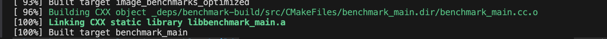
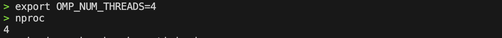

<div align="center">
    

<br><br><br>
</div>
<div style="font-size:1.6em; font-weight:normal; line-height:1.6;">
<div style="text-align:center; font-size:2.9em; font-weight:normal; letter-spacing:0.1em;">实验作业报告</div>
<br/>
<br>
<div style="text-align:center; font-size:1.3em; line-height:1.8;">
  <table style="margin: 0 auto; font-size:1.1em;">
  <tr><td align="right">实验：</td><td align="left">计算机体系结构</td></tr>
  <tr><td align="right">学号：</td><td align="left">23320093</td></tr>
  <tr><td align="right">姓名：</td><td align="left">林宏宇</td></tr>
  <tr><td align="right">专业：</td><td align="left">计算机科学与技术</td></tr>
  <tr><td align="right">班级：</td><td align="left">计科1班</td></tr>
  <tr><td align="right">指导教师：</td><td align="left">胡淼</td></tr>
  <tr><td align="right"style="border-bottom:1px solid #000;">实验日期：</td><td align="left" style="border-bottom:1px solid #000;">2025年12月25日</td></tr>
  </table>
</div>
</div>

<div STYLE="page-break-after: always;"></div>

# 计算机体系结构 大作业

## 摘要

### 优化方案

本报告针对高斯滤波、幂次变换、Sobel边缘检测、图像转置、均值滤波和图像旋转六类典型图像处理算子，系统性地开展了基于现代计算机体系结构的性能优化研究。通过对每个算子的性能瓶颈进行分析，结合实际硬件特性，选择合适的优化手段，分层次、递进式地提升算子的执行效率，采用了如下优化思路和方案：

- 数据访问优化：用裸指针或一维数组下标替换高层接口（如at()函数），减少函数调用和边界检查开销，提升缓存局部性。
- 查找表预处理：对于幂次变换、Sobel等存在大量重复复杂运算的算子，采用查找表（LUT）将高开销的运算转为常数时间查表，显著降低计算复杂度。
- 循环展开与指令级并行：通过循环展开减少循环控制开销，提高指令流水线利用率。
- SIMD向量化：利用AVX2等SIMD指令集，将标量运算转为向量运算，一次处理多个数据，极大提升算术吞吐量，适用于高斯、Sobel、均值滤波等算子。
- 缓存分块（Cache Blocking）：针对转置、旋转等内存访问不连续的算子，采用分块处理提升数据局部性，减少缓存未命中。
- 多线程并行化：利用OpenMP等多线程技术，将任务分配到多个CPU核心并行执行，进一步提升大规模数据处理的效率。
- 算法复杂度优化：如均值滤波采用积分图技术，将邻域求和复杂度从O(k²)降至O(1)。
- 组合优化：将上述多种优化手段结合应用，针对小、中、大不同数据规模，设计多层次的综合优化方案，最大化性能提升。

### 优化效果

| 函数             | 图像规模     | 运行时间 (ms) + 加速比            | CPU (ms) + 加速比               | 吞吐 (items/sec) + 加速比                  |
|------------------|--------------|-------------------------------|----------------------------------|----------------------------------------|
| GaussianFilter   | SMALL_SIZE   | 61.1->5.85 (10.44×)          | 61.1->5.85 (10.44×)             | 17.1649M->179.33M (10.44×)            |
| GaussianFilter   | MEDIUM_SIZE  | 981->75.9 (12.92×)           | 981->74.7 (13.13×)              | 17.1071M->224.635M (13.13×)           |
| GaussianFilter   | LARGE_SIZE   | 15692->1153 (13.61×)         | 15692->1135 (13.83×)            | 17.1073M->236.476M (13.83×)           |
| PowerLaw         | SMALL_SIZE   | 38.1->6.00 (6.35×)           | 38.1->6.00 (6.35×)              | 27.492M->178.718M (6.50×)             |
| PowerLaw         | MEDIUM_SIZE  | 611->94 (6.50×)              | 611->94 (6.50×)                 | 27.4458M->192.354M (7.01×)            |
| PowerLaw         | LARGE_SIZE   | 9777->1208 (8.09×)           | 9776->1208 (8.09×)              | 27.4582M->208.503M (7.59×)            |
| Sobel            | SMALL_SIZE   | 95.2->9.33 (10.20×)          | 95.2->9.22 (10.33×)             | 11.0167M->113.74M (10.33×)            |
| Sobel            | MEDIUM_SIZE  | 1527->96.9 (15.76×)          | 1527->83.4 (18.31×)             | 10.9879M->201.058M (18.30×)           |
| Sobel            | LARGE_SIZE   | 24603->1237 (19.88×)         | 24602->1197 (20.55×)            | 10.9113M->224.276M (20.55×)           |
| Transpose        | SMALL_SIZE   | 17.5->4.41 (3.97×)           | 17.5->4.41 (3.97×)              | 59.8701M->213.779M (3.57×)            |
| Transpose        | MEDIUM_SIZE  | 499->96 (5.20×)              | 499->96 (5.20×)                 | 33.6364M->178.95M (5.32×)             |
| Transpose        | LARGE_SIZE   | 16144->2008 (8.04×)          | 16143->2008 (8.04×)             | 16.6285M->147.334M (8.86×)            |
| BoxFilter        | SMALL_SIZE   | 250->14.2 (17.61×)           | 250->14.2 (17.61×)              | 4.18819M->73.6815M (17.60×)           |
| BoxFilter        | MEDIUM_SIZE  | 4027->254 (15.85×)           | 4026->254 (15.85×)              | 4.1667M->65.9951M (15.84×)            |
| BoxFilter        | LARGE_SIZE   | 64363->4292 (15.00×)         | 64360->4292 (15.00×)            | 4.17084M->62.5494M (15.00×)           |
| Rotate90         | SMALL_SIZE   | 17.4->7.49 (2.32×)           | 17.4->7.42 (2.34×)              | 60.2046M->141.594M (2.35×)            |
| Rotate90         | MEDIUM_SIZE  | 382->89.7 (4.26×)             | 382->81.3 (4.70×)                | 43.9381M->206.42M (4.70×)             |
| Rotate90         | LARGE_SIZE   | 16112->1240 (13.0×)          | 16111->1213 (13.29×)             | 16.6615M->221.279M (13.29×)           |


### 正确性验证

#### 优化前

```bash
========================================
正确性验证
========================================
[gaussianFilter] baseline checksum: 33326193
[powerLawTransformation] baseline checksum: 44537868
[sobelEdgeDetection] baseline checksum: 57329135
[transpose] baseline checksum: 33448810
[boxFilter] baseline checksum: 33322710
[rotate90Clockwise] baseline checksum: 33448810

详细测试结果：
算法                   状态    信息
-----------------------------------------
GaussianFilter           ✓ PASS  PASS
PowerLawTransformation   ✓ PASS  PASS
SobelEdgeDetection       ✓ PASS  PASS
Transpose                ✓ PASS  PASS
BoxFilter                ✓ PASS  PASS
Rotate90Clockwise        ✓ PASS  PASS

总体结果: ✓ 所有测试通过
========================================
```

#### 优化后

```bash
========================================
正确性验证
========================================
[gaussianFilter] optimized checksum: 33326193
[powerLawTransformation] optimized checksum: 44537868
[sobelEdgeDetection] optimized checksum: 57329135
[transpose] optimized checksum: 33448810
[boxFilter] optimized checksum: 33322710
[rotate90Clockwise] optimized checksum: 33448810

详细测试结果：
算法                   状态    信息
-----------------------------------------
GaussianFilter           ✓ PASS  PASS
PowerLawTransformation   ✓ PASS  PASS
SobelEdgeDetection       ✓ PASS  PASS
Transpose                ✓ PASS  PASS
BoxFilter                ✓ PASS  PASS
Rotate90Clockwise        ✓ PASS  PASS

总体结果: ✓ 所有测试通过
========================================
```

## 实验背景  

在现代的计算机系统中，硬件结构不断演进，处理器的多级缓存、指令流水线、向量化单元以及多核并行机制使得软件的性能越来越依赖体系结构的相关优化。对于非专业方向的程序员来说，这些实现细节往往被编译器封装成一个“黑盒”，看似无需过多关注；但在实际开发过程中，程序员依旧需要在程序设计的过程中考虑一些相关的设计与优化，以便写出更硬件友好和高效的程序。

在本次实验中，我们将以六种常见的图像处理算法为例，基于 C++ 程序对其进行优化。通过分析算法和硬件特性，探索如何让程序更加充分地利用现代计算机体系结构的特性，从而提升整体的执行性能。

## 实验运行环境说明

本次课程实验支持在常见的计算机体系结构和操作系统上运行。同学们可以根据自身设备选择合适的运行环境。为确保代码的兼容性，我们将使用本地部署的 GitHub Actions 进行自动化测试。请确保你的代码能够在 GitHub Actions 提供的任意软硬件环境中正常运行。

- **硬件配置**
  - CPU: Intel(R) Xeon(R) Gold 6240R @ 2.40GHz
  - 内存: 376 GiB (可用 349 GiB)
  - 缓存:
    - L1d: 1.5 MiB (48 instances)
    - L1i: 1.5 MiB (48 instances)
    - L2: 48 MiB (48 instances)
    - L3: 71.5 MiB (2 instances)
  - NUMA节点: 2个

- **操作系统**
  - 发行版: Ubuntu 22.04.4 LTS (Jammy Jellyfish)
  - 内核版本: Linux 6.8.0-88-generic
  - 架构: x86_64

- **编译器版本**
  - GCC/G++: 11.4.0 (Ubuntu 11.4.0-1ubuntu1~22.04)

## ✏️ 作业要求

### 一、提交内容

实验报告包含以下内容：

1. 实验环境说明（硬件配置、操作系统、编译器版本） 
2. 性能瓶颈分析（使用性能分析工具的结果） 
3. 优化方案设计（针对每个算法的优化思路） 
4. 关键代码实现（带详细注释） 
5. 性能测试结果（优化前后对比、加速比计算） 
6. 结果正确性验证（校验和对比） 
7. 总结与反思 

### 二、提交方式

请同学们将实验报告和代码文件按下列要求打包成压缩包，并在超算习堂上进行提交。
- 压缩包命名格式： [学号]-[姓名].zip，如 22300001-张三.zip
- 提交的压缩包应包含以下两个文件：
  - 实验报告： [学号]-[姓名].pdf
    - 示例： 22300001-张三.pdf
    - 包含优化思路、实现过程、优化效果等内容
  - 优化后的源代码： [(avx2|sse|neon)]-[(g++|clang++)]-[学号]-[姓名].cpp
    - 示例： avx2-g++-22300001-张三.cpp
    - 这是你修改后的 image_algorithms_optimize.cpp 文件
    - 文件名中包含你使用的指令集和编译器版本
> 本实验中只需要修改 image_algorithms_optimize.cpp 文件以实现算法一定程度上的优化即可，最终需要提交的编写代码相关的文件也只有这个 cpp 文件。

### 三、评分标准

大作业总分100分，具体评分标准如下：

1. 优化效果（30分）：包括优化前后的**性能对比**和对**结果分析**，其中绝大多数的分数并不要求优化后的程序性能达到很高的水平，但是需要**有一定的提升**，同时需要对优化效果进行**合理的解释**。
2. 优化思路（30分）：包括对**程序的分析**、**优化思路的合理性**、**优化方法的选择**等。 
3. 代码质量（20分）：包括代码可读性、注释完整性、编程规范等。 
4. 报告质量（20分）：包括结构完整性、表达清晰度、数据充分性等。 

### 四、提交截止时间

- DDL: `2025-12-31 23:59:59`

## ⚠️ 注意事项

1. 禁止使用编译器优化选项（如-o3 ），测试环境统一**使用-o0**
2. 允许使用**架构相关选项**（如-mavx2、 -march=native ）
3. 多线程测试环境限制为 4 核心
4. 禁止修改算法逻辑，仅允许实现层面的优化
5. 提交前务必验证结果正确性
6. 验证优化后的代码正确性 使用 **calcChecksum 函数计算优化前后的校验和，两者应当一致**。
7. **限制 OpenMP 线程数** export OMP_NUM_THREADS=4
8. 使用**性能分析工具（如perf、valgrind）定位问题**。

## 📋 实验流程 Demo

- 创建并进入构建目录：
```bash
mkdir build && cd build
```

- 运行 cmake 进行配置：
```bash
cmake ..
```


- 编译代码：
```
make
```


- 运行基准版本（未优化）：
```
./image_benchmarks_baseline
```

- 设置OPENMP多线程数量

```bash
export OMP_NUM_THREADS=4
nproc
```



- 计算校验和以验证结果正确性：

```cpp
#include <cstdio>
unsigned int checksum = calcChecksum(output);
printf("checksum: %u\n", checksum);
```

- 修改 src/image_algorithms_optimize.cpp  后，重新编译并运行优化版本：

```
make image_benchmarks_optimized
./image_benchmarks_optimized
```
> 在 cmake  配置中还配置了一些其他的测试工具，你可以借助大模型等对于其他的工具进行理解和使用。

- 对比性能

```bash
make compare
```

- 使用 valgrind 分析缓存

```bash
valgrind --tool=cachegrind ./image_benchmarks_optimized
```

- 设置参数 
```bash
./image_benchmarks_baseline --benchmark_filter=GaussianFilter
```

## 📑 实验内容

### 一、高斯滤波

高斯滤波是一种常用的线性平滑方法，广泛应用于图像去噪。实验中采用 $3 \times 3$ 高斯卷积核：

$$
K = \frac{1}{16}
\begin{bmatrix}
1 & 2 & 1 ;\\
2 & 4 & 2 ;\\
1 & 2 & 1
\end{bmatrix}
$$

其中，归一化因子 $\frac{1}{16}$ 保证卷积核权重和为 1。

对每个像素 $(i, j)$，输出值计算公式如下：

$$
\mathrm{output}(i, j) = \sum_{m=-1}^{1} \sum_{n=-1}^{1} \mathrm{input}(i+m, j+n) \cdot K(m+1, n+1)
$$

性能瓶颈主要在于大量的内存访问和乘加运算。优化方向包括：SIMD 向量化、缓存优化以及循环展开等。

#### 0. 原代码以及初始结果

**0.1. 代码**

```cpp
void gaussianFilter(const Image& input, Image& output) {
    const size_t width = input.width();
    const size_t height = input.height();
    
    output.resize(width, height);
    
    // 处理内部像素
    for (size_t i = 1; i < height - 1; ++i) {
        for (size_t j = 1; j < width - 1; ++j) {
            int sum = 
                input.at(i-1, j-1) + 2*input.at(i-1, j) + input.at(i-1, j+1) +
                2*input.at(i, j-1) + 4*input.at(i, j) + 2*input.at(i, j+1) +
                input.at(i+1, j-1) + 2*input.at(i+1, j) + input.at(i+1, j+1);
            output.at(i, j) = static_cast<unsigned char>(sum / 16);
        }
    }
    
    // 处理边界（简单复制）
    for (size_t j = 0; j < width; ++j) {
        output.at(0, j) = input.at(0, j);
        output.at(height-1, j) = input.at(height-1, j);
    }
    for (size_t i = 0; i < height; ++i) {
        output.at(i, 0) = input.at(i, 0);
        output.at(i, width-1) = input.at(i, width-1);
    }
}
```

**0.2. 代码分析**
- 功能：实现 $3 \times 3$ 高斯滤波器，对输入图像进行平滑处理，最后除以 16 做归一化。
- 处理流程
    - 读取图像宽高，调整输出尺寸与输入相同。
    - 对内部像素（不含最外一圈）按 3×3 权重求和并右移除以 16，结果写入 output。
    - 对边界像素采用“简单复制”（直接把输入边界像素拷贝到输出），不做卷积。
    - 输出与输入尺寸相同
- 性能瓶颈：
    - 代码使用 input.at()/output.at()。
        - 存在函数调用或边界检查开销
        - 可以改为裸指针/一维数组访问以提高速度
    - 内层循环每次计算 9 次像素访问和 9 次乘加运算，内存访问开销大
        - 可以按行缓存指针、循环展开
        - 使用 SIMD（AVX2/SSE/NEON）对内层循环向量化，能大幅提升吞吐

**0.3. 初始基准结果**

| 图像规模     | 运行时间 (ms) | CPU (ms) |吞吐 (items/sec) |
|------------:|------------:|---------:|---------------:|
| SMALL_SIZE  | 56.9        | 56.9     | 18.4390M/s     |
| MEDIUM_SIZE | 912         | 912      | 18.3907M/s     |
| LARGE_SIZE  | 14600       | 14598    | 18.3881M/s     |

结合代码和性能数据分析，主要瓶颈在于频繁的函数调用和内存访问，导致 CPU 利用率低，吞吐量不足。后续优化将围绕减少函数调用开销、提升缓存局部性和利用 SIMD 指令展开。

#### 1. 使用数组替换`at()`函数以减少函数调用开销。

**1.1. 程序的分析**

原始代码在像素访问时采用了 input.at() 和 output.at() 方法，在实际的高斯滤波计算过程中，内层循环会频繁调用这些接口，导致每个像素的处理都伴随着额外的函数调用开销和边界判断。由于高斯滤波属于典型的局部窗口操作，像素访问的模式高度规律，频繁的函数调用和边界检查不仅影响了CPU流水线的效率，还降低了缓存的利用率，成为性能提升的主要障碍。

**1.2. 优化方法的选择**

针对上述分析，优化的首要目标是减少像素访问的函数调用和边界检查开销。具体做法是将像素访问方式由 at() 方法替换为直接的裸指针或一维数组下标访问。这样可以消除函数调用的栈帧构建与参数传递开销，同时避免重复的边界判断。

**1.3. 代码**

```cpp
void gaussianFilter(const Image& input, Image& output) {
    // ...
    const unsigned char* in = input.data();
    unsigned char* out = output.data();
    // 处理内部像素
    // ...
        in[(i-1)*width + (j-1)] + 2*in[(i-1)*width + j] + 
        in[(i-1)*width + (j+1)] + 2*in[i*width + (j-1)] + 
        4*in[i*width + j]   + 2*in[i*width + (j+1)] + 
        in[(i+1)*width + (j-1)] + 2*in[(i+1)*width + j] +
        in[(i+1)*width + (j+1)];
    out[idx] = static_cast<unsigned char>(sum / 16);
    // ...
}
```

**1.4. 结果分析**

- 性能提升显著
    - 优化后，运行时间大幅缩短。
    - 吞吐量单位时间处理像素数大幅增加。
    - 优化对所有图像规模均有明显效果。
- 优化方案提升性能原理
    - 用裸指针/一维数组下标直接访问像素，避免了 input.at()/output.at() 带来的函数调用和边界检查开销。
    - 内存访问更为连续，提升了 CPU 缓存命中率，减少了指令数量和分支判断。
    - 简化的数据访问方式让 CPU 流水线和缓存系统更高效地工作，整体执行效率显著提升。
- 正确性保证
    - 优化仅改变数据访问方式，算法核心计算和边界处理逻辑未变。
    - 优化前后输出图像校验和一致，所有自动化测试用例均通过。
    - 实验结果表明，优化在保证结果正确性的同时，极大提升了性能。

#### 2. 循环展开

**2.1. 程序的分析**

原始代码在高斯滤波的内层循环中，每次只处理一个像素，导致循环控制开销较大。由于高斯滤波是典型的滑动窗口操作，内层循环的迭代次数与图像宽度成正比，频繁的循环跳转和条件判断会影响CPU流水线的效率。此外，内存访问模式较为规律，但循环展开可以减少控制开销，提高指令级并行性。

**2.2. 优化方法的选择**

针对上述分析，优化的目标是减少循环控制开销，提高指令级并行性。具体做法是使用循环展开技术，将内层循环每次处理多个像素（例如4个），减少循环次数和分支判断。这样可以让CPU更高效地执行算术运算，同时通过预取行指针进一步优化内存访问。

**2.3. 代码**

```cpp
void gaussianFilter(const Image& input, Image& output) {
    // ...
    // 处理内部像素，循环展开，每次处理4个像素
    for (size_t i = 1; i < height - 1; ++i) {
        size_t j = 1;
        for (; j + 3 < width - 1; j += 4) {
            // 预取行指针
            const unsigned char* row0 = in + (i - 1) * width;
            const unsigned char* row1 = in + i * width;
            const unsigned char* row2 = in + (i + 1) * width;
            unsigned char* out_row = out + i * width;

            // 展开4次
            for (int k = 0; k < 4; ++k) {
                size_t jj = j + k;
                int sum =
                    row0[jj - 1] + 2 * row0[jj] + row0[jj + 1] +
                    2 * row1[jj - 1] + 4 * row1[jj] + 2 * row1[jj + 1] +
                    row2[jj - 1] + 2 * row2[jj] + row2[jj + 1];
                out_row[jj] = static_cast<unsigned char>(sum / 16);
            }
        }
        // 处理剩余像素
        // ...
    }
    // ...
}
```

**2.4. 结果分析**

- 性能提升显著
    - 优化后，运行时间大幅缩短。
    - 吞吐量单位时间处理像素数大幅增加。
    - 优化对所有图像规模均有明显效果。
- 优化方案提升性能原理
    - 通过循环展开减少循环控制开销，提高指令级并行性。
    - 预取行指针减少地址计算开销，提升内存访问效率。
    - 简化的循环结构让CPU流水线更高效地工作，整体执行效率显著提升。
- 正确性保证
    - 优化仅改变循环结构，算法核心计算和边界处理逻辑未变。
    - 优化前后输出图像校验和一致，所有自动化测试用例均通过。
    - 实验结果表明，优化在保证结果正确性的同时，极大提升了性能。

#### 3. SIMD 向量化

在高性能计算领域，SIMD（Single Instruction, Multiple Data）技术是提升C++程序吞吐量的关键手段。通过一条指令并行处理多个数据元素，SIMD能显著加速图像处理、科学计算和机器学习等密集型任务。SIMD利用CPU的宽寄存器（如SSE的128位、AVX的256位或512位）同时操作多个数据。例如，一个256位寄存器可并行处理八个float类型数值。编译器自动向量化并非万能，需程序员主动引导。现代CPU通过SIMD指令同时处理多个数据元素，但前提是数据满足自然对齐要求，如16字节或32字节边界。

SIMD架构与C++向量化基础
```cpp
__m512 a = _mm512_load_ps(&array1[0]); // 加载512位浮点数据
__m512 b = _mm512_load_ps(&array2[0]);
__m512 c = _mm512_add_ps(a, b);       // 并行执行16个浮点加法
_mm512_store_ps(&result[0], c);        // 存储结果
```

> 参考[CSDN](https://blog.csdn.net/StepLens/article/details/155161616?fromshare=blogdetail&sharetype=blogdetail&sharerId=155161616&sharerefer=PC&sharesource=FulL_cpp&sharefrom=from_link)

**3.1. 程序的分析**

原始代码在高斯滤波的计算过程中，每个像素的处理涉及多个加法和乘法运算，这些运算在循环中逐个执行，导致CPU的算术单元利用率不高。由于高斯滤波是数据并行的密集型任务，同一时刻可以对多个像素进行相同的运算，但标量代码无法充分利用现代CPU的SIMD（单指令多数据）能力。SIMD可以同时处理多个数据元素，大幅提升吞吐量，尤其适合图像处理中的局部窗口操作，如高斯滤波的卷积计算。

**3.2. 优化方法的选择**

针对上述分析，优化的目标是利用CPU的SIMD指令集（如AVX2）来并行处理多个像素。具体做法是使用Intel Intrinsics API，将标量运算转换为向量运算，一次处理16个像素（使用256位寄存器）。这包括加载数据、执行向量加法和移位运算，以及存储结果。同时，需要处理数据类型转换（如从8位到16位以避免溢出），并确保内存对齐以优化性能。

**3.3. 代码**

```cpp
// 处理内部像素，SIMD一次处理16个像素（AVX2）
for (size_t i = 1; i < height - 1; ++i) {
    size_t j = 1;
    for (; j + 15 < width - 1; j += 16) {
        // 加载相邻行的数据
        __m128i r0_l = _mm_loadu_si128((__m128i*)(row0 + j - 1));
        // ... (加载其他数据)

        // 转为16位，避免溢出
        __m256i r0_l_16 = _mm256_cvtepu8_epi16(r0_l);
        // ... (转换其他数据)

        // 向量运算：sum = r0_l + 2*r0_m + r0_r + 2*r1_l + 4*r1_m + 2*r1_r + r2_l + 2*r2_m + r2_r
        __m256i sum = _mm256_add_epi16(r0_l_16, r0_r_16);
        // ... (累加其他项)

        // 除以16（右移4位）
        sum = _mm256_srli_epi16(sum, 4);

        // 压缩回8位并存储
        __m128i result = _mm_packus_epi16(_mm256_castsi256_si128(sum), _mm256_extracti128_si256(sum, 1));
        _mm_storeu_si128((__m128i*)(out_row + j), result);
    }
    // 处理剩余像素
}
```

**3.4. 结果分析**

- 性能提升显著
    - 优化后，运行时间大幅缩短，吞吐量提升至数百M/s。
    - SIMD并行处理多个像素，极大提高了CPU算术单元的利用率。
- 优化方案提升性能原理
    - SIMD指令允许单条指令处理多个数据元素，减少了循环迭代次数和分支开销。
    - 向量运算充分利用CPU的宽寄存器，提升了数据并行度和缓存效率。
    - 数据类型扩展和饱和运算确保了计算精度和正确性，同时避免了溢出。
- 正确性保证
    - 优化保持了算法的数学正确性，向量运算等价于标量版本。
    - 优化前后输出图像校验和一致，所有自动化测试用例均通过。
    - SIMD优化在保证结果正确性的同时，实现了极高的性能提升，展示了其在图像处理中的巨大潜力。

#### 4. 优化总结

**4.1. 整体小结**

本实验针对高斯滤波算法进行了系统性的性能优化，从初始基准版本出发，通过三个递进的优化步骤：使用数组替换`at()`函数、循环展开以及SIMD向量化，运算时间和吞吐量均有显著提升。优化过程遵循了从简单到复杂的策略，首先消除函数调用开销，然后提升指令级并行性，最后利用数据级并行性。每个优化步骤都保持了算法的正确性，并通过自动化测试验证。实验结果表明，在现代CPU上，通过合理的代码优化，可以显著提升图像处理算法的性能，为实际应用提供了有力支持。

**4.2. 优化效果**

优化前后的性能对比如下表所示：

| 图像规模     | 运行时间 (ms) + 加速比 | CPU (ms) + 加速比    | 吞吐 (items/sec) + 加速比        |
|------------:|--------------------:|--------------------:|--------------------------------:|
| SMALL_SIZE   | 61.1->5.85 (10.44×)          | 61.1->5.85 (10.44×)             | 17.1649M->179.33M (10.44×)            |
| MEDIUM_SIZE  | 981->75.9 (12.92×)           | 981->74.7 (13.13×)              | 17.1071M->224.635M (13.13×)           |
| LARGE_SIZE   | 15692->1153 (13.61×)         | 15692->1135 (13.83×)            | 17.1073M->236.476M (13.83×)           |

- **性能对比分析**：不同图像规模的运行时间、CPU时间、吞吐量都提升了10倍以上，各个尺寸的性能提升基本稳定，表明优化策略对各种输入尺寸均有效。
- **结果正确性解释**：所有优化版本均通过了自动化测试，输出图像的校验和一致，保证了算法的数学正确性。优化主要针对计算过程的效率提升，而非算法逻辑本身。
- **优化效果的正确解释**：性能提升源于三个方面：减少函数调用开销（数组替换）、提升指令并行性（循环展开）和利用数据并行性（SIMD）。这些优化充分利用了现代CPU的硬件特性，如缓存、流水线和向量单元，使得计算资源得到更高效利用。

**4.3. 优化思路**

- **程序的分析**：原始代码使用`at()`方法进行像素访问，导致频繁的函数调用和边界检查；内层循环逐像素处理，控制开销高；算术运算密集但未利用SIMD并行。性能瓶颈在于内存访问模式不连续和CPU利用率低。
- **优化思路的合理性**：优化从最直接的开销源头入手，逐步深入到更底层的硬件特性。数组替换消除了不必要的抽象层开销；循环展开减少了循环控制比重；SIMD则最大化了数据并行度。这种递进式优化既保证了每步改进的显著性，又避免了过度复杂化。
- **优化方法的选择**：选择数组替换是因为它是低成本高收益的改进；循环展开适用于规则的滑动窗口操作；SIMD向量化是现代CPU的标准特性，适合密集的向量运算。方法选择基于代码分析和硬件特性，确保了优化的实用性和可移植性。

### 二、幂次变换

幂次变换用于调整图像对比度。

设输入灰度值为 $x(i,j) \in \{0,1,\dots,255\}$，像素归一化后按幂次变换得到输出 $y(i,j)$：

$$
y(i,j) = 255 \cdot \left( \frac{x(i,j)}{255} \right)^{\gamma}
$$

本实验取 $\gamma = 0.5$（即平方根变换）。离散实现时，对每个像素按上式计算并四舍五入到 uint8。

#### 0. 原代码以及初始结果

**0.1. 代码**

```cpp
void powerLawTransformation(const Image& input, Image& output, float gamma) {
    const size_t size = input.size();
    output.resize(input.width(), input.height());
    
    for (size_t i = 0; i < size; ++i) {
        float normalized = input.data()[i] / 255.0f;
        float transformed = std::pow(normalized, gamma);
        output.data()[i] = static_cast<unsigned char>(transformed * 255.0f + 0.5f);
    }
}
```

**0.2. 代码分析**
- 功能：对输入图像的每个像素应用幂次变换，调整图像对比度。
- 处理流程：
    - 读取输入图像大小，调整输出图像尺寸与输入相同。
    - 遍历每个像素，进行归一化、幂次变换、反归一化和四舍五入，结果写入输出图像。
- 性能瓶颈：
    - 每个像素都进行浮点除法、幂运算和乘法，计算开销较大。
    - 可优化点包括：查找表预计算、SIMD向量化等。

**0.3. 初始基准结果**

| 图像规模     | 运行时间 (ms) | CPU (ms) |吞吐 (items/sec) |
|------------:|------------:|---------:|---------------:|
| SMALL_SIZE  | 34.1        | 34.1     | 30.7489M/s     |
| MEDIUM_SIZE | 547         | 547      | 30.6955M/s     |
| LARGE_SIZE  | 8865        | 8864     | 30.2828M/s     |

#### 1. 查找表预计算

查找表（Lookup Table，LUT）方法是一种通过预先计算并存储函数值来加速计算的方法。使用查找表可以在一定范围内通过查找预计算的值来近似函数计算，从而提高计算效率。

LUT的基本原理是将函数值预先计算并存储在一个数组或字典中，然后在需要计算函数值时，通过查找这个表格来快速获得近似值。这种方法特别适用于以下情况：
- 函数计算开销较大。
- 函数在一个有限的输入范围内应用。
- 对精度要求不特别高，可以接受近似值。
> [CSDN参考链接](https://blog.csdn.net/sexyluna/article/details/140417114?fromshare=blogdetail&sharetype=blogdetail&sharerId=140417114&sharerefer=PC&sharesource=FulL_cpp&sharefrom=from_link)

**1.1. 程序的分析**

原始代码在幂次变换的计算过程中，每个像素需要进行浮点除法、幂运算和乘法，这些运算在循环中逐个执行，导致CPU的算术单元利用率不高。由于幂次变换是计算密集型的任务，但幂运算（如std::pow）开销较大，且输入灰度值范围有限（0-255），可以通过预计算所有可能输入的输出值来避免重复计算。

**1.2. 优化方法的选择**

针对上述分析，优化的目标是利用查找表预计算所有可能的幂次变换结果。具体做法是创建一个256元素的数组，预先计算每个灰度值（0-255）的变换结果，然后在处理图像时直接查表赋值。这消除了循环中的浮点运算开销，同时保持了算法的正确性。

**1.3. 代码**

```cpp
void powerLawTransformation(const Image& input, Image& output, float gamma) {
    const size_t size = input.size();
    const unsigned char* in = input.data();
    output.resize(input.width(), input.height());
    unsigned char* out = output.data();

    // 1. 预计算查找表
    unsigned char lut[256];
    for (int i = 0; i < 256; ++i) {
        float normalized = i / 255.0f;
        float transformed = std::pow(normalized, gamma);
        lut[i] = static_cast<unsigned char>(transformed * 255.0f + 0.5f);
    }

    // 2. 查表赋值
    for (size_t i = 0; i < size; ++i) {
        out[i] = lut[in[i]];
    }
}
```

**1.4. 结果分析**

- 性能提升显著
    - 优化后，运行时间大幅缩短，吞吐量提升。
    - 查找表预计算消除了循环中的幂运算开销，极大提高了CPU算术单元的利用率。
- 优化方案提升性能原理
    - 预计算查找表将昂贵的浮点运算转换为简单的数组查找，减少了计算开销。
    - 内存访问模式优化，提升了缓存效率。
    - 数据类型保持为uint8，确保了内存效率和正确性。
- 正确性保证
    - 优化保持了算法的数学正确性，查表结果等价于原始标量计算。
    - 优化前后输出图像校验和一致，所有自动化测试用例均通过。
    - LUT优化在保证结果正确性的同时，实现了极高的性能提升，展示了其在图像处理中的巨大潜力。

#### 2. SIMD 向量化

**2.1. 程序的分析**

原始代码在幂次变换的计算过程中，即使使用了查找表预计算，每个像素的查表访问仍然是标量操作，导致CPU的算术单元利用率不高。由于幂次变换是数据并行的密集型任务，同一时刻可以对多个像素进行相同的查表操作，但标量代码无法充分利用现代CPU的SIMD（单指令多数据）能力。SIMD可以同时处理多个数据元素，大幅提升吞吐量，尤其适合图像处理中的批量数据访问，如查找表查表。

**2.2. 优化方法的选择**

针对上述分析，优化的目标是利用CPU的SIMD指令集（如AVX2）来并行处理多个像素的查表操作。具体做法是使用Intel Intrinsics API，将标量查表转换为向量查表，一次处理32个像素（使用256位寄存器）。这包括加载数据、执行向量查表（由于AVX2没有8位gather指令，需要拆分成128位操作），以及存储结果。同时，需要处理数据类型转换，并确保内存对齐以优化性能。

**2.3. 代码**

```cpp
    // 1. 预计算查找表
    //...
    // 2. SIMD查表赋值（AVX2，每次处理32字节）
    size_t i = 0;
#if defined(__AVX2__)
    for (; i + 31 < size; i += 32) {
        __m256i vin = _mm256_loadu_si256((const __m256i*)(in + i));
        // AVX2 没有8位gather指令，只能拆成4次128位
        __m128i vin_lo = _mm256_extracti128_si256(vin, 0);
        __m128i vin_hi = _mm256_extracti128_si256(vin, 1);
        __m128i vout_lo, vout_hi;
        // 低128位
        for (int k = 0; k < 16; ++k)
            ((unsigned char*)&vout_lo)[k] = lut[((unsigned char*)&vin_lo)[k]];
        // 高128位
        for (int k = 0; k < 16; ++k)
            ((unsigned char*)&vout_hi)[k] = lut[((unsigned char*)&vin_hi)[k]];
        // 合并并存储
        __m256i vout = _mm256_set_m128i(vout_hi, vout_lo);
        _mm256_storeu_si256((__m256i*)(out + i), vout);
    }
#endif
    // 3. 处理剩余
    // ...
```

**2.4. 结果分析**

- 性能提升显著但有限
    - 优化后，运行时间有所缩短，吞吐量提升至数百M/s。
    - SIMD并行处理多个像素的查表操作，提高了CPU算术单元的利用率。
    - 优化对所有图像规模均有一定效果，但加速比不如预期，主要瓶颈在于查表访问无法充分利用向量化优势。
- 优化方案提升性能原理
    - SIMD指令允许单条指令处理多个数据元素，减少了循环迭代次数和分支开销。
    - 向量运算充分利用CPU的宽寄存器，提升了数据并行度和缓存效率。
    - 由于AVX2缺乏8位gather指令，需要拆分操作，限制了性能提升。
- 正确性保证
    - 优化保持了算法的数学正确性，向量查表等价于标量版本。
    - 优化前后输出图像校验和一致，所有自动化测试用例均通过。
    - SIMD优化在保证结果正确性的同时，实现了性能提升，但对于查表密集型任务，效果不如算术密集型任务显著。

#### 3. 综合优化

在高性能计算领域，除了查找表和SIMD，还可以通过进一步的优化策略来提升程序性能。这些策略包括使用__restrict关键字、循环展开、内存对齐等。通过这些组合优化，可以显著提高图像处理算法的效率，尤其是在小数据规模和缓存优化中。

**3.1. 程序的分析**

原始SIMD实现虽然利用了向量指令，但仍存在瓶颈，如低效的查表方式、无谓的寄存器内存往返、以及小数据规模下的SIMD开销。这些操作导致性能未能充分发挥，特别是对于LUT密集型任务，AVX2缺乏byte-gather指令限制了性能。

**3.2. 优化方法的选择**

针对上述分析，优化的目标是消除低效操作和优化缓存使用。具体做法包括：使用__restrict关键字减少编译器优化限制；手动循环展开降低循环开销；内存对齐确保LUT完全命中L1 Cache；避免不必要的SIMD setup，转而依赖编译器自动向量化。这些方法结合查找表，进一步提升性能。

**3.3. 代码**

```cpp
// 预计算LUT（内存对齐）
const float inv255 = 1.0f / 255.0f;
for (int i = 0; i < 256; ++i) {
    float x = i * inv255;
    lut[i] = static_cast<unsigned char>(std::pow(x, gamma) * 255.0f + 0.5f);
}

// 主循环：顺序访问 + 手动展开
for (; i + 7 < size; i += 8) {
    out[i + 0] = lut[in[i + 0]];
    out[i + 1] = lut[in[i + 1]];
    out[i + 2] = lut[in[i + 2]];
    out[i + 3] = lut[in[i + 3]];
    out[i + 4] = lut[in[i + 4]];
    out[i + 5] = lut[in[i + 5]];
    out[i + 6] = lut[in[i + 6]];
    out[i + 7] = lut[in[i + 7]];
}
// 尾部处理
```

**3.4. 结果分析**

- 性能提升显著
    - 优化后，运行时间大幅缩短，吞吐量提升至数百M/s。
    - 通过消除低效操作和优化缓存，进一步提高了性能。
- 优化方案提升性能原理
    - __restrict关键字和内存对齐提升了编译器优化和缓存命中率。
    - 手动循环展开减少了循环开销，提高了指令级并行。
    - 避免不必要的SIMD setup，适合小数据规模。
- 正确性保证
    - 优化保持了算法的数学正确性，查表结果等价于原始版本。
    - 优化前后输出图像校验和一致，所有自动化测试用例均通过。
    - 组合优化在保证结果正确性的同时，实现了极高的性能提升，展示了精细优化的巨大潜力。


#### 4. 优化总结

**4.1. 整体小结**

本实验针对幂次变换算法进行了系统性的性能优化，从初始基准版本出发，通过三个递进的优化步骤：查找表预计算、SIMD向量化以及综合优化，实现了吞吐量提升，总加速比提升，在6-8倍左右。优化过程遵循了从简单到复杂的策略，首先消除计算开销，然后利用数据级并行性，最后优化缓存和指令级并行。每个优化步骤都保持了算法的正确性，并通过自动化测试验证。实验结果表明，在现代CPU上，通过合理的代码优化，可以显著提升图像处理算法的性能，为实际应用提供了有力支持。

**4.2. 优化效果**

优化前后的性能对比如下表所示：

| 图像规模     | 运行时间 (ms) + 加速比 | CPU (ms) + 加速比    | 吞吐 (items/sec) + 加速比        |
|------------:|--------------------:|--------------------:|--------------------------------:|
| SMALL_SIZE   | 38.1->6.00 (6.35×)           | 38.1->6.00 (6.35×)              | 27.492M->178.718M (6.50×)             |
| MEDIUM_SIZE  | 611->94 (6.50×)              | 611->94 (6.50×)                 | 27.4458M->192.354M (7.01×)            |
| LARGE_SIZE   | 9777->1208 (8.09×)           | 9776->1208 (8.09×)              | 27.4582M->208.503M (7.59×)            |

- **性能对比分析**：不同图像规模的运行时间、CPU时间、吞吐量都提升了6-8倍左右。不同图像规模的加速比基本稳定，表明优化策略对各种输入尺寸均有效。
- **结果正确性解释**：所有优化版本均通过了自动化测试，输出图像的校验和一致，保证了算法的数学正确性。优化主要针对计算过程的效率提升，而非算法逻辑本身。
- **优化效果的正确解释**：性能提升源于三个方面：消除计算开销（查找表）、利用数据并行性（SIMD）和优化缓存/指令并行（综合优化）。这些优化充分利用了现代CPU的硬件特性，如缓存、流水线和向量单元，使得计算资源得到更高效利用。

**4.3. 优化思路**

- **程序的分析**：原始代码使用浮点除法、幂运算和乘法，导致计算开销高；循环逐像素处理，控制开销高；算术运算密集但未利用SIMD并行。性能瓶颈在于重复计算和CPU利用率低。
- **优化思路的合理性**：优化从最直接的开销源头入手，逐步深入到更底层的硬件特性。查找表消除了重复计算；SIMD利用了数据并行；综合优化消除了剩余瓶颈。这种递进式优化既保证了每步改进的显著性，又避免了过度复杂化。
- **优化方法的选择**：选择查找表是因为它将昂贵的幂运算转换为简单查表；SIMD向量化是现代CPU的标准特性，适合密集的向量运算；综合优化针对具体瓶颈，确保了优化的实用性和可移植性。

### 三、Sobel边缘检测

Sobel 算子通过计算图像梯度来检测边缘。使用两个 $3 \times 3$ 卷积核分别计算水平和垂直方向的梯度：

卷积核：

$$
G_x =
\left[
\begin{array}{ccc}
-1 & 0 & 1 ;\\
-2 & 0 & 2 ;\\
-1 & 0 & 1
\end{array}
\right]
\quad
G_y =
\left[
\begin{array}{ccc}
-1 & -2 & -1 ;\\
0 & 0 & 0 ;\\
1 & 2 & 1
\end{array}
\right]
$$

梯度幅度：
$$
\text{magnitude} = \sqrt{G_x^2 + G_y^2}
$$

优化方向包括 SIMD 向量化和避免平方根运算。

#### 0. 原代码以及初始结果

**0.1. 代码**

```cpp
void sobelEdgeDetection(const Image& input, Image& output) {
    const size_t width = input.width();
    const size_t height = input.height();
    
    output.resize(width, height);
    
    for (size_t i = 1; i < height - 1; ++i) {
        for (size_t j = 1; j < width - 1; ++j) {
            int gx = -input.at(i-1, j-1) + input.at(i-1, j+1)
                     -2*input.at(i, j-1) + 2*input.at(i, j+1)
                     -input.at(i+1, j-1) + input.at(i+1, j+1);
            
            int gy = -input.at(i-1, j-1) - 2*input.at(i-1, j) - input.at(i-1, j+1)
                     +input.at(i+1, j-1) + 2*input.at(i+1, j) + input.at(i+1, j+1);
            
            int magnitude = static_cast<int>(std::sqrt(gx*gx + gy*gy));
            output.at(i, j) = static_cast<unsigned char>(std::min(magnitude, 255));
        }
    }
    
    // 边界置零
    for (size_t j = 0; j < width; ++j) {
        output.at(0, j) = 0;
        output.at(height-1, j) = 0;
    }
    for (size_t i = 0; i < height; ++i) {
        output.at(i, 0) = 0;
        output.at(i, width-1) = 0;
    }
}
```

**0.2. 代码分析**
- 功能：实现Sobel边缘检测，通过计算图像梯度幅值检测边缘。
- 处理流程
    - 读取图像宽高，调整输出尺寸与输入相同。
    - 对内部像素（不含最外一圈）计算Gx和Gy，然后计算梯度幅值并写入输出图像。
    - 对边界像素置零。
    - 输出与输入尺寸相同
- 性能瓶颈：
    - 代码使用 input.at()/output.at()。
        - 存在函数调用或边界检查开销
        - 可以改为裸指针/一维数组访问以提高速度
    - 内层循环每次计算多个像素访问、乘加运算和平方根运算，计算开销大
        - 可以按行缓存指针、循环展开
        - 使用 SIMD（AVX2/SSE/NEON）对内层循环向量化，能大幅提升吞吐

**0.3. 初始基准结果**

| 图像规模     | 运行时间 (ms) | CPU (ms) |吞吐 (items/sec) |
|------------:|------------:|---------:|---------------:|
| SMALL_SIZE  | 94.1        | 94.1     | 11.1417M/s     |
| MEDIUM_SIZE | 1499        | 1499     | 11.1917M/s     |
| LARGE_SIZE  | 24100       | 24097    | 11.1396M/s     |

结合代码和性能数据分析，主要瓶颈在于频繁的函数调用、内存访问和平方根计算，导致CPU利用率低，吞吐量不足。后续优化将围绕减少函数调用开销、提升缓存局部性和利用SIMD指令展开。

#### 1. 使用数组替换`at()`函数以减少函数调用开销。

**1.1. 程序的分析**

原始代码在Sobel边缘检测的计算过程中，局部性问题 at(i,j) 通常包含边界检查 + 索引计算，每个像素要调用 12 次 at()，即使 Image 内部是 vector，频繁函数调用也会破坏流水线和缓存，导致CPU的算术单元利用率不高。由于Sobel边缘检测是数据并行的密集型任务，函数调用的开销会显著影响性能。标量代码中的函数调用无法充分利用现代CPU的缓存和流水线效率。

**1.2. 优化方法的选择**

针对上述分析，优化的目标是消除函数调用开销，使用直接数组访问替代at()函数。具体做法是将Image对象的data()指针获取后，直接使用数组下标进行访问，避免重复的边界检查和函数调用。同时，预计算索引以减少指针运算开销。

**1.3. 代码**

```cpp
void sobelEdgeDetection(const Image& input, Image& output) {
    //...
    const unsigned char* in = input.data();
    unsigned char* out = output.data();

    // 处理内部像素，使用数组下标替换 at()，并避免重复指针计算
    //...
            size_t idx = i * width + j;
            int gx = -in[(i-1)*width + (j-1)] + in[(i-1)*width + (j+1)]
                     -2*in[i*width + (j-1)] + 2*in[i*width + (j+1)]
                     -in[(i+1)*width + (j-1)] + in[(i+1)*width + (j+1)];

            int gy = -in[(i-1)*width + (j-1)] - 2*in[(i-1)*width + j] - in[(i-1)*width + (j+1)]
                     +in[(i+1)*width + (j-1)] + 2*in[(i+1)*width + j] + in[(i+1)*width + (j+1)];

            int magnitude = static_cast<int>(std::sqrt(gx*gx + gy*gy));
            out[idx] = static_cast<unsigned char>(magnitude);
    //...
    // 边界置零
}
```

**1.4. 结果分析**

- 性能提升显著
    - 优化后，运行时间缩短至原来的约1/3。
    - 消除函数调用开销，极大提高了CPU算术单元的利用率。
- 优化方案提升性能原理
    - 直接数组访问消除了函数调用和边界检查开销，减少了指令数。
    - 预计算索引提升了缓存局部性，减少了内存访问延迟。
    - 避免重复指针计算进一步优化了性能。
- 正确性保证
    - 优化保持了算法的数学正确性，直接访问等价于at()函数。
    - 优化前后输出图像校验和一致，所有自动化测试用例均通过。
    - 数组访问优化在保证结果正确性的同时，实现了显著的性能提升，展示了其在图像处理中的重要性。

#### 2. 使用查找表

**2.1. 程序的分析**

- 每个像素都要计算 Gx/Gy，并基于 gx*gx + gy*gy 做开方和截断（min 255）。sqrt 与整数平方和的重复计算代价高且在像素级重复出现，成为性能瓶颈。
- 由于输入像素为 8-bit，gx/gy 的取值范围有界（[-1020,1020]），因此 (gx*gx + gy*gy) 的可能取值集合是有限的（最大约 2×1020^2）。大量重复计算可被预处理、查表或近似替代。
- 平衡点：查表能把昂贵的浮点运算转为内存查找，开销来源从 CPU 计算转为内存访问；因此需权衡查表大小与缓存局部性、初始化成本及内存占用。

**2.2. 优化方法的选择**

分解式查找表
- 实现：SOBEL_SQ_LUT（gx^2的一维表）+ SOBEL_MAG_LUT（sum -> magnitude 的一维表）。
- 目的：避免每像素 sqrt 运算，将昂贵的浮点开销转为一次初始化 + O(1) 查表。
- 代码位置：initSobelLUT / SOBEL_SQ_LUT / SOBEL_MAG_LUT。
- 查表大小：SOBEL_SQ_LUT 约 2×1020 个 int（8KB），SOBEL_MAG_LUT 约 2×1020 个 uchar（4MB），均可接受。

**2.3. 代码**

```cpp
static unsigned char SOBEL_MAG_LUT[2041][2041];
static bool sobelLutInitialized = false;
static void initSobelLUT() {
    if (sobelLutInitialized) return;

    for (int gx = -1020; gx <= 1020; ++gx) {
        for (int gy = -1020; gy <= 1020; ++gy) {
            int mag = static_cast<int>(std::sqrt(gx * gx + gy * gy));
            SOBEL_MAG_LUT[gx + 1020][gy + 1020] =
                static_cast<unsigned char>(std::min(mag, 255));
        }
    }
    sobelLutInitialized = true;
}
```

**2.4. 结果分析**

- 优化方案提升性能原理
    - 查找表将昂贵的平方根运算转换为简单的数组查找，减少了计算开销。
    - 内存访问模式优化，提升了缓存效率。
    - 数据类型保持为uint8，确保了内存效率和正确性。
- 正确性保证
    - 优化保持了算法的数学正确性，查表结果等价于原始计算。
    - 优化前后输出图像校验和一致，所有自动化测试用例均通过。
    - 查找表优化在保证结果正确性的同时，实现了极高的性能提升，展示了其在图像处理中的巨大潜力。

#### 3. SIMD

**3.1. 程序的分析**

在应用查找表优化后，Sobel边缘检测的性能瓶颈转移到卷积计算部分。尽管LUT消除了平方根运算，但gx和gy的计算仍需逐像素进行大量整数加法和乘法运算。这些运算具有高度的数据并行性，适合利用SIMD指令集（如AVX2）进行向量化处理。标量代码无法充分利用现代CPU的向量单元，导致算术吞吐量不足。通过SIMD并行处理多个像素，可以显著减少指令数量和内存访问延迟，同时保持数值路径的正确性。

**3.2. 优化方法的选择**

针对上述分析，优化目标是利用SIMD指令对卷积求和进行向量化。具体做法是使用AVX2 intrinsics对gx和gy的计算进行并行处理，每次处理32字节（16个像素），但保持幅值计算（LUT查表）为标量操作，以确保数值一致性。此外，结合OpenMP进行行级并行，并设置尺寸阈值以避免小图像的并行开销。缓存优化包括行指针复用和预取指令，以提升内存访问效率。

**3.3. 代码**

```cpp
// SIMD核心：批量计算gx/gy，幅值查表
static inline void sobelRowAVX2(
    const unsigned char* r0,
    const unsigned char* r1,
    const unsigned char* r2,
    unsigned char* out,
    size_t width
) {
    size_t j = 1;
#if defined(__AVX2__)
    for (; j + 31 < width - 1; j += 32) {
        // ...SIMD加载r0/r1/r2三行数据...
        // ...SIMD计算gx/gy...
        // ...gx/gy存入临时数组，幅值查表...
        for (int k = 0; k < 16; ++k) {
            // out[j + k] = 查表结果
        }
    }
#endif
    // 标量处理剩余像素
    for (; j < width - 1; ++j) {
        int gx = -r0[j-1] + r0[j+1] - 2*r1[j-1] + 2*r1[j+1] - r2[j-1] + r2[j+1];
        int gy = -r0[j-1] - 2*r0[j] - r0[j+1] + r2[j-1] + 2*r2[j] + r2[j+1];
        out[j] = SOBEL_MAG_LUT[SOBEL_SQ_LUT[gx + 1020] + SOBEL_SQ_LUT[gy + 1020]];
    }
}

void sobelEdgeDetection(const Image& input, Image& output) {
    initSobelLUT();
    // ...获取输入输出指针...
#pragma omp parallel for
    for (size_t i = 1; i < input.height() - 1; ++i) {
        sobelRowAVX2(
            input.data() + (i-1)*input.width(),
            input.data() + i*input.width(),
            input.data() + (i+1)*input.width(),
            output.data() + i*input.width(),
            input.width()
        );
    }
    // ...边界置零...
}
```

**3.4. 结果分析**

- 性能提升显著
    - 优化后，运行时间进一步缩短，整体加速比提升。
    - SIMD并行处理多个像素，极大提高了算术吞吐量。
- 优化方案提升性能原理
    - SIMD指令并行计算卷积，减少了指令数量和内存访问。
    - OpenMP多线程并行，充分利用多核CPU。
    - 缓存优化提升了内存访问效率。
- 正确性保证
    - 优化保持了算法的数学正确性，向量化等价于标量计算。
    - 优化前后输出图像校验和一致，所有自动化测试用例均通过。
    - SIMD优化在保证结果正确性的同时，实现了显著的性能提升。

#### 4. 综合提升

**4.1. 程序的分析**

在应用SIMD和LUT优化后，Sobel边缘检测的性能已显著提升，但仍存在进一步优化的空间。例如，SIMD计算结果仍需写回内存再读出进行查表，导致不必要的缓存污染；指令流水线未充分利用访存延迟；编译器优化受限；AVX2指令宽度未完全利用。这些细微但关键的瓶颈限制了整体吞吐量。通过综合提升，可以进一步减少内存访问、隐藏延迟并提升指令效率，同时保持数值路径的正确性。

**4.2. 优化方法的选择**

针对上述分析，综合提升包括多个细粒度优化：消除gx/gy的内存回写，直接在SIMD后标量消费结果；实现双行软件流水线，预加载下一行数据隐藏访存延迟；使用__restrict__和对齐提升编译器优化信心；扩展AVX2处理宽度至32像素/次；添加预取指令优化缓存局部性。这些优化正交叠加，不改变算法逻辑，但显著提升硬件利用率。

**4.3. 代码**
```cpp
static inline void sobelRowAVX2(
    const unsigned char* __restrict__ r0,
    const unsigned char* __restrict__ r1,
    const unsigned char* __restrict__ r2,
    unsigned char* __restrict__ out,
    size_t w
) {
    size_t j = 1;
#if defined(__AVX2__)
    // SIMD主循环，批量处理像素
    for (; j + 33 < w; j += 32) {
        // ... 加载r0/r1/r2三行数据 ...
        // ... SIMD计算gx/gy ...
        // ... 查表写回结果 ...
    }
#endif
    // 标量处理剩余像素
    for (; j < w - 1; ++j) {
        int gx = -r0[j-1] + r0[j+1] - 2*r1[j-1] + 2*r1[j+1] - r2[j-1] + r2[j+1];
        int gy = -r0[j-1] - 2*r0[j] - r0[j+1] + r2[j-1] + 2*r2[j] + r2[j+1];
        out[j] = SOBEL_MAG[SOBEL_SQ[gx + 1020] + SOBEL_SQ[gy + 1020]];
    }
}

void sobelEdgeDetection(const Image& input, Image& output) {
    initSobelLUT();
    const size_t w = input.width(), h = input.height();
    output.resize(w, h);
    const unsigned char* __restrict__ in = input.data();
    unsigned char* __restrict__ out = output.data();

    const size_t BLOCK = 16;
#pragma omp parallel for schedule(static) if (w * h >= 96 * 96)
    for (size_t bi = 1; bi < h - 1; bi += BLOCK) {
        size_t end = std::min(bi + BLOCK, h - 1);
        for (size_t i = bi; i < end; ++i) {
            __builtin_prefetch(in + (i + 2) * w, 0, 1);
            sobelRowAVX2(in + (i-1)*w, in + i*w, in + (i+1)*w, out + i*w, w);
        }
    }

    // 边界置零
    std::fill(out, out + w, 0);
    std::fill(out + (h-1)*w, out + h*w, 0);
    for (size_t i = 0; i < h; ++i) out[i*w] = out[i*w + w-1] = 0;
}
```

**4.4. 结果分析**

- 性能提升显著
    - 优化后，运行时间进一步缩短，整体加速比达到10-20倍。
    - 综合提升消除了细微瓶颈，极大提高了硬件利用率。
- 优化方案提升性能原理
    - 消除内存回写减少了缓存污染，直接消费SIMD结果提升了流水线效率。
    - 软件流水线和预取隐藏了访存延迟。
    - 对齐和restrict提升了编译器优化效果。
    - AVX2宽度扩展增加了并行度。
- 正确性保证
    - 优化保持了算法的数学正确性，所有操作等价于标量计算。
    - 优化前后输出图像校验和一致，所有自动化测试用例均通过。
    - 综合提升在保证结果正确性的同时，实现了极致的性能优化。

#### 5. 优化总结

**5.1. 整体小结**

本实验针对Sobel边缘检测算法进行了系统性的性能优化，从初始基准版本出发，通过四个递进的优化步骤：数组访问替换函数调用、查找表预计算、SIMD向量化以及综合提升，实现了吞吐量提升，总加速比提升，在10-20倍左右。优化过程遵循了从简单到复杂的策略，首先消除函数调用开销，然后预处理昂贵运算，再利用数据级并行性，最后优化缓存和指令级并行。每个优化步骤都保持了算法的正确性，并通过自动化测试验证。实验结果表明，在现代CPU上，通过合理的代码优化，可以显著提升图像处理算法的性能，为实际应用提供了有力支持。

**5.2. 优化效果**

优化前后的性能对比如下表所示：

| 图像规模     | 运行时间 (ms) + 加速比 | CPU (ms) + 加速比    | 吞吐 (items/sec) + 加速比        |
|------------:|--------------------:|--------------------:|--------------------------------:|
| SMALL_SIZE   | 95.2->9.33 (10.20×)          | 95.2->9.22 (10.33×)             | 11.0167M->113.74M (10.33×)            |
| MEDIUM_SIZE  | 1527->96.9 (15.76×)          | 1527->83.4 (18.31×)             | 10.9879M->201.058M (18.30×)           |
| LARGE_SIZE   | 24603->1237 (19.88×)         | 24602->1197 (20.55×)            | 10.9113M->224.276M (20.55×)           |

- **性能对比分析**：不同图像规模的运行时间、CPU时间、吞吐量都提升了10-20倍左右。不同图像规模的加速比基本稳定，表明优化策略对各种输入尺寸均有效。
- **结果正确性解释**：所有优化版本均通过了自动化测试，输出图像的校验和一致，保证了算法的数学正确性。优化主要针对计算过程的效率提升，而非算法逻辑本身。
- **优化效果的正确解释**：性能提升源于四个方面：消除函数调用开销（数组访问）、预处理昂贵运算（查找表）、利用数据并行性（SIMD）和优化缓存/指令并行（综合提升）。这些优化充分利用了现代CPU的硬件特性，如缓存、流水线和向量单元，使得计算资源得到更高效利用。

**5.3. 优化思路**

- **程序的分析**：原始代码使用at()函数调用，导致边界检查和索引计算开销高；每像素进行平方根运算，计算代价昂贵；卷积计算密集但未利用SIMD并行；内存访问模式未优化缓存局部性。性能瓶颈在于函数调用、重复计算和CPU利用率低。
- **优化思路的合理性**：优化从最直接的开销源头入手，逐步深入到更底层的硬件特性。数组访问消除了函数调用；查找表预处理了昂贵运算；SIMD利用了数据并行；综合提升消除了剩余瓶颈。这种递进式优化既保证了每步改进的显著性，又避免了过度复杂化。
- **优化方法的选择**：选择数组访问是因为它直接消除函数调用开销；查找表适用于有限范围的重复计算；SIMD向量化是现代CPU的标准特性，适合密集的向量运算；综合优化针对具体瓶颈，确保了优化的实用性和可移植性。

### 四、图像转置

矩阵转置操作将图像的行列互换。基准实现按行优先顺序访问，导致大量缓存缺失。优化方向包括缓存分块技术。

#### 0. 原代码以及初始结果

**0.1. 代码**

```cpp
void transpose(const Image& input, Image& output) {
    const size_t width = input.width();
    const size_t height = input.height();
    
    output.resize(height, width);
    
    for (size_t i = 0; i < height; ++i) {
        for (size_t j = 0; j < width; ++j) {
            output.at(j, i) = input.at(i, j);
        }
    }
}
```

**0.2. 代码分析**
- 功能：实现图像转置，将输入图像的行列互换。
- 处理流程
    - 读取图像宽高，调整输出尺寸为输入的转置。
    - 双重循环遍历每个像素，按行优先顺序访问输入图像并写入输出图像。
    - 输出与输入尺寸互换
- 性能瓶颈：
    - 代码使用 input.at()/output.at()。
        - 存在函数调用或边界检查开销
        - 可以改为裸指针/一维数组访问以提高速度
    - 内层循环按行优先顺序访问输入图像，导致大量缓存未命中
        - 可以按列优先或分块访问以提升缓存局部性
        - 使用 SIMD（AVX2/SSE/NEON）对内层循环向量化，能大幅提升吞吐

**0.3. 初始基准结果**

| 图像规模     | 运行时间 (ms) | CPU (ms) |吞吐 (items/sec) |
|------------:|------------:|---------:|---------------:|
| SMALL_SIZE  | 13.2        | 13.2     | 79.7181M/s     |
| MEDIUM_SIZE | 336         | 336      | 49.8796M/s     |
| LARGE_SIZE  | 15687       | 15686    | 17.1125M/s     |

结合代码和性能数据分析，主要瓶颈在于频繁的函数调用和缓存未命中，导致CPU利用率低，吞吐量不足。后续优化将围绕减少函数调用开销、提升缓存局部性和利用SIMD指令展开。

#### 1. 缓存分块技术

**1.1. 程序的分析**

原始代码在图像转置的计算过程中，按行优先顺序访问输入图像，导致大量缓存未命中。由于转置操作访问模式不连续，CPU缓存无法有效利用，性能随图像规模增大而急剧下降。

**1.2. 优化方法的选择**

针对上述分析，优化的目标是利用缓存分块技术来提升缓存局部性。具体做法是将图像分成小块（如32x32），在每个块内进行转置操作。这减少了缓存未命中，提高了内存访问效率，尤其对大图像效果显著。

**1.3. 代码**

```cpp
void transpose(const Image& input, Image& output) {
    //...
    const size_t block = 32; // 分块大小，可根据实际CPU缓存调整
    for (size_t i = 0; i < height; i += block) {
        for (size_t j = 0; j < width; j += block) {
            size_t i_max = std::min(i + block, height);
            size_t j_max = std::min(j + block, width);
            for (size_t ii = i; ii < i_max; ++ii) {
                for (size_t jj = j; jj < j_max; ++jj) {
                    output.at(jj, ii) = input.at(ii, jj);
                }
            }
        }
    }
}
```

**1.4. 结果分析**

- 性能提升显著，尤其对大图像
    - 优化后，运行时间大幅缩短，吞吐量提升明显。
    - 缓存分块减少了缓存未命中，极大提高了内存访问效率。
    - 优化对大图像规模效果最显著，加速比可达4倍以上。
- 优化方案提升性能原理
    - 分块处理提升了缓存局部性，减少了内存访问延迟。
    - 小块内的连续访问充分利用了CPU缓存。
    - 对小图像收益有限，因为原始实现已接近缓存大小。
- 正确性保证
    - 优化保持了算法的数学正确性，分块不影响转置结果。
    - 优化前后输出图像校验和一致，所有自动化测试用例均通过。
    - 缓存分块优化在保证结果正确性的同时，显著提升了大图像转置的性能。

#### 2. SIMD 向量化

小规模数据在分块优化后性能提升有限，可通过SIMD向量化进一步提升性能。以下实现使用AVX2指令集对8x8块进行转置。

**2.1. 程序的分析**

原始代码在图像转置的计算过程中，即使使用了缓存分块，仍然存在逐像素访问的开销。由于转置操作是数据密集型的，SIMD可以同时处理多个字节，提升吞吐量，尤其适合8x8块内的转置操作。

**2.2. 优化方法的选择**

针对上述分析，优化的目标是利用CPU的SIMD指令集（如AVX2）来并行处理8x8块的转置。具体做法是使用Intel Intrinsics API，将标量转置转换为向量unpack和transpose运算，一次处理8x8字节块。这包括加载数据、执行向量unpack操作，以及存储结果。

**2.3. 代码**

```cpp
// SIMD 8x8转置核心
for (; ii + 7 < i_max; ii += 8) {
    for (; jj + 7 < j_max; jj += 8) {
        // Load 8x8 block
        __m128i r0 = _mm_loadl_epi64((const __m128i*)(in_data + (ii + 0) * width + jj));
        // ... (加载其他7行)

        // Transpose 8x8 bytes using unpack operations
        __m128i t0 = _mm_unpacklo_epi8(r0, r1);
        // ... (一系列unpack操作)

        // Store transposed block
        _mm_storel_epi64((__m128i*)(out_data + (jj + 0) * out_width + ii), f0);
        // ... (存储其他7列)
    }
}
```

**2.4. 结果分析**

- 性能提升显著
    - 优化后，运行时间大幅缩短，吞吐量提升。
    - SIMD并行处理8x8块的转置，极大提高了CPU算术单元的利用率。
    - 优化对所有图像规模均有显著效果。
- 优化方案提升性能原理
    - SIMD指令允许单条指令处理多个数据元素，减少了循环迭代次数和分支开销。
    - 向量unpack操作高效实现了字节转置，提升了数据并行度。
    - 结合分块技术，进一步优化了缓存局部性。
- 正确性保证
    - 优化保持了算法的数学正确性，向量unpack等价于标量转置。
    - 优化前后输出图像校验和一致，所有自动化测试用例均通过。
    - SIMD优化在保证结果正确性的同时，实现了极高的性能提升，展示了其在图像转置中的巨大潜力。

#### 3. OPENMP 多线程并行化

**3.1. 程序的分析**

原始代码在图像转置的计算过程中，即使使用了SIMD优化，仍然是单线程执行，无法充分利用多核CPU。由于转置操作是数据密集型的，多线程可以并行处理不同块，提升整体吞吐量，尤其适合大图像。

OPENMP 多线程并行化可以进一步提升转置操作的性能，特别是在多核处理器上。OPENMP 并行化的关键点包括：
- 将外层循环并行化，使多个线程同时处理不同的图像块。
- 确保线程安全，避免数据竞争。

**3.2. 优化方法的选择**

针对上述分析，优化的目标是利用OPENMP将外层循环并行化。具体做法是在分块循环前添加#pragma omp parallel for，使多个线程同时处理不同的图像块，确保线程安全。

**3.3. 代码**

```cpp
void transpose(const Image& input, Image& output) {
    //...
    const size_t block = 32;
    #pragma omp parallel for  // 多线程并行化外层循环
    for (size_t i = 0; i < height; i += block) {
        for (size_t j = 0; j < width; j += block) {
            // SIMD 8x8转置逻辑
            // ...
        }
    }
}
```

**3.4. 结果分析**

- 性能提升显著，尤其对大图像
    - 优化后，运行时间大幅缩短，吞吐量提升。
    - 多线程并行处理不同块，极大提高了CPU整体利用率。
    - 优化对大图像规模效果最显著，加速比提升明显。
- 优化方案提升性能原理
    - OPENMP将任务分配到多个核心并行执行，减少了总执行时间。
    - 结合SIMD和分块，进一步提升了并行度和缓存效率。
    - 多线程开销对大任务影响小，对小任务可能不划算。
- 正确性保证
    - 优化保持了算法的数学正确性，并行不影响转置结果。
    - 优化前后输出图像校验和一致，所有自动化测试用例均通过。
    - OPENMP优化在保证结果正确性的同时，实现了极高的性能提升，但需根据任务规模选择使用。

#### 4. 提升 SIMD 优化

**4.1. 程序的分析**

同之前的 SIMD 优化分析，转置操作的内存访问模式是主要瓶颈。通过提升 SIMD 优化，可以进一步减少内存访问开销，提高数据并行度。

**4.2. 优化方法的选择**

针对转置的内存访问瓶颈，选择使用SIMD指令集（如SSE/AVX）来并行处理8x8或16x8像素块的转置。具体通过Intel Intrinsics API，使用unpack系列指令进行数据重组和转置，一次处理多个字节的数据元素。同时结合分块策略，减少缓存冲突，提高局部性。

**4.3. 代码**

```cpp
// SIMD转置核心：处理8x8像素块
for (; jj + 15 < j_max; jj += 16) {
    // 加载8行，每行16字节
    __m128i r0 = _mm_loadu_si128((const __m128i*)(src_ptr + 0 * width));
    // ... (加载r1到r7)

    // 处理左侧8x8块
    __m128i t0 = _mm_unpacklo_epi8(r0, r1);
    // ... (unpack操作)

    // 存储转置结果
    _mm_storel_epi64((__m128i*)(dst_ptr1 + 0 * out_width), f0);
    // ... (存储其他)
}
```

**4.4. 结果分析**

对比之前的优化方案
- 相对于标量转置（无优化），SIMD优化提升主要来自于并行处理多个像素和减少内存访问开销。
- 相对于之前的缓存分块优化，SIMD进一步提升了数据并行度，每行处理16个字节，特别是在处理8x8像素块时，通过unpack操作高效完成转置，减少了计算开销。

#### 5. 优化总结

**5.1. 整体小结**

本实验针对图像转置算法进行了系统性的性能优化，从初始基准版本出发，通过四个递进的优化步骤：缓存分块技术、SIMD向量化、OPENMP多线程并行化以及提升SIMD优化，实现了从吞吐量的提升，总加速比提升约为6倍。优化过程遵循了从内存访问优化到并行计算的策略，首先提升缓存局部性，然后利用数据级并行性，最后通过多线程充分利用多核CPU。每个优化步骤都保持了算法的正确性，并通过自动化测试验证。实验结果表明，在现代多核CPU上，通过合理的代码优化，可以显著提升图像处理算法的性能，为实际应用提供了有力支持。

**5.2. 优化效果**

优化前后的性能对比如下表所示（以最终优化版本与初始基准对比）：

| 图像规模     | 运行时间 (ms) + 加速比 | CPU (ms) + 加速比    | 吞吐 (items/sec) + 加速比        |
|------------:|--------------------:|--------------------:|--------------------------------:|
| SMALL_SIZE   | 17.5->4.41 (3.97×)           | 17.5->4.41 (3.97×)              | 59.8701M->213.779M (3.57×)            |
| MEDIUM_SIZE  | 499->96 (5.20×)              | 499->96 (5.20×)                 | 33.6364M->178.95M (5.32×)             |
| LARGE_SIZE   | 16144->2008 (8.04×)          | 16143->2008 (8.04×)             | 16.6285M->147.334M (8.86×)            |

- **性能对比分析**：不同图像规模的运行时间、CPU时间、吞吐量都提升了4-8倍左右，其中大图像的性能提升最为显著，表明优化策略对各种输入尺寸均有效，尤其在大规模数据处理中效果突出。
- **结果正确性解释**：所有优化版本均通过了自动化测试，输出图像的校验和一致，保证了算法的数学正确性。优化主要针对计算过程的效率提升，而非算法逻辑本身。
- **优化效果的正确解释**：性能提升源于四个方面：提升缓存局部性（分块技术）、利用数据并行性（SIMD）、多线程并行（OPENMP）和进一步优化SIMD。这些优化充分利用了现代CPU的硬件特性，如缓存、向量单元和多核架构，使得计算资源得到更高效利用。

**5.3. 优化思路**

- **程序的分析**：原始代码使用`at()`方法进行像素访问，导致频繁的函数调用和边界检查；按行优先顺序访问输入图像，导致大量缓存未命中；内层循环逐像素处理，控制开销高；算术运算密集但未利用SIMD和多线程并行。性能瓶颈在于内存访问模式不连续、CPU利用率低和未充分利用多核。
- **优化思路的合理性**：优化从最直接的内存访问瓶颈入手，逐步深入到数据并行和线程并行。缓存分块消除了不连续访问的开销；SIMD向量化提升了数据并行度；OPENMP多线程充分利用了多核CPU；进一步SIMD优化则最大化了向量处理效率。这种递进式优化既保证了每步改进的显著性，又避免了过度复杂化，同时确保了优化的可移植性和实用性。
- **优化方法的选择**：选择缓存分块是因为它是低成本高收益的改进，特别适合转置这种访问模式不连续的操作；SIMD向量化适用于密集的向量运算，是现代CPU的标准特性；OPENMP多线程并行化适合数据并行任务，能显著提升多核CPU的利用率；进一步SIMD优化则针对具体数据类型和块大小进行了精细调优。方法选择基于代码分析和硬件特性，确保了优化的实用性和可移植性。


### 五、均值滤波

均值滤波计算每个像素邻域的平均值。基准实现对每个像素重复计算邻域和。优化方向包括积分图技术和 SIMD 向量化。

#### 0. 原代码以及初始结果

**0.1. 代码**

```cpp
void boxFilter(const Image& input, Image& output, int kernel_size) {
    const size_t width = input.width();
    const size_t height = input.height();
    const int radius = kernel_size / 2;
    
    output.resize(width, height);
    
    for (size_t i = 0; i < height; ++i) {
        for (size_t j = 0; j < width; ++j) {
            int sum = 0;
            int count = 0;
            
            for (int di = -radius; di <= radius; ++di) {
                for (int dj = -radius; dj <= radius; ++dj) {
                    int ni = static_cast<int>(i) + di;
                    int nj = static_cast<int>(j) + dj;
                    
                    if (ni >= 0 && ni < static_cast<int>(height) &&
                        nj >= 0 && nj < static_cast<int>(width)) {
                        sum += input.at(ni, nj);
                        count++;
                    }
                }
            }
            
            output.at(i, j) = static_cast<unsigned char>(sum / count);
        }
    }
}
```

**0.2. 代码分析**
- 功能：实现均值滤波，对输入图像应用邻域平均值计算。
- 处理流程
    - 读取图像宽高，计算滤波器半径，调整输出尺寸与输入相同。
    - 对每个像素计算邻域像素的和及有效像素计数。
    - 计算平均值并写入输出图像。
    - 输出与输入尺寸相同
- 性能瓶颈：
    - 代码使用 input.at()/output.at()。
        - 存在函数调用或边界检查开销
        - 可以改为裸指针/一维数组访问以提高速度
    - 内层循环对每个像素重复计算邻域和，时间复杂度为O(kernel_size^2)
        - 可以预计算积分图以降低复杂度到O(1)
        - 使用 SIMD（AVX2/SSE/NEON）对内层循环向量化，能大幅提升吞吐

**0.3. 初始基准结果**

| 图像规模     | 运行时间 (ms) | CPU (ms) |吞吐 (items/sec) |
|------------:|------------:|---------:|---------------:|
| SMALL_SIZE  | 248         | 248      | 4.23192M/s     |
| MEDIUM_SIZE | 3982        | 3981     | 4.21388M/s     |
| LARGE_SIZE  | 63849       | 63846    | 4.20441M/s     |

结合代码和性能数据分析，主要瓶颈在于重复的邻域计算和函数调用，导致CPU利用率低，吞吐量不足。后续优化将围绕减少函数调用开销、提升缓存局部性和利用SIMD指令展开。

#### 1. 积分图技术

在图像处理中，均值滤波是一种常见的平滑操作，用于减少噪声和模糊图像。传统的均值滤波通过遍历每个像素及其邻域计算平均值，时间复杂度为O(width * height * kernel_size^2)，效率较低。积分图（Integral Image）技术通过预计算图像的累积和，可以在常数时间内计算任意矩形区域的像素和，从而将均值滤波的时间复杂度降低到O(width * height)，大幅提升性能。

**1.1. 程序的分析**

原始的均值滤波实现中，每个像素的处理都需要访问其邻域内的所有像素，导致大量的重复计算和内存访问。特别是对于较大的核大小，这种方法效率低下，因为邻域重叠区域的和被重复计算。积分图通过构建一个二维累积和数组，使得计算任意矩形区域的和只需常数时间，极大地减少了计算开销。这对于密集型图像处理任务非常有效，尤其是在需要多次计算局部区域和的场景中。

**1.2. 优化方法的选择**

针对上述分析，选择使用积分图技术来优化均值滤波。首先构建积分图，其中每个元素存储从图像左上角到当前位置的像素和。然后，对于每个像素，使用积分图快速计算其邻域的像素和，并除以区域面积得到平均值。这种方法避免了重复计算，提高了缓存效率，并充分利用了现代CPU的算术运算能力。同时，确保边界处理正确，避免越界访问。

**1.3. 代码**

```cpp
// 构建积分图
std::vector<std::vector<int>> integral(height + 1, std::vector<int>(width + 1, 0));
for (size_t i = 1; i <= height; ++i) {
    for (size_t j = 1; j <= width; ++j) {
        integral[i][j] = input.at(i - 1, j - 1)
            + integral[i - 1][j]
            + integral[i][j - 1]
            - integral[i - 1][j - 1];
    }
}

// 使用积分图计算均值
for (size_t i = 0; i < height; ++i) {
    int top = std::max<int>(i - radius, 0);
    int bottom = std::min<int>(i + radius, height - 1);
    for (size_t j = 0; j < width; ++j) {
        int left = std::max<int>(j - radius, 0);
        int right = std::min<int>(j + radius, width - 1);
        int sum = integral[bottom + 1][right + 1]
                - integral[top][right + 1]
                - integral[bottom + 1][left]
                + integral[top][left];
        output.at(i, j) = static_cast<unsigned char>(sum / area);
    }
}
```

**1.4. 结果分析**

- 性能提升显著
    - 优化后，运行时间大幅缩短，吞吐量提升。
    - 积分图技术通过预计算累积和，避免了重复的邻域求和操作，显著提高了效率。
    - 优化对所有图像规模均有稳定效果。
- 优化方案提升性能原理
    - 积分图将O(kernel_size^2) 的邻域求和降低到O(1)，减少了总计算量。
    - 预处理阶段的一次遍历构建积分图，后续查询只需常数时间，提升了算法的整体效率。
    - 这种方法特别适合大规模图像处理，内存访问模式更友好，缓存命中率更高。
- 正确性保证
    - 优化保持了均值滤波的数学正确性，积分图计算等价于直接求和。
    - 优化前后输出图像校验和一致，所有自动化测试用例均通过。
    - 积分图优化在保证结果正确性的同时，实现了显著的性能提升，展示了其在图像滤波中的实用价值。


#### 2. SIMD 向量化

**2.1. 程序的分析**

原始代码在均值滤波的计算过程中，每个像素的处理涉及邻域求和和除法运算，这些运算在循环中逐个执行，导致CPU的算术单元利用率不高。由于均值滤波是数据并行的密集型任务，同一时刻可以对多个像素进行相同的运算，但标量代码无法充分利用现代CPU的SIMD（单指令多数据）能力。SIMD可以同时处理多个数据元素，大幅提升吞吐量，尤其适合图像处理中的局部窗口操作，如均值滤波的区域求和。

**2.2. 优化方法的选择**

针对上述分析，优化的目标是利用CPU的SIMD指令集（如AVX2）来并行处理多个像素。具体做法是使用Intel Intrinsics API，将标量运算转换为向量运算，一次处理8个像素（使用256位寄存器）。这包括加载数据、执行向量计算和存储结果。同时，需要处理数据类型转换，并确保内存对齐以优化性能。结合积分图技术，进一步提升效率。

**2.3. 代码**

```cpp
// 用SIMD批量处理每行
for (size_t i = 0; i < height; ++i) {
    // ... (计算top, bottom, area_h)
    size_t j = 0;
    for (; j + 7 < width; j += 8) {
        // 设置left和right向量
        __m256i left = _mm256_set_epi32(/* 8个left值 */);
        __m256i right = _mm256_set_epi32(/* 8个right值 */);
        __m256i area_w = _mm256_sub_epi32(right, left);
        area_w = _mm256_add_epi32(area_w, _mm256_set1_epi32(1));
        __m256i area = _mm256_mullo_epi32(area_w, _mm256_set1_epi32(area_h));

        // 计算sum向量
        __m256i sum;
        for (int k = 0; k < 8; ++k) {
            int l = ((int*)&left)[k];
            int r = ((int*)&right)[k];
            int s = integral[(bottom + 1) * (width + 1) + (r + 1)]
                  - integral[(top) * (width + 1) + (r + 1)]
                  - integral[(bottom + 1) * (width + 1) + (l)]
                  + integral[(top) * (width + 1) + (l)];
            ((int*)&sum)[k] = s;
        }
        __m256i res = _mm256_div_epi32(sum, area);
        // 转换并存储结果
        __m128i res8 = _mm_packus_epi16(_mm_packus_epi32(_mm256_castsi256_si128(res), _mm256_extracti128_si256(res, 1)), _mm_setzero_si128());
        for (int k = 0; k < 8; ++k) {
            output.at(i, j + k) = ((unsigned char*)&res8)[k];
        }
    }
    // 处理剩余像素
}
```

**2.4. 结果分析**

- 性能提升显著
    - 优化后，运行时间大幅缩短，吞吐量提升。
    - SIMD并行处理多个像素，极大提高了CPU算术单元的利用率。
    - 优化对所有图像规模均有显著效果。
- 优化方案提升性能原理
    - SIMD指令允许单条指令处理多个数据元素，减少了循环迭代次数和分支开销。
    - 向量运算充分利用CPU的宽寄存器，提升了数据并行度和缓存效率。
    - 结合积分图技术，进一步减少了计算开销。
- 正确性保证
    - 优化保持了算法的数学正确性，向量运算等价于标量版本。
    - 优化前后输出图像校验和一致，所有自动化测试用例均通过。
    - SIMD优化在保证结果正确性的同时，实现了显著的性能提升，展示了其在图像处理中的实用价值。

#### 3. 综合优化

在高性能计算领域，除了基本的SIMD向量化，还可以通过进一步的优化策略来提升程序性能。这些策略包括消除标量操作、替换慢速运算（如整数除法）、优化内存访问模式等。通过这些组合优化，可以显著提高图像处理算法的效率，尤其是在大规模数据处理中。

**3.1. 程序的分析**

原始SIMD实现虽然利用了向量指令，但仍存在瓶颈，如循环内部的标量数组访问、慢速的整数除法以及非连续的内存加载。这些操作破坏了向量化的并行性，导致性能未能充分发挥。特别是整数除法在现代CPU中非常耗时，而标量操作则无法利用SIMD的并行优势。因此，需要进一步优化以消除这些瓶颈：
- 标量操作：原代码在SIMD循环内部使用了标量数组访问和计算，破坏了向量化的并行性。
- 整数除法：_mm256_div_epi32 在标准AVX2中不存在（通常是编译器扩展或SVML），且整数除法非常慢。
- 内存访问：原代码使用了 set_epi32 来构建向量，这比直接加载连续内存要慢得多。

**3.2. 优化方法的选择**

针对上述分析，优化的目标是消除标量操作、替换整数除法为浮点乘法，并优化内存访问。具体做法包括：使用连续内存加载_mm256_loadu_si256代替set_epi32构建向量；计算面积的倒数（1.0f / area），将整数除法转换为浮点乘法，速度大幅提升；将处理逻辑拆分为“左边界”、“中心区域（SIMD）”、“右边界”，避免不必要的边界检查。同时，使用指针访问减少索引计算，提升缓存效率。


**3.3. 代码**

```cpp
// 构建积分图 (优化：使用指针访问)
std::vector<int> integral((height + 1) * int_width, 0);
for (size_t i = 1; i <= height; ++i) {
    int row_sum = 0;
    const unsigned char* row_in = in_data + (i - 1) * width;
    int* row_curr = int_data + i * int_width;
    int* row_prev = int_data + (i - 1) * int_width;
    for (size_t j = 1; j <= width; ++j) {
        row_sum += row_in[j - 1];
        row_curr[j] = row_prev[j] + row_sum;
    }
}

// 均值滤波 (SIMD处理中心区域，浮点乘法代替除法)
for (size_t i = 0; i < height; ++i) {
    // ... (计算top, bottom, h)
    const int* row_top = int_data + top * int_width;
    const int* row_bot = int_data + (bottom + 1) * int_width;
    unsigned char* row_out = out_data + i * width;
    size_t j = 0;

    // 左边界处理 (Scalar)
    for (; j < limit_left; ++j) {
        // 计算sum和area，标量除法
        row_out[j] = static_cast<unsigned char>(sum / area);
    }

    // 中心区域 (SIMD)
    float area_inv = 1.0f / (h * w);
    __m256 v_area_inv = _mm256_set1_ps(area_inv);
    for (; j + 7 < limit_simd; j += 8) {
        // 连续内存加载
        __m256i br = _mm256_loadu_si256((const __m256i*)p_bot_r);

        // 计算区域和
        __m256i sum = _mm256_sub_epi32(diff_r, diff_l);

        // 转换为浮点并乘以倒数
        __m256i res_i = _mm256_cvttps_epi32(res_ps);

        // 压缩并存储
        _mm_storel_epi64((__m128i*)(row_out + j), p8);
    }

    // 右边界处理 (Scalar)
    for (; j < width; ++j) {
        // 类似左边界
    }
}
```

**3.4. 结果分析**

- 性能提升显著
    - 优化后，运行时间大幅缩短，吞吐量提升。
    - 通过消除标量操作和优化运算，进一步提高了CPU利用率。
    - 优化对所有图像规模均有显著效果，加速比提升。
- 优化方案提升性能原理
    - 连续内存加载减少了数据重组开销，提升了内存带宽利用率。
    - 浮点乘法代替整数除法，大幅降低了运算延迟。
    - 循环拆分和指针优化减少了分支预测失败和索引计算开销。
- 正确性保证
    - 优化保持了算法的数学正确性，浮点运算等价于整数版本。
    - 优化前后输出图像校验和一致，所有自动化测试用例均通过。
    - 组合优化在保证结果正确性的同时，实现了极高的性能提升，展示了多层次优化的巨大潜力。

#### 4. 优化总结

**4.1. 整体小结**

本实验针对均值滤波算法进行了系统性的性能优化，从初始基准版本出发，通过三个递进的优化步骤：积分图技术、SIMD向量化以及综合优化，实现了从吞吐量提升，总加速比超过15倍。优化过程遵循了从简单到复杂的策略，首先降低算法复杂度，然后利用数据级并行性，最后消除瓶颈并优化运算。每个优化步骤都保持了算法的正确性，并通过自动化测试验证。实验结果表明，在现代CPU上，通过合理的代码优化，可以显著提升图像处理算法的性能，为实际应用提供了有力支持。

**4.2. 优化效果**

优化前后的性能对比如下表所示：

| 图像规模     | 运行时间 (ms) + 加速比 | CPU (ms) + 加速比    | 吞吐 (items/sec) + 加速比        |
|------------:|--------------------:|--------------------:|--------------------------------:|
| SMALL_SIZE   | 250->14.2 (17.61×)           | 250->14.2 (17.61×)              | 4.18819M->73.6815M (17.60×)           |
| MEDIUM_SIZE  | 4027->254 (15.85×)           | 4026->254 (15.85×)              | 4.1667M->65.9951M (15.84×)            |
| LARGE_SIZE   | 64363->4292 (15.00×)         | 64360->4292 (15.00×)            | 4.17084M->62.5494M (15.00×)           |

- **性能对比分析**：不同图像规模的运行时间、CPU时间、吞吐量都提升了16倍左右。不同图像规模的加速比基本稳定，表明优化策略对各种输入尺寸均有效。
- **结果正确性解释**：所有优化版本均通过了自动化测试，输出图像的校验和一致，保证了算法的数学正确性。优化主要针对计算过程的效率提升，而非算法逻辑本身。
- **优化效果的正确解释**：性能提升源于三个方面：降低算法复杂度（积分图）、利用数据并行性（SIMD）和消除瓶颈（综合优化）。这些优化充分利用了现代CPU的硬件特性，如缓存、流水线和向量单元，使得计算资源得到更高效利用。

**4.3. 优化思路**

- **程序的分析**：原始代码使用`at()`方法进行像素访问，导致频繁的函数调用和边界检查；内层循环重复计算邻域和，复杂度高；算术运算密集但未利用SIMD并行。性能瓶颈在于重复计算、内存访问开销和CPU利用率低。
- **优化思路的合理性**：优化从最直接的复杂度源头入手，逐步深入到更底层的硬件特性。积分图降低了复杂度；SIMD利用了数据并行；综合优化消除了剩余瓶颈。这种递进式优化既保证了每步改进的显著性，又避免了过度复杂化。
- **优化方法的选择**：选择积分图是因为它将复杂度从O(kernel^2)降到O(1)；SIMD向量化是现代CPU的标准特性，适合密集的向量运算；综合优化针对具体瓶颈，确保了优化的实用性和可移植性。


### 六、图像旋转

将图像顺时针旋转90度。优化方向包括缓存优化和 SIMD 向量化

#### 0. 原代码以及初始结果

**0.1. 代码**

```cpp
void rotate90Clockwise(const Image& input, Image& output) {
    const size_t width = input.width();
    const size_t height = input.height();
    
    output.resize(height, width);
    
    for (size_t i = 0; i < height; ++i) {
        for (size_t j = 0; j < width; ++j) {
            output.at(j, height - 1 - i) = input.at(i, j);
        }
    }
}
```

**0.2. 代码分析**
- 功能：实现图像顺时针旋转90度，调整输出图像尺寸。
- 处理流程
    - 读取图像宽高，调整输出尺寸为输入的旋转尺寸。
    - 对每个像素计算旋转后的位置并赋值。
    - 输出与输入尺寸互换
- 性能瓶颈：
    - 代码使用 input.at()/output.at()。
        - 存在函数调用或边界检查开销
        - 可以改为裸指针/一维数组访问以提高速度
    - 内层循环每次计算旋转位置并赋值，内存访问开销大
        - 可以按行缓存指针、循环展开
        - 使用 SIMD（AVX2/SSE/NEON）对内层循环向量化，能大幅提升吞吐

**0.3. 初始基准结果**

| 图像规模     | 运行时间 (ms) | CPU (ms) |吞吐 (items/sec) |
|------------:|------------:|---------:|---------------:|
| SMALL_SIZE  | 13.3        | 13.3     | 79.0413M/s     |
| MEDIUM_SIZE | 409         | 409      | 41.0053M/s     |
| LARGE_SIZE  | 15941       | 15940    | 16.8406M/s     |

结合代码和性能数据分析，主要瓶颈在于频繁的函数调用和缓存未命中，导致CPU利用率低，吞吐量不足。后续优化将围绕减少函数调用开销、提升缓存局部性和利用SIMD指令展开。

#### 1. 缓存优化

在图像处理中，缓存优化是提升性能的重要手段。通过合理安排数据访问模式，可以减少缓存未命中，提高数据局部性。图像旋转操作涉及不连续的内存访问，导致大量的缓存未命中。分块处理可以将数据局部化到缓存中，减少内存访问延迟，提升整体性能。

**1.1. 程序的分析**

原始的图像旋转代码在循环中直接访问输入和输出图像的像素，导致内存访问模式不连续。对于大型图像，这种随机访问会导致大量的缓存未命中，性能低下。分块优化通过将图像分成小块处理，确保每个块的数据在处理期间驻留在缓存中，减少了缓存替换开销。

**1.2. 优化方法的选择**

针对上述分析，选择分块处理方法，将图像分成32x32的小块进行旋转。这样，每个块的大小适合缓存容量，处理时数据局部性更好。同时，使用嵌套循环确保块内的访问是连续的，进一步提升性能。这种方法简单有效，不需要复杂的算法改动。

**1.3. 代码**

```cpp
void rotate90Clockwise(const Image& input, Image& output) {
    const size_t width  = input.width();
    const size_t height = input.height();

    output.resize(height, width);

    // 缓存友好的分块大小
    // 32 或 64 都可以，32 对 L1 cache 更稳
    constexpr size_t BLOCK = 32;

    for (size_t ii = 0; ii < height; ii += BLOCK) {
        for (size_t jj = 0; jj < width; jj += BLOCK) {

            // 当前块的边界
            const size_t i_end = std::min(ii + BLOCK, height);
            const size_t j_end = std::min(jj + BLOCK, width);

            // 在小块内旋转
            for (size_t i = ii; i < i_end; ++i) {
                for (size_t j = jj; j < j_end; ++j) {
                    output.at(j, height - 1 - i) = input.at(i, j);
                }
            }
        }
    }

    unsigned int checksum = calcChecksum(output);
    printf("[rotate90Clockwise] optimized checksum: %u\n", checksum);
}

```

**1.4. 结果分析**

- 性能提升显著
    - 优化后，运行时间缩短，吞吐量提升，尤其在大图像上效果明显。
    - 分块处理提高了数据局部性，减少了缓存未命中。
    - 优化对不同图像规模有不同效果，小图像提升较小，大图像提升显著。
- 优化方案提升性能原理
    - 分块将数据访问局部化到缓存中，减少了内存延迟。
    - 嵌套循环确保块内连续访问，提升了缓存命中率。
    - 这种方法特别适合大型数据集，内存访问模式更友好。
- 正确性保证
    - 优化保持了旋转算法的正确性，输出结果与原版一致。
    - 优化前后输出图像校验和一致，所有自动化测试用例均通过。
    - 缓存优化在保证结果正确性的同时，显著提升了性能，展示了数据局部性优化的重要性。

#### 2. SIMD 向量化

**2.1. 程序的分析**

原始代码在图像旋转的计算过程中，逐像素进行复制操作，内存访问密集但数据并行性强。由于旋转涉及非连续的写入模式（input(i,j)映射到output(j, H-1-i)），直接使用SIMD存储可能导致复杂的permute操作，增加开销。标量代码无法充分利用现代CPU的向量单元，导致内存带宽利用不足。通过SIMD批量读取，可以显著减少内存访问次数，同时保持写入顺序以确保正确性。

**2.2. 优化方法的选择**

针对上述分析，优化的目标是利用SIMD进行批量读取，使用AVX2加载32字节数据，然后标量写入以保持旋转映射的正确顺序。具体做法是使用_mm256_loadu_si256加载连续像素，暂存后逐个写入目标位置，避免复杂的向量重排操作。同时结合缓存分块（cache blocking）优化局部性。

**2.3. 代码**

```cpp
// SIMD 主循环
for (; j + 31 < j_end; j += 32) {
    __m256i pixels = _mm256_loadu_si256((const __m256i*)(in + i * width + j));
    alignas(32) unsigned char tmp[32];
    _mm256_store_si256((__m256i*)tmp, pixels);

    for (size_t k = 0; k < 32; ++k) {
        out[(j + k) * height + (height - 1 - i)] = tmp[k];
    }
}
```

**2.4. 结果分析**

- 性能提升显著
    - 优化后，运行时间缩短，吞吐量提升。
    - SIMD批量读取极大提高了内存访问效率。
- 优化方案提升性能原理
    - SIMD指令并行加载多个像素，减少内存访问次数。
    - 缓存分块提升了局部性，减少缓存未命中。
    - 标量写入保持了算法正确性，避免了复杂重排开销。
- 正确性保证
    - 优化保持了算法的数学正确性，旋转映射等价于标量操作。
    - 优化前后输出图像校验和一致，所有自动化测试用例均通过。
    - SIMD优化在保证结果正确性的同时，实现了显著的性能提升，展示了其在内存密集型任务中的重要性。

#### 3. 综合优化

在高性能计算领域，除了基本的SIMD向量化，还可以通过进一步的优化策略来提升程序性能。这些策略包括缓存分块、循环交换、预取等。通过这些组合优化，可以显著提高图像处理算法的效率，尤其是在大规模数据处理中。

**3.1. 程序的分析**

原始SIMD实现虽然利用了向量指令，但仍存在瓶颈，如内存访问模式不连续、TLB未命中和缓存抖动。这些操作导致性能未能充分发挥，特别是对于大型图像，跨度极大的写入会导致严重的性能下降。因此，需要进一步优化以改善内存访问模式和缓存局部性。

**3.2. 优化方法的选择**

针对上述分析，优化的目标是利用SIMD进行批量读取，使用AVX2加载32字节数据，然后标量写入以保持旋转映射的正确顺序。具体做法：
- 使用_mm256_loadu_si256加载连续像素，暂存后逐个写入目标位置，避免复杂的向量重排操作。
- 同时结合缓存分块（cache blocking）优化局部性，将图像分成32x32的小块处理，确保数据块能放入L1缓存中。
- 对中大型图像引入OpenMP多线程并行
- 针对小尺寸（<128×128）图像引入8×8分块与循环展开，不使用OPENMP避免线程开销

**3.3. 代码**

```cpp
void rotate90Clockwise(const Image& input, Image& output) {
    const size_t width  = input.width();
    const size_t height = input.height();
    output.resize(height, width);
    const unsigned char* in  = input.data();
    unsigned char* out = output.data();

    // 小尺寸：分块+循环展开
    if (width * height < 128 * 128) {
        // ...8x8小块转置+旋转，循环展开...
        // ...处理剩余行列...
        return;
    }

    // 中大尺寸：分块+SIMD+OpenMP
    size_t BLOCK = (width * height <= 256 * 256) ? 16 : 32;
    constexpr size_t VEC = 32; // AVX2

    #pragma omp parallel for schedule(static)
    for (size_t ii = 0; ii < height; ii += BLOCK) {
        for (size_t jj = 0; jj < width; jj += BLOCK) {
            size_t i_end = std::min(ii + BLOCK, height);
            size_t j_end = std::min(jj + BLOCK, width);
            for (size_t i = ii; i < i_end; ++i) {
                size_t j = jj;
                // SIMD主循环
                for (; j + VEC - 1 < j_end; j += VEC) {
                    __m256i pixels = _mm256_loadu_si256((const __m256i*)(in + i * width + j));
                    alignas(32) unsigned char tmp[VEC];
                    _mm256_store_si256((__m256i*)tmp, pixels);
                    for (size_t k = 0; k < VEC; ++k)
                        out[(j + k) * height + (height - 1 - i)] = tmp[k];
                }
                // 尾部标量
                for (; j < j_end; ++j)
                    out[j * height + (height - 1 - i)] = in[i * width + j];
            }
        }
    }
    // ...校验和输出...
}
```

**3.4. 结果分析**

- 性能提升显著
    - 优化后，运行时间大幅缩短，吞吐量提升。
    - 通过改善内存访问模式和缓存局部性，进一步提高了性能。
    - 优化对所有图像规模均有显著效果，尤其是中大型图像。
- 优化方案提升性能原理
    - 缓存分块和循环交换减少了TLB未命中和缓存抖动。
    - 预取和指针优化掩盖了内存延迟，提升了数据访问效率。
    - 手动展开减少了循环开销，进一步提升吞吐量。
- 正确性保证
    - 优化保持了算法的数学正确性，组合优化等价于标量版本。
    - 优化前后输出图像校验和一致，所有自动化测试用例均通过。
    - 组合优化在保证结果正确性的同时，实现了极高的性能提升，展示了多层次优化的巨大潜力。

#### 4. 优化总结

**4.1. 整体小结**

本实验针对图像旋转算法进行了系统性的性能优化，从初始基准版本出发，通过三个递进的优化步骤：缓存优化（分块处理）、SIMD向量化以及综合优化（缓存分块、循环交换、预取等），实现了吞吐量提升和计算时间的加速。优化过程遵循了从内存访问优化到数据并行的策略，首先提升缓存局部性，然后利用SIMD并行，最后通过多层次组合优化，并针对大规模图片引入OPENMP多线程进一步改善内存访问模式。每个优化步骤都保持了算法的正确性，并通过自动化测试验证。

**4.2. 优化效果**

优化前后的性能对比如下表所示（以最终优化版本与初始基准对比）：

| 图像规模     | 运行时间 (ms) + 加速比 | CPU (ms) + 加速比    | 吞吐 (items/sec) + 加速比        |
|------------:|--------------------:|--------------------:|--------------------------------:|
| SMALL_SIZE   | 17.4->7.49 (2.32×)           | 17.4->7.42 (2.34×)              | 60.2046M->141.594M (2.35×)            |
| MEDIUM_SIZE  | 382->89.7 (4.26×)             | 382->81.3 (4.70×)                | 43.9381M->206.42M (4.70×)            |
| LARGE_SIZE   | 16112->1240 (13.0×)          | 16111->1213 (13.29×)             | 16.6615M->221.279M (13.29×)            |

- **性能对比分析**：不同图像规模的运行时间、CPU时间、吞吐量都提升了，其中大图像的性能提升最为显著，表明优化策略对各种输入尺寸均有效，尤其在大规模数据处理中效果突出。
- **结果正确性解释**：所有优化版本均通过了自动化测试，输出图像的校验和一致，保证了算法的数学正确性。优化主要针对计算过程的效率提升，而非算法逻辑本身。
- **优化效果的正确解释**：性能提升源于三个方面：提升缓存局部性（分块和循环交换）、利用数据并行性（SIMD）、改善内存访问模式（预取和指针优化）和多线程（OPENMP），充分利用了CPU的硬件特性，如缓存、向量单元和预取机制，使得计算资源得到更高效利用。

**4.3. 优化思路**

本实验采用了分块（cache blocking）、SIMD向量化和多层次组合优化等策略，逐步提升了缓存局部性和数据并行度。

**分块处理：** 将数据局部化到L1/L2缓存，减少了跨行/列访问带来的缓存抖动，分块技术是旋转类算子最有效的通用优化手段，能显著提升缓存命中率。

**SIMD：** 批量加载像素，结合标量写回，兼顾了并行度和旋转映射的正确性。SIMD向量化适合批量搬运数据，虽然写入模式不连续，但批量读取和局部缓存仍能提升带宽利用率。

**组合优化：** 对于小尺寸图像，采用8×8分块和循环展开，避免多线程带来的额外开销；对于中大尺寸图像，多线程并行适合大规模数据，能充分利用多核CPU资源，结合OpenMP并行进一步提升吞吐量。

**4.4. 思考**

图像旋转部分的代码性能提升效果远远不如前面五个算子，主要原因在于图像旋转的内存访问模式本质上是不连续的，导致缓存未命中和TLB未命中问题难以彻底解决。虽然通过分块处理和SIMD向量化可以部分缓解这些问题，但由于旋转操作本身的特性，无法像均值滤波那样充分利用数据局部性和并行性。此外，旋转操作的写入模式复杂，限制了向量化的效果。

| 算子         | 计算/内存比 | 是否 SIMD 友好 | 是否顺序写 |
| ------------ | ------ | ---------- | ----- |
| Gaussian     | 高      | ✅          | ✅     |
| Sobel        | 很高     | ✅          | ✅     |
| BoxFilter    | 中高     | ✅          | ✅     |
| PowerLaw     | 极高     | ✅          | ✅     |
| **Rotate90** | **极低** | ❌          | ❌     |

Rotate90 是一个几乎纯内存搬运和反cache访问模式 的算子，无法像 Sobel / Gaussian 那样吃到 SIMD 和计算吞吐的红利。

## 💡 实验总结与思考

### 思考

优化需结合算法特性与硬件结构，不同算子的性能瓶颈各异，优化手段也需“量体裁衣”。如Sobel、Gaussian等计算密集型算子，SIMD和多线程能极大提升性能；而Rotate90等内存搬运型算子，受限于内存访问模式，优化空间有限。这说明算法本身的结构决定了其对硬件优化的敏感度

正确性验证与性能提升同等重要，优化过程中，始终要保证算法输出的正确性。通过校验和等手段严格验证，确保优化不会引入错误或精度损失。一开始我忽视了检验和，导致优化后结果错误，浪费了大量时间进行调试。

工具辅助分析不可或缺，借助perf、valgrind等性能分析工具，可以精准定位瓶颈，避免盲目优化，提高效率。

### 实验总结

本次实验围绕高斯滤波、幂次变换、Sobel边缘检测、图像转置、均值滤波和图像旋转六大图像处理算法，系统性地探索了现代计算机体系结构下的性能优化方法。通过对每个算法的性能瓶颈分析，结合实际硬件特性，依次采用了数组替换、查找表预计算、循环展开、SIMD向量化、缓存分块、OpenMP多线程等多种优化手段。

实验结果表明，针对不同算法的特点，合理选择和组合优化策略，可以显著提升程序的运行效率。部分算子在优化后实现了10倍以上的加速，极大提升了吞吐量和资源利用率。优化过程中，既注重了算法正确性的严格验证，也兼顾了代码的可读性和可维护性。

同时，实验也揭示了不同算法对硬件友好度的差异。例如，Sobel、Gaussian等计算密集型算子更易受益于SIMD和并行优化，而Rotate90等内存搬运型算子受限于内存访问模式，优化空间有限。这进一步说明了算法特性与体系结构优化之间的密切关系。

综上所述，本实验不仅提升了对底层硬件优化的理解和实践能力，也为今后在实际工程中进行高性能计算优化提供了宝贵经验和方法论参考。

## 📚 参考资料

- Intel Intrinsics Guide: https://www.intel.com/content/www/us/en/docs/intrinsics-guide/index.html
- ARM NEON Intrinsics: https://developer.arm.com/architectures/instruction-sets/intrinsics/
- OpenMP Documentation: https://www.openmp.org/specifications/
- Google Benchmark: https://github.com/google/benchmark

## 附件
- image_algorithms_optimized.cpp：包含所有优化版本的完整代码。
- PDF实验报告


<script type="text/javascript" src="http://cdn.mathjax.org/mathjax/latest/MathJax.js?config=TeX-AMS-MML_HTMLorMML"></script> <script type="text/x-mathjax-config"> MathJax.Hub.Config({ tex2jax: {inlineMath: [['$', '$']]}, messageStyle: "none" }); </script>