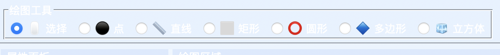
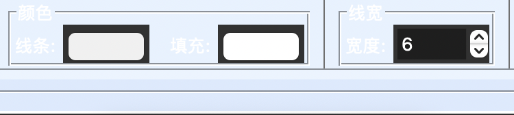
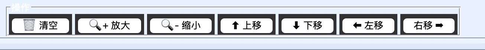
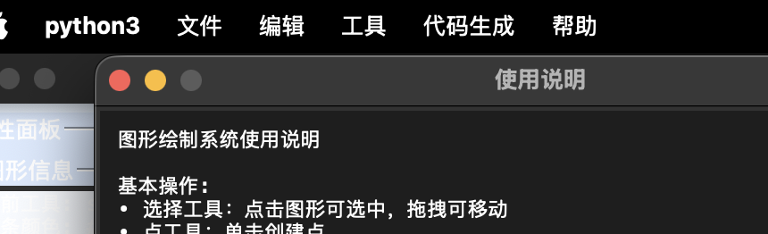
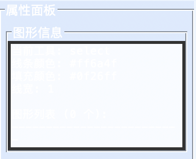
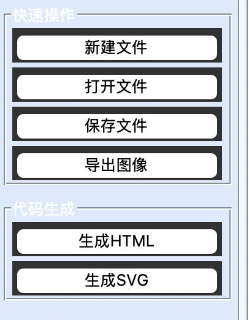
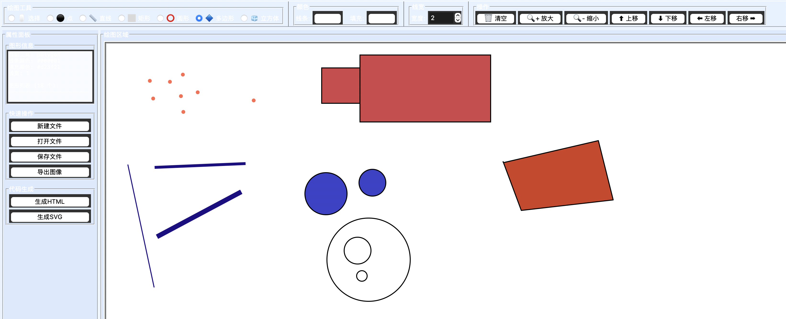
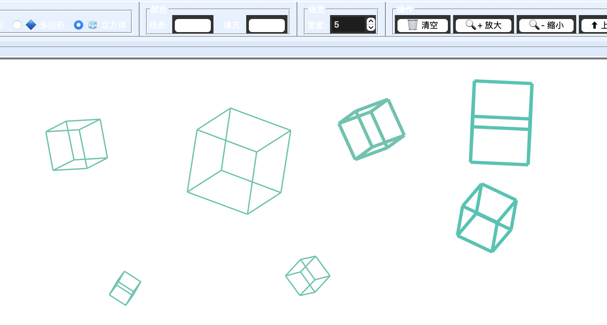
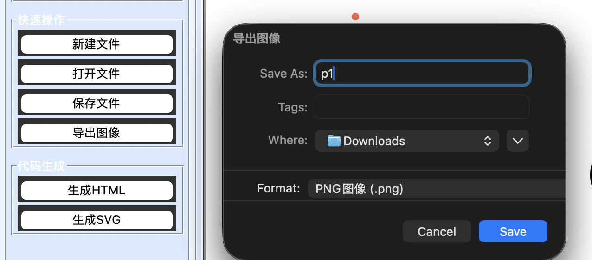
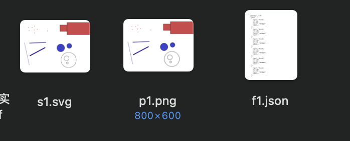

# 绘图系统实验报告

作业：计算机图形学第一次作业  
学号：23320093  
姓名：林宏宇    
提交日期：2025-10-14    

## 作业要求
- 支持绘制基本二维图形，如点、直线、矩形、圆形、多边形。
- 支持设置图形的属性，如颜色、线宽、填充方式。
- 支持拖动、缩放等基本功能。
- 提供图形化界面，用户能够通过界面绘制不同的图形。
- 能够将绘制的图形存储为文件。
- 其他扩展功能，如对三维图形的操作，自选完成。
- 个人单独完成！！！系统有特色、有亮点！！！！！

## 提交要求
- 提交可执行程序文件：Windows 平台可直接运行的.exe（无需安装即可启动）。
- 提交程序源代码：包含所有源程序文件（如.py /.java /.cpp 等），编程语言不做要求。
- 2025年10月15日前提交。
- 以邮件方式发送到指定邮箱：cg2025@yeah.net
- 所有文件打包成一个压缩包，压缩包命名为【学号-姓名-绘图系统作业zip】（注：中间用“-”符号隔开），邮件标题命名为【学号-姓名-第一次作业】（注：中间用“-”符号隔开）。

## 1.实验目的
- 建立一个绘图系统，能够绘制和存储基本的二维图形，了解二维图形的基本构成、属性以及如何通过编程实现图形的创建与存储。在二维的基础上实现三维绘图。
- 通过在作业中，熟悉常用的图形编程软件和图形函数库的使用。

## 2. 实验环境
- 语言与运行时：Python ≥ 3.12
- 主要依赖：
  - Tkinter（GUI）
  - Pillow（导出 PNG/JPG）
  - PyInstaller（打包可执行文件）
- 平台：macOS（用于编写程序）、Windows 11（用于最后生成 .exe）
- 项目结构：
  - `main.py` 程序入口
  - `gui.py` 主界面与菜单/工具栏
  - `canvas.py` 绘图与交互逻辑
  - `shapes.py` 图形模型（点/线/矩形/圆/多边形/立方体）
  - `file_manager.py` 文件保存/加载、前端代码生成
  - `build.py` 打包脚本
  - `run.py` 便捷启动器
  - `example.json` 示例数据

## 3. 需求分析与实现对照

### 支持基本二维图形
- [x] 点
- [x] 直线
- [x] 矩形
- [x] 圆形
- [x] 多边形 

### 支持图形属性
- [x] 颜色
- [x] 填充（点不含填充）
- [x] 线宽

### 支持基本交互
- [x] 选择
- [x] 拖动
- [x] 缩放（支持中心缩放）
- [x] 删除
- [x] 移动（方向键微移）

### 图形界面
- [x] 工具栏
- [x] 状态栏
- [x] 属性面板与快捷键

### 文件存储
- [x] 新建/打开/保存
- [x] HTML/SVG 格式代码生成
- [x] PNG/JPG图像导出

### 扩展功能及其他要求
- [x] 3D 立方体（支持三维图像的旋转）
- [x] 可执行程序：支持 PyInstaller 打包（在 Windows 环境打包）

## 4. 系统设计与模块划分
- GUI 层（`gui.py`）
  - 菜单：文件/编辑/工具/代码生成/帮助
  - 工具栏：绘图工具（选择/点/线/矩形/圆/多边形/立方体），颜色与线宽设置，缩放与微移快捷操作
  - 左侧信息/操作/代码生成面板 + 右侧绘图区
  - 事件总线：将用户操作委派给 `DrawingCanvas`
- 交互层（`canvas.py`）
  - 统一维护图形列表、当前工具与状态（绘制、拖拽、多边形点集）
  - 选择命中、拖拽移动/旋转（立方体）、绘制过程的临时形状、缩放中心计算
  - 图像导出：将图形绘制到 Pillow `ImageDraw`
- 数据层（`shapes.py`）
  - 图形抽象类 `Shape`：绘制、命中、移动、边界、缩放、序列化
  - 派生类：`Point`、`Line`、`Rectangle`、`Circle`、`Polygon`、`Cube`
  - 工厂方法 `create_shape_from_dict`
- 存储与生成（`file_manager.py`）
  - JSON 序列化/反序列化
  - 前端代码生成器：HTML Canvas 与 SVG 输出
  - 文件对话框与消息提示
- 启动与打包（`run.py`、`build.py`）
  - 依赖检查与主程序启动
  - PyInstaller 一键打包

## 5. 关键技术与算法说明
- 命中测试（Hit Testing）
  - 点：半径距离判断
  - 线：点到线段距离 + 段范围判定
  - 矩形/圆：区域或半径内判定
  - 多边形：射线法（Ray Casting）
  - 立方体：使用最近一次投影边界做包围盒命中，外扩容差提升选中易用性
- 缩放与中心对齐
  - 通过 `get_bounds` 计算选中图形包围盒中心作为缩放中心
  - 各图形根据中心点进行坐标/尺寸缩放
- 3D 立方体绘制
  - 顶点在局部坐标系定义；支持绕 X/Y/Z 旋转
  - 采用等轴测投影（cos30≈0.866）映射到 2D 屏幕
  - 鼠标拖拽在选择状态下改变 `rotation_x/rotation_y` 实现交互旋转
- 序列化与前端代码生成
  - JSON Schema：记录图形类型与必要参数（位置、尺寸、样式等）
  - HTML Canvas：使用 `ctx` 绘制等价图形
  - SVG：生成语义化 `<line> / <rect> / <circle> / <polygon>` 等元素
- 图像导出
  - 使用 Pillow 将场景绘制到内存图像后保存为 PNG/JPG

### 命中测试细节与复杂度
- 点（`Point.contains_point`）
  - 距离阈值：

    $$ d = \sqrt{(x - x_0)^2 + (y - y_0)^2} \le \text{size} + 3. $$

  - 复杂度：$O(1)$。

- 线段（`Line.contains_point`）
  - 距离公式：设直线 $Ax + By + C = 0$，其中：

    $$ A = y_2 - y_1, \quad B = x_1 - x_2, \quad C = x_2 y_1 - x_1 y_2, $$

    $$ d = \frac{|A x + B y + C|}{\sqrt{A^2 + B^2 + \varepsilon}}. $$

    其中 $\varepsilon = 1\times 10^{-10}$ 用于防止除零。
  - 同时进行线段范围判定：

    $$ x \in [\min(x_1,x_2)-3,\ \max(x_1,x_2)+3],\quad y \in [\min(y_1,y_2)-3,\ \max(y_1,y_2)+3]. $$

  - 复杂度：$O(1)$。

- 矩形与圆（`Rectangle/Circle.contains_point`）
  - 矩形：点在轴对齐包围盒内的闭区间判断；圆：中心半径判定。
  - 复杂度：$O(1)$。

- 多边形（`Polygon.contains_point`）
  - 射线法（Ray Casting）：从测试点向右水平射线，统计与边的交点奇偶性决定是否在内。
  - 特殊情形：水平边与端点重合通过条件次序与“<=/!=”的搭配避免重复计数。
  - 复杂度：$O(n)$（n 为顶点数）。

- 立方体（`Cube.contains_point`）
  - 不做逐边拾取，采用最近一次绘制时的投影点集的轴对齐包围盒 `get_bounds()`，并外扩 6px 容差，提升可选中性与交互流畅度。
  - 优点：稳定、快速；局限：无法区分空洞与非凸投影边界、不能精确到边/面。
  - 复杂度：$O(1)$。

- 选择优先级与绘制顺序
  - 选择从后向前遍历 `shapes`（后绘制在上层，先命中），符合视觉层级直觉。
  - 全局命中复杂度：$O(N)$（N 为图形数）。

### 缩放中心与各图形缩放策略
- 缩放中心：统一使用选中图形的包围盒中心 `(cx, cy)`，由 `get_bounds()` 计算。
- 点：缩放 size，位置相对 `(cx, cy)` 线性缩放；最小 size 限制为 1。
- 线：两端点相对 `(cx, cy)` 进行仿射缩放，保持连线方向。
- 矩形：先缩放宽高，再根据新中心回推左上角，保证视觉居中缩放。
- 圆：缩放半径并对圆心做相对中心的线性缩放。
- 多边形：逐顶点相对中心缩放，随后重算几何中心作为形心。
- 立方体：缩放 `size` 并重建局部八顶点（不改变旋转角）；注意缩放不影响旋转状态。

### 3D 立方体渲染与交互
- 顶点与旋转：
  - 顶点以立方体中心为原点的局部坐标，边长 size/2。
  - 旋转顺序：Y → X → Z；逐轴使用标准旋转矩阵：

    $$ R_y(\theta)=\begin{bmatrix}\cos\theta&0&-\sin\theta\\0&1&0\\\sin\theta&0&\cos\theta\end{bmatrix} $$

    $$ R_x(\phi)=\begin{bmatrix}1&0&0\\0&\cos\phi&-\sin\phi\\0&\sin\phi&\cos\phi\end{bmatrix} $$

    $$ R_z(\psi)=\begin{bmatrix}\cos\psi&-\sin\psi&0\\\sin\psi&\cos\psi&0\\0&0&1\end{bmatrix} $$
  - 数值稳定：所有三角函数基于 `math`，不做归一化以避免累积误差放大。
 - 投影：等轴测投影，使用 $\cos 30^\circ \approx 0.866$ 与 $0.5$ 的标准权重；屏幕坐标 y 轴向下，故投影 y 分量取负以匹配 Tkinter 坐标系。

   $$ x' = (x - z)\cos 30^\circ, \quad y' = -\big(y + 0.5(x+z)\big). $$
- 交互：选择后拖拽即旋转，增量映射为 `rotation_y += dx * 0.01`，`rotation_x += dy * 0.01`，体验上更直观。
- 命中缓存：绘制时缓存投影点的包围盒，供后续命中使用（首次命中则即时计算一次）。

### 序列化与代码生成
- JSON Schema（`file_manager.py`）：
  - 文件级：`{"version":"1.0","shapes":[...],"metadata":{...}}`；形状级：各自 `to_dict()` 字段集（如 Line: x1,y1,x2,y2,color,line_width）。
  - 未知 `type` 将抛出异常以避免静默错误（`create_shape_from_dict`）。
- HTML Canvas/SVG 生成：
  - 完整映射 Point/Line/Rectangle/Circle/Polygon 的绘制语义（颜色、线宽、填充）。
  - 当前未对 `Cube` 生成前端代码（3D 未导出）；可在后续将 12 条边投影为 12 条线段输出到 Canvas/SVG。

### 图像导出（Pillow）
- 使用 `ImageDraw` 将场景栅格化为 PNG/JPG；已覆盖 Point/Line/Rectangle/Circle/Polygon。
- 目前未栅格化 `Cube`（与代码生成一致的限制）；后续可在导出时对 12 边做与 GUI 相同的投影后再绘制直线以实现导出。

### 数值与工程注意点
- 坐标系：Tkinter 原点左上，x 向右、y 向下；3D 投影已做 y 反号匹配。
- 容差：线段命中采用 3px，立方体命中采用 6px 外扩，兼顾可选中性与准确性。
- 稳健性：距离分母引入 ε 防止除零；最小尺寸与半径做下限保护。
- 性能：每次重绘 $O(N)$；命中 $O(N)$。在上千图形规模下仍可流畅，如需进一步优化可引入空间索引（网格/四叉树）。

## 6. 特色与亮点
- 前端代码一键生成：将手绘内容转译为可直接部署的 HTML Canvas 与 SVG。
- 3D 立方体交互：在 2D GUI 中以等轴测投影呈现，并支持拖拽旋转与缩放。
- 友好交互：状态栏提示、快捷键、方向键微移、属性实时生效。
- 工程化完整链路：编辑 → 存储 → 导出图像/前端代码 → 打包发布。

## 7. 使用说明
- 工具切换：工具栏单选按钮或菜单（选择/点/线/矩形/圆/多边形/立方体）
- 属性设置：线条颜色、填充颜色（可置空）、线宽
- 基本操作：
  - 单击选择；拖拽移动（立方体为旋转）；Delete 删除
  - Ctrl+= / Ctrl+- 缩放，方向键微移（↑↓←→ 每次10像素）
  - 多边形：单击依次落点，双击结束
- 代码生成：点击“生成HTML”或“生成SVG”保存到本地
- 图像导出：可保存 PNG/JPG

## 8. 使用结果展示

- 2D绘图展示    

- 3D立方体展示    

- 导出文件/图片   

- 保存结果  

## 9. 遇到的问题与解决
- 跨平台适配：在macOS编写调试，最终在Windows打包生成.exe。解决方案是使用PyInstaller在目标平台执行打包脚本。
- 多边形命中与闭合：使用射线法；绘制过程中提供临时点与虚线段辅助反馈。
- 立方体命中：直接对投影后的包围盒判定，并设置外扩容差以提升可选中性。

## 10. 总结

### 结果小结
- 实现点、线、矩形、圆、多边形等 2D 图形的绘制、选择、移动、缩放、删除与属性编辑。
- 实现 3D 立方体的等轴测显示与交互旋转，丰富系统表现力。
- 支持文件保存/加载（JSON）、图像导出（PNG/JPG）以及前端代码生成（HTML Canvas/SVG）。
- GUI 具备工具栏、状态栏、属性面板与快捷键，操作流程顺畅。

### 图形编程和库的学习
- Tkinter 事件与组件
  - 事件驱动模型：<Button-1> / <B1-Motion> / <ButtonRelease-1> / <Double-Button-1> / <KeyPress> 的配合，完成绘制、拖拽、闭合多边形与快捷键微移；焦点管理确保方向键在全局可用。
  - 画布与状态：`DrawingCanvas` 统一维护工具状态（选择/绘制/多边形点集），与 GUI 的单选按钮、菜单快捷键形成清晰的单向数据流。
  - UI 体验：状态栏实时提示、属性即时生效（颜色/线宽/填充），信息面板展示场景摘要，提高可观测性。
- 图形抽象与可扩展性
  - 以抽象类 `Shape` 统一接口：`draw/contains_point/move/get_bounds/scale/to_dict/from_dict`，便于新增图形类型、统一序列化与导出。
  - 工厂方法 `create_shape_from_dict` 解耦载入逻辑与具体类型，JSON Schema 清晰可读、易扩展。
- 命中测试与数值稳定
  - 线段命中采用点到线距离 + 线段范围判定，并在分母加入 ε 防止除零；对点/圆/矩形使用半径或 AABB 判定；多边形使用射线法（奇偶性）。
  - 3D 立方体使用投影点集的包围盒做命中，并外扩容差（6px）平衡精度与易用性，实践中显著改善选择手感。
- 3D 等轴测与交互旋转
  - 局部八顶点 + 旋转矩阵（Y→X→Z）+ 等轴测投影（cos30、0.5 权重）=→ 2D 显示；拖拽映射为角度增量，直观高效。
  - 旋转与缩放互不干扰：缩放重建顶点，旋转角保持；减少累积误差对显示的影响。
- 序列化与前端代码生成
  - JSON 序列化对 Point/Line/Rectangle/Circle/Polygon 全覆盖；HTML Canvas/SVG 一键生成对应绘制语句，便于分享与复现。
  - 当前未生成 `Cube` 的前端代码与导出图像（已在设计上预留扩展点，未来将 12 条边投影为 2D 线段输出）。
- Pillow 光栅化导出
  - 使用 `ImageDraw` 将矢量场景栅格化为 PNG/JPG；对线宽、填充与颜色保持一致；注意与 Tkinter 坐标系一致性（y 轴向下）。
- 打包与跨平台
  - 依赖最小化（Tkinter/Pillow），在 Windows 使用 PyInstaller 打包；开发在 macOS，运行/打包在 Windows，验证了基本的跨平台链路。

本次实验完成了二维图形的完整链路（绘制—交互—存储—导出—代码生成），并在此基础上实现了 3D 立方体的等轴测显示与交互旋转，界面与交互流程清晰顺畅，满足并超出作业要求。通过合理的抽象与模块划分，系统具备良好的可维护性与可扩展性，能够在后续较低成本地增加新图形或新导出能力。

 