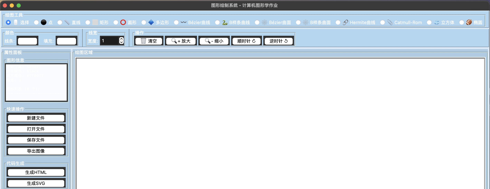
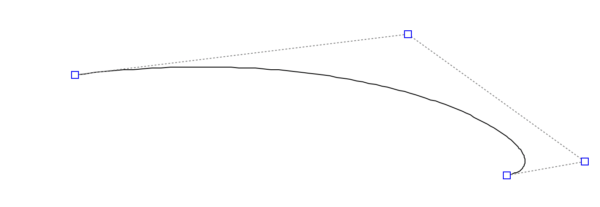
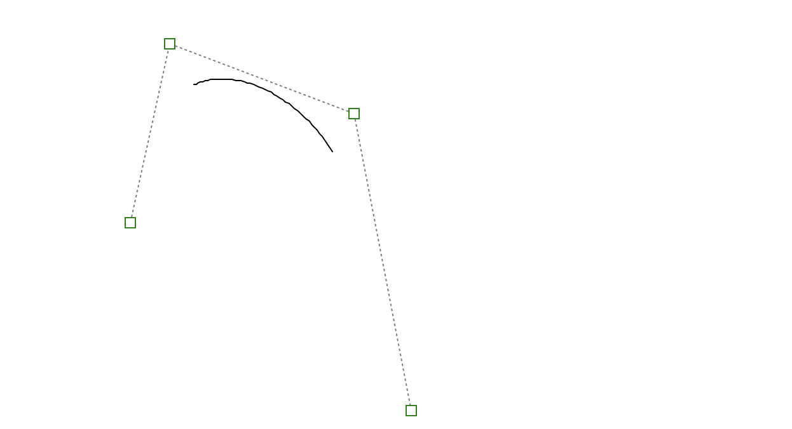
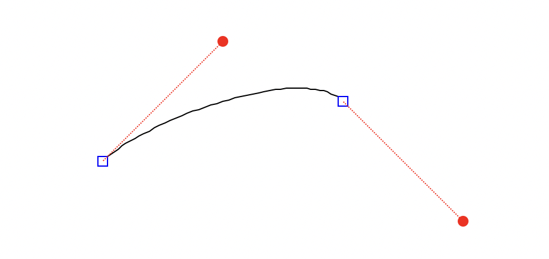
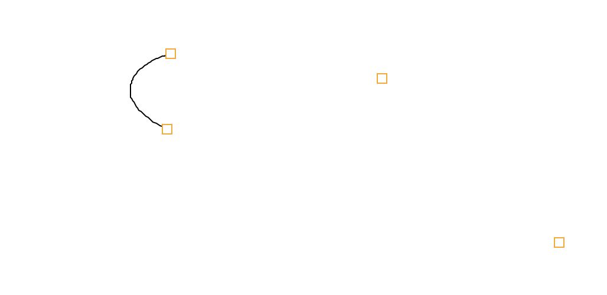
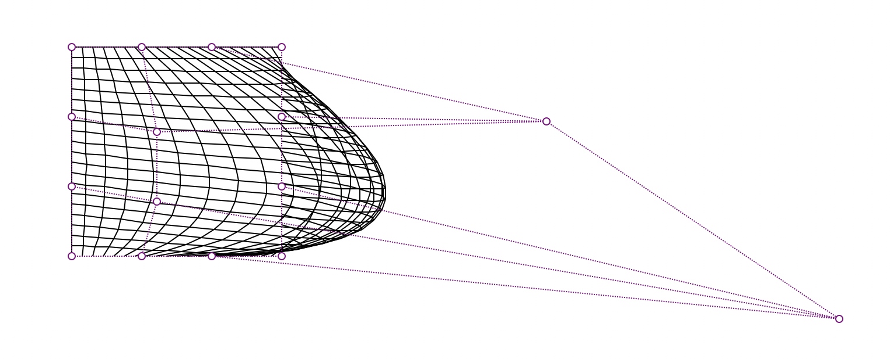
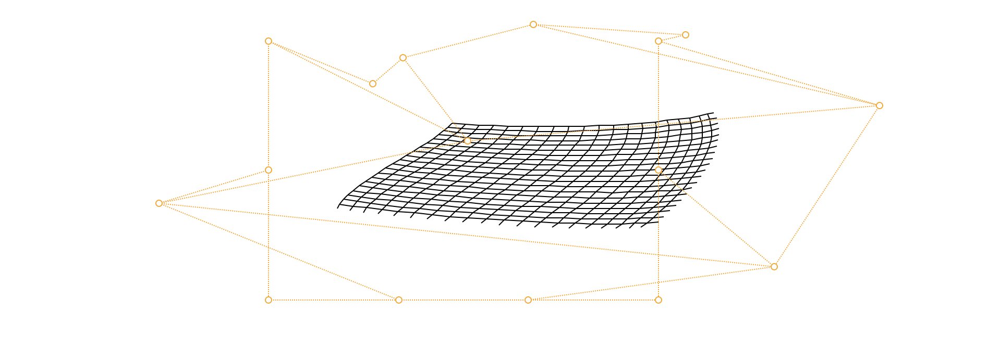
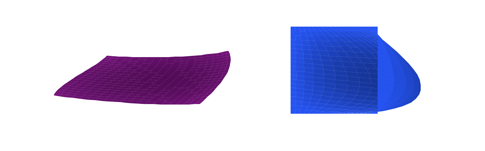
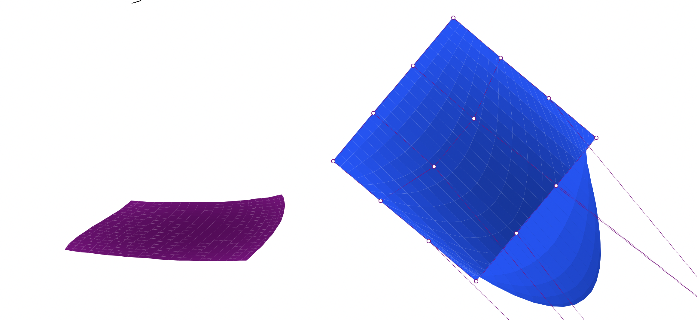

<div align="center">
    

<br><br><br>
</div>
<div style="font-size:1.6em; font-weight:normal; line-height:1.6;">
<div style="text-align:center; font-size:2.9em; font-weight:normal; letter-spacing:0.1em;">实验作业报告</div>
<br/>
<br>
<div style="text-align:center; font-size:1.3em; line-height:1.8;">
  <table style="margin: 0 auto; font-size:1.1em;">
  <tr><td align="right">实验：</td><td align="left">计算机图形学</td></tr>
  <tr><td align="right">学号：</td><td align="left">23320093</td></tr>
  <tr><td align="right">姓名：</td><td align="left">林宏宇</td></tr>
  <tr><td align="right">专业：</td><td align="left">计算机科学与技术</td></tr>
  <tr><td align="right">班级：</td><td align="left">计科1班</td></tr>
  <tr><td align="right">指导教师：</td><td align="left">周凡</td></tr>
  <tr><td align="right"style="border-bottom:1px solid #000;">实验日期：</td><td align="left" style="border-bottom:1px solid #000;">2025年12月19日</td></tr>
  </table>
</div>
</div>

<div STYLE="page-break-after: always;"></div>

# 计算机图形系统实验报告

## ✏️ 作业要求

### 目标

在已建立的绘图系统基础上，深化对参数曲线与曲面生成原理的理解与工程应用，通过手动实现经典曲线(Bézier、B 样条)与曲面(Bézier 曲面、三边 Bézier 曲面)的核心算法，提升系统对复杂几何造型的支持能力。

### 作业要求

- 至少手动实现两种经典参数曲线算法，包括但不限于二次/三次 Bézier 曲线(基于 Bernstein 基函数、de Casteljau 递推算法)、二次/三次 B样条曲线(基于B样条基函数、分段连续特性)，需支持通过拖拽控制顶点调整曲线形态;
- 实现至少一种参数曲面算法，优先选择双三次 Bézier 曲面(基于张量积原理)或三边 Bézier 曲面(基于三角域Bernstein 基)，需通过控制网格(矩形阵列/三角形阵列)定义曲面，并支持“网格线显示”“曲面填充” 两种可视化模式，填充时需结合扫描线算法或重心坐标法实现颜色渐变;
- 新增曲线曲面平移/旋转/缩放操作，操作过程中需优化重绘逻辑，减少画面闪烁;
- 与第二次个人作业的成果相集成，能够直观的对比不同方法下的实现效果，形成功能更加完备、交互性更好的绘图系统;
- 本次作业不可直接调用现成的库函数，需要通过光栅化算法实现上述功能;
- 个人单独完成!人机交互友好、功能完整，系统有特色、有亮点!!!!!

## 🧑‍💻 项目介绍

本项目是一个基于实验一和实验二的图形绘制系统，实现了从实验一的库函数、实验二作业的光栅化算法绘制到实验三作业的曲线曲面算法。

系统支持多种基本二维图形的绘制，包括点、直线、矩形、圆形、多边形、立方体和椭圆，并提供完整的图形交互功能，如选择、移动、缩放、旋转、颜色设置等。

实验三的提升主要在于使用曲线和曲面算法提升了系统对复杂集合造型的支持能力。本次实验重点攻克了 **参数曲线与曲面** 的生成技术。系统完全摒弃了绘图库的高级接口，从像素级出发，实现了包括 B样条曲线、Bézier 曲面在内的复杂几何对象的数学建模与渲染。


## 📋 实验内容与原理

### 1. 参数曲线算法

#### 1.1 Bézier 曲线
**实现原理**: 
Bézier 曲线利用 Bernstein 基函数进行线性组合。对于 $n$ 次 Bézier 曲线，给定 $n+1$ 个控制点 $P_0, P_1, ..., P_n$，其参数方程为：

$$ P(t) = \sum_{i=0}^{n} B_{i,n}(t) P_i, \quad t \in [0, 1] $$

其中 $B_{i,n}(t)$ 为 Bernstein 多项式：
$$ B_{i,n}(t) = C_n^i t^i (1-t)^{n-i} $$

**代码实现详解**:
代码中定义了 `bernstein_poly` 函数计算基函数值，并通过 `draw_bezier_curve` 函数遍历 $t$ (步长 1/steps) 来计算曲线上的点序列。相邻点之间调用 `draw_line_bresenham` 或 `draw_line_wu` (抗走样) 进行连接。

**核心代码 (`rasterization.py`)**:
```python
def bernstein_poly(i, n, t):
    """计算Bernstein基函数值"""
    return binomial_coeff(n, i) * (t ** i) * ((1 - t) ** (n - i))

def draw_bezier_curve(canvas, points, ...):
    n = len(points) - 1
    # 遍历参数 t [0, 1]
    for i in range(1, steps + 1):
        t = i / steps
        x, y = 0.0, 0.0
        # 对每个控制点计算其对当前 t 时刻点的贡献
        for j in range(n + 1):
            b = bernstein_poly(j, n, t)
            x += points[j][0] * b
            y += points[j][1] * b
        # 连接点绘制线段...
```

#### 1.2 B样条曲线 (B-Spline)
**实现原理**: 
B样条曲线克服了 Bézier 曲线无法局部控制的缺点。本项目实现了 **均匀 B 样条曲线**。对于 $k$ 次 B样条曲线，由控制点 $P_0, P_1, ..., P_n$ 定义，其方程为：

$$ P(u) = \sum_{i=0}^{n} N_{i,k}(u) P_i $$

其中 $N_{i,k}(u)$ 是通过 Cox-de Boor 递推公式定义的基函数。
在代码中，针对常用的二次 ($k=2$) 和三次 ($k=3$) 均匀 B 样条，我们直接展开了基函数的多项式形式以提高计算效率。例如三次 B 样条的基函数矩阵形式隐式包含在代码逻辑中：

$$
P_i(t) = \frac{1}{6} \begin{bmatrix} t^3 & t^2 & t & 1 \end{bmatrix} 
\begin{bmatrix} -1 & 3 & -3 & 1 \\ 3 & -6 & 3 & 0 \\ -3 & 0 & 3 & 0 \\ 1 & 4 & 1 & 0 \end{bmatrix}
\begin{bmatrix} P_{i} \\ P_{i+1} \\ P_{i+2} \\ P_{i+3} \end{bmatrix}
$$

**核心代码 (`rasterization.py`)**:
代码利用了 B 样条的局部性原理，即曲线的每一段只由 $k+1$ 个控制点决定。
```python
def draw_bspline_curve(canvas, points, k, ...):
    # 三次均匀B样条 (k=3)
    # 对于每一段曲线 segment，由相邻的4个控制点定义
    for i in range(n - k + 1):
        segment_points = points[i : i + k + 1]
        for j in range(steps + 1):
            t = j / steps
            # 直接应用展开后的基函数公式
            it = 1 - t
            b0 = (it**3) / 6.0
            b1 = (3*t**3 - 6*t**2 + 4) / 6.0
            b2 = (-3*t**3 + 3*t**2 + 3*t + 1) / 6.0
            b3 = (t**3) / 6.0
            
            x = b0*segment_points[0][0] + b1*segment_points[1][0] + \
                b2*segment_points[2][0] + b3*segment_points[3][0]
            # ...
```

#### 1.3 Hermite 曲线
**实现原理**: 
Hermite 曲线通过两个端点 $P_1, P_2$ 和两个端点的切向量 $T_1, T_2$ 定义。其参数方程可以表示为三次多项式：

$$ P(t) = (2t^3 - 3t^2 + 1)P_1 + (-2t^3 + 3t^2)P_2 + (t^3 - 2t^2 + t)T_1 + (t^3 - t^2)T_2, \quad t \in [0, 1] $$

这四个多项式系数称为 Hermite 基函数。

**核心代码 (`rasterization.py`)**:
```python
def draw_hermite_curve(canvas, p1, p2, t1, t2, ...):
    for i in range(1, steps + 1):
        t = i / steps
        t2_val = t * t
        t3_val = t2_val * t
        # Hermite 基函数
        h1 = 2 * t3_val - 3 * t2_val + 1
        h2 = -2 * t3_val + 3 * t2_val
        h3 = t3_val - 2 * t2_val + t
        h4 = t3_val - t2_val
        
        x = h1 * p1[0] + h2 * p2[0] + h3 * t1[0] + h4 * t2[0]
        y = h1 * p1[1] + h2 * p2[1] + h3 * t1[1] + h4 * t2[1]
        # ...
```

#### 1.4 Catmull-Rom 样条曲线
**实现原理**: 
Catmull-Rom 样条是一种特殊的插值样条，它保证曲线经过所有的控制点。第 $i$ 段曲线由四个点 $P_{i-1}, P_i, P_{i+1}, P_{i+2}$ 定义，实际上绘制的是 $P_i$ 到 $P_{i+1}$ 之间的部分。其切向量由相邻点的差分隐式定义：$T_i = 0.5 * (P_{i+1} - P_{i-1})$。

基函数矩阵形式 (Tension = 0.5):
$$
P(t) = \frac{1}{2} \begin{bmatrix} t^3 & t^2 & t & 1 \end{bmatrix} 
\begin{bmatrix} -1 & 3 & -3 & 1 \\ 2 & -5 & 4 & -1 \\ -1 & 0 & 1 & 0 \\ 0 & 2 & 0 & 0 \end{bmatrix}
\begin{bmatrix} P_{i-1} \\ P_{i} \\ P_{i+1} \\ P_{i+2} \end{bmatrix}
$$

**核心代码 (`rasterization.py`)**:
```python
def draw_catmull_rom_curve(canvas, points, ...):
    # 至少需要4个点才能确定一段曲线
    for i in range(len(points) - 3):
        p0, p1, p2, p3 = points[i], points[i+1], points[i+2], points[i+3]
        for j in range(1, steps + 1):
            t = j / steps
            # 计算基函数权重
            b0 = 0.5 * (-t3 + 2*t2 - t)
            b1 = 0.5 * (3*t3 - 5*t2 + 2)
            # ...
            x = b0*p0[0] + b1*p1[0] + b2*p2[0] + b3*p3[0]
            # ...
```

### 2. 参数曲面算法

#### 2.1 双三次 Bézier 曲面
**实现原理**: 
曲面生成基于 **张量积 (Tensor Product)** 思想。双三次 Bézier 曲面由 $4 \times 4$ 的控制网格 $P_{i,j}$ 定义：

$$ S(u, v) = \sum_{i=0}^{3} \sum_{j=0}^{3} B_{i,3}(u) B_{j,3}(v) P_{i,j}, \quad u,v \in [0, 1] $$

**算法流程**:
1.  **网格生成**: 在 $u, v$ 方向上分别进行 $M, N$ 次采样。
2.  **点计算**: 使用 `get_bezier_point(points, u, v)` 函数，先对每一行控制点进行 $v$ 方向的 Bézier 插值得到中间控制点，再对中间控制点进行 $u$ 方向插值得到最终曲面点 $S(u,v)$。
3.  **渲染模式**:
    -   **网格线模式**: 将计算出的点投影到屏幕坐标（简单正交投影），连接相邻点形成网格。
    -   **填充模式**: 将网格形成的每个四边形 (Quad) 视为一个小多边形，利用扫描线算法进行颜色填充，实现渐变效果。

**核心代码 (`rasterization.py`)**:
`get_bezier_point` 函数完美体现了张量积的两次插值过程。
```python
def get_bezier_point(points, u, v):
    """计算双三次Bézier曲面上的一点 (Tensor Product)"""
    # 第一步：在 V 方向上插值，将 4x4 点阵简化为 4 个中间点
    temp_points = []
    for i in range(4):
        row_p = [points[i][j] for j in range(4)]
        row_x, row_y, row_z = 0.0, 0.0, 0.0
        for j in range(4):
            b = bernstein_poly(j, 3, v) # 计算 V 方向基函数
            row_x += row_p[j][0] * b
            row_y += row_p[j][1] * b
            row_z += row_p[j][2] * b
        temp_points.append((row_x, row_y, row_z))
    
    # 第二步：在 U 方向上插值，得到最终曲面点
    final_x, final_y, final_z = 0.0, 0.0, 0.0
    for i in range(4):
        b = bernstein_poly(i, 3, u) # 计算 U 方向基函数
        final_x += temp_points[i][0] * b
        # ...
    return (final_x, final_y, final_z)
```

#### 2.2 B样条曲面
**实现原理**:
同理，B样条曲面也是控制点列的张量积，但基函数替换为 B 样条基函数。它提供了更好的局部控制能力，调整一个控制点只会影响曲面的局部区域。系统通过遍历 $N \times M$ 的控制网格，将其划分为多个 $(4 \times 4)$ 的基本 Patch 进行绘制。
对于 $k \times l$ 次 B 样条曲面，由 $(n+1) \times (m+1)$ 个控制点网络 $P_{i,j}$ 定义，其方程为：
$$ S(u, v) = \sum_{i=0}^{n} \sum_{j=0}^{m} N_{i,k}(u) N_{j,l}(v) P_{i,j} $$

本实验中采用**三次均匀 B 样条曲面**，其张量积矩阵形式（针对单个 Patch）为：
$$ S(u, v) = U M P M^T V^T $$
其中：
- $U = [u^3, u^2, u, 1]$, $V = [v^3, v^2, v, 1]$
- $M$ 为三次均匀 B 样条基矩阵（同曲线部分）
- $P$ 为该 Patch 涉及的 $4 \times 4$ 控制点矩阵

**核心代码**:
```python
def get_bspline_surface_point(points_4x4, u, v):
    # 预计算基函数值
    bu = bspline_basis_cubic(u)
    bv = bspline_basis_cubic(v)
    
    # 双重循环加权求和
    for i in range(4):
        for j in range(4):
            weight = bu[i] * bv[j] # 张量积权重
            p = points_4x4[i][j]
            final_x += p[0] * weight
            # ...
    return (final_x, final_y, final_z)
```

#### 2.3 曲面可视化模式

系统支持两种截然不同的曲面可视化模式，分别侧重于展示拓扑结构和表面光照效果。

##### 2.3.1 网格线模式 (Wireframe)
**数学原理**:
将参数曲面 $S(u,v)$ 在参数域 $u, v \in [0, 1]$ 上进行等间距离散化。
令 $u_i = i/N, v_j = j/M$，计算网格点 $P_{i,j} = S(u_i, v_j)$。
网格线即将同一行或同一列的离散点连接起来，近似表示参数曲线 $S(u, v_j)$ 和 $S(u_i, v)$。

**代码实现**:
使用 `draw_line_wu` (抗走样) 或 `draw_line_bresenham` 绘制连接线。
```python
if show_mesh:
    # 绘制 u 方向和 v 方向的等参数线
    draw_line_wu(canvas, p00[0], p00[1], p01[0], p01[1], color) # v 方向
    draw_line_wu(canvas, p00[0], p00[1], p10[0], p10[1], color) # u 方向
```

##### 2.3.2 深度光照填充模式 (Depth-based Shading)
**数学原理**:
为了增强曲面的立体感，本实验实现了一种**基于深度（高度）的伪光照模型**。
1.  **细分 (Tessellation)**: 将曲面划分为微小的四边形面片 $Q_{i,j}$。
2.  **深度映射 (Depth Mapping)**: 计算每个面片的平均深度 $\bar{z}_{i,j}$，并归一化到 $[0, 1]$ 区间。
    $$ ratio = \frac{\bar{z}_{i,j} - z_{min}}{z_{max} - z_{min}} $$
3.  **色彩空间插值**: 在两个关键颜色 $C_{light}$ (高光/浅色) 和 $C_{dark}$ (阴影/深色) 之间进行线性插值。
    $$ C_{final} = (1 - ratio) \cdot C_{light} + ratio \cdot C_{dark} $$

**代码实现**:
利用扫描线算法 `_scanline_fill_quad` 填充每个微小四边形。
```python
if fill:
    # 1. 计算当前面片的平均高度 Z
    avg_z = (p00[2] + p01[2] + p11[2] + p10[2]) / 4.0
    
    # 2. 归一化深度值
    ratio = (avg_z - min_z) / z_range
    
    # 3. 颜色线性插值 (Lerp)
    r = int(r1 + (r2 - r1) * ratio)
    g = int(g1 + (g2 - g1) * ratio)
    b = int(b1 + (b2 - b1) * ratio)
    poly_color = f"#{r:02x}{g:02x}{b:02x}"
    
    # 4. 扫描线填充
    _scanline_fill_quad(canvas, quad_points, poly_color)
```

### 3. 光栅化引擎升级

#### 3.1 线宽支持 (Line Width)
为了增强视觉效果，在 `rasterization.py` 中对 Bresenham 直线算法、中点圆算法、中点椭圆算法进行了扩展。
-   **原理**: 在计算出核心的一组像素后，通过循环在法线方向（对于直线）或径向（对于圆环）填充额外的像素。
-   **代码**:
    ```python
    # Bresenham 直线宽度处理
    # 根据斜率决定扩展方向：dx > dy 时垂直扩展，否则水平扩展
    if dx > dy: 
        for k in range(offset_start, offset_end):
            canvas.draw_pixel(x1, y1 + k, color)
    ```

#### 3.2 椭圆算法修复与优化
在引入线宽后，发现原有的增量更新决策变量 ($d1, d2$) 逻辑容易受到变量复用干扰。最新的实现中，重构了 `draw_ellipse_midpoint`：
-   严格区分 **Region 1** (斜率绝对值 < 1) 和 **Region 2** (斜率绝对值 > 1)。
-   使用标准的决策参数初始值 $d1 = b^2 - a^2 b + 0.25 a^2$。
-   修正了不同半径下的循环逻辑，确保线宽渲染正确且无断裂。

**核心代码**:
```python
def draw_ellipse_midpoint(canvas, ...):
    # 模拟线宽的外层循环
    for k in range(start_offset, end_offset):
        crx = max(1, rx + k)
        cry = max(1, ry + k)
        # Region 1 初始化
        d1 = b2 - a2 * cry + 0.25 * a2
        while dx < dy:
            # 绘制对称点...
            # 更新 d1
            if d1 < 0:
                d1 += dx + b2
            else:
                d1 += dx - dy + b2
```


## 🧐 对比分析

### 4.1 四种参数曲线算法对比

| 算法 | 数学基础 | 连续性 | 局部控制性 | 描述 |
| :--- | :--- | :--- | :--- | :--- |
| **Bézier 曲线** | Bernstein 基函数 | $C^{n-1}$ (整体) | **无** (牵一发而动全身) | 它是通过端点和控制点定义的，曲线必定经过首尾控制点，但一般不经过中间控制点。改变任意一个控制点，整条曲线的形状都会发生变化。 |
| **B 样条曲线** | B 样条基函数 (递推) | $C^{k-1}$ (分段) | **有** (局部支撑) | 克服了 Bézier 的缺点，改变一个控制点只影响其所在的 $k$ 段曲线。可以精确表示圆锥曲线，是工业标准。 |
| **Hermite 曲线** | Hermite 基函数 (插值) | $C^1$ | 弱 (需操作切线) | 由两个端点和两个端点的切向量定义。相比点的控制，直接操作切向量对用户来说不够直观，但在计算机动画插值中非常有用。 |
| **Catmull-Rom** | 分段三次多项式 | $C^1$ | **有** | 一种特殊的插值样条，它**必定经过所有控制点**。不需要像 Hermite 那样显式定义切向量（切向量由相邻点自动计算），因此在路径规划和关键帧动画中极受欢迎。 |

**实验观察**:
- 在交互操作中，拖动 B 样条的一个顶点，曲线只会发生局部变形，操作手感更细腻。
- Catmull-Rom 曲线非常适合用于“连点成线”的场景，因为它能平滑地穿过所有用户选定的点。

### 4.2 两种参数曲面算法对比

| 算法 | 基本单元 | 接合特性 | 适用场景 |
| :--- | :--- | :--- | :--- |
| **双三次 Bézier 曲面** | 4x4 控制网格 | $C^0$ (简单拼接) | 适合构建简单的、独立的曲面片，如茶壶的盖子、简单的汽车部件。 |
| **双三次 B 样条曲面** | (N+1)x(M+1) 网格 | **$C^2$ 连续** | 适合构建复杂的、大范围的光滑曲面。由于其天然的连续性，在渲染时表面光照过渡更加自然，没有明显的接缝。 |

**可视化模式对比**:
- **网格线模式**: 计算开销小，适合在编辑阶段实时查看控制点调整对曲面拓扑的影响。
- **深度填充模式**: 计算开销大（需填充数千个四边形），但能直观展示曲面的空间起伏。使用 Z-Depth 映射代替复杂的光照计算，在保持 Python 渲染帧率的同时，达到了伪 3D 的视觉效果。

## 🎨 结果展示

### 功能展示

在原来实验的基础上，增加了参数曲线与曲面的绘制功能。以下为系统界面及各功能模块截图展示。



### 参数曲线

#### Bézier 曲线



#### B样条曲线



#### Hermite 曲线



#### Catmull-Rom 曲线



### 参数曲面

#### Bézier 曲面



#### B样条曲面



#### 颜色填充



#### 缩放、移动与旋转效果



## 💡 实验总结

### 算法总结

本次实验在实现了基础图形光栅化的基础上，成功实现了参数曲线与曲面的绘图功能。主要成果总结如下：

1.  **从离散到连续**：成功实现了从像素点阵（光栅化）到数学解析式（参数方程）的结合。通过将 $[0,1]$ 参数域离散化，利用 Bernstein 基函数和 B 样条基函数，实现了数学公式在屏幕空间的精准可视化。
2.  **曲面渲染技术**：在不引入 OpenGL 等 3D 库的前提下，探索了伪 3D 渲染管线。通过**细分（Tessellation）**将曲面转化为四边形网格，并创造性地提出了**基于 Z-Depth 的扫描线填充算法**。即利用曲面高度信息的归一化值 ($ratio$) 来驱动色彩插值，替代了传统的简单漫反射模型，在 Python 有限的算力下实现了具有立体感的色彩渐变效果。
3.  **矩阵与递推**：在 B 样条的实现中，对比了 Cox-de Boor 递归定义与矩阵展开形式。最终在代码中采用了针对三次 B 样条优化后的矩阵形式，显著减少了函数调用开销，保证了拖拽控制点时的实时帧率。

### 心得体会

通过本次实验，我对计算机图形学有了更深刻的体会和认识，我将理论课上学习的算法从公式变成了可视化的图形，并在作业的指引下完成了丰富的功能。

*   **遇到的问题**：课本上的公式往往是理想化的，但在工程实现中需要处理大量细节。例如在实现扫描线填充时，必须处理边界重合产生的“裂缝”问题；在计算颜色渐变时，需要防范 $Z_{max} = Z_{min}$ 导致的除零错误。解决这些 Edge Case 的过程也是对图形学理解和学习的深化。
*   **性能优化**：Python 作为解释型语言，在处理像素级操作时天生处于劣势。这迫使我不断思考优化策略，例如使用列表推导式替代循环、利用双缓冲机制减少重绘闪烁。不仅要展示出正确的图形，更要保证交互的流畅性。
*  **数学与编程结合**：本次实验让我体会到数学公式与编程实现之间的桥梁作用。理解曲线曲面的数学本质，才能在代码中正确实现其逻辑。每一个函数、每一行代码都承载着数学公式的意义，这种结合让我通过实践加深了对图形学的理解。

## 附件
- 实验报告（包含实验一二的基础，和此次实验三报告）
- 可执行程序

<script type="text/javascript" src="http://cdn.mathjax.org/mathjax/latest/MathJax.js?config=TeX-AMS-MML_HTMLorMML"></script> <script type="text/x-mathjax-config"> MathJax.Hub.Config({ tex2jax: {inlineMath: [['$', '$']]}, messageStyle: "none" }); </script>
