---

# 中山大学计算机学院

# 计算机网络实验报告

# 实验4——VLAN实验报告

---

|         | 姓名   | 学号     | 评分(按百分制) | 实验组编号: 3 |
| :------ | :----- | :------- | :------------- | :------------ |
| 组长:   | 王胜伟 | 23336228 | 100            | 3             |
| 组员 1: | 宋信贤 | 23336207 | 100            | 3             |
| 组员 2: | 王一澄 | 23336233 | 100            | 3             |
| 组员 3: | 林宏宇 | 23320093 | 100            | 3             |

---

# **实验: VLAN**

## 实验题目

采用以下拓扑，参考实验手册，完成下列任务：
a) 在进行VLAN配置前，要求：PC1、PC2、PC3都可以相互ping通;
b) 在交换机A上创建VLAN10，使VLAN绑定PC1在交换机上的端口；
c) 在交换机A和B上创建VLAN20,分别绑定PC2和PC3各自连接交换机的端口；
d) 把交换机A与B之间相连接的端口配置为Trunk口（Tag VLAN模式）；
e) 完成配置后，要求实现目标：PC1无法ping通PC 2和PC3；PC2与PC3可以互通。
f) 请在实验报告中截图显示两个交换机各自的VLAN配置信息、各种情况下互ping的结果。

## 实验拓扑

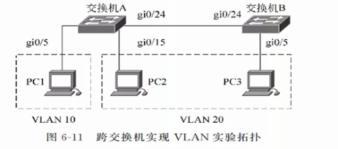

## 实验步骤与结果分析

### 1. 步骤一: PC 端 IP 地址配置

为了实现基本的网络互通，我们首先为三台 PC 配置了同一网段下的静态 IP 地址。我们选择 `192.168.10.0/24` 网段，确保在未划分 VLAN 前它们处于同一广播域。

- **PC1:**
    - IP 地址: 192.168.10.10
    - 子网掩码: 255.255.255.0

- **PC2:**
    - IP 地址: 192.168.10.20
    - 子网掩码: 255.255.255.0

- **PC3:**
    - IP 地址: 192.168.10.30
    - 子网掩码: 255.255.255.0

### 2. 步骤二: 交换机物理连接

依据实验拓扑图，我们将设备进行了物理连接：
- 交换机 A 负责接入 PC1 和 PC2，分别连接在端口 5 和 15。
- 交换机 B 负责接入 PC3，连接在端口 5。
- 为了实现跨交换机的通信，我们将交换机 A 的 24 口与交换机 B 的 24 口进行级联。

### 3. 步骤三: 初始连通性测试

> ***a）: 在进行VLAN配置前，要求：PC1、PC2、PC3都可以相互ping通***

在配置任何 VLAN 之前，交换机所有端口默认属于 VLAN 1。此时，所有 PC 应处于同一个广播域内。我们进行了 Ping 测试以验证物理链路的连通性。

**测试结果如下：**

PC1 ping PC2、PC3，均能正常连通：
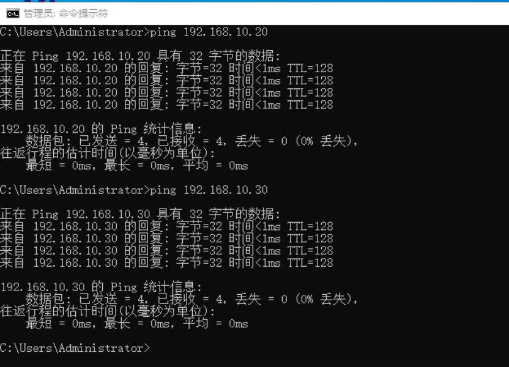

PC2 ping PC1、PC3，均能正常连通：
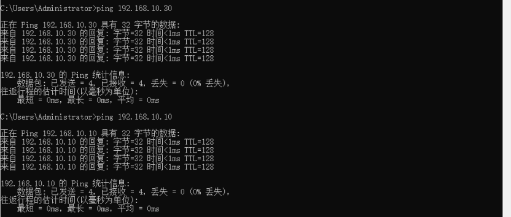

PC3 ping PC1、PC2，均能正常连通：
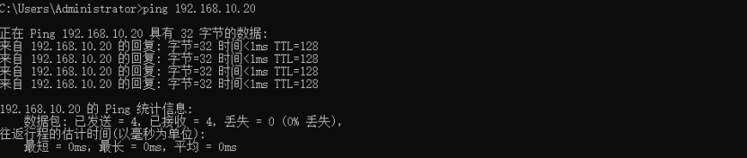
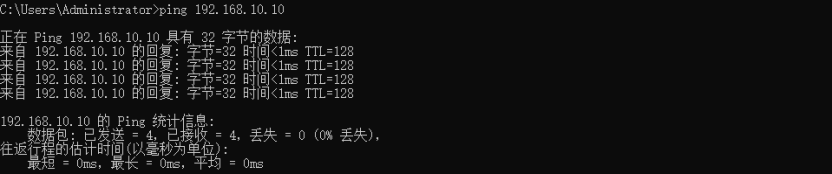

**分析：** 此时网络处于扁平化状态，所有设备二层互通，符合预期。

### 4. 步骤四: 配置 VLAN 10 (隔离 PC1)

> ***b）: 在交换机A上创建VLAN10，使VLAN绑定PC1在交换机上的端口***

为了实现网络隔离，我们在交换机 A 上创建 VLAN 10，并将 PC1 所在的端口划分进去。

**操作命令说明：**
- `vlan 10`: 创建 VLAN ID 为 10 的虚拟局域网。
- `port link-type access`: 将端口链路类型设置为 Access 模式，该模式主要用于连接终端设备，进出端口的数据帧不带 Tag（但在交换机内部带 Tag）。
- `port default vlan 10`: 将端口的 PVID 设置为 10，使其属于 VLAN 10。

**具体配置命令：**
```
system-view 
sysname SwitchA 
! 1. 创建 VLAN 10 
vlan 10 
quit 
! 2. 配置连接PC1的端口 
interface GigabitEthernet0/0/5 
! 将端口模式设为access 
port link-type access
! 将端口划入VLAN 10 
port default vlan 10 
quit
```

配置结果展示：
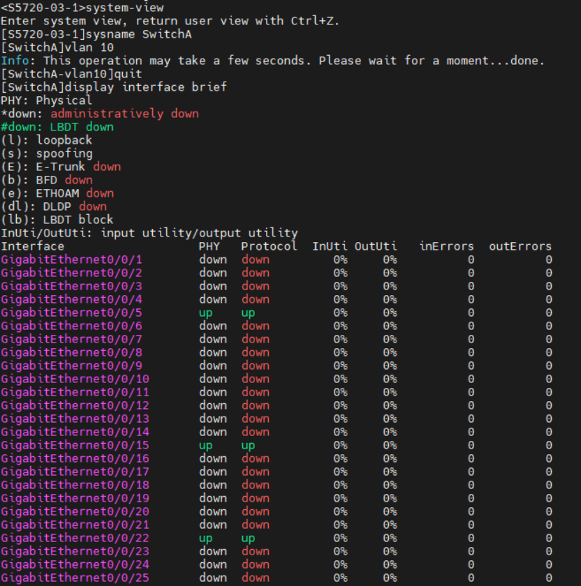
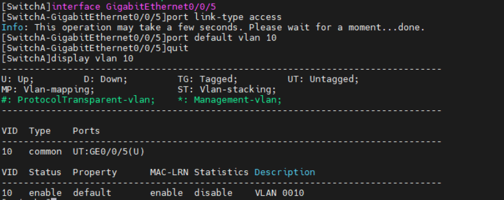
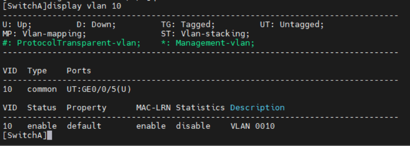

### 5. 步骤五: 配置 VLAN 20 (组建跨交换机网络)

> ***c）: 在交换机A和B上创建VLAN20,分别绑定PC2和PC3各自连接交换机的端口***

接下来，我们在两台交换机上分别配置 VLAN 20，用于连接 PC2 和 PC3。

首先在交换机 A 上配置 PC2 的接入端口：
```
system-view 
! 1. 创建 VLAN 20 
vlan 20 
quit 
! 2. 配置连接PC2的端口 
interface GigabitEthernet0/0/15 
port link-type access 
port default vlan 20 
quit 
```

接着在交换机 B 上配置 PC3 的接入端口。
*注：在修改设备名时遇到权限提示，但不影响后续 VLAN 的功能配置，我们继续完成了端口划分。*
```
system-view 
sysname SwitchB（此处略过） 
! 1. 创建 VLAN 20 
vlan 20 
quit 
! 2. 配置连接PC3的端口 
interface GE1/0/5 
port link-type access 
port default vlan 20 
quit
```

配置结果展示：
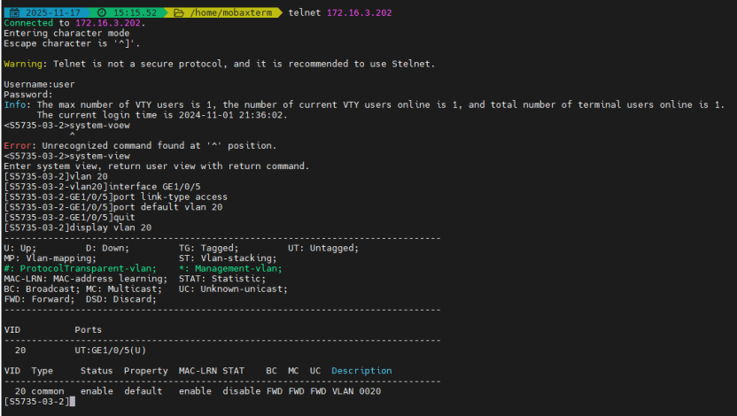

### 6. 步骤六: 中间状态连通性测试

在完成了 Access 端口的 VLAN 划分，但尚未配置交换机级联口的 Trunk 模式时，我们再次进行了测试。

**测试要求：PC1、PC2、PC3互相ping不通**

- **PC1 与 PC2/3**：因为 PC1 在 VLAN 10，而其他两台在 VLAN 20，二层网络被隔离，因此无法 Ping 通。
- **PC2 与 PC3**：虽然它们都在 VLAN 20，但连接两台交换机的 24 号端口默认属于 VLAN 1，且可能未允许 VLAN 20 的带标签数据帧通过，因此此时也无法 Ping 通。

**测试结果截图：**

PC1 ping PC2、PC3 (Request timed out):
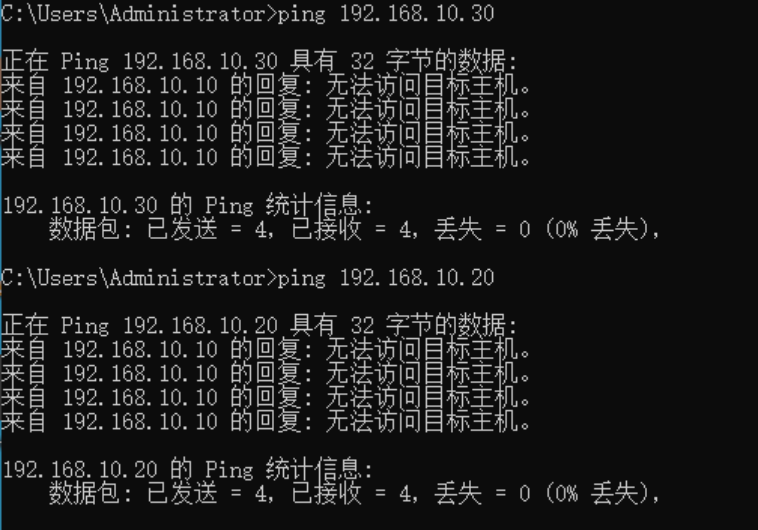

PC2 ping PC1、PC3 (Request timed out):
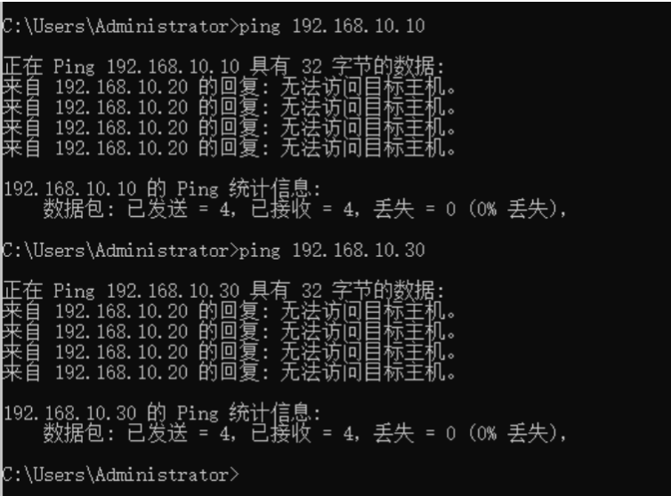

PC3 ping PC1、PC2 (Request timed out):
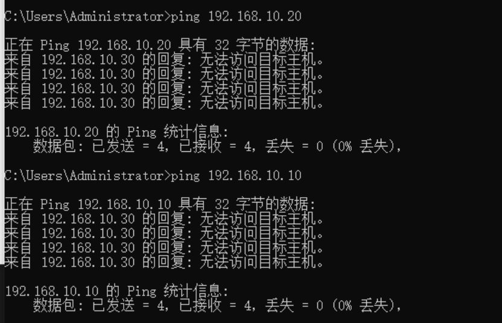

### 7. 步骤七: 配置 Trunk 端口

> ***d）: 把交换机A与B之间相连接的端口配置为Trunk口（Tag VLAN模式）***

为了让 PC2 和 PC3 能够跨交换机通信，我们需要将交换机 A 和 B 互联的端口（G0/0/24）配置为 **Trunk** 模式。Trunk 端口允许多个 VLAN 的数据帧通过，并保持其 VLAN 标签（Tag），从而实现跨设备的 VLAN 延伸。

**关键操作：**
- 使用 `port link-type trunk` 将端口设为干道模式。
- 使用 `port trunk allow-pass vlan all` (或指定 VLAN) 允许 VLAN 10 和 20 的流量通过。

**交换机 A Trunk 配置及验证:**
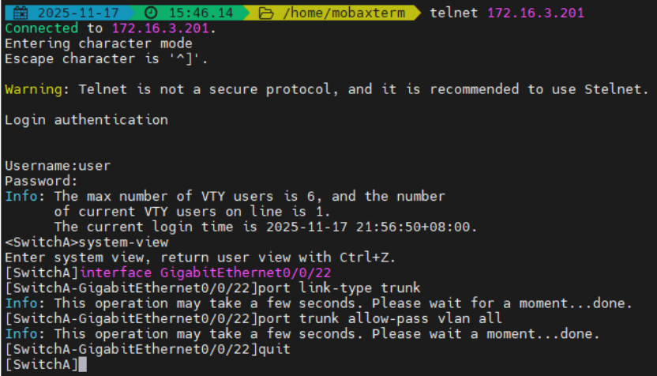
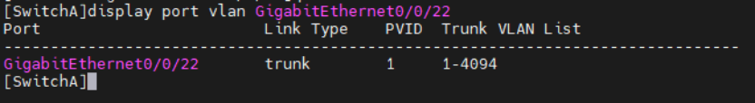

**交换机 B Trunk 配置及验证:**
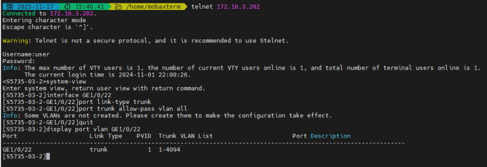 

### 8. 步骤八: 最终连通性测试

> ***e）: 完成配置后，要求实现目标：PC1无法ping通PC 2和PC3；PC2与PC3可以互通***

完成 Trunk 配置后，VLAN 20 的数据帧可以携带标签通过级联链路。我们进行了最终的验证：

**测试结果：**

1.  **PC1 ping PC2、PC3**: 失败。
    *   原因：PC1 属于 VLAN 10，与其他 PC 处于不同的广播域，实现了网络隔离。
    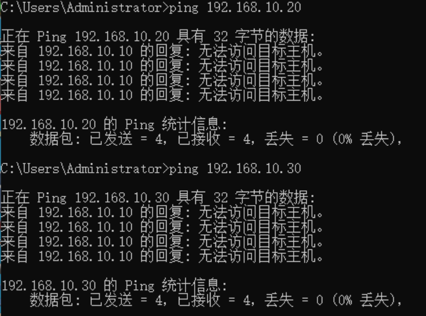

2.  **PC2 ping PC3**: **成功**。
    *   原因：两者同属 VLAN 20，且 Trunk 链路正常工作，实现了跨交换机的二层互通。
    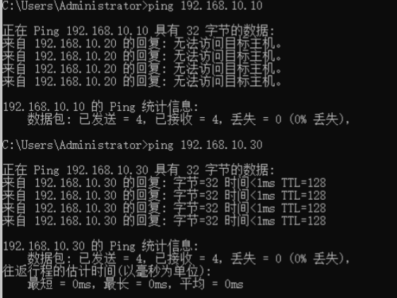

3.  **PC3 ping PC1**: 失败；**PC3 ping PC2**: **成功**。
    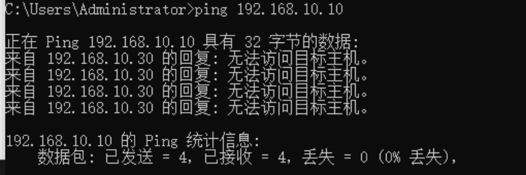
    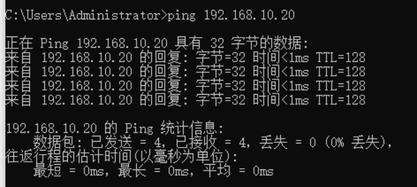

### 9. 步骤九: 实验配置检查

> ***f）: 请在实验报告中截图显示两个交换机各自的VLAN配置信息***

最后，我们使用 `display vlan` 命令检查了交换机的最终 VLAN 状态，确认端口划分正确，Tagged/Untagged 状态符合预期。

**交换机 A 配置信息:**
可以看到 GE0/0/5 在 VLAN 10 (Access), GE0/0/15 在 VLAN 20 (Access), GE0/0/24 为 Trunk (Tagged)。
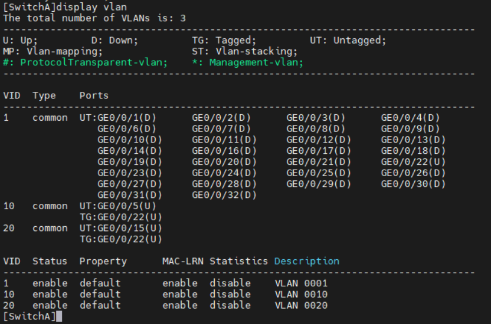 

**交换机 B 配置信息:**
可以看到 GE1/0/5 在 VLAN 20 (Access), 级联口为 Trunk。
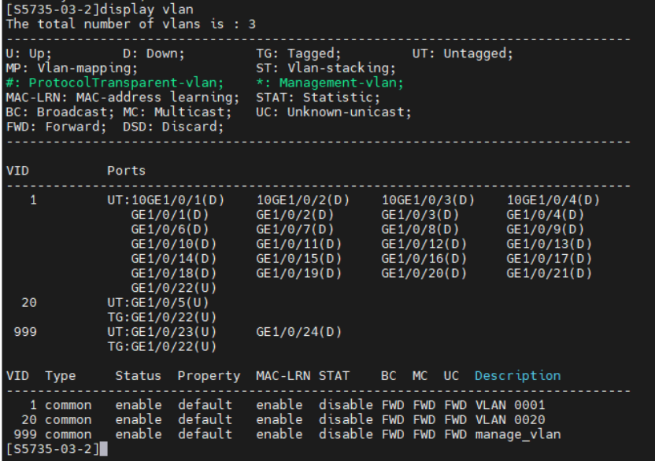

---
**实验总结：**
通过本次实验，我们成功掌握了 VLAN 的基本配置方法，理解了 Access 端口用于连接终端、Trunk 端口用于交换机级联的原理。实验结果完全符合预期，验证了 VLAN 技术在隔离广播域和构建跨物理设备虚拟工作组中的作用。