---

# 中山大学计算机学院

# 计算机网络实验报告

# 实验6——OSPF

---

|             | **姓名** | **学号** | **评分(按百分制)** | **实验组编号: ** |
| :---------- | :------- | :------- | :----------------- | :--------------- |
| **组长:**   | 王胜伟   | 23336228 | 100                | 3                |
| **组员 1:** | 宋信贤   | 23336207 | 100                | 3                |
| **组员 2:** | 王一澄   | 23336233 | 100                | 3                |
| **组员 3:** | 林宏宇   | 23320093 | 100                | 3                |

## 实验内容
a)路由器执行OSPF协议。完成配置后，要求实现目标：PC1可以ping通PC 2，而且路由器间执行OSPF。   
b)请在实验报告中截图显示路由表信息、路由学习过程、各种情况下互ping的结果。 

c)设计方法捕获路由器信息交换数据包,分析OSPF头部结构。（提示：交换机/路由器端口镜像）  

d)本实验有没有DR/BDR(指派路由器/备份指派路由器)?如果有,请指出DR与BDR分别是哪个设备,讨论DR/BDR的选举规则和更新方法(通过拔线改变拓扑,观察DR/BDR的变化情况);如没有,请说明原因。    

e)在（a）的基础上每台路由器上各加入一台电脑，画出新拓扑，然后： 
f)检查任意两个PC之间是否可以Ping通，对一台主机ping其它主机的结果进行截屏。 
g)显示并记录路由器R1数据库的Router LSA，Network LSA，LS数据库信息汇总   
#display ospf lsdb router            ！ 显示router LSA   
#display ospf lsdb network          ！显示network LSA    
#display ospf lsdb                 ！显示OSPF 链路状态数据库信息。  
h)显示并记录邻居状态。 
#display ospf peer 
i)显示并记录R1的所有接口信息   
#display interface (brief)   

## 实验拓扑
本实验初始阶段的拓扑结构如图 1 所示，后续将在该基础上进行扩展：
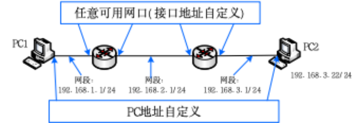
*图 1 OSPF 实验拓扑*

## 实验步骤与结果分析
### **任务 a) & b): OSPF 协议配置与连通性验证**
**任务要求:** 在路由器上执行 OSPF 协议，实现 PC1 与 PC2 的互通。在报告中截图显示路由表信息、路由学习过程以及互 ping 结果。

**1. PC 端 IP 地址配置与物理连接**
我们首先为网络中的终端设备配置静态 IP 地址，为它们设定唯一的网络标识并指定默认网关。这是所有后续网络通信的基础。

*   **PC3 (拓扑图中 PC1):** IP 地址 `192.168.1.11`, 子网掩码 `255.255.255.0`, 默认网关 `192.168.1.1`。
*   **PC2:** IP 地址 `192.168.3.22`, 子网掩码 `255.255.255.0`, 默认网关 `192.168.3.1`。

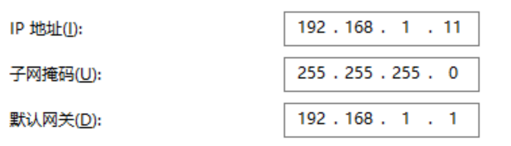
*图 a-1: PC3 的 IP 配置*

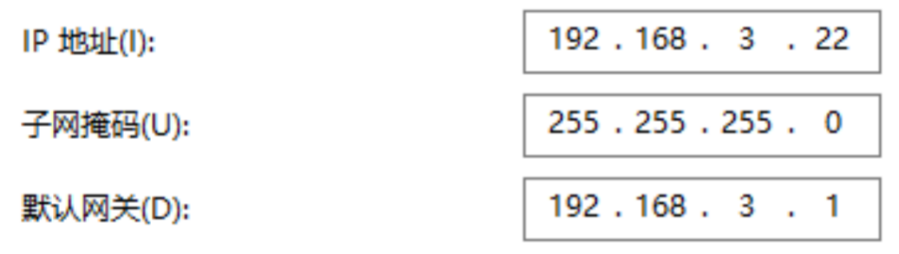
*图 a-2: PC2 的 IP 配置*

> 物理连接：我们用
>
> PC2接R2的5口    
> PC3接R1的1口    
> R1的3口接R2的7口    

**2. 路由器基础及 OSPF 配置**
我们通过 Telnet 登录 R1 和 R2，为接口配置 IP 地址，并创建 OSPF 进程，宣告相应的网段。这是使路由器能够参与动态路由计算的核心步骤。

*   **R1 配置:**
    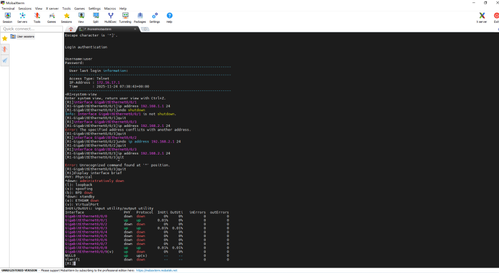
    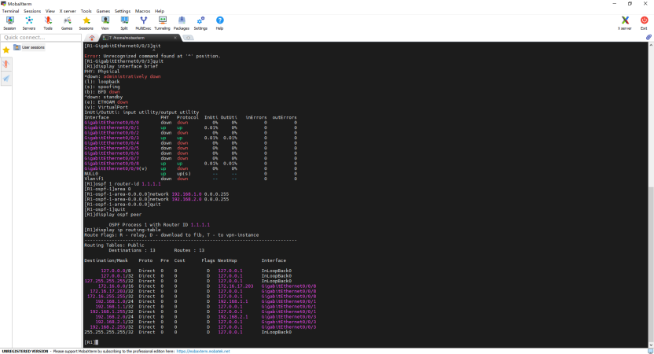
    *图 a-3: R1 的接口及 OSPF 配置命令*
    
    
    
    我们为 R1 设置了全局唯一的 `router-id 1.1.1.1`。接着，为连接 PC3 的 `GigabitEthernet0/0/1` 接口配置网关地址 `192.168.1.1`，为连接 R2 的 `GigabitEthernet0/0/3` 接口配置 `192.168.2.1`。
    
    最关键的 OSPF 配置中，`ospf 1` 创建了一个 OSPF 进程，`area 0` 进入了骨干区域的配置视图。`network 192.168.1.0 0.0.0.255` 命令的作用是，匹配所有 IP 地址前24位为 `192.168.1` 的接口（即 G0/0/1)，在该接口上激活 OSPF 协议并开始收发 Hello 包，同时将该网段信息通告给邻居。对 `192.168.2.0` 网段的宣告同理。
    
    
    
*   **R2 配置:**
    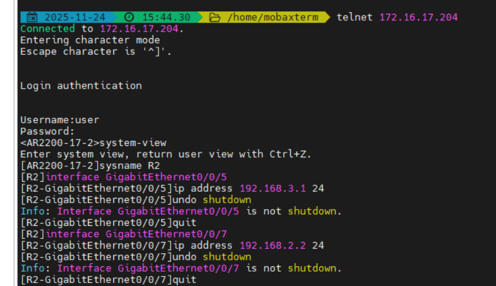
    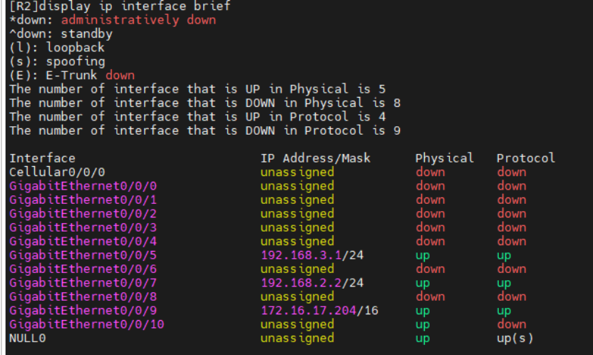
    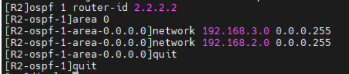
    *图 a-4: R2 的接口及 OSPF 配置命令*
    
* R2 的配置与 R1 类似，设置了唯一的 router-id 2.2.2.2，并为连接 PC2 的接口 G0/0/5 和连接 R1 的接口 G0/0/7 配置了相应网段的 IP 地址。

  同样在 OSPF 进程的 Area 0 中宣告了其直连的 192.168.3.0 和 192.168.2.0 网段。

**3. 路由学习过程与路由表验证**
  配置完成后，OSPF 协议自动开始工作。我们通过查看 OSPF 邻居状态和路由表来验证路由学习过程。

*   **R1 状态信息:**
    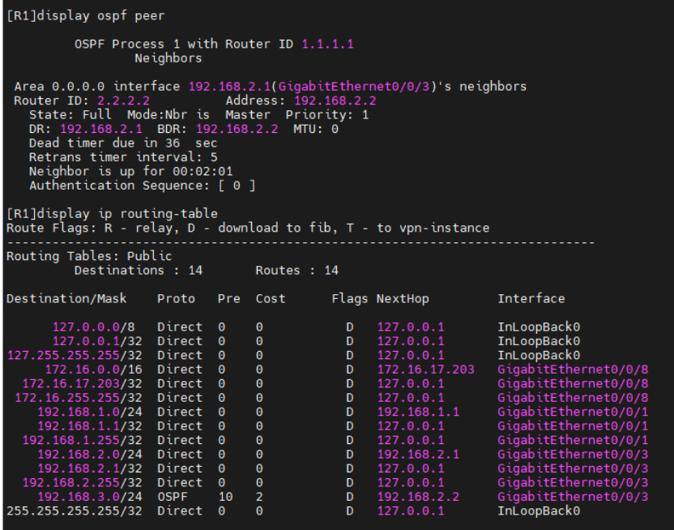
    *图 b-1: R1 的 OSPF 邻居及路由表*
    `display ospf peer` 的输出结果显示，R1 已经和 Router ID 为 `2.2.2.2` 的邻居（即 R2）成功建立了 `State: Full` 的全毗邻关系，它们的链路状态数据库（LSDB）已完全同步。

    `display ip routing-table` 的输出结果体现：在路由表中，出现了一条 `Proto` 为 `OSPF` 的路由，目标是 `192.168.3.0/24`，下一跳（`NextHop`）指向 `192.168.2.2`，开销（`Cost`)为2。这表明 R1 已通过 OSPF 动态学习到通往 PC2 所在网段的路径。
    
    
    
*   **R2 状态信息:**
    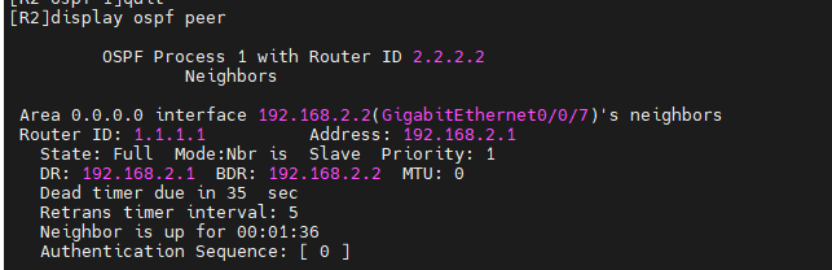
    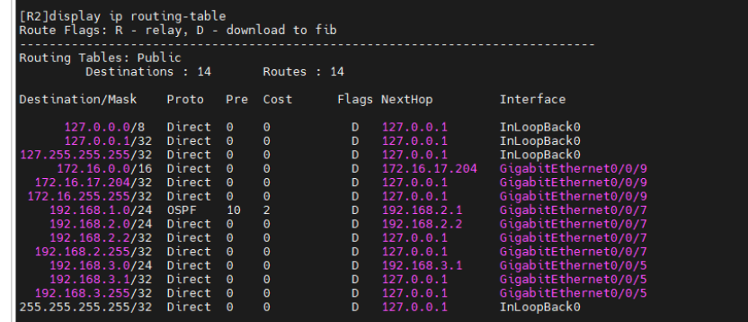
    *图 b-2: R2 的 OSPF 邻居及路由表*
    R2 的状态与 R1 的观察结果一致。它也与 R1 建立了 `Full` 的邻居关系，并在路由表中学习到了一条 `OSPF` 路由，指向 `192.168.1.0/24` 网段，下一跳为 `192.168.2.1`。
    
    这条路由是 PC2 回复数据包给 PC3 的关键路径。
    
    

**4. 最终连通性测试**
在确认路由学习成功后，我们进行了ping 测试。

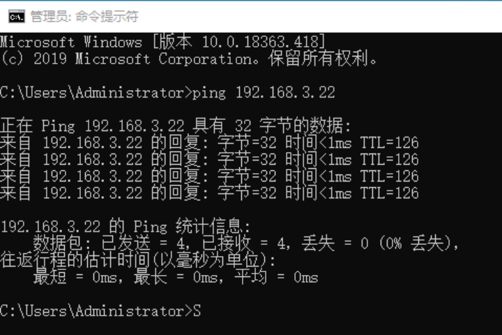
*图 b-3: PC3 成功 ping 通 PC2*

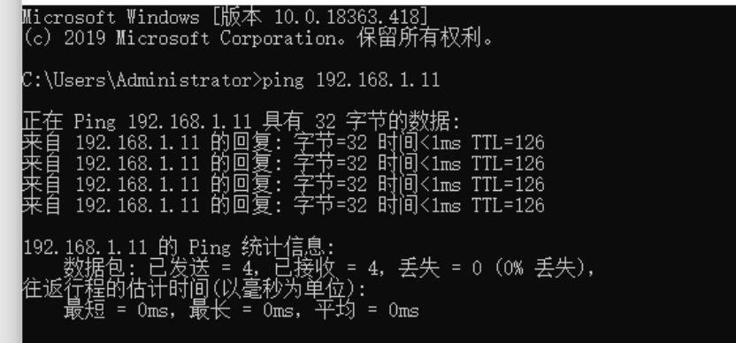
*图 b-4: PC2 成功 ping 通 PC3*
    两个方向的 `ping` 测试均成功，丢包率为0%。数据包的完整路径为：PC3 发送的数据包，经网关 R1，R1 查询路由表找到 OSPF 路由，将包转发给 R2，R2 再将其送达 PC2。PC2 的回复包，经网关 R2，R2 查询其 OSPF 路由表，将包转发给 R1，最终由 R1 送回 PC3。至此，任务 a 和 b 的要求全部达成。

---
### **任务 c): 捕获并分析 OSPF 头部结构**
**任务要求:** 设计方法捕获路由器间的信息交换数据包，并分析 OSPF 头部结构。

**1. 端口镜像配置**
为了非侵入式地捕获 R1 和 R2 之间的数据包，我们采用了端口镜像技术。我们将交换机上连接 R1 的端口（3口）的所有流量复制一份，发送到另一个未使用的端口（9口），然后将一台装有 Wireshark 的 PC 连接到 9 口进行抓包。
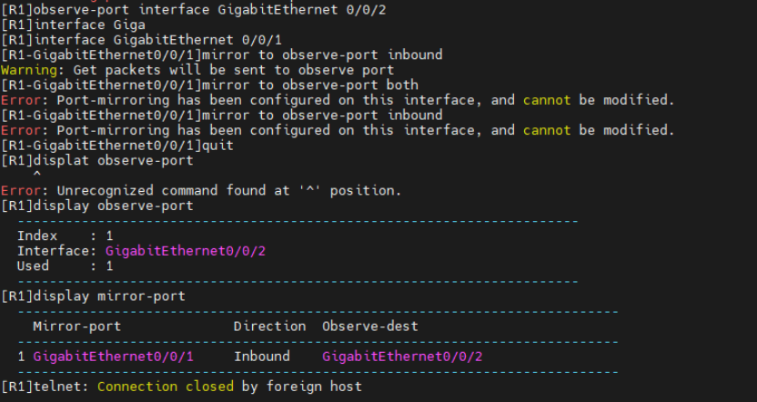
*图 c-1: 交换机端口镜像配置命令*

**2. OSPF Hello 报文捕获与分析**
  启动 Wireshark 捕获后，我们筛选 `ospf` 协议，成功捕获到了周期性发送的 Hello 报文。
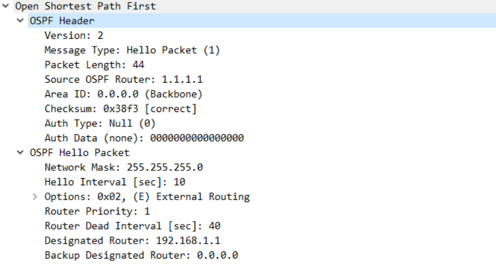
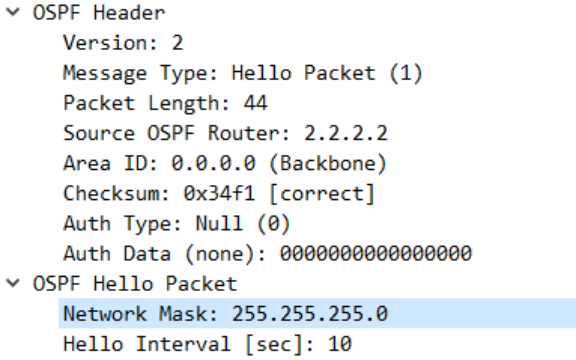
*图 c-2: Wireshark 捕获的 OSPF Hello 报文*

我们对捕获到的 OSPF 报文头部和 Hello 净荷部分进行逐字段分析：

*   **OSPF Header (头部):**
    *   `Version: 2`: 表明我们使用的是当前主流的 OSPFv2，兼容 IPv4。
    *   `Message Type: Hello Packet (1)`: 报文类型为1，代表这是用于发现、建立和维护邻居关系的 Hello 包。
    *   `Packet Length: 44`: 整个 OSPF 报文的长度为44字节。
    *   `Source OSPF Router: 1.1.1.1` (或 `2.2.2.2`): 发送此报文的路由器的 Router ID，这是路由器在 OSPF 域中的唯一身份。
    *   `Area ID: 0.0.0.0 (Backbone)`: 区域 ID，表明此报文属于骨干区域。邻居关系的建立要求双方的 Area ID 必须一致。
    *   `Checksum`: 校验和，用于验证 OSPF 报文在传输过程中是否出错。
    *   `Auth Type: Null (0)`: 认证类型为0，表示不进行认证。这是默认配置，生产环境中通常会配置口令或 MD5 认证以增加安全性。
*   **OSPF Hello Packet (净荷):**
    *   `Network Mask: 255.255.255.0`: 接口的子网掩码，邻居双方必须一致才能建立关系。
    *   `Hello Interval [sec]: 10`: Hello 包的发送周期，默认为10秒。邻居双方必须一致。
    *   `Router Dead Interval [sec]: 40`: 失效判定时间，通常是 Hello 周期的4倍。如果在40秒内未收到邻居的 Hello 包，则认为邻居失效。邻居双方此值也必须一致。
    *   `Designated Router / Backup Designated Router`: 该路由器当前认为的 DR 和 BDR 的 IP 地址。在邻居关系建立初期，这个值可能是`0.0.0.0`。
    通过抓包分析，我们直观地验证了 OSPF 协议的工作细节和邻居建立的各项参数匹配原则。

---
### **任务 d): DR/BDR 选举、状态分析与故障切换**

**任务要求:** 判断实验中是否存在 DR/BDR，指出它们是哪个设备，并讨论选举规则和更新方法(通过拔线改变拓扑,观察DR/BDR的变化情况)。

**1. 初始网络状态分析 (LSA 数据库与接口信息)**
在验证了初始网络连通性后，我们首先对两台路由器的 OSPF 数据库和接口状态进行了详细检查，以全面了解 DR/BDR 选举完成后的网络基准状态。

* **R1 初始状态信息收集与分析:**

  *   **(1) Router LSA (`display ospf lsdb router`):**
      
      *图 d-1: R1 初始 LSDB 中的 Router LSA*
      此命令显示了 R1 数据库中所有的 Type-1 LSA。我们可以看到两个 LSA，分别由 R1 (`Ls id: 1.1.1.1`) 和 R2 (`Ls id: 2.2.2.2`) 通告。以 R1 自己的 LSA 为例，`Link count: 2` 表明它有两个激活的 OSPF 链接：一个 `Link Type: StubNet` 指向 `192.168.1.0` 这个末端网络，另一个 `Link Type: TransNet` 指向 `192.168.2.1` 这个传输网络。这准确地描绘了 R1 的连接情况。

  *   **(2)(3) Network LSA & LSDB 汇总 (`display ospf lsdb network` 和 `display ospf lsdb`):**
      
      *图 d-2: R1 初始 Network LSA 和 LSDB 摘要*
      Network LSA (Type-2 LSA) 由 DR (`Adv rtr: 1.1.1.1`) 产生，描述了 `192.168.2.1` 这个广播网段以及所有连接到该网段的路由器（`1.1.1.1` 和 `2.2.2.2`)。下方的 LSDB 摘要则清晰地列出了当前数据库中的全部3条 LSA，证明 LSDB 已同步。

  *   **(4) 接口信息 (`display interface brief`):**
      
      *图 d-3: R1 初始接口状态*
      确认了 R1 的 G0/0/1 和 G0/0/3 接口均处于 `up/up` 状态，这是 OSPF 正常工作的基础。

* **R2 初始状态信息收集与分析:**
  我们同样在 R2 上进行了信息收集，以验证其视角下的网络状态。
  
  *图 d-4: R2 初始 LSDB 中的 Router LSA*

  
  *图 d-5: R2 初始 LSDB 中的 Network LSA*

  
  *图 d-6: R2 初始 LSDB 摘要*

  
  *图 d-7: R2 初始接口状态*
      R2 收集到的 LSA 信息与 R1 完全一致，再次证明了 OSPF 域内所有路由器维护着一份相同的网络拓扑地图（LSDB）。

**2. DR/BDR 选举结果与故障切换验证**
基于以上信息，我们明确了 DR/BDR 的归属，并通过模拟 DR 故障来验证其高可用性机制。

* **初始选举结果:**
  
  *图 d-8: R1 接口状态明确显示为 DR*
  在 R1 上执行 `display ospf interface GigabitEthernet0/0/3` 命令，输出中的 `State: DR` 明确指出 **R1 是 DR**，并且它识别出的 `Backup Designated Router: 192.168.2.2` 表明 **R2 是 BDR**。

* **模拟 DR 故障:**
  我们进入 R1 的 G0/0/3 接口视图，并执行 `shutdown` 命令，手动关闭该接口，模拟 DR 路由器在该链路上失效。
  
  *图 d-9: 手动关闭作为 DR 的 R1 的 G0/0/3 接口*

* **观察 BDR 的状态变化:**
  在 R1 接口关闭前，我们在 R2 上确认其接口状态为 BDR。
  
  *图 d-10: R2 在故障前的接口状态为 BDR*

  在 R1 接口关闭并等待 `Dead Interval` 超时后，我们再次检查 R2 的接口状态。
  
  *图 d-11: R2 在 DR 故障后成功提升为新的 DR*

  

  结果非常清晰，当原 DR (R1) 失效后，原 BDR (R2) 立即接替其角色，状态从 `BDR` 提升为 `DR`。这一过程是自动完成的，验证了 OSPF 的 DR/BDR 机制能够有效地处理单点故障，保障广播网络中 LSA 交换的连续性和稳定性。

---
### **任务 e) & f): 拓扑扩展与连通性验证**
**任务要求:** 在每台路由器上各加入一台电脑，画出新拓扑，并检查任意 PC 间的连通性。

**1. 拓扑扩展**
我们在 R1 下连接 PC4，在 R2 下连接 PC5，形成新的网络拓扑。
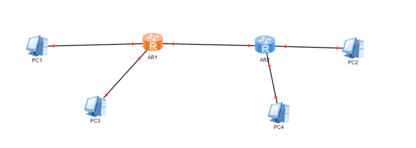
*图 e-1: 扩展后的网络拓扑图*

**2. 新增设备与 OSPF 更新配置**
我们为新增的 PC4 和 PC5 配置 IP，并在 R1 和 R2 上配置新接口并宣告新网段。

*   **PC 配置:**
    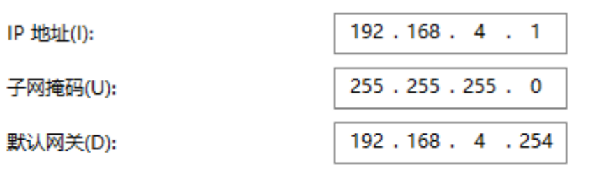
    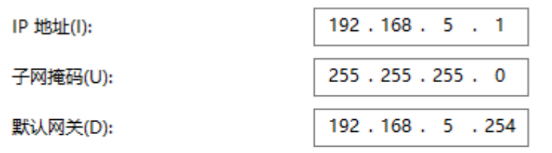
    *图 f-1: PC4 和 PC5 的 IP 配置*

*   **路由器更新配置:**
    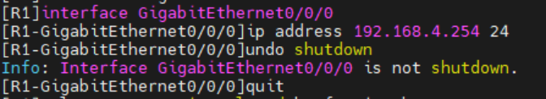
    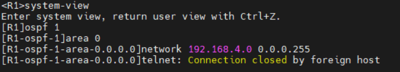
    *图 f-2: R1 宣告新增的 192.168.4.0 网段*

    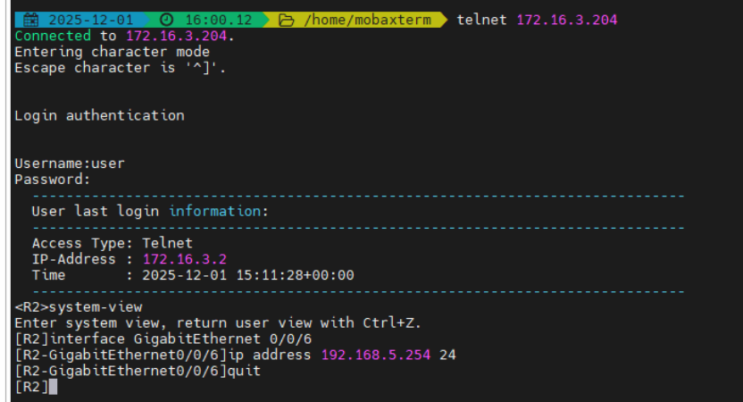
    *图 f-3: R2 宣告新增的 192.168.5.0 网段*
    当我们在 OSPF 进程中宣告了新的网段后，路由器会立即生成一条更新的 Type-1 LSA，其中包含了这个新增的 Stub 网络链接。这条更新的 LSA 会被泛洪给所有 OSPF 邻居，域内的所有路由器都会更新自己的 LSDB，并重新运行 SPF 算法来计算最新的最短路径树。

**3. 扩展后全网连通性测试**
  我们对网络中的多对 PC 进行了 ping 测试。
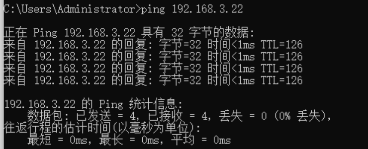
*图 f-4: 新增主机 PC4 与原有主机 PC2 互通*

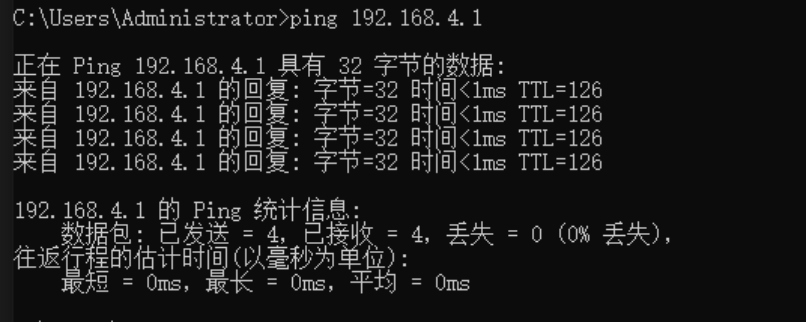
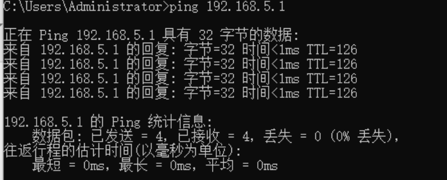
*图 f-5: 两台新增主机 PC4 和 PC5 之间互通*
所有测试均成功。充分展示了 OSPF 作为动态路由协议在网络拓扑发生变化后，能够自动地、快速地适应变化，更新路由信息，恢复全网的连通性，整个过程无需网络管理员的手动干预。

---
### **任务 g), h), i): 最终状态信息记录与分析**
**任务要求:** 在最终的网络状态下，显示并记录 R1 的 LSA 数据库、邻居状态和接口信息。

**g) 显示并记录 R1 的 LSA 数据库**

*   **Router LSA (`display ospf lsdb router`):**
    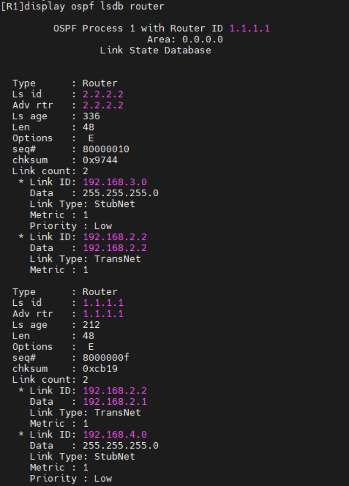
    *图 g-1: R1 数据库中的 Router LSA (Type-1 LSA)*
    Router LSA 是 OSPF 的基础。每个路由器都会产生一个，用来描述自己的链路状态。例如，`Ls id: 1.1.1.1` 这个 LSA 描述了 R1 的状态，其中 `Link count: 2` 表示它有两个 OSPF 激活的链接：一个 `Link Type: TransNet` 指向 `192.168.2.0` 这个传输网络（因为有 DR)，另一个 `Link Type: StubNet` 指向 `192.168.4.0` 这个末端网络。

*   **Network LSA (`display ospf lsdb network`):**
    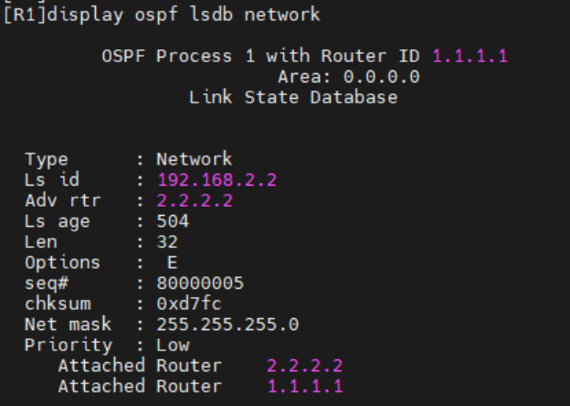
    *图 g-2: R1 数据库中的 Network LSA (Type-2 LSA)*
    Network LSA 由 DR 产生，用于描述一个广播型网络。这里的 `Ls id: 192.168.2.2` 是 DR（R2)的接口 IP。这个 LSA 告诉大家，在 `192.168.2.0/24` 这个网络上，连接了 `2.2.2.2` 和 `1.1.1.1` 这两台路由器。通过 Type-1 和 Type-2 LSA，所有路由器就能在脑海中构建出完整的网络拓扑图。

*   **LSDB 汇总 (`display ospf lsdb`):**
    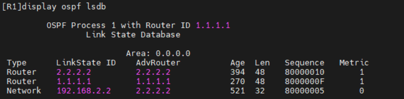
    *图 g-3: R1 的链路状态数据库摘要*
     此图汇总了 R1 LSDB 中的所有 LSA。可以看到，Area 0 内所有路由器（R1, R2）的 Router LSA 和所有广播网段（1个)的 Network LSA 都已存在。我们可以确认，区域内所有路由器的 LSDB 最终会完全同步。

**h) 显示并记录邻居状态**
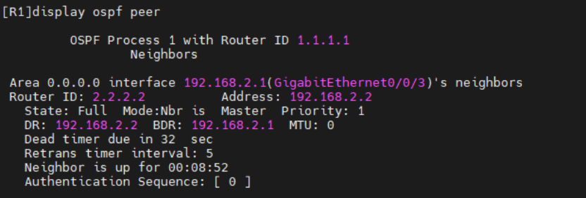
*图 h-1: R1 的 OSPF 邻居最终状态*
`display ospf peer` 命令的输出确认了 R1 与 R2（Router ID `2.2.2.2`）的邻居关系依然是 `Full` 状态。由于之前的故障切换，现在的 DR 是 R2 (`192.168.2.2`)，而 R1 (`192.168.2.1`) 变成了 BDR。`Dead timer due in 32 sec` 显示了倒计时，如果32秒内收不到 R2 的 Hello 包，R1 就会认为邻居失效。

**i) 显示并记录 R1 的所有接口信息**
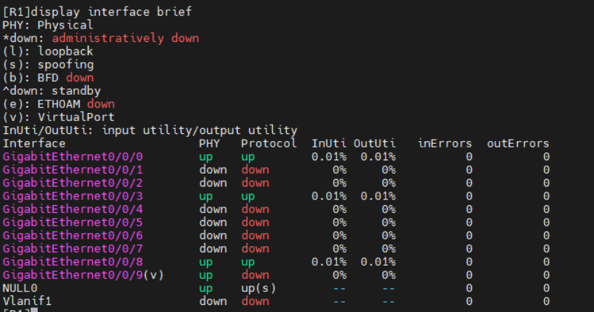
*图 i-1: R1 所有接口的最终状态*
`display interface brief` 命令展示了路由器所有物理和逻辑接口的简要状态。`PHY` 列代表物理层状态，`Protocol` 列代表数据链路层协议状态。`up`/`up` 状态是接口正常工作的标志，表明物理连接良好（网线插好、对端设备开机)且链路层协议协商成功。这是 OSPF 等上层协议能够正常运行的根本保障。

#### R2 最终状态信息收集与分析

为了验证 OSPF 链路状态数据库在全网的一致性，我们在 R1 上完成信息收集后，同样在 R2 上执行了一系列命令，以从 R2 的视角来观察最终的网络状态。

*   **Router LSA (`display ospf lsdb router`):**
    
    *图 g-4: R2 最终 LSDB 中的 Router LSA*
    R2 的 Router LSA 数据库内容与 R1（图 g-1）的完全一致，都包含了由 R1（`Ls id: 1.1.1.1`）和 R2（`Ls id: 2.2.2.2`）产生的两条 Type-1 LSA。我们特别关注 R2 自己的 LSA（`Ls id: 2.2.2.2`），`Link count: 2` 表明它也有两个 OSPF 激活的链接：一个 `TransNet` 指向与 R1 相连的传输网络，另一个 `StubNet` 指向新增的 PC5 所在的 `192.168.5.0` 末端网络。

*   **Network LSA & LSDB 汇总 (`display ospf lsdb network` 和 `display ospf lsdb`):**
    
    
    *图 g-5: R2 最终 Network LSA 和 LSDB 摘要*
    R2 数据库中的 Network LSA（由 DR R2 自己产生）以及整个 LSDB 摘要，与在 R1 上观察到的结果（图 g-2, g-3）完全相同。这有力地证明了 OSPF 的核心原则：**在同一个区域内，所有路由器的链路状态数据库最终必须实现完全同步**。正是基于这份完全一致的“网络地图”，每台路由器才能独立地、无环路地计算出到达域内任何目的地的最短路径。

*   **邻居状态 (`display ospf peer`):**
    
    *图 h-2: R2 的 OSPF 邻居最终状态*
    从 R2 的视角看，它与 R1（Router ID `1.1.1.1`）的邻居关系也处于 `Full` 状态。重要的是，这里的 `DR` 显示为 `192.168.2.2`（即 R2 自身），`BDR` 显示为 `192.168.2.1`（即 R1）。这与 R1 上的观察结果（图 h-1)完全吻合，只是视角不同。

*   **接口信息 (`display interface brief`):**
    
    *图 i-2: R2 所有接口的最终状态*
    该命令确认了 R2 上所有参与路由的接口，包括连接 R1 的 `G0/0/7` 和连接新增 PC5 的 `G0/0/6`，其物理层（`PHY`）和协议层（`Protocol`)都处于 `up` 状态，保障了网络的稳定运行。

---
## 实验思考
### (1) 如何查看 OSPF 协议发布的网段?
要查看 OSPF 协议学习到并发布的网段，主要有两种方法：

1.  **查看路由表并筛选 OSPF 路由：**
    这是最直接的方法。通过执行命令 `display ip routing-table`，可以查看路由器完整的路由表。在输出结果中，协议（Proto）字段为 `OSPF` 的条目就是通过 OSPF 学习到的外部网段。例如，在 R1 上看到的 `192.168.3.0/24` 路由。为了更精确地只看 OSPF 路由，可以使用命令 `display ip routing-table protocol ospf`。

2.  **查看 OSPF 自身的路由信息库：**
    通过执行命令 `display ospf routing`，可以查看 OSPF 协议内部计算出的路由信息。这个表显示了 OSPF 计算出的到达各个目标网络的路径、开销（Cost）、下一跳以及所属的 LSA 类型等详细信息，比全局路由表提供了更多 OSPF 相关的细节。

### (2) 关于 OSPF 反掩码的理解
OSPF 配置中 `network` 命令后面跟的反掩码（Wildcard Mask），可以简单理解为子网掩码的“取反”。它不是一个网络地址的一部分，而是一个“匹配规则”，用来告诉 OSPF 进程哪些接口需要被激活并宣告。

反掩码由32位二进制数组成，其中 `0` 表示对应位置的 IP 地址位必须精确匹配，`1` 表示对应位置的 IP 地址位可以是任意值（不关心）。例如，`network 192.168.1.0 0.0.0.255` 的含义是：“检查所有接口的 IP 地址，只要其前24位（三个八位组）是 `192.168.1`，无论最后8位是什么，都匹配此规则”。

虽然它看起来像子网掩码取反，但 OSPF 反掩码允许不连续的 `1`，提供了比子网掩码更灵活的匹配能力。例如，`0.0.255.0` 也是一个合法的反掩码。在实验中，`0.0.0.255` 准确地匹配了所有 `192.168.x.0/24` 类型的网络。
