---

# 中山大学计算机学院

# 计算机网络实验报告

# 实验7——生成树协议 (STP/RSTP)

---

|             | **姓名** | **学号** | **评分(按百分制)** | **实验组编号: ** |
| :---------- | :------- | :------- | :----------------- | :--------------- |
| **组长:**   | 王胜伟   | 23336228 | 100                | 3                |
| **组员 1:** | 宋信贤   | 23336207 | 100                | 3                |
| **组员 2:** | 王一澄   | 23336233 | 100                | 3                |
| **组员 3:** | 林宏宇   | 23320093 | 100                | 3                |

## **第一部分：基础实验**

### **实验内容**
a) 完成“快速生成树协议配置”，通过配置、观察和验证，深入理解RSTP的工作原理、根桥选举、端口角色以及故障切换机制。
b) 设计方法捕获交换机之间交互的生成树协议数据包，并对核心的桥协议数据单元（BPDU）进行分析。
c) 在实验设备上查看VLAN环境下的生成树信息，并学会查看其他相关的重要状态信息。

### **实验拓扑**
本实验基础部分的拓扑结构如图 1 所示，我们使用两台交换机（SwitchA 和 SwitchB），它们之间通过两条独立的物理链路（G0/0/2-G0/0/2 和 G0/0/4-G0/0/4）互联，人为地构建了一个二层物理环路。

*图 1 基础实验拓扑图*

---
### **实验步骤与结果分析**

#### **步骤一：环路现象验证**
在启用任何环路避免协议之前，我们首先需要直观地观察并验证一个纯粹的二层环路会对网络造成何种灾难性影响。

**1. PC端IP地址配置与物理连接**
我们为网络中的PC配置了静态IP地址，并完成了物理连接。

**静态ip地址：**

*   **PC1:** `192.168.1.10/24`
*   **PC2:** `192.168.1.20/24`
*   **PC3:** `192.168.1.30/24` (用于广播测试)

**物理连接：**

交换机A：

- 1口接PC1
- 2口接交换机B2口
- 4口接交换机B4口
- 6口接PC3

交换机B：

- 1口接PC2
- 2口接交换机A2口
- 4口接交换机A4口


**2. 关闭交换机生成树协议**
为了营造一个无保护的环路环境，我们通过`undo stp enable`命令手动关闭了两台交换机默认开启的生成树功能。
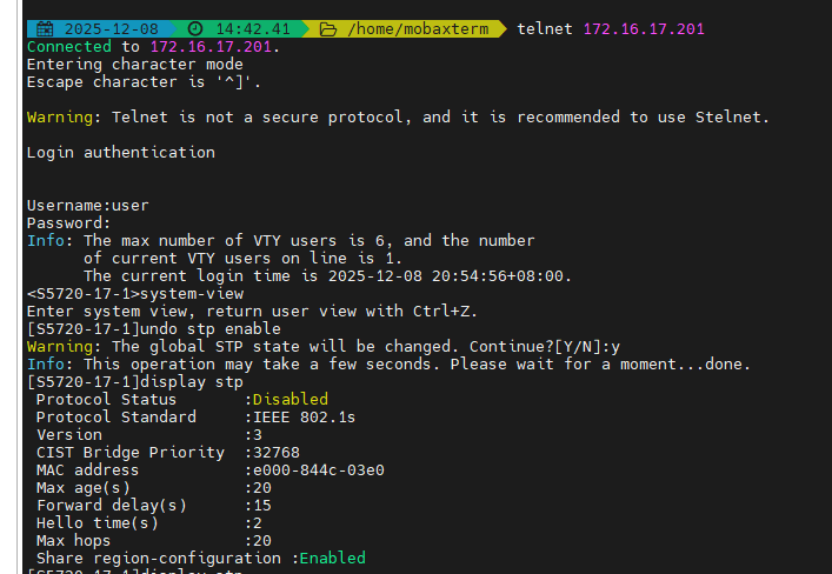
*图 1-1: 在 SwitchA 上执行 `undo stp enable` 并查看状态*

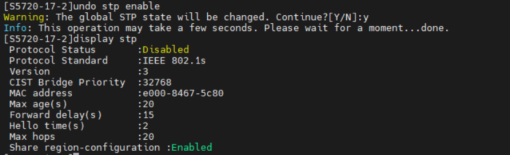
*图 1-2: 在 SwitchB 上确认 STP 已关闭*
从两台交换机的`display stp`命令输出中，我们可以看到`Protocol Status`字段明确显示为`Disabled`，这确认了生成树协议当前处于非活动状态，交换机将按照其最基本的转发逻辑处理数据帧，环路将不受任何协议的抑制。

**3. 广播风暴观察与分析**
连接好环路后，我们立刻观察到交换机所有连接端口的指示灯开始以极高的频率疯狂、无规律地闪烁。同时，我们启动Wireshark进行抓包。
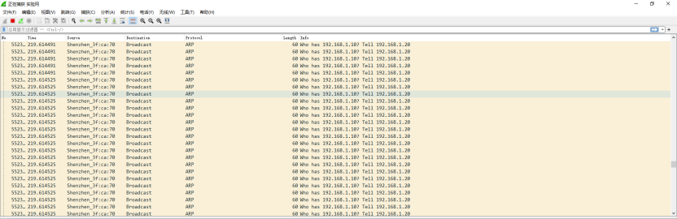
*图 1-3: Wireshark 捕获到网络中充斥着海量的 ARP 广播包*
上图清晰地展示了广播风暴的形成。网络中的任何一个广播帧（例如PC为解析IP地址而发出的ARP请求)到达交换机后，会被从除入口外的所有端口泛洪。由于环路的存在，这个广播帧会通过另一条链路被传回，并被再次泛洪。这个过程无限循环，数据包被指数级地复制和转发，迅速占满了所有可用带宽，导致设备CPU负载飙升，网络陷入瘫痪。

---

**4. 主动通信对广播风暴的影响分析**
为了进一步探究环路中主动通信对网络风暴的影响，我们进行了两种对比`ping`测试，并观察了网络中数据包的增长速度。

*   **情况一：PC1 ping 一个网络中存在的主机 PC2**
    我们从 PC1 执行 `ping 192.168.1.20 -t` 命令，尝试与 PC2 建立持续通信。
    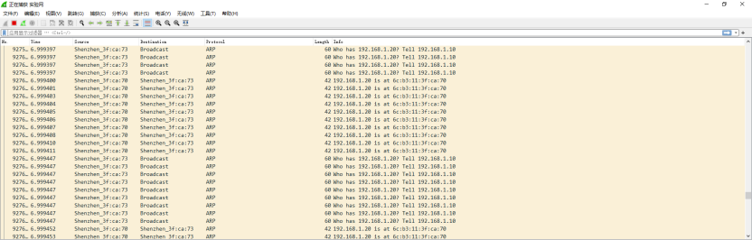
    *图 1-5: 在环路环境下，PC1 持续 ping PC2，请求超时*

    **现象分析：** 尽管 `ping` 命令显示请求超时，但在网络层面，这个操作极大地加剧了风暴。其过程如下：
    1. **ARP广播风暴：** PC1 首先发出一个 ARP 请求（广播帧）来寻找 PC2 的 MAC 地址。这个广播帧立即被卷入环路，开始了第一轮的广播风暴。
    
    2. **单播帧泛洪：** 假设 PC1 侥幸收到了 PC2 的 ARP 回复，它会开始发送 ICMP Echo 请求（单播帧）。然而，由于 MAC 地址表在环路中处于剧烈漂移状态，交换机无法确定 PC2 的准确位置，导致本应是单播的 ICMP 帧被从所有端口泛洪出去（除了入口端口），其行为等效于广播。

    3. **流量叠加：** PC2 收到被泛洪的 ICMP 请求后，会发送 ICMP Echo 回复（同样是单播帧），这个回复帧在返回途中同样会因为 MAC 地址表不稳定而被泛洪。结果是，网络中不仅有循环的 ARP 广播包，还叠加了被持续泛洪的 ICMP 请求和回复包，流量增长极为迅速。
    
       
    
*   **情况二：PC1 ping 一个非PC1与PC2的IP**
    接下来，我们从 PC1 执行 `ping 192.168.1.30 -t`，目标是 PC3。
    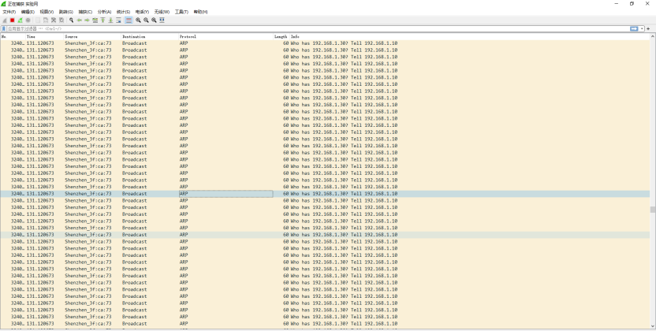
    *图 1-6: PC1 持续 ping 不在同一链路上的 PC3*

    **现象分析：**
    1.  **纯粹的ARP广播风暴：** PC1 同样会发出 ARP 请求（广播帧）来寻找目标IP的MAC地址。
    2.  **无后续流量：** 由于目标主机不存在或不可达，PC1 永远不会收到 ARP 回复。因此，它无法进入发送 ICMP 包的阶段。
    3.  **流量构成：** 这种情况下，网络风暴完全由这个单一的 ARP 请求广播帧在环路中被无限复制和循环转发所构成。虽然同样是风暴，但其流量源只有一个。

**结论对比：**
通过观察 Wireshark 的数据包捕获速率，我们得出结论：在存在环路的情况下，**第一种情况（ping 一个存在的主机）比第二种情况（ping 一个不存在的主机）包增长得更快**。

这是因为第一种情况的风暴流量是 **ARP 广播风暴** 与 **持续的、被泛洪的 ICMP 单播流量** 的叠加，而第二种情况仅有 **纯粹的 ARP 广播风暴**。这个对比实验深刻地揭示了环路不仅会放大广播流量，还会破坏单播通信的寻址机制，使其退化为泛洪，从而导致网络拥塞的急剧恶化。


**5. MAC地址表不稳定（MAC地址漂移）分析**
在广播风暴期间，我们持续使用`display mac-address`命令查看SwitchA的MAC地址表。
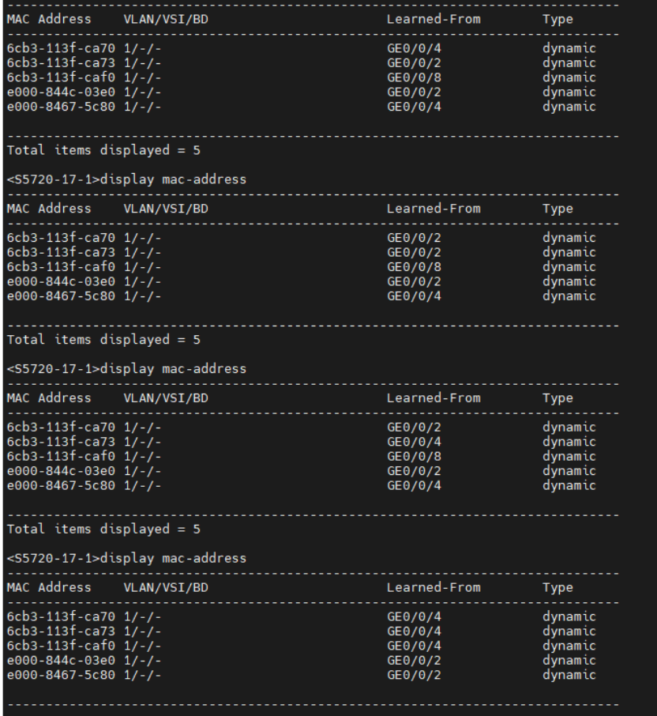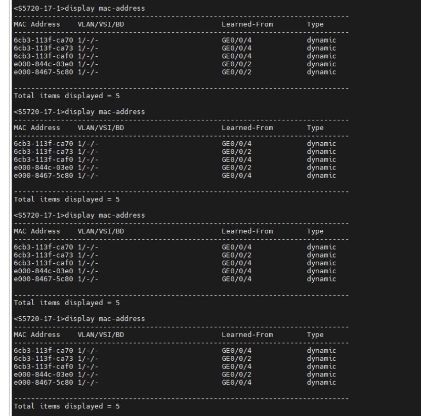
*图 1-4: 同一MAC地址在 G0/0/2 和 G0/0/4 端口间反复跳变*
我们观察到，同一个设备的MAC地址（如`6cb3-113f-ca70`）在MAC地址表中的学习端口在`GE0/0/2`和`GE0/0/4`之间剧烈地、反复地变化。这就是“MAC地址漂移”现象。因为SwitchA可以从两条不同的路径（通过端口2和端口4)收到来自同一个源MAC地址的数据帧，它会认为该设备的位置在不断移动，从而不停地更新MAC地址表。这导致了MAC地址表的极度不稳定，使得交换机无法进行正确的单播转发，所有数据都只能被泛洪，加剧了网络风暴。

#### **步骤二 & 三：交换机基础配置**
在验证了环路的危害后，我们拔下了一条跳线暂时断开环路，并开始进行基础配置，为后续部署RSTP做准备。

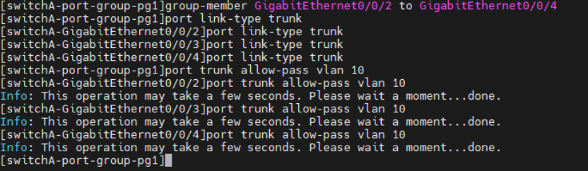
*图 2-1: SwitchA 的 VLAN 及端口配置命令*


```bash
[switchB]vlan 10
[switchB-vlan10]name sales
[switchB]interface GigabitEthernet0/0/1
[switchB-GigabitEthernet0/0/1]port link-type access
[switchB-GigabitEthernet0/0/1]port default vlan 10
[switchB]port-group pg1
[switchB-port-group-pg1]group-member GigabitEthernet0/0/2 to GigabitEthernet0/0/4
[switchB-port-group-pg1]port link-type trunk
[switchB-port-group-pg1]port trunk allow-pass vlan 10
```
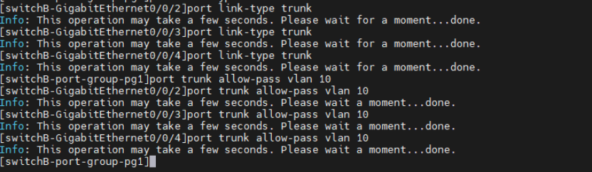

*图 2-2: SwitchB 的 VLAN 及端口配置命令*
我们创建了VLAN 10，并将连接PC的端口设置为`access`模式划入该VLAN。交换机之间的互联端口（G0/0/2和G0/0/4）被配置为`trunk`模式，以承载VLAN 10的流量。

---

#### **步骤四：配置并验证快速生成树协议（RSTP）**
在深刻理解了二层环路的危害之后，我们重新连接上造成环路的第二根跳线，并在两台交换机上部署快速生成树协议（RSTP），以验证其在自动检测和消除环路、保障网络稳定运行方面的核心功能。

**1. 启用RSTP协议**
我们分别登录两台交换机的命令行界面，执行`stp enable`命令全局开启生成树功能，并通过`stp mode rstp`命令将协议模式设置为快速生成树。

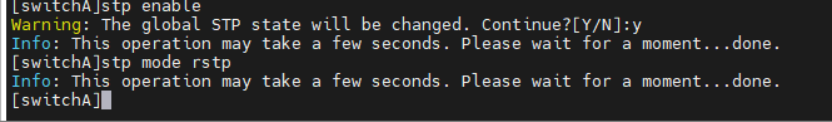
*图 4-1: 在 SwitchA 上执行 `stp enable` 和 `stp mode rstp` 命令*

该操作在SwitchA上激活了RSTP协议。交换机将立即开始发送和监听BPDU（桥协议数据单元)，参与到全网的生成树计算中。


*图 4-2: 在 SwitchB 上执行相同的RSTP启用命令*
SwitchB也同样被配置为RSTP模式。至此，两台交换机都具备了通过RSTP协议来构建无环逻辑拓扑的能力。

**2. 环路消除效果的即时验证**
配置命令执行完毕后，我们立刻观察到先前疯狂闪烁的交换机端口指示灯恢复了正常的、有节奏的闪烁，这初步表明网络流量已不再异常。为了进一步验证，我们查看了Wireshark的捕获结果。

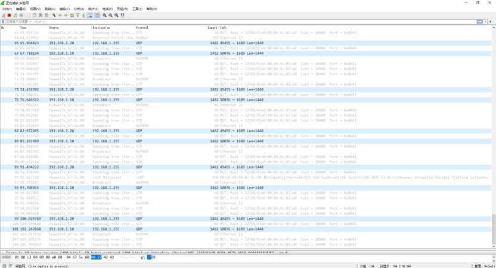
*图 4-3: 启用RSTP后，网络恢复平静，仅剩周期性的BPDU等控制报文*
这张截图与步骤一中的广播风暴（图 1-3)形成了对比。网络中海量的ARP广播包已经完全消失，取而代之的是周期性出现的STP协议报文。这些STP报文就是RSTP用于维护无环拓扑的BPDU。交换机正是通过在所有激活端口上收发这些BPDU，来选举根桥、确定端口角色，并最终将冗余链路上的某个端口置于逻辑阻塞状态，从而从根本上消除了广播风暴。


**3. 网络功能与连通性测试**
在确认环路被消除后，我们需要验证网络的转发功能是否正常。我们从PC1向PC2发起持续ping测试。

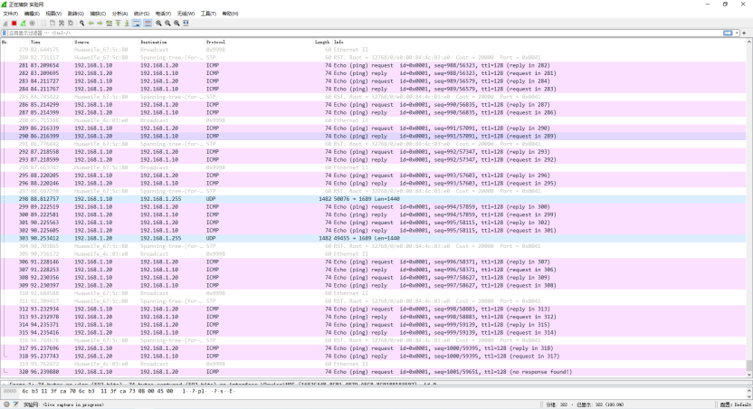
*图 4-4: 启用RSTP后，PC1成功ping通PC2，证明数据通路正常*
ping测试结果显示，ICMP包文可以无丢包地、稳定地在PC1和PC2之间传输，证明了在RSTP的管理下，数据帧能够沿着一条无环的、确定的路径被正确转发。

**4. MAC地址表稳定性验证**
最后，我们再次检查交换机的MAC地址表，以验证“MAC地址漂移”问题是否得到解决。

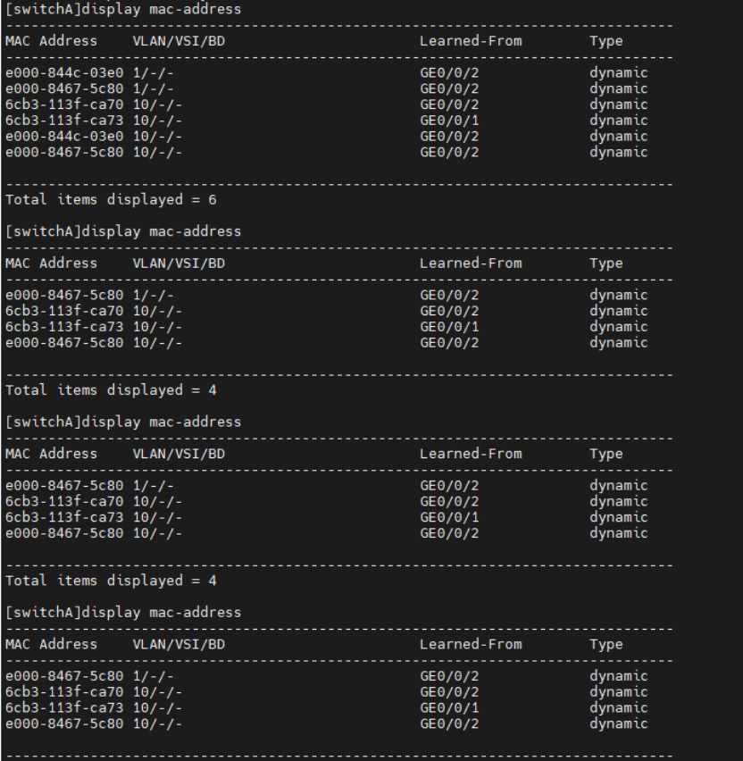
*图 4-5: 启用RSTP后，MAC地址表学习结果正确且稳定*
`display mac-address`命令的输出显示，所有学习到的MAC地址都稳定地映射到了唯一的端口上，不再出现之前在两个端口间反复跳变的情况。这表明交换机现在对网络中每个设备的位置有了清晰、稳定的认知，能够进行高效的单播转发。


---

#### **步骤五、六、七：根桥选举、端口角色分析与优先级设置**
在RSTP协议自动完成收敛、逻辑环路被消除之后，我们工作的核心便是深入分析这棵无环树的结构。

这包括确定哪台交换机成为了网络的逻辑中心——根桥，以及非根桥上的端口分别扮演了何种角色（根端口、预备端口等）。

随后，我们通过手动干预优先级来演示如何实现对网络拓扑的可控设计。

**1. 初始选举结果与端口状态分析 (步骤五)**
在未进行任何优先级配置的情况下，RSTP会根据默认规则自动选举根桥。我们通过一系列`display`命令来探查选举的结果。

*   **探查SwitchA的状态：**
    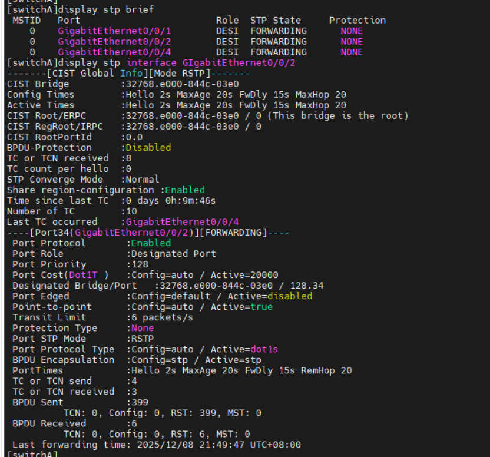
    *图 5-1: 在SwitchA上使用`display stp brief`查看STP简要状态*
    
    
    
    如图5-1所示，我们首先在SwitchA上查看了STP的简要信息。关键信息点在于，其所有参与STP计算的端口（`GigabitEthernet0/0/1`, `0/0/2`, `0/0/4`）的`Role`（角色）均为`DESI`（Designated Port，指定端口）。在一台交换机上，如果其所有活跃端口都是指定端口，这强烈地表明它就是根桥。
    
    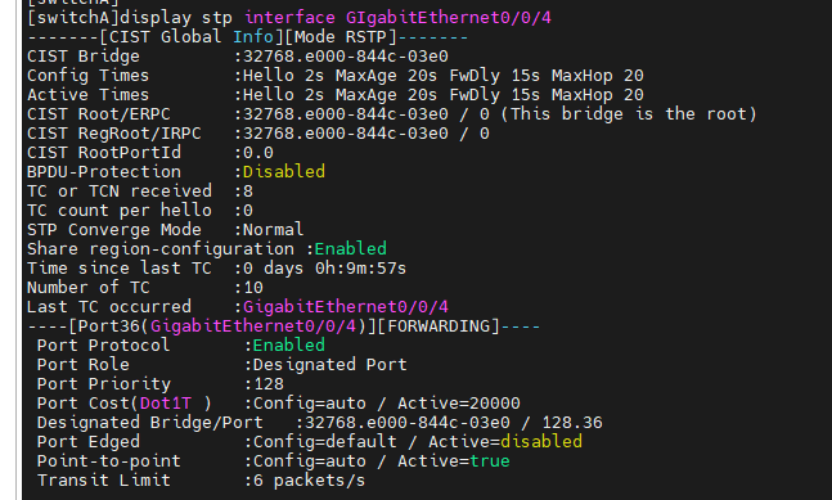
    *图 5-2: 在SwitchA上查看G0/0/2接口的STP详细信息*
    
    
    
    为了进一步确认，我们查看了其中一个端口的详细信息。如图5-2所示，`Port Role`为`Designated Port`，并且`Designated Bridge`字段显示的是SwitchA自身的网桥ID (`32768.e000-844c-03e0`)。这符合根桥的特征：根桥上的所有端口都是其所在网段的指定端口。
    
    
    
*   **探查SwitchB的状态：**
    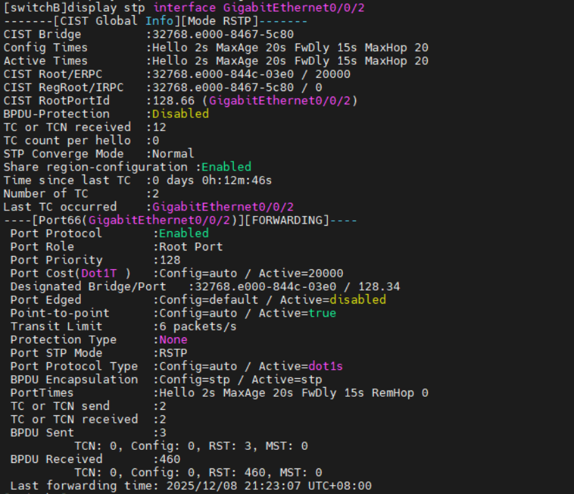
    *图 5-3: 在SwitchB上使用`display stp brief`查看STP简要状态*
    
    
    
    如图5-3所示，SwitchB的状态与SwitchA截然不同。它的G0/0/2端口角色为`ROOT`（根端口），而G0/0/4端口角色为`ALTE`（Alternate Port，预备端口）。这清晰地展示了RSTP的环路避免机制：选择一条最优路径作为根路径（通过根端口），并将冗余路径（通过预备端口)置于阻塞状态。
    
    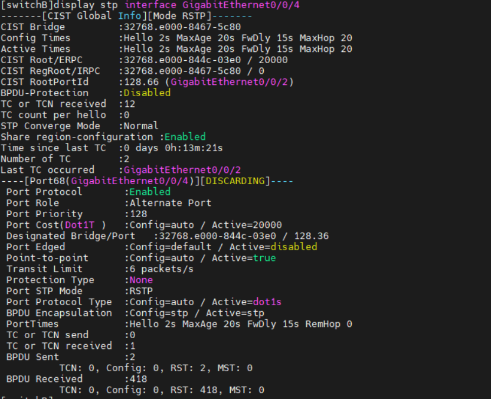
    *图 5-4: 在SwitchB上查看其根端口G0/0/2的详细信息*
    
    
    
    如图5-4所示，G0/0/2端口的角色被确认为`Root Port`，其状态为`FORWARDING`。`Designated Bridge`字段显示的是SwitchA的ID，表明这个端口正朝着根桥SwitchA的方向。
    
*   **初始选举结论：**
    根据生成树的选举规则（先比较优先级，若相同则比较MAC地址，值小者优），两台交换机默认优先级均为32768。通过比较MAC地址，SwitchA (`e000-844c-03e0`) 小于 SwitchB (`e000-8467-5c80`)，因此**SwitchA在初始选举中获胜，成为了根桥**。我们的观察结果与理论完全吻合。
    
    

**2. 手动设置交换机优先级 (步骤六)**
在实际网络部署中，将根桥的选举交给偶然的MAC地址大小是不可靠的。我们通常需要通过手动配置优先级来明确指定性能最好、位置最核心的交换机作为根桥。

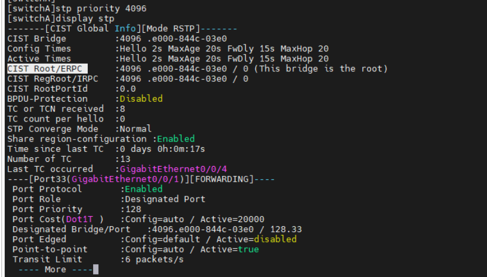
*图 6-1: 在SwitchA上执行`stp priority 4096`命令*

如图6-1所示，我们在SwitchA上将其优先级设置为`4096`。这个值是4096的倍数，并且远小于默认的32768，从而确保了SwitchA在优先级比较中拥有绝对优势。

**3. 验证优先级配置效果 (步骤七)**
配置完成后，我们需要验证优先级是否生效，以及SwitchA是否因此而稳定地保持其根桥地位。

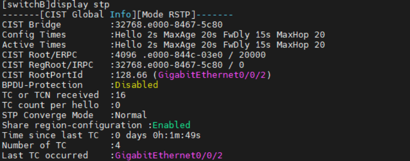
*图 7-1: 再次查看SwitchA的STP状态以验证优先级配置*

如图7-1所示，我们再次执行`display stp`命令。关键的变化在于`CIST Bridge`字段，现在显示为`4096.e000-844c-03e0`，这证明了我们的优先级配置已成功应用。由于4096是当前网络中最低的优先级值，`CIST Root`字段也相应地更新为此ID。这表明，通过手动干预，我们成功地将SwitchA指定为了网络的根桥，使得整个生成树拓扑变得清晰。

此时再次查看SwitchB，其端口角色和状态与步骤五的分析一致，只是它现在所朝向的根桥是一个优先级为4096的根桥。


---

#### **步骤八：非根桥端口角色与状态分析**
在通过手动设置优先级，将SwitchA确定为根桥后，整个生成树的逻辑拓扑就围绕它来构建。此时，分析非根桥（SwitchB）上的端口角色和状态，是理解RSTP如何选择最优路径并阻塞冗余路径的关键。我们通过`display stp interface`命令来逐一检查SwitchB上的互联端口。

**1. 分析SwitchB的GigabitEthernet0/0/2端口**
我们首先查看连接到SwitchA G0/0/2的端口。
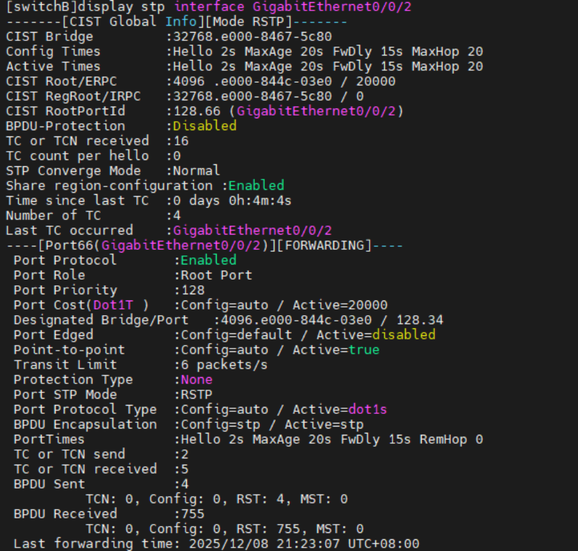
*图 8-1: 查看SwitchB上GigabitEthernet0/0/2端口的STP详细状态*

**详细分析：**

* `Port Protocol`: `Enabled`，表明该端口已启用STP协议。

* `Port Role`: **`Root Port`** (根端口)。这是非根交换机上最重要的角色。根端口是交换机上到达根桥（SwitchA）的路径开销（Cost）最低的端口。所有需要发往网络其他部分（经由根桥）的流量，都会从这个端口发出。

* `Port Priority`: `128`，这是端口的默认优先级。

* `Port Cost(Dot1T)`: `Config=auto / Active=20000`。对于千兆以太网接口，RSTP计算出的默认路径开销是20000。

* `Designated Bridge/Port`: `4096.e000-844c-03e0 / 128.34`。这一行信息至关重要，它指明了这个端口所连接的对端（即指定桥）是SwitchA（网桥ID为`4096.e000-844c-03e0`），以及对端端口的ID是`128.34`。

* `[FORWARDING]`: 该端口的最终状态是**转发状态**。它正常参与数据帧的收发和MAC地址学习。

  

**2. 分析SwitchB的GigabitEthernet0/0/4端口**
接下来，我们查看另一条冗余链路所连接的端口。
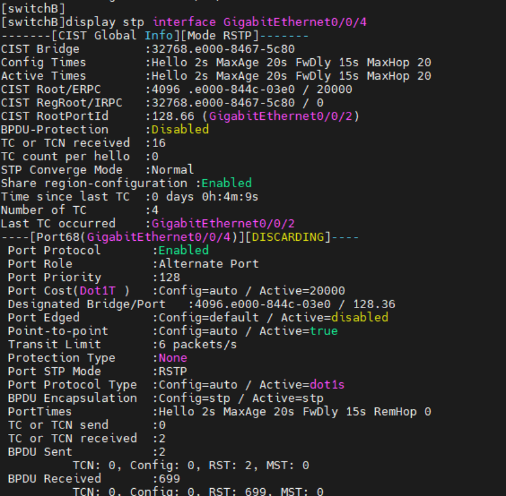
*图 8-2: 查看SwitchB上GigabitEthernet0/0/4端口的STP详细状态*

**详细分析：**

* `Port Role`: **`Alternate Port`** (预备端口)。这是RSTP协议相比于传统STP的一个重要改进。预备端口提供了到根桥的一条备份路径。它的路径开销不劣于根端口，但在当前拓扑中不是最优选择。

* `[DISCARDING]`: 该端口的最终状态是**丢弃状态**。在这个状态下，端口不会转发任何用户数据帧，也不会学习源MAC地址，从而在逻辑上切断了环路。但是，它会持续监听来自对端（SwitchA G0/0/4）的BPDU，以便在当前根端口（G0/0/2）失效时，能够迅速切换角色，接替成为新的根端口。

* `Designated Bridge/Port`: `4096.e000-844c-03e0 / 128.36`。同样，它也知道对端是根桥SwitchA。

  

**本步骤回答与小结：**
(1) **交换机B的端口G0/0/2处于什么状态？**
    答：处于 **FORWARDING (转发)** 状态。

(2) **交换机B的端口G0/0/2的端口角色是什么？**
    答：角色是 **Root Port (根端口)**。

(3) **交换机B的端口G0/0/4处于什么状态？**
    答：处于 **DISCARDING (丢弃)** 状态。

(4) **交换机B的端口G0/0/4的端口角色是什么？**
    答：角色是 **Alternate Port (预备端口)**。

#### **步骤九：实验分析与故障切换**

**(1) 记录初始稳定状态的生成树信息**
在步骤七中，我们已将SwitchA的优先级设置为4096，使其稳定成为根桥。此时，网络拓扑收敛完成。我们记录下两台交换机的详细生成树信息，并填入表6-4。

*表 6-4 交换机生成树信息（1）*
| 属性            | 描述                             | 交换机A                 | 交换机B                       |
| :-------------- | :------------------------------- | :---------------------- | :---------------------------- |
| Port Priority   | 网桥优先权                       | 4096                    | 32768                         |
| CIST Bridge     | 本机网桥ID                       | 4096.e000-844c-03e0     | 32768.e000-8467-5c80          |
| CIST Root/ERPC  | CIST总根交换设备ID/路径开销      | 4096.e000-844c-03e0 / 0 | 4096.e000-844c-03e0 / 20000   |
| CIST RootPortId | 根端口                           | 0.0                     | 128.66 (GigabitEthernet0/0/2) |
| Designated      | Port Role为Designated Port的端口 | G0/0/1, G0/0/2, G0/0/4  | G0/0/1                        |


**(2) 模拟链路故障并验证状态转换**
我们模拟了主用链路中断的场景。在我们的实验中，SwitchB的根端口是G0/0/2，预备端口是G0/0/4。我们拔掉了连接SwitchB根端口（G0/0/2）的网线，并立即观察原预备端口（G0/0/4）的状态变化。

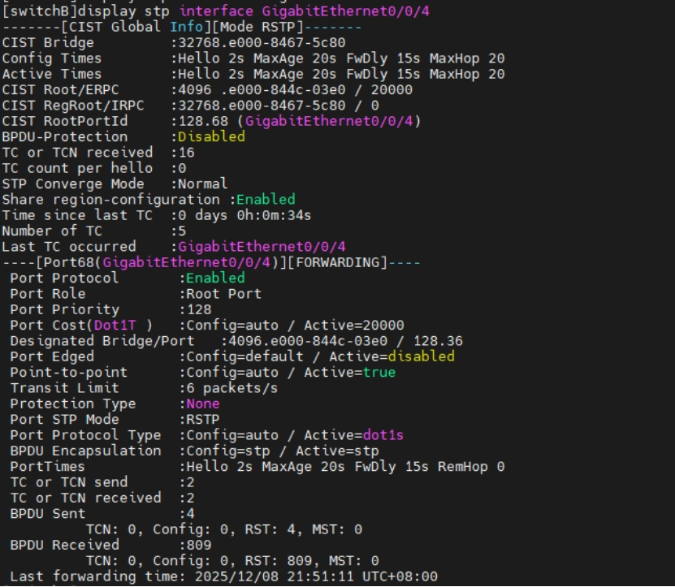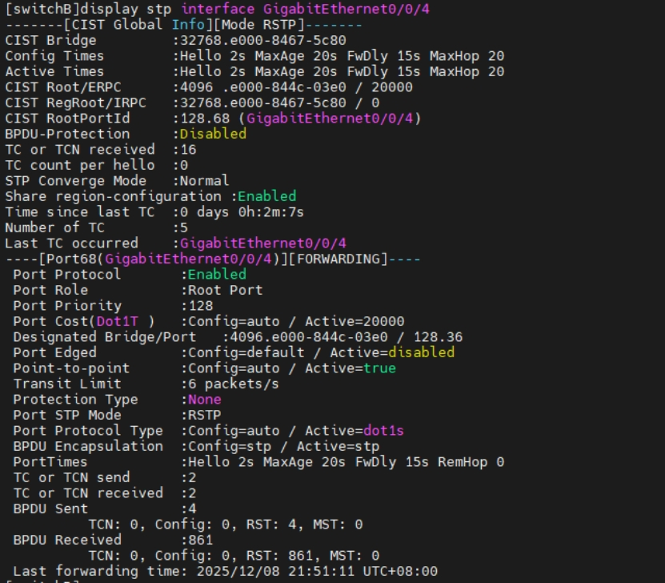
*图 9-1: 根端口链路故障后，原预备端口 G0/0/4 的状态变化*

我们的实验结果表明，在原根端口链路失效后，原先处于`DISCARDING`状态的G0/0/4端口，其角色迅速从`Alternate Port`转变为`Root Port`，端口状态也随之切换到`FORWARDING`状态。

判断上述结论是否正确：我们的实验结果**证实了该结论是正确的**。生成树协议确实在主链路失效后，立即启用了原先处于阻塞状态的冗余链路。我们的观察也证实，**状态转换时间非常迅速，大约在2秒以内**，体现了RSTP的快速收敛能力。


**(3) 记录故障切换后的生成树信息并分析变化**
在链路切换完成，网络重新稳定后，我们再次记录了两台交换机的生成树信息，并与（1）中的初始状态进行比较。
最显著的变化发生在SwitchB上。它的根端口已经由原来的`GigabitEthernet0/0/2`切换到了`GigabitEthernet0/0/4`。这表明网络的逻辑数据通路已经成功地、自动地切换到了备份链路上。同时，由于现在只剩下一条到根桥的活动链路，SwitchB上不再有`Alternate Port`（预备端口）。


**(4) 验证故障切换期间的连通性**
在拔掉网线之前，我们已确定SwitchB的`GigabitEthernet0/0/2`是根端口（转发流量），`GigabitEthernet0/0/4`是预备端口（阻塞流量）。我们在PC1上对PC2执行持续ping操作，并拔掉了连接根端口`G0/0/2`的网线。

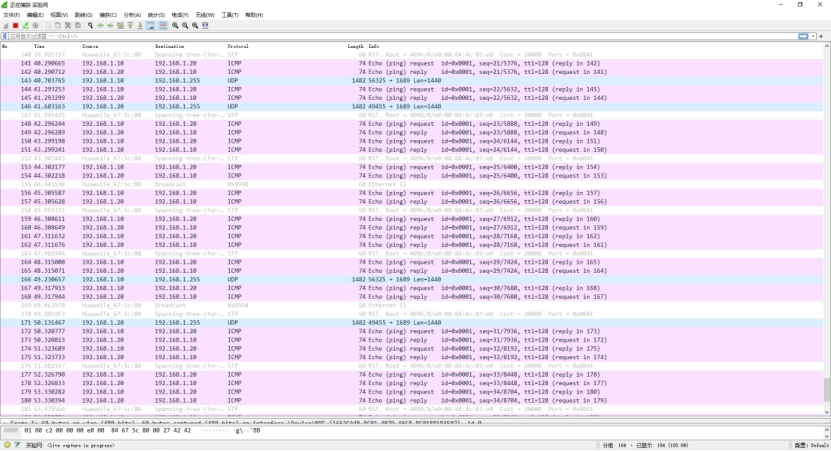
*图 9-2: 链路切换过程中的Ping丢包情况*

**丢包情况解析：**
如图9-2所示，在拔线的瞬间，我们观察到ping命令出现了**一次“请求超时”**，即丢失了一个数据包。这个丢包发生在RSTP协议进行拓扑收敛的极短时间窗口内。在此期间，SwitchB检测到根端口链路中断，并将原先阻塞的预备端口G0/0/4提升为新的根端口并转为转发状态。一旦新的数据通路建立，ping通信立即恢复。这个结果有力地证明了，尽管发生了物理链路故障，网络仍能保持连通性，且业务中断时间被控制在极短的范围内。


**(5) 汇总故障切换后的生成树信息**
我们将故障切换后，网络再次稳定时的信息填入表6-5。

*表 6-5 交换机生成树信息（2）*
| 属性            | 描述                            | 交换机A                 | 交换机B                           |
| :-------------- | :------------------------------ | :---------------------- | :-------------------------------- |
| Port Priority   | 网桥优先权                      | 4096                    | 32768                             |
| CIST Bridge     | 本机网桥ID                      | 4096.e000-844c-03e0     | 32768.e000-8467-5c80              |
| CIST Root/ERPC  | CIST总根交换设备ID/路径开销     | 4096.e000-844c-03e0 / 0 | 4096.e000-844c-03e0 / 20000       |
| CIST RootPortId | 根端口                          | 0.0                     | **128.68 (GigabitEthernet0/0/4)** |
| Alternate       | Port Role为Alternate Port的端口 | (无)                    | **(无)**                          |

**变化对比分析：**
对比表6-5与表6-4，最核心的变化是SwitchB的**`CIST RootPortId`** 字段，其对应的端口已从`GigabitEthernet0/0/2`**变为**`GigabitEthernet0/0/4`。这从数据层面精确地记录了RSTP成功执行了一次故障自愈切换，逻辑拓扑已经重构。


**(6) 捕获并分析BPDU**
为了深入理解生成树协议的底层工作机制，我们使用Wireshark在SwitchA和SwitchB之间的链路上进行了数据包捕获。我们成功捕获到了RSTP周期性交互的核心报文——BPDU（桥协议数据单元）。我们对其中一帧典型的、由根桥SwitchA发往SwitchB的BPDU进行了解析。

以下是我们对捕获到的BPDU关键字段的分析：

*   **Spanning Tree Protocol**
    *   `Protocol Identifier: 0x0000`
        *   **分析：** 这是生成树协议的标识，值为0，表明这是一个标准的IEEE生成树家族的协议报文。
    *   `Protocol Version Identifier: 2`
        *   **分析：** 版本号为2，明确指出我们当前运行的是**RSTP (Rapid Spanning Tree Protocol)**。传统的STP版本号为0，MSTP版本号为3。
    *   `BPDU Type: 0x02 (RST BPDU)`
        *   **分析：** 类型为0x02，同样是RSTP的特征。这与传统的Configuration BPDU（类型0x00）或TCN BPDU（类型0x80）不同。
    *   `BPDU Flags: 0b00001100`
        *   `.... .1.. = Port Role: Designated Port (0x1)`
        *   `.... ..1. = Proposal: True`
        *   **分析：** 这是RSTP BPDU中最重要的字段之一。`Port Role`字段指明了发送此BPDU的端口（本例中为SwitchA的端口）的角色是`Designated Port`（指定端口）。`Proposal`位置位，表明这是一个用于快速收敛协商的提议报文。
    *   `Root Identifier: Priority 4096, MAC: e000-844c-03e0`
        *   **分析：** 该字段声明了发送方认为的根桥ID。在这里，它正是我们手动配置的SwitchA的网桥ID（优先级4096 + MAC地址）。
    *   `Root Path Cost: 0`
        *   **分析：** 到达根桥的路径开销。由于这个BPDU是由根桥自身发出的，所以路径开销为0。
    *   `Bridge Identifier: Priority 4096, MAC: e000-844c-03e0`
        *   **分析：** 该字段是发送此BPDU的交换机自身的ID。在这里，它与`Root Identifier`完全相同，这正是根桥发出BPDU的典型特征。
    *   `Port Identifier: 0x8022 (e.g., for G0/0/2)`
        *   **分析：** 标识了发送此BPDU的具体端口。由端口优先级（默认128）和端口号组成。
    *   `Message Age: 0`, `Max Age: 20s`, `Hello Time: 2s`, `Forward Delay: 15s`
        *   **分析：** 这些是从根桥传播开来的计时器参数，网络中所有交换机都会采用根桥设定的这些值。`Hello Time`为2秒，意味着根桥会每隔2秒发送一次这样的BPDU来宣告自己的存在并维护拓扑。


通过对捕获的BPDU进行逐字段分析，我们从协议层面证实了实验的观察结果。BPDU的内容反映了：

1.  网络中运行的是**RSTP**协议。
2.  **SwitchA**是根桥，因为它发送的BPDU中`Root Identifier`和`Bridge Identifier`相同，且`Root Path Cost`为0。
3.  SwitchB接收到这个BPDU后，会将其与自身的BPDU信息进行比较。由于SwitchA的网桥ID更优，SwitchB会认可SwitchA为根桥，并停止发送自己的BPDU。它会根据从不同端口收到的来自根桥的BPDU，计算出到达根桥的最优路径（选择为根端口），并将其他冗余路径阻塞（选择为预备端口）。整个网络的无环逻辑拓扑，正是通过这样持续不断地、精确地信息交换来建立和维护的。


---
### **实验思考**
**(1) 请问该实验中有无环路?请说明判断的理由。如果存在,说明交换机是如何避免环路的?**
答：该实验中**存在物理环路**，因为两台交换机之间连接了两条物理网线。但**不存在逻辑环路**。理由是，我们启用了RSTP协议，该协议通过BPDU协商，在逻辑上将其中一个端口（SwitchB的G0/0/4）置于`DISCARDING`状态，使其不转发数据帧，从而在数据转发层面断开了环路，形成了一个无环的树状结构。


**(2) 冗余链路会不会出现MAC地址表不稳定和多帧复制的问题?请举例说明。**
答：在**未启用生成树协议**的情况下，冗余链路**会**导致MAC地址表不稳定和多帧复制。如本实验步骤一所示，PC1发往PC2的帧，SwitchA会从G0/0/2和G0/0/4两个端口收到，导致PC1的MAC在两个端口间漂移。同时，广播帧会被无限复制转发，形成广播风暴。
在**启用生成树协议**后，冗余链路**不会**出现这些问题。因为备份链路上的端口（Alternate Port）处于阻塞状态，不参与数据帧的转发，所以数据帧始终只有一条确定的路径，MAC地址学习稳定，广播帧也不会形成环路。


**(3) 将实验改用STP协议,重点观察状态转换时间。**
答：如果改用传统的STP协议，在主链路（根端口）故障后，状态转换时间会**显著变长**。STP的收敛过程依赖于计时器，一个端口从Blocking状态转换到Forwarding状态，需要经过Listening（15秒）和Learning（15秒）两个阶段，总共需要大约30-50秒的时间。这期间网络会完全中断。而RSTP通过Proposal/Agreement机制和预定义的端口角色（如Alternate Port），可以实现秒级甚至亚秒级的快速切换。


**(4) 在本实验中,开始时首先在两台交换机之间只连接一根跳线,发现可以正常ping通。此时在两台交换机之间多接一根跳线,发现还是可以继续正常ping通。请问此时有广播风暴吗?**
答：如果在**启用了生成树协议**（无论是STP、RSTP还是MSTP）的情况下，多接一根跳线形成环路，网络**不会出现广播风暴**。当第二根跳线接上时，交换机会检测到新的物理链路，生成树协议会立即开始收敛过程。它会通过交换BPDU，计算出新的拓扑，并将新形成的冗余路径上的某个端口置于阻塞状态。整个过程是自动的，可能会有瞬间的拓扑变化（通常用户无感知），但最终会形成一个新的、稳定的无环逻辑拓扑，因此可以继续正常ping通，不会产生广播风暴。


## **第二部分：拓展实验**

### **实验内容**
a) 在一个由四台交换机组成的全连接（Full-Mesh）拓扑中，规划并配置VLAN及PC的IP地址。
b) 首先在禁用生成树协议的情况下，观察并分析多环路环境下网络风暴的形成及其对网络连通性的影响。
c) 逐个在交换机上配置VLAN和RSTP，验证生成树协议在复杂环路环境下的收敛过程和环路抑制效果。
d) 探讨在存在多条物理路径的情况下，如何超越RSTP的限制，利用端口汇聚技术实现链路的负载均衡。

### **实验拓扑**
本次拓展实验采用了一个更为复杂的网络拓扑，由四台交换机（A, B, C, D）构成一个全连接的网状结构，这意味着任意两台交换机之间都存在直接的物理链路，从而在网络中形成了多个复杂的物理环路。

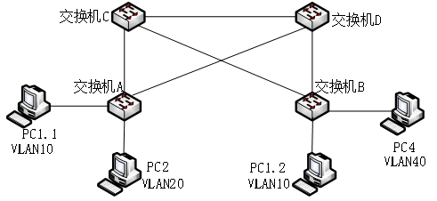
*图 2 拓展实验拓扑图*

**1. PC IP地址与VLAN规划**
我们为连接在网络边缘的PC规划了IP地址，并将它们划分到不同的VLAN中，以模拟多业务部门的网络环境。

| 设备  | IP地址       | 子网掩码      | 所属VLAN |
| :---- | :----------- | :------------ | :------- |
| PC1.1 | 192.168.1.11 | 255.255.255.0 | VLAN 10  |
| PC2   | 192.168.1.21 | 255.255.255.0 | VLAN 20  |
| PC1.2 | 192.168.1.12 | 255.255.255.0 | VLAN 10  |
| PC4   | 192.168.1.41 | 255.255.255.0 | VLAN 40  |

**2. 交换机接口连接规划**
我们按照以下规划连接了所有设备，其中PC接口为Access模式，交换机间互联接口为Trunk模式。

*   **交换机A:** 连接 PC1.1, PC2, 交换机C, 交换机D
*   **交换机B:** 连接 PC1.2, PC4, 交换机C, 交换机D
*   **交换机C:** 连接 交换机A, 交换机B, 交换机D
*   **交换机D:** 连接 交换机A, 交换机B, 交换机C

**交换机接口配置：**

交换机A（组3的SW1）、交换机C（组3的SW2）
交换机B（组5的SW1）、交换机D（组5的SW1）

交换机	接口	连接对象	    模式	    备注
交换机A	Fa0/1	PC1.1	      access	直连PC
交换机A	Fa0/2	PC2	          access	直连PC
交换机A	Fa0/3	交换机C	       trunk	交换机间链路
交换机A	Fa0/4	交换机D	       trunk	交换机间链路

交换机B	Fa0/1	PC1.2	      access	直连PC
交换机B	Fa0/2	PC4	          access	直连PC
交换机B	Fa0/3	交换机C	       trunk	交换机间链路
交换机B	Fa0/4	交换机D	       trunk	交换机间链路 

交换机C	Fa0/1	交换机A	       trunk	交换机间链路
交换机C	Fa0/2	交换机B	       trunk	交换机间链路
交换机C	Fa0/3	交换机D	       trunk	交换机间链路

交换机D	Fa0/1	交换机A	       trunk	交换机间链路
交换机D	Fa0/2	交换机B	       trunk	交换机间链路
交换机D	Fa0/3	交换机C	       trunk	交换机间链路

---
### **实验步骤与结果分析**

#### **一、 多交换机环路与网络风暴验证**
**任务要求：** 在禁用生成树协议的情况下，观察并记录网络风暴现象。

**1. 禁用生成树协议**
在连接所有物理链路之前，我们首先登录到每一台交换机，并使用 `undo stp enable` 命令全局禁用生成树协议，以创造一个没有任何环路保护的原始网络环境。
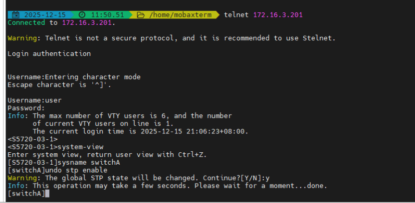
*图 2-1: 在SwitchA上执行`undo stp enable`，为观察环路现象做准备*

**2. 网络风暴观察与连通性测试**
完成所有物理连接后，我们立即观察到所有交换机上互联端口的指示灯开始以极高的频率疯狂闪烁。我们启动Wireshark进行抓包，并尝试进行ping测试。
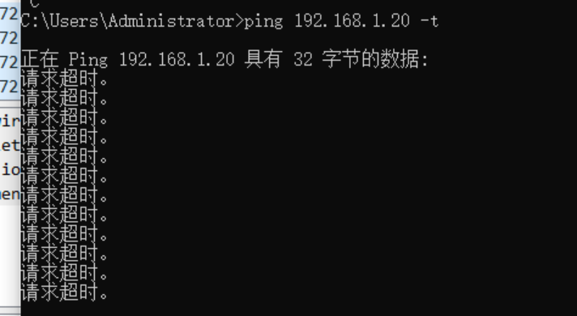
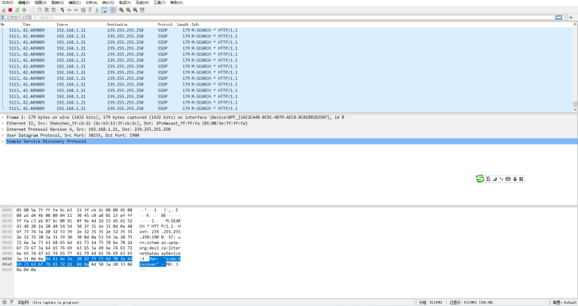
*图 2-2: Wireshark捕获到网络中充斥着海量的SSDP和ARP等广播/组播报文*
我们的抓包结果显示，网络中瞬间充满了大量的广播和组播报文，形成了比基础实验中更为猛烈的网络风暴。在这个由四台交换机组成的网状拓扑中，一个广播帧会被更多次地复制和循环转发，迅速导致网络完全拥塞。

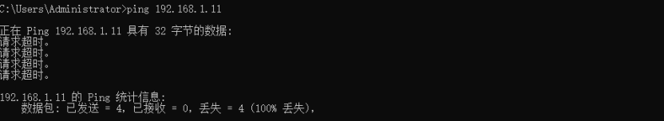
*图 2-3: 在网络风暴中，从PC2 ping PC1.1，所有请求均超时*
我们尝试从PC2 ping PC1.1，结果显示所有ICMP请求全部超时。这清晰地表明，网络风暴已经使得交换设备无法处理正常的通信数据包，整个网络陷入瘫痪状态，完全不可用。

#### **二、 VLAN与RSTP逐级配置**
**任务要求：** 逐个交换机增加VLAN和生成树配置，检查网络风暴情况。

在验证了环路的危害后，我们开始在四台交换机上逐一进行VLAN和RSTP的配置。

*   **交换机A配置：**
    我们创建了VLAN 10, 20, 40，将G0/0/1划入VLAN 10（Access），G0/0/2划入VLAN 20（Access），并将互联端口配置为Trunk，允许所有业务VLAN通过。
    
    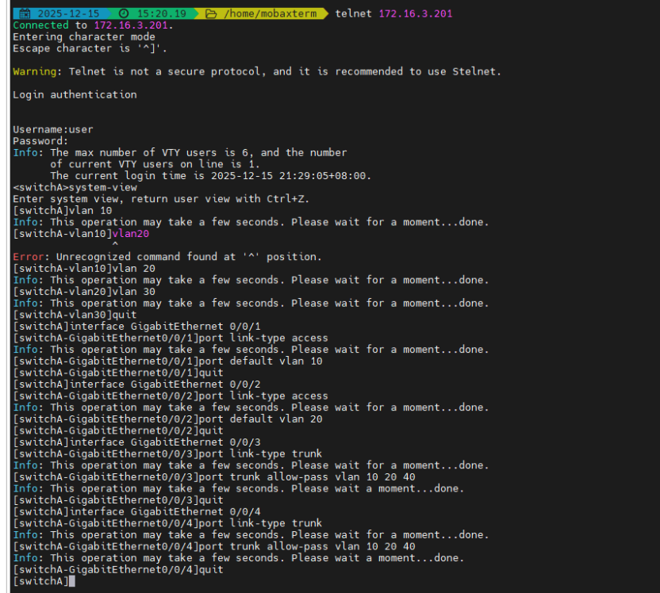
    
    *图 2-4: 在SwitchA上进行VLAN和端口的详细配置*
    配置过程中我们发现一个笔误（将VLAN 40错配为30），并进行了修正，这体现了配置核查的重要性。
    
    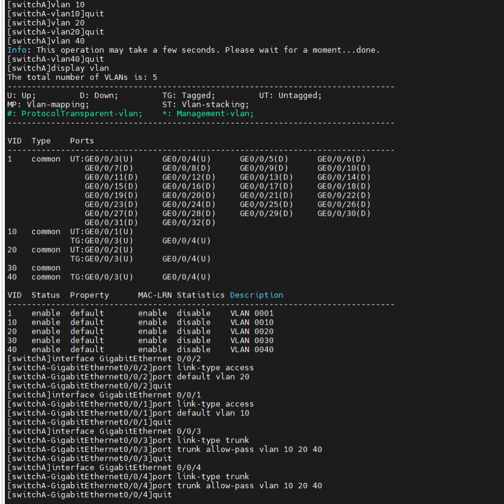
    
    *图 2-5: 对SwitchA的VLAN配置进行修正*
    最后，我们在SwitchA上启用RSTP。
    
    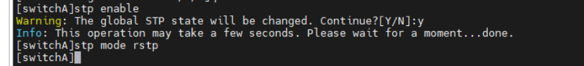
    
    *图 2-6: 在SwitchA上启用RSTP协议*
    
*   **交换机B, C, D配置：**
    我们参照SwitchA的配置方法，依次在SwitchB, C, D上完成了VLAN的创建、端口的划分以及Trunk链路的配置，并最终在所有交换机上启用了RSTP协议。
    
    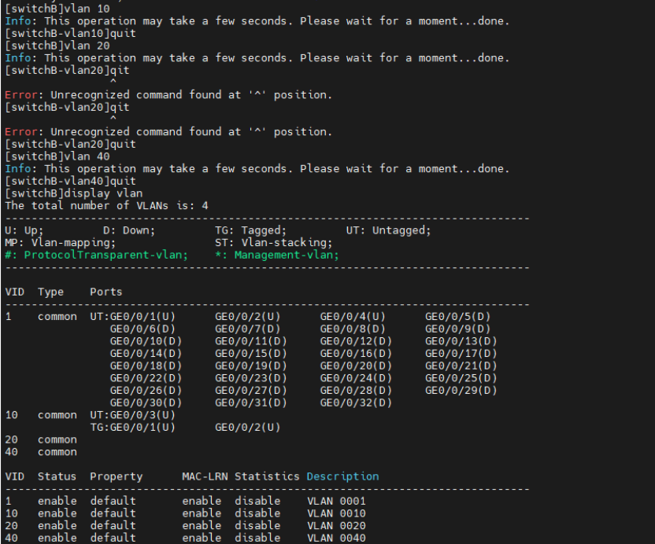
    
    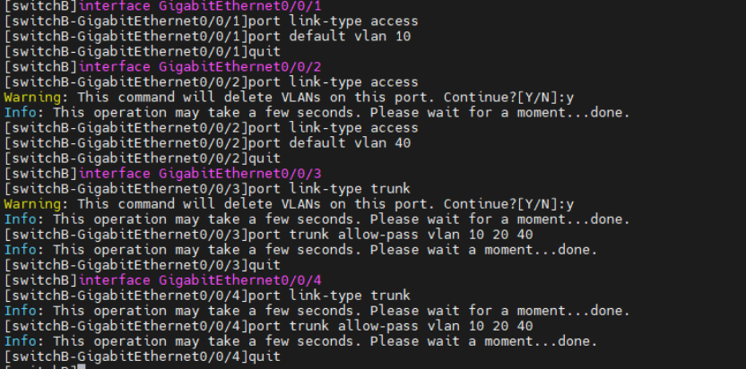
    
    *图 2-7: 在SwitchB上进行VLAN和端口配置*
    
    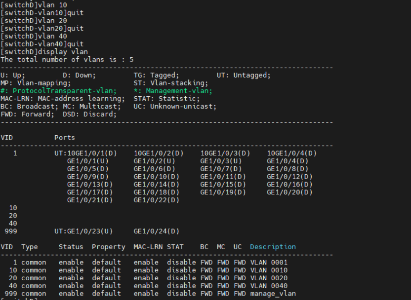
    
    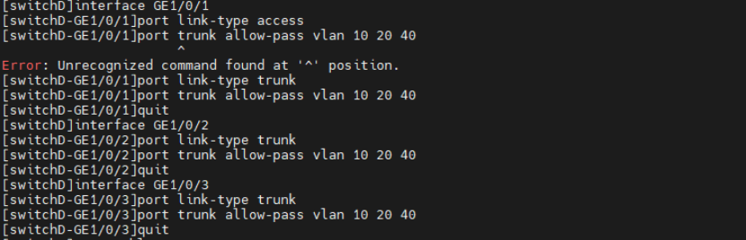
    
    *图 2-8: 在SwitchD上进行VLAN和端口配置*
    
    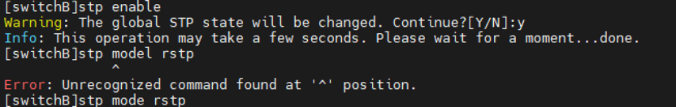
    
    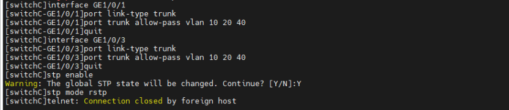
    
    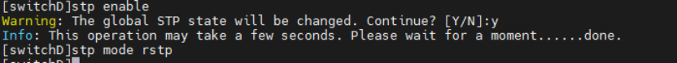
    
    *图 2-9: 依次在SwitchB, C, D上启用RSTP协议*

#### **三、 配置验证与连通性恢复**
**任务要求：** 检查配置并验证网络风暴是否消除，网络是否恢复正常。

**1. VLAN配置验证**
在所有交换机上配置完毕后，我们使用`display vlan`命令来核查VLAN的创建以及端口的分配情况是否正确。

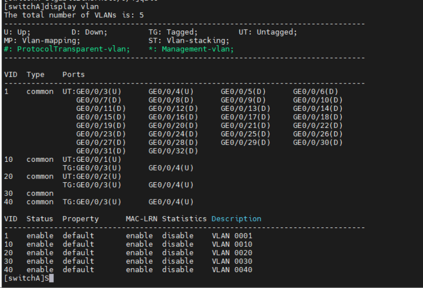


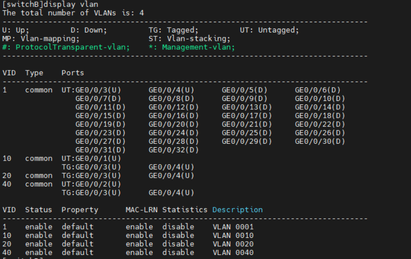


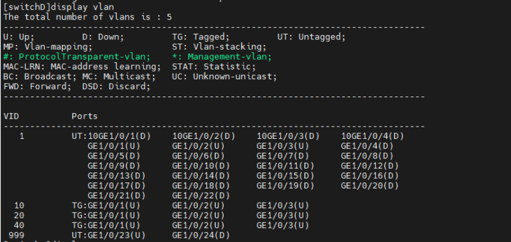


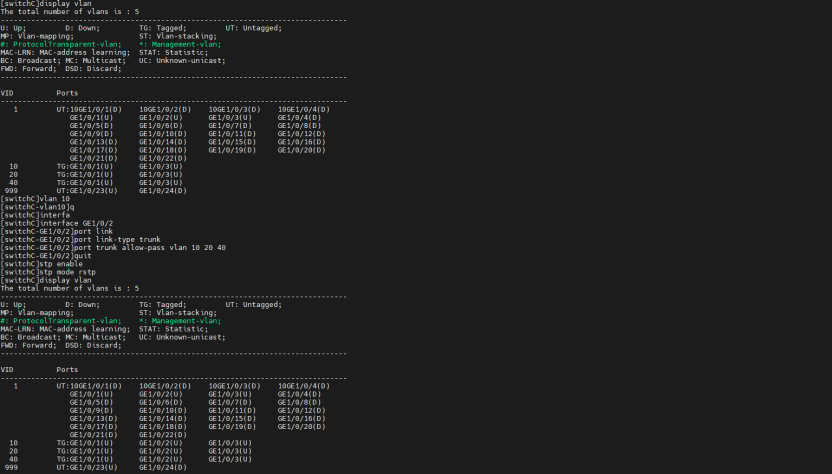

*图 2-10: 分别在四台交换机上验证VLAN配置，确认端口划分正确*
从以上四张截图中，我们可以确认所有交换机的VLAN配置均符合我们的规划。例如，在SwitchA上，G0/0/1是VLAN 10的Untagged成员，G0/0/2是VLAN 20的Untagged成员，而互联端口G0/0/3和G0/0/4则是VLAN 10, 20, 40的Tagged成员。


**2. 连通性恢复验证**
在所有交换机都启用RSTP后，我们观察到端口指示灯恢复正常，Wireshark中也不再有网络风暴。我们再次进行了ping测试。
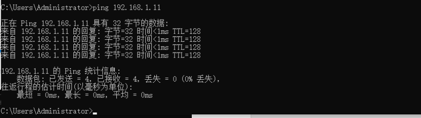
*图 2-11: 启用RSTP后，从PC2成功ping通PC1.1*
**分析：**
我们再次从PC2（192.168.1.21）ping PC1.1（192.168.1.11)。这一次，ping测试成功，所有ICMP包都得到了正常的回复。

证明了：RSTP协议在复杂的、多环路的全连接网络中，同样能够成功地进行收敛，通过计算选举出一棵覆盖全网的、无环的逻辑树状拓扑。它通过阻塞掉所有造成冗余的端口，为数据帧的转发提供了一条唯一的逻辑路径，从而彻底消除了网络风暴，恢复了网络的正常通信能力。

#### **四、 拓展思考：利用多路径实现负载均衡**
**任务要求：** PC1.1与PC2到PC4分别有多条物理连通的交互路径，如何利用它们实现负载均衡？

在我们的实验拓扑中，任意两台交换机之间都存在多条物理链路，例如SwitchA和SwitchC之间，SwitchA和SwitchD之间等。然而，RSTP为了防止环路，其核心思想是“阻塞冗余”，即在多条路径中只保留一条处于转发状态，其余的全部置于阻塞状态作为备份。这意味着，在任何时候，数据流量都只能利用其中的一条物理链路，另外的链路处于闲置状态，其带宽被浪费了。因此，**RSTP本身无法实现负载均衡**。

要利用这些多条物理路径来同时转发数据，以实现**负载均衡**和**带宽叠加**，我们需要使用**端口汇聚（Link Aggregation）**技术。在华为设备上，该技术被称为**Eth-Trunk**。

**实现方法：**
1.  **创建Eth-Trunk接口：** 在相互连接的两台交换机上（例如SwitchA和SwitchC），我们首先需要创建一个逻辑的Eth-Trunk接口。
2.  **绑定物理成员端口：** 然后，我们将用于连接这两台交换机的多个物理端口（例如SwitchA的G0/0/3和SwitchD的G0/0/1，假设它们都连向SwitchC）绑定到这个逻辑Eth-Trunk接口中。
3.  **配置逻辑接口：** 之后，所有针对这条链路的配置（如设置为Trunk模式，允许通过的VLAN等）都只需要在逻辑Eth-Trunk接口上进行一次即可。

**工作原理：**
配置完成后，生成树协议会将这个Eth-Trunk逻辑接口视为**一条单一的链路**来参与计算。而在数据转发层面，交换机会根据配置的负载均衡算法（如基于源/目的MAC地址、源/目的IP地址等进行哈希计算），将不同的数据流分摊到捆绑在一起的多条物理链路上进行传输。

**优势：**

*   **增加带宽：** N条链路汇聚后，总带宽理论上变为N倍。
*   **提高可靠性：** 当其中一条物理链路故障时，流量会自动、快速地（通常是毫秒级）切换到其他正常的链路上，无需等待RSTP重新收敛，可靠性更高。
*   **简化管理：** 将多条物理链路作为一个逻辑整体进行管理，简化了配置。

因此，通过在我们的四台交换机之间配置Eth-Trunk，我们就可以真正地利用起网状拓扑的物理冗余，实现链路的负载均衡和带宽叠加，从而构建一个更加高效的网络。