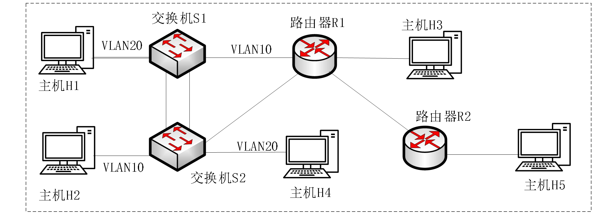

计算机网络实验

网络拓扑图:

请参照以上网络拓扑图，利用实验室已有设备完成相应的实验任务，记录实验中的关键信息以及截图，并呈现在实验报告中。网络拓扑说明：

（1） 路由器 R1 与 R2 通过一个网口互联；

（2） 交换机 S1 与 S2 分别通过网口与路由器 R1 连接；

（3） 交换机 S1 与 S2 先连接一条线，完成 VLAN 和 RSTP 设置后再连接另一条网线。（请注意交换机环路连接引起的网络风暴）；

（4） 主机按图中方案与交换机及路由器连接，主机数量不够，可以动态调配主机与中继设备的连接，或通过自带笔记本来实现。

（5） 请根据任务需要自定义主机、网段的地址和掩码，并在实验报告中明确地址信息。

实验任务说明：
（1）(20 分) 设计并实现方案解决图中S1 与S2 之间插上两条网线后产生的网络风暴问题，请在实验报告中提供方案和实验结果。

（2）(20 分) 按图中完成VLAN 配置，要求H1 与（H2，H4）能够相互ping 通，不同VLAN 要求通过路由器连通，请在实验报告中提供方案和实验结果。

（3）(20 分) R1 与R2 之间采用OSPF 路由协议。要求所有主机能够两两相互ping 通。

（4）(20 分) 实现符合以下要求的访问控制：
在08:00~11:00 时间段内，H1 与H5 可以互访，但是不允许H1 与H3 互通；H2 与H3 可以互访，但是不允许H2 与H5 互通。

在14:00~17:00 时间段内，H1 与H3 可以互访，但是不允许H1 与H5 互通；H2 与H5 可以互访，但是不允许H2 与H3 互通。

其余时段，禁止H1 与（H3，H5）的互通，禁止H2 与（H3，H5）的互通。

在所有时段，H1、H2 与H 4 之间的互通不受ACL 限制；H3 和H5 之间的互通不受ACL限制。H4 可以全时段自由与任意主机进行双向互通。

（5）(20 分) 基于UDP 或TCP 套接字编程技术，实现H1（发送端）和H5（接收端）的数据发送。发送数据包括：图像和文字（建议把下图存为BMP 格式图像后用于传送）。请在实验报告中呈现数据经过中继设备时的特点，并比较接收结果和发送端原始版本之间的差异。

注意事项：

a) 实验中，除了配置交换机和路由器需要之外，请断开桌面主机与桌面小交换机的连接。

b) 实验中需要用到的IP 地址请自己规划设计，并在提交的报告中标注及说明清楚。

c) 请在实验报告中详实呈现自己的实验结果及证明信息，避免被误判为虚假或抄袭报告。
