# 数据库系统课程设计：智慧物流车队与配送管理系统

## 目录

**成员**

*   小组成员
*   成员分工总览，在后面实验报告的具体部分也要相应注明

1.  **概念结构设计**
    *   实体与属性定义
    *   E-R 图（需清晰标注 1:1, 1:n, m:n 关系）
2.  **逻辑结构设计**
    *   E-R 图转换为关系模式（表格结构）
    *   规范化分析（证明至少已达到 3NF）
3.  **物理结构与高级对象设计（重点）**
    *   表结构定义（SQL 建表语句）
    *   Trigger 的详细设计与代码实现（需解释设计意图）
    *   存储过程与视图的设计
    *   索引的设置策略
4.  **4. 创新实现：SQL设计**
    * 创新模块一：智能成本测算与派单推荐系统
    * 创新模块二：基于时间序列的运力预警与熔断系统
    * 创新模块三：全系统实时运行状态监控
5.  **系统实现与测试**
    *   开发环境说明
    *   关键功能截图（特别是触发器生效拦截错误或自动更新数据的截图）
    *   前端技术选型与关键代码
    *   遇到的一处具体技术难点及解决方案
6.  **总结**
    *   课程设计心得
    *   对数据库效率优化的思考
7.  **附录/附件**
    *   主要 SQL 脚本（建表、触发器、存储过程）
    *   演示 demo，录制以小组成员学号（口述）开始的演示作业设计中各个功能的简短视频,如果不方便传视频，可以传到一些在线视频网站然后把链接附在报告中，助教由视频开头的口述学号确定视频归属者。
    *   前端代码不要求上传，但需要在视频中体现。


## 0. 成员

### 0.1 小组成员

|       |  姓名  |   学号   |
| :---: | :----: | :------: |
| 组员1 | 林宏宇 | 23320093 |
| 组员2 | 王一澄 | 23336233 |
| 组员3 | 林思涵 | 23336142 |

### 0.2 成员分工总览
#### 林宏宇

在本课程设计中，我主要作为前后端开发者与创新模块实现者，负责将数据库设计转化为可视化的应用系统，并主导了系统的智能化扩展。

**1. Django 框架搭建与系统集成**

搭建基于 Python 的 **Django Web 开发环境**，规划项目的工程结构。

解决 Django 与原生 **SSMS 系统** 使用问题，确保数据库层面的约束能正确反馈至应用层。

**2. 辅助数据库设计与优化**

协同王一澄同学进行需求分析，从**应用开发的角度**对 E-R 图设计的合理性提出改进建议。

配合林思涵同学**测试物理表结构与约束，排查触发器执行中的异常情况**，确保数据库对象的稳定性。

**3. 前后端交互开发**

实现**前端页面的动态渲染**，特别是针对“车辆状态”和“运单管理”的数据展示。

编写**后端业务逻辑**，封装数据库操作接口，处理 HTTP 请求与响应，确保数据流转的准确性。

**4. 创新功能的 SQL 设计与落地**

**运力预警系统**：实现了创新模块二中关于“未来运力预测”的业务逻辑对接，将后台复杂的 SQL 运算结果转化为前端直观的风险提示。

**实时监控大屏**：独立完成了创新模块三的开发，从 Monitor_Board 表中实时拉取 KPI 数据，实现了系统运行状态的可视化仪表盘。

#### 王一澄

在本课程设计中，我主要负责如下工作：

**1. 概念结构设计**

*   **职责**：作为数据库设计的起点，我负责将项目需求文档中的业务规则和语义转化为结构化的数据模型。
*   **具体工作**：
    *   **实体与属性的抽象与定义**：深入分析了物流系统的业务流程，识别出“配送中心”、“车队”、“车辆”、“司机”、“运单”等八个核心实体。为每个实体精确定义了其必要属性，确保了模型能够完整地覆盖所有业务信息。
    *   **E-R图的绘制与关系分析**：使用绘图工具绘制了详细的E-R图。在此过程中，重点分析并清晰地标注了实体间的关系，例如：调度主管与车队之间的 **1:1** 关系，车队与车辆/司机之间的 **1:N** 关系等。为后续的逻辑设计提供了清晰的蓝图。

**2. 逻辑结构设计 **

*   **职责**：将抽象的E-R图转化为数据库能够理解的关系模式，并从理论上保证其设计的健壮性。
*   **具体工作**：
    *   **E-R图到关系模式的转换**：我系统地将E-R图中的实体和关系，一一映射为数据库中的表格结构。这项工作包括确定每个表的主键和外键，从而在逻辑层面建立了表与表之间的引用关系。
    *   **规范化分析**：为确保数据库设计的质量，我对每一个转换后的关系模式都进行了严格的规范化分析。通过函数依赖的推导，我证明了所有表的设计均至少达到了**第三范式 (3NF)**。消除了数据冗余，避免了可能出现的插入、更新和删除异常，保证了数据的一致性。

**3. 物理结构设计**

*   **职责**：负责将前面的关系模型编写成sql代码，建表。
*   **具体工作**：
    *   **表结构定义 (DDL实现)**：我编写了项目所需全部数据表的 `CREATE TABLE` 语句。在此过程中，我为每个字段精心选择了最合适的数据类型（如 `NVARCHAR` 兼容中文字符，`DECIMAL` 保证载重等数据的精度，`DATE` 用于存储日期），并定义了 `NOT NULL`、`DEFAULT`、`CHECK` 等约束，从物理层面强化了数据的完整性。
    *   本部分之后的工作以及表定义的修改，由林思涵同学完成。

**4. 创新与优化**

* **职责**：在完成基础设计之上，我主导了系统的创新功能构思，将系统从一个单纯的数据记录工具，提升为一个具备辅助决策能力的智能平台。

*   **具体工作**：
    * **三大创新点设计**：我从业务优化的角度出发，构思并设计了三个递进的创新模块：“智能派单推荐系统”、“基于时间序列的运力预警与熔断系统”和“全系统实时运行状态监控”，并撰写了详细的设计思路。
    
    * **原型开发与团队协作**：为了验证创新想法的可行性，我独立完成了第一个创新点——“智能派单推荐系统”的核心SQL代码实现，包括其所需的数据表结构和核心存储过程。
    
      在完成初步的原型开发后，我将此部分代码移交给了组员 **林宏宇**，由他进行后续的修改、优化与集成。

**5. 实验报告撰写**

*   **职责**：作为项目文档化的关键环节，我与团队成员紧密协作，共同完成了最终的实验报告。
*   **具体工作**：
    *   我主要负责撰写了报告中与我分工相对应的部分，包括**第一章（概念结构设计）、第二章（逻辑结构设计）** 的核心内容、**第三章（物理结构设计）** 的部分内容，以及**第四章（创新与优化）** 的整体设计思路。在撰写过程中，我确保了对自己工作的描述清晰、准确，并与其他组员的部分保持了良好的衔接与一致性，共同保证了报告的整体质量。

#### 林思涵

在本课程设计中，我主要负责项目的触发器、存储过程与视图以及索引部分，并承担了功能验证的工作。

**1. 物理结构与高级对象设计**

*   **职责**：按照需求，完成触发器、存储过程与视图以及索引部分的 SQL 代码编写
*   **具体工作**：
    *   **触发器的详细设计与实现**：这是我的核心贡献。我编写了全部三个核心业务逻辑的触发器：
        1.  **自动载重校验**：确保了运单分配时车辆不会超载，从数据库层面保证了物理安全。
        2.  **车辆状态自动流转**：通过两个独立的触发器，实现了车辆在“运单完成”和“异常处理”后状态的自动更新，减少了人工操作，提升了系统自动化水平。
        3.  **审计日志**：为关键信息（如司机驾照变更）设计并实现了日志记录触发器，确保所有重要操作都有据可查。
    *   **存储过程与视图的设计**：我根据项目需求，编写了用于计算车队月度绩效的存储过程，将复杂的统计逻辑封装起来；同时创建了“本周异常警报”视图，简化了前端的查询需求。
    *   **索引的设置与优化分析**：我分析了系统的高频查询场景，为关键字段（如 `driver.name`）创建了索引，并通过对比分析索引前后的**执行计划 (Execution Plan)**，从理论和实践上证明了索引对查询性能的显著提升。

**2. 功能验证与测试**

*   **职责**：为确保所有数据库对象的正确性，我为每个高级对象（触发器、存储过程、视图）都编写了独立的验证脚本。
*   **具体工作**：
    *   通过构造**预期成功**和**预期失败**的场景，我对触发器的拦截、自动更新和日志记录功能进行了全面测试，并截取了关键的运行结果作为报告依据。
    *   通过插入模拟数据并调用，验证了存储过程计算结果的准确性。
    *   通过查询视图，验证了其数据筛选逻辑的正确性。

***

## 1. 概念结构设计 

> 王一澄同学负责

### 1.1 实体与属性定义

#### 1. **配送中心 (DistributionCenter)**
*   **属性 (Attributes)**:
    中心编号 (CenterID), 中心名称 (CenterName), 中心地址 (Address)
*   **主键 (PK)**: 中心编号 (CenterID)
*   **外键 (FK)**: 无

#### 2. **车队 (Fleet)**
*   **属性 (Attributes)**:
    车队编号 (FleetID), 车队名称 (FleetName), 所属中心编号 (CenterID)
*   **主键 (PK)**: 车队编号 (FleetID)
*   **外键 (FK)**: 所属中心编号 (CenterID) $\to$ 配送中心 (DistributionCenter)

#### 3. **调度主管 (Supervisor)**
*   **属性 (Attributes)**:
    主管工号 (SupervisorID), 姓名 (Name), 登录密码 (Password), 联系电话 (Phone), 所属车队编号 (FleetID)
*   **主键 (PK)**: 主管工号 (SupervisorID)
*   **外键 (FK)**: 所属车队编号 (FleetID) $\to$ 车队 (Fleet)
    *(注：根据每个车队有一名调度主管的1:1关系，在此处设置外键并需添加唯一性约束)*

#### 4. **司机 (Driver)**
*   **属性 (Attributes)**:
    司机工号 (DriverID), 姓名 (Name), 驾照等级 (LicenseLevel), 联系电话 (Phone), 入职时间 (HireDate), 所属车队编号 (FleetID)
*   **主键 (PK)**: 司机工号 (DriverID)
*   **外键 (FK)**: 所属车队编号 (FleetID) $\to$ 车队 (Fleet)

#### 5. **车辆 (Truck)**
*   **属性 (Attributes)**:
    车牌号 (PlateNumber), 最大载重 (MaxLoad), 最大容积 (MaxVolume), 当前状态 (CurrentStatus), 所属车队编号 (FleetID)
*   **主键 (PK)**: 车牌号 (PlateNumber)
*   **外键 (FK)**: 所属车队编号 (FleetID) $\to$ 车队 (Fleet)

#### 6. **运单 (Order)**
*   **属性 (Attributes)**:
    运单号 (OrderID), 货物重量 (Weight), 货物体积 (Volume), 目的地 (Destination), 运单状态 (Status), 创建时间 (CreateTime), 承运车辆车牌 (TruckPlate)
*   **主键 (PK)**: 运单号 (OrderID)
*   **外键 (FK)**: 承运车辆车牌 (TruckPlate) $\to$ 车辆 (Truck)

#### 7. **异常记录 (ExceptionRecord)**
*   **属性 (Attributes)**:
    记录编号 (RecordID), 异常类型 (ExceptionType), 发生时间 (OccurTime), 罚款金额 (FineAmount), 处理状态 (HandleStatus), 关联车辆车牌 (TruckPlate), 关联司机工号 (DriverID)，
*   **主键 (PK)**: 记录编号 (RecordID)
*   **外键 (FK)**:
    1. 关联车辆车牌 (TruckPlate) $\to$ 车辆 (Truck)
    2. 关联司机工号 (DriverID) $\to$ 司机 (Driver)

#### 8. 审计日志 (History_Log)
*   **属性 (Attributes)**:
    日志编号 (LogID), 目标对象ID (TargetID), 旧值 (OldValue), 新值 (NewValue), 修改时间 (ChangeTime), 操作类型 (OperationType)
*   **主键 (PK)**: 日志编号 (LogID)
*   **外键 (FK)**: 无 (为了保持审计独立性，通常不强制物理外键约束，防止主表删除导致日志丢失)


### 实体关系图示

#### 1. 配送中心 与 车队
**配送中心** —— `0..N` —— **下辖** —— `1..1` —— **车队**
*   **解读**：
    *   左侧 `0..N`：一个配送中心可以下辖 0 个或 N 个车队。
    *   右侧 `1..1`：一个车队必须且只能属于 1 个配送中心。

#### 2. 车队 与 车辆
**车队** —— `0..N` —— **拥有** —— `1..1` —— **车辆**
*   **解读**：
    *   左侧 `0..N`：一个车队可以拥有 0 辆或 N 辆车（如新成立车队）。
    *   右侧 `1..1`：一辆车必须且只能属于 1 个车队。

#### 3. 车队 与 司机
**车队** —— `0..N` —— **雇佣** —— `1..1` —— **司机**
*   **解读**：
    *   左侧 `0..N`：一个车队可以有 0 名或 N 名司机。
    *   右侧 `1..1`：一名司机必须且只能属于 1 个车队。

#### 4. 车队 与 调度主管
**车队** —— `1..1` —— **配备** —— `1..1` —— **调度主管**
*   **解读**：
    *   左侧 `1..1`：一个车队必须恰好有 1 名主管（文档规则3强制要求）。
    *   右侧 `1..1`：一名主管必须恰好管理 1 个车队。

#### 5. 车辆 与 运单
**车辆** —— `0..N` —— **承运** —— `0..1` —— **运单**
*   **解读**：
    *   左侧 `0..N`：一辆车可以承运 0 个（空闲）或 N 个运单。
    *   右侧 `0..1`：一个运单在刚创建时可能未分配（0），分配后属于 1 辆车。**（这里注意是 0..1，因为存在待分配状态）**

#### 6. 车辆 与 异常记录
**车辆** —— `0..N` —— **发生** —— `1..1` —— **异常记录**
*   **解读**：
    *   左侧 `0..N`：一辆车可以没有异常（0），也可以有多次异常（N）。
    *   右侧 `1..1`：一条异常记录必须依附于 1 辆具体的车，不能凭空存在。

#### 7. 司机 与 异常记录
**司机** —— `0..N` —— **责任** —— `1..1` —— **异常记录**
*   **解读**：
    *   左侧 `0..N`：一名司机可以没有违规（0），也可以有多次违规（N）。
    *   右侧 `1..1`：一条异常记录必须关联到 1 名具体的司机。

---


### 1.2 E-R 图

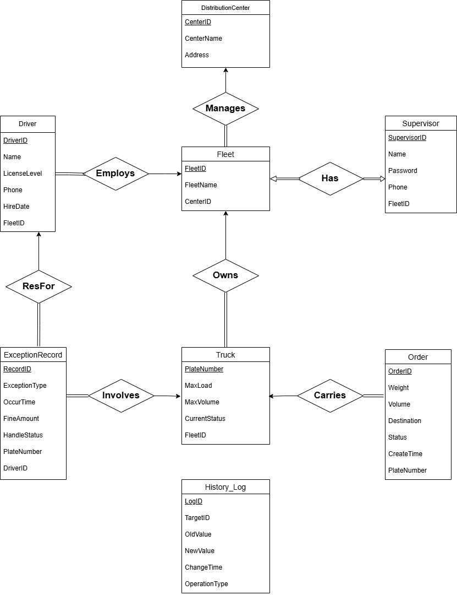

## 2. **逻辑结构设计**

> 王一澄同学负责

### 2.1 关系模式

1.  **配送中心 (distribution_center)**
    *   **模式**：**distribution_center** ( **center_id**, center_name, address )
    *   **主键**：center_id
    *   **外键**：无
2.  **车队 (fleet)**
    *   **模式**：fleet( **fleet_id**, fleet_name, center_id )
    *   **主键**：fleet_id
    *   **外键**：
        *   center_id $\to$ distribution_center (center_id)
3.  **调度主管 (supervisor)**
    *   **模式**：**supervisor**( **supervisor_id**, name, password, phone, fleet_id )
    *   **主键**：supervisor_id
    *   **外键**：
        *   fleet_id $\to$ fleet (fleet_id)
    *   **约束**：fleet_id 必须唯一 (Unique)，以满足 1:1 关系。
4.  **司机 (driver)**
    *   **模式**：**driver**( **driver_id**, name, license_level, phone, hire_date, fleet_id )
    *   **主键**：driver_id
    *   **外键**：
        *   fleet_id $\to$ fleet (fleet_id)
5.  **车辆 (truck)**
    *   **模式**：**truck**( **plate_number**, max_load, max_volume, current_status, fleet_id )
    *   **主键**：plate_number
    *   **外键**：
        *   fleet_id $\to$ fleet (fleet_id)
6.  **运单 (order_info)**
    *   **模式**：**order_info**( **order_id**, weight, volume, destination, status, create_time, truck_plate )
    *   **主键**：order_id
    *   **外键**：
        *   truck_plate $\to$ truck (plate_number)
    *   *注：truck_plate 允许为空（NULL），表示运单尚未分配给车辆。*
    *   *注：为了避免 SQL 关键字冲突，建议将逻辑表名 Order 改为 order_info
7.  **异常记录 (exception_record)**
    *   **模式**：**exception_record**( **record_id**, exception_type, occur_time, fine_amount, handle_status, truck_plate, driver_id )
    *   **主键**：record_id
    *   **外键**：
        *   truck_plate $\to$ truck (plate_number)
        *   driver_id $\to$ driver (driver_id)
8.  **审计日志 (history_log)**
    *   **模式**：**history_log**( **log_id**, target_id, old_value, new_value, change_time, operation_type )
    *   **主键**：log_id
    *   **外键**：无
    *   *设计理由：审计日志应独立于业务主表，防止因主表数据（如司机被删除）导致历史审计记录连带丢失，故不设置物理外键强约束。*

---

### 2.2 规范化分析 (证明达到 3NF)

#### 1. 配送中心 (distribution_center)
*   **属性集合** $U = \{ \text{center\_id}, \text{center\_name}, \text{address} \}$
*   **函数依赖集 (FD)**：
    *   $\text{center\_id} \to \text{center\_name}$
    *   $\text{center\_id} \to \text{address}$
    *   *(注：中心编号唯一标识一个中心及其地址)*
*   **候选码**：$\{ \text{center\_id} \}$
*   **分析**：
    *   **1NF**: 所有属性均为原子值。
    *   **2NF**: 主键为单属性，不存在非主属性对码的部分依赖。
    *   **3NF**: 不存在非主属性对码的传递依赖（如不存在 $X \to Y \to Z$），$\text{center\_name}$ 和 $\text{address}$ 直接依赖于主键。$\therefore$ **符合 3NF**。

#### 2. 车队 (fleet)
*   **属性集合** $U = \{ \text{fleet\_id}, \text{fleet\_name}, \text{center\_id} \}$
*   **函数依赖集 (FD)**：
    *   $\text{fleet\_id} \to \text{fleet\_name}$
    *   $\text{fleet\_id} \to \text{center\_id}$
    *   *(注：一个车队属于一个特定中心)*
*   **候选码**：$\{ \text{fleet\_id} \}$
*   **分析**：
    *   **1NF**: 属性原子化。
    *   **2NF**: 单属性主键，无部分依赖。
    *   **3NF**: $\text{center\_id}$ 是外键，虽然引用了外部表，但在本表中非主属性 $\text{fleet\_name}$ 和 $\text{center\_id}$ 均直接依赖于 $\text{fleet\_id}$，表内无传递依赖。$\therefore$ **符合 3NF**。

#### 3. 调度主管 (supervisor)
*   **属性集合** $U = \{ \text{supervisor\_id}, \text{name}, \text{password}, \text{phone}, \text{fleet\_id} \}$
*   **函数依赖集 (FD)**：
    *   $\text{supervisor\_id} \to \{ \text{name}, \text{password}, \text{phone}, \text{fleet\_id} \}$ （工号唯一标识主管信息）
    *   $\text{fleet\_id} \to \text{supervisor\_id}$ （语义规则：每个车队只有一名主管，车队编号也能唯一标识主管）
*   **候选码**：
    *   候选码 1: $\{ \text{supervisor\_id} \}$ （选作主键）
    *   候选码 2: $\{ \text{fleet\_id} \}$
*   **分析**：
    *   **1NF**: 属性原子化。
    *   **2NF**: 主键是单属性。虽然有两个候选码，但非主属性（name, phone等）对任一候选码都是完全函数依赖。
    *   **3NF**: 表中非主属性直接依赖于候选码，不存在传递依赖。$\therefore$ **符合 3NF**。

#### 4. 司机 (driver)
*   **属性集合** $U = \{ \text{driver\_id}, \text{name}, \text{license\_level}, \text{phone}, \text{hire\_date}, \text{fleet\_id} \}$
*   **函数依赖集 (FD)**：
    *   $\text{driver\_id} \to \{ \text{name}, \text{license\_level}, \text{phone}, \text{hire\_date}, \text{fleet\_id} \}$
*   **候选码**：$\{ \text{driver\_id} \}$
*   **分析**：
    *   **1NF**: 属性原子化。
    *   **2NF**: 单属性主键，无部分依赖。
    *   **3NF**: 此处需注意，有人可能认为 $\text{fleet\_id} \to \text{center\_id}$ 是传递依赖，但 $\text{center\_id}$ 不在司机表中。在司机表内部，所有非主属性均直接依赖于 `driver_id`。$\therefore$ **符合 3NF**。

#### 5. 车辆 (truck)
*   **属性集合** 
    * $U = \{ \text{plate\_number}, \text{max\_load}, \text{max\_volume}, \text{current\_status}, \text{fleet\_id} \}$
*   **函数依赖集 (FD)**：
    *   $\text{plate\_number} \to \{ \text{max\_load}, \text{max\_volume}, \text{current\_status}, \text{fleet\_id} \}$
*   **候选码**：$\{ \text{plate\_number} \}$
*   **分析**：
    *   **1NF**: 属性原子化。
    *   **2NF**: 单属性主键，无部分依赖。
    *   **3NF**: 所有非主属性直接依赖于车牌号，无传递依赖。$\therefore$ **符合 3NF**。

#### 6. 运单 (order)
*   **属性集合** 
    * $U = \{ \text{order\_id}, \text{weight}, \text{volume}, \text{destination}, \text{status}, \text{create\_time}, \text{truck\_plate} \}$
*   **函数依赖集 (FD)**：
    *   $\text{order\_id} \to \{ \text{weight}, \text{volume}, \text{destination}, \text{status}, \text{create\_time}, \text{truck\_plate} \}$
*   **候选码**：$\{ \text{order\_id} \}$
*   **分析**：
    *   **1NF**: 属性原子化。
    *   **2NF**: 单属性主键，无部分依赖。
    *   **3NF**: `truck_plate` 是外键。运单的状态 (`status`) 取决于运单本身的生命周期，虽与车辆有关联，但在数据依赖上直接依赖于 `order_id`。无传递依赖。$\therefore$ **符合 3NF**。

#### 7. 异常记录 (exception_record)
*   **属性集合** 
    * $U = \{ \text{record\_id}, \text{exception\_type}, \text{occur\_time}, \text{fine\_amount}, \text{handle\_status}, \text{truck\_plate}, \text{driver\_id} \}$
*   **函数依赖集 (FD)**：
    *   $\text{record\_id} \to \{ \text{exception\_type}, \text{occur\_time}, \text{fine\_amount}, \text{handle\_status}, \text{truck\_plate}, \text{driver\_id} \}$
*   **候选码**：$\{ \text{record\_id} \}$
*   **分析**：
    *   **1NF**: 属性原子化。
    *   **2NF**: 单属性主键，无部分依赖。
    *   **3NF**: 虽然 `truck_plate` 和 `driver_id` 之间可能存在业务关联（司机驾驶某车），但在本表中它们都是作为该条异常记录的属性存在的，直接由记录ID决定。表内不存在 $A \to B \to C$ 的结构。$\therefore$ **符合 3NF**。

---

**结论**：
经过对系统内所有关系模式的函数依赖分析，所有表均满足：
1.  属性原子性 (1NF)。
2.  非主属性完全依赖于候选码 (2NF)。
3.  非主属性直接依赖于候选码，不存在传递依赖 (3NF)。
    因此，本数据库逻辑结构设计符合 **第三范式 (3NF)** 要求。


## 3. 物理结构与高级对象设计（重点）

> 林思涵 与 王一澄同学 共同负责

在上文写的 E-R 图和逻辑关系变成数据库表时，我们主要的工作就是编写 SQL 的 DDL 语句。下面就是我们为这个系统设计的每一张表的 `create table` 语句，以及我们当时是怎么考虑的。

### 3.1 表结构定义（sql 建表语句）

> 王一澄同学根据之前的设计和验证，建立数据表，设置其完整性约束

#### 3.1.1 配送中心表 (`distribution_center`)

这张表是我们整个系统的根节点，结构很简单：

`center_id` 用了 `int` 类型做主键，因为数字做主键在后面连接查询的时候效率会高一些。

`center_name` 和 `address` 用了 `nvarchar`，主要是为了能存中文，这点很重要，不然就会像我之前实验里遇到的问题一样显示成问号。

`center_name` 设置了 `not null`，因为每个配送中心肯定得有个名字，但地址 `address` 就没强制，考虑到可能有些是虚拟的或者临时的调度点，不一定有固定地址。

```sql
create table distribution_center (
    center_id int primary key,              -- 中心编号 (pk)
    center_name nvarchar(100) not null,     -- 中心名称
    address nvarchar(200)                   -- 中心地址
);
```

---

#### 3.1.2 车队表 (`fleet`)

车队表的作用就是把车队和配送中心关联起来。

这里的关键点是 `center_id` 字段和那个 `foreign key` 约束。

这个约束保证了我们往 `fleet` 表里加的每一条记录，它的 `center_id` 都必须在 `distribution_center` 表里真实存在。
这样就从数据库层面杜绝了一个车队属于一个不存在的配送中心的错误。

```sql
create table fleet (
    fleet_id int primary key,               -- 车队编号 (pk)
    fleet_name nvarchar(100) not null,      -- 车队名称
    center_id int,                          -- 所属中心编号 (fk)
    
    constraint fk_fleet_center foreign key (center_id) 
        references distribution_center(center_id)
);
```

---

#### 3.1.3 调度主管表 (`supervisor`)

根据我们的业务规则，每个车队有一名调度主管，这是个 1 对 1 的关系。

为了在数据库里强制实现这个规则，我们用了 `foreign key` 和 `unique` 两个约束。

`foreign key` 保证了主管必须属于一个存在的车队，而 `unique (fleet_id)` 这个约束则保证了 `fleet_id` 在这张表里不能重复。

这么一来，就不可能出现两个主管管同一个车队，或者一个车队被分配了两个主管的情况，非常稳。

```sql
create table supervisor (
    supervisor_id nvarchar(20) primary key, -- 主管工号 (pk)
    name nvarchar(50) not null,             -- 姓名
    password nvarchar(100) not null,        -- 登录密码
    phone nvarchar(20),                     -- 联系电话
    fleet_id int not null,                  -- 所属车队编号 (fk)
    
    constraint fk_supervisor_fleet foreign key (fleet_id) 
        references fleet(fleet_id),
    
    constraint uq_supervisor_fleet unique (fleet_id)
);
```

---

#### 3.1.4 司机表 (`driver`)

司机表就比较常规了，工号 `driver_id` 做主键，`fleet_id` 做外键关联到车队。

这里值得一提的是 `hire_date` 字段，我们用了 `date` 类型而不是 `datetime`。

因为入职日期我们只关心到天，用 `date` 类型更节省空间，语义也更清晰。

```sql
create table driver (
    driver_id nvarchar(20) primary key,     -- 司机工号 (pk)
    name nvarchar(50) not null,             -- 姓名
    license_level nvarchar(10),             -- 驾照等级 (如 'a1', 'b2')
    phone nvarchar(20),                     -- 联系电话
    hire_date date,                         -- 入职时间
    fleet_id int,                           -- 所属车队编号 (fk)
    
    constraint fk_driver_fleet foreign key (fleet_id) 
        references fleet(fleet_id)
);
```

---

#### 3.1.5 车辆表 (`truck`)

车辆表有两个设计点我们觉得挺重要的。

第一是 `max_load` 和 `max_volume` 用了 `decimal(10, 2)` 类型。

处理像载重这种需要精确计算的数字时，用 `decimal` 比用 `float` 靠谱，可以避免浮点数精度丢失的问题。

第二就是 `current_status` 字段上的 `check` 约束。它规定了这一列只能填进 `'空闲', '运输中', '维修中', '异常'` 这几个值，任何其他字符串都插不进去，保证了车辆状态数据的规范性。

同时，`default '空闲'` 也让录入新车时方便了不少。

```sql
create table truck (
    plate_number nvarchar(20) primary key,  -- 车牌号 (pk)
    max_load decimal(10, 2) not null,       -- 最大载重 (单位: 吨)
    max_volume decimal(10, 2) not null,     -- 最大容积 (单位: 立方米)
    current_status nvarchar(20) default '空闲', -- 当前状态
    fleet_id int,                           -- 所属车队编号 (fk)
    
    constraint fk_truck_fleet foreign key (fleet_id) 
        references fleet(fleet_id),
        
    constraint ck_truck_status check (current_status in ('空闲', '运输中', '维修中', '异常'))
);
```

---

#### 3.1.6 运单表 (`[order]`)

这个表名叫 `[order]` 是因为 `order` 是 SQL 的一个关键字，所以得用方括号括起来，不然会报错。

这张表里最重要的一个设计是 `truck_plate` 这个外键**允许为空（`null`）**。

这是为了匹配真实的业务流程：一个运单刚创建的时候，是待分配状态，还没有分给任何车，所以它的 `truck_plate` 自然是空的。

如果这里强制 `not null`，那业务逻辑就走不通了。

```sql
create table [order] (
    order_id nvarchar(50) primary key,      -- 运单号 (pk)
    weight decimal(10, 2) not null,         -- 货物重量
    volume decimal(10, 2) not null,         -- 货物体积
    destination nvarchar(200) not null,     -- 目的地
    status nvarchar(20) default '待分配',   -- 运单状态
    create_time datetime default getdate(), -- 创建时间
    truck_plate nvarchar(20),               -- 承运车辆车牌 (fk, 可为空)
    
    constraint fk_order_truck foreign key (truck_plate) 
        references truck(plate_number),

    constraint ck_order_status check (status in ('待分配', '运输中', '已完成', '已取消'))
);
```

---

#### 3.1.7 异常记录表 (`exception_record`)

这张表我们给 `record_id` 设置了 `identity(1,1)`，让它变成一个自增主键。

这样每次插入一条新的异常记录时，数据库会自动给它分配一个唯一的、递增的ID，我们自己就不用操心主键冲突的问题了。

同时，通过两个外键 `truck_plate` 和 `driver_id`，把每一条异常都精确地关联到了具体的车辆和司机身上。

```sql
create table exception_record (
    record_id int identity(1,1) primary key, -- 记录编号 (自增 pk)
    exception_type nvarchar(50) not null,    -- 异常类型
    occur_time datetime default getdate(),   -- 发生时间
    fine_amount decimal(10, 2) default 0,    -- 罚款金额
    handle_status nvarchar(20) default '未处理', -- 处理状态
    truck_plate nvarchar(20),                -- 关联车辆 (fk)
    driver_id nvarchar(20),                  -- 关联司机 (fk)
    
    constraint fk_ex_truck foreign key (truck_plate) 
        references truck(plate_number),
    constraint fk_ex_driver foreign key (driver_id) 
        references driver(driver_id),

    constraint ck_handle_status check (handle_status in ('未处理', '处理中', '已处理'))
);
```

---

#### 3.1.8 审计日志表 (`history_log`)

我们把 `old_value` 和 `new_value` 设置成 `nvarchar(max)`，这样不管记录的是一个简短的状态，还是一大段备注，都能存得下。

**`target_id` 这个字段我们没有设置外键**。因为如果设置了外键，比如关联到司机表，那万一哪天这个司机离职，记录被删掉了，那根据外键的级联规则，可能会导致他的所有历史修改日志也跟着被删掉。这对于审计来说是致命的。

所以，让日志表独立存在，可以确保就算业务数据没了，历史痕迹也永远都在。

```sql
create table history_log (
    log_id int identity(1,1) primary key,    -- 日志编号 (自增 pk)
    target_id nvarchar(50),                  -- 被修改对象的 id
    old_value nvarchar(max),                 -- 修改前的值
    new_value nvarchar(max),                 -- 修改后的值
    change_time datetime default getdate(),  -- 修改时间
    operation_type nvarchar(50)              -- 操作类型说明
);
```

***

### 3.2 Trigger 的详细设计与代码实现（需解释设计意图）

> 本部分由 林思涵 同学负责

#### 1. 自动载重校验触发器

**设计意图：**
当向 `order` 表分配车辆时，此触发器自动计算该车辆当前已承运的总重量，并与新运单重量相加。

如果总和超过车辆的最大载重，则抛出错误并回滚操作，保证车辆不会超载。

**代码实现：**

```sql
create trigger trg_check_truck_load
on [order]
after insert, update
as
begin
    declare @truck_plate nvarchar(20), @new_weight decimal(10, 2);
    declare @current_total_weight decimal(10, 2), @max_load decimal(10, 2);

    select @truck_plate = truck_plate, @new_weight = weight from inserted;

    if @truck_plate is not null
    begin
        select @max_load = max_load from truck where plate_number = @truck_plate;
        
        select @current_total_weight = isnull(sum(weight), 0) 
        from [order] 
        where truck_plate = @truck_plate and order_id not in (select order_id from inserted);

        if (@current_total_weight + @new_weight > @max_load)
        begin
            declare @error_msg nvarchar(500);
            set @error_msg = formatmessage('分配失败：车辆 %s 将超出最大载重限制！当前载重 %.2f, 新增 %.2f, 最大载重 %.2f', 
                                           @truck_plate, @current_total_weight, @new_weight, @max_load);
            raiserror (@error_msg, 16, 1);
            rollback transaction;
        end
    end
end;
```

**功能测试与截图：**
我们对最大载重为5吨的车辆 `沪B66666` 进行测试。首先分配一个2吨的运单，然后尝试再分配一个4吨的运单（总重将达到6吨）。

* **测试代码：**

  ```sql
  -- 准备
  insert into [order] (order_id, weight, truck_plate, ...) values ('VALIDATION-LOAD-1', 2.00, '沪B66666', ...);
  -- 验证
  insert into [order] (order_id, weight, truck_plate, ...) values ('VALIDATION-LOAD-2', 4.00, '沪B66666', ...);
  ```

* **测试结果：** 触发器成功拦截了第二次超重分配，并返回了我们自定义的错误信息。

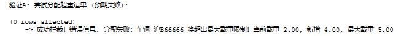

#### 2. 车辆状态自动流转触发器

**设计意图：**
这两个触发器用于实现车辆状态的自动化管理：

* 当一辆运输中的车完成了其所有运单，状态应自动变回“空闲”
* 当一辆处于“异常”状态的车被修复后，状态也应自动恢复。

**代码实现：**

```sql
-- 基于运单完成
create trigger trg_auto_update_truck_status_on_order on [order] after update as
begin
    if update(status) and exists (select * from inserted where status = '已完成')
    begin
        declare @truck_plate nvarchar(20) = (select truck_plate from inserted);
        if @truck_plate is not null and not exists (select 1 from [order] where truck_plate = @truck_plate and status = '运输中')
        begin
            update truck set current_status = '空闲' where plate_number = @truck_plate and current_status = '运输中';
        end
    end
end;
go
-- 基于异常处理
create trigger trg_auto_update_truck_status_on_exception on exception_record after update as
begin
    if update(handle_status) and exists (select * from inserted where handle_status = '已处理')
    begin
        update truck set current_status = '空闲' 
        where plate_number = (select truck_plate from inserted) and current_status = '异常';
    end
end;
```

**功能测试与截图：**

* **运单完成测试：** 我们让车辆 `沪B66666` 完成其唯一的运单。

  * **测试代码：**

    ```sql
    -- 准备
    UPDATE truck SET current_status = '运输中' WHERE plate_number = '沪B66666';
    INSERT INTO [order] (order_id, truck_plate, status, ...) VALUES ('VALIDATION-STATUS-1', '沪B66666', '运输中', ...);
    -- 验证
    UPDATE [order] SET status = '已完成' WHERE order_id = 'VALIDATION-STATUS-1';
    SELECT plate_number, current_status FROM truck WHERE plate_number = '沪B66666';
    ```

  * **测试结果：** 车辆状态自动从“运输中”变为“空闲”。

  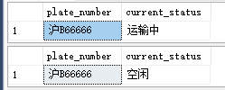

* **异常处理测试：** 我们将车辆 `沪B66666` 设为“异常”，然后将其对应的异常记录更新为“已处理”。

  * **测试代码：**

    ```sql
    -- 准备
    UPDATE truck SET current_status = '异常' WHERE plate_number = '沪B66666';
    INSERT INTO exception_record (truck_plate, ...) VALUES ('沪B66666', ...);
    DECLARE @ex_id INT = SCOPE_IDENTITY();
    -- 验证
    UPDATE exception_record SET handle_status = '已处理' WHERE record_id = @ex_id;
    SELECT plate_number, current_status FROM truck WHERE plate_number = '沪B66666';
    ```

  * **测试结果：** 车辆状态自动从“异常”变为“空闲”。

  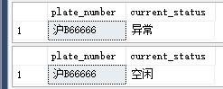

#### 3. 审计日志触发器

**设计意图：**
当司机的驾照等级或异常记录的处理状态等关键信息被修改时，自动将变更前后的信息存入 `history_log` 表中，以供审计。

**代码实现：**

```sql
-- 司机驾照变更
create trigger trg_audit_driver_license on driver after update as
begin
    if update(license_level)
    begin
        insert into history_log (target_id, old_value, new_value, operation_type)
        select d.driver_id, '驾照等级: ' + d.license_level, '驾照等级: ' + i.license_level, '修改司机驾照等级'
        from deleted d join inserted i on d.driver_id = i.driver_id
        where isnull(d.license_level, '') <> isnull(i.license_level, '');
    end
end;
go
-- 异常记录处理
create trigger trg_audit_exception_handle on exception_record after update as
begin
    if update(handle_status)
    begin
        insert into history_log (target_id, old_value, new_value, operation_type)
        select cast(d.record_id as nvarchar(50)), '处理状态: ' + d.handle_status, '处理状态: ' + i.handle_status, '处理异常记录'
        from deleted d join inserted i on d.record_id = i.record_id
        where d.handle_status <> i.handle_status and i.handle_status = '已处理';
    end
end;
```

**功能测试与截图：**
我们修改了司机 `D001` 的驾照等级，并处理了一条异常记录，然后查询 `history_log` 表的最新内容。

* **测试代码：**

  ```sql
  UPDATE driver SET license_level = 'A2' WHERE driver_id = 'D001';
  SELECT TOP 1 * FROM history_log ORDER BY log_id DESC;
  ```

* **测试结果：** `history_log` 表中成功生成了对应的日志记录。

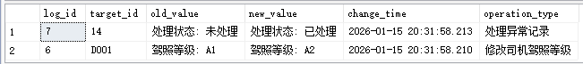

***

### 3.3 存储过程与视图的设计

> 本部分由 林思涵 同学负责

#### 1. 存储过程

**设计意图：**
此存储过程用于封装复杂的月度绩效统计逻辑。前端或报表系统只需调用此过程并传入车队ID、年份和月份，即可获得包含总运单数、异常数和罚款总额的绩效报告，无需关心内部复杂的 `JOIN` 和 `GROUP BY` 计算。

**代码实现：**

```sql
create procedure sp_get_fleet_monthly_performance
    @fleet_id int, @year int, @month int
as
begin
    declare @total_orders int, @total_exceptions int, @total_fines decimal(10, 2);

    select @total_orders = count(o.order_id) from [order] o
    join truck t on o.truck_plate = t.plate_number
    where t.fleet_id = @fleet_id and year(o.create_time) = @year and month(o.create_time) = @month;

    select @total_exceptions = count(e.record_id), @total_fines = isnull(sum(e.fine_amount), 0)
    from exception_record e join truck t on e.truck_plate = t.plate_number
    where t.fleet_id = @fleet_id and year(e.occur_time) = @year and month(e.occur_time) = @month;

    select @fleet_id as '车队ID', @total_orders as '总运单数', 
           @total_exceptions as '异常事件总数', @total_fines as '累计罚款金额';
end;
```

**功能测试与截图：**
我们为车队 `101` 在 2025年12月插入了测试数据，并调用了存储过程。

* **测试代码：**

  ```sql
  -- 准备
  INSERT INTO [order] (order_id, create_time, truck_plate, ...) VALUES ('VALIDATION-SP-1', '2025-12-15', '沪A88888', ...);
  INSERT INTO exception_record (occur_time, fine_amount, truck_plate, ...) VALUES ('2025-12-20', 50.00, '沪A88888', ...);
  -- 验证
  EXEC sp_get_fleet_monthly_performance @fleet_id = 101, @year = 2025, @month = 12;
  ```

* **测试结果：** 存储过程返回了正确的统计结果：总运单数1，异常事件数1，累计罚款金额50.00。


#### 2. 视图

**设计意图：**
此视图旨在简化对“本周异常”的查询。用户或应用程序只需 `SELECT * FROM v_weekly_exception_alerts`，即可获得格式化好的警报信息，无需每次都编写复杂的 `JOIN` 和日期函数查询。

**代码实现：**

```sql
create view v_weekly_exception_alerts as
select distinct
    t.plate_number as '车牌号', t.current_status as '车辆状态',
    d.name as '司机姓名', d.phone as '司机电话',
    e.exception_type as '异常类型', e.occur_time as '发生时间'
from exception_record e
join truck t on e.truck_plate = t.plate_number
join driver d on e.driver_id = d.driver_id
where datepart(wk, e.occur_time) = datepart(wk, getdate())
  and year(e.occur_time) = year(getdate());
```

**功能测试与截图：**
我们在数据库中插入一条发生在本周的异常记录，然后查询该视图。

* **测试代码：**

  ```sql
  -- 准备
  INSERT INTO exception_record (occur_time, ...) VALUES (GETDATE(), ...);
  -- 验证
  SELECT * FROM v_weekly_exception_alerts;
  ```

* **测试结果：** 视图成功地筛选并显示了本周发生的异常记录。

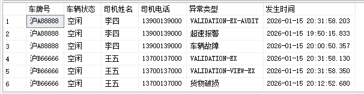

***

### 3.4 索引的设置策略

> 本部分由 林思涵 同学负责

**设计意图：**
对高频查询的 `WHERE` 条件字段建立索引，可以避免全表扫描，极大提升查询性能。我们以 `driver` 表的 `name` 字段为例进行验证。

**代码实现：**

```sql
create index idx_driver_name on driver(name);
```

**功能测试与截图：**

* **索引前：**

  *   **操作：** 在 `driver.name` 列没有索引时，开启“实际的执行计划”并执行 `SELECT * FROM driver WHERE name = '李四'`。
  *   **执行计划：** 显示为 **聚集索引扫描 (Clustered Index Scan)**，意味着数据库为了找到'李四'，不得不遍历整个表。

  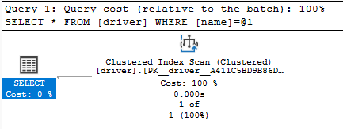

* **索引后：**

  *   **操作：** 创建非聚集索引 `idx_driver_name` 后，再次执行相同的查询。
  *   **执行计划：** 优化器选择了更高效的 **索引查找 (Index Seek)**，直接通过新建的索引定位到数据，成本显著降低。

  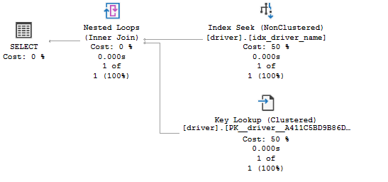

**结论：**
通过对比执行计划，证明为 `name` 字段创建索引能有效优化查询性能。

## **4. 创新实现：SQL设计**

> 王一澄 与 林宏宇 同学共同完成

### **4.1 创新模块一：智能成本测算与派单推荐系统**

> 王一澄完成 林宏宇检查并改进完善

#### 4.1.1 设计思路

* **问题**：我们观察到，在实际的物流工作中，调度员分配运单往往依赖于个人的经验和直觉。

  这种决策方式存在很明显的问题：

  1. 它缺乏一个统一和量化的标准，不同的调度员可能会做出完全不同的选择；
  2. 这很难保证每次都能选出成本最低、效率最高的方案，尤其是在面对复杂的线路和众多车队时。

* **目标**：为了解决这个痛点，我们决定给系统构建一个数据驱动的派单推荐模型。

  这个模型的目标不是取代调度员，而是成为他们的智能助手。

  当有新订单进来时，系统能自动分析，并从**成本、效率、安全性**这三个核心维度出发，综合评估所有可行的车队，最后给出一个有数据支撑的、排名分先后顺序的推荐列表。

  这样一来，调度员的决策就有了科学依据，整个派单环节的效率和成本控制能力都能得到提升。

#### 4.1.2 核心实现

为了实现智能推荐，我们主要做了两件事：首先是建立新的数据表，然后是编写核心的存储过程。

##### **数据模型**

我们的推荐算法不能凭空计算，它需要有数据作为基础。因此，我们设计了两张全新的表来存放这些规则和评分数据：

1. **`path_cost_rule` (路径成本规则表)**：

   这张表是一本运费报价手册。它详细记录了从某个配送中心出发，到全国各个省份的基础运费单价（我们这里定义为元/公里/吨）。

   更进一步，我们还加入了一个 `traffic_factor`（交通系数）字段，用来模拟不同路线的拥堵情况或者路况难度。

   这样，成本估算就不仅仅是简单的距离乘以重量了，而是更加贴近现实。

   ```sql
   CREATE TABLE path_cost_rule (
       rule_id INT IDENTITY(1,1) PRIMARY KEY,
       center_id INT NOT NULL,
       target_province NVARCHAR(50) NOT NULL,
       base_price_per_km_ton DECIMAL(10,2) NOT NULL,
       traffic_factor DECIMAL(4,2) DEFAULT 1.0,
       CONSTRAINT fk_cost_rule_center FOREIGN KEY (center_id) REFERENCES distribution_center(center_id)
   );
   ```

2. **`fleet_efficiency_score` (车队效率评分表)**：

   这张表就是所有车队的综合能力档案。

   我们用几个关键指标来给每个车队画像：`avg_delivery_hours` 记录了它的平均送货时长，代表了速度；`safety_score` 是一个安全分，初始满分100，出了事会被扣分，代表了可靠性；`cost_efficiency_index` 是一个成本效益指数，用来衡量它在控制成本方面的综合表现。

   ```sql
   CREATE TABLE fleet_efficiency_score (
       fleet_id INT PRIMARY KEY,
       avg_delivery_hours DECIMAL(10,1),
       safety_score INT DEFAULT 100,
       cost_efficiency_index DECIMAL(4,2),
       CONSTRAINT fk_score_fleet FOREIGN KEY (fleet_id) REFERENCES fleet(fleet_id)
   );
   ```

##### **算法逻辑**

有了数据基础，我们就把核心的推荐算法写成了一个名为 `proc_recommend_fleets` 的存储过程。

这样做的好处是把复杂的逻辑封装起来，前端调用时只需要传入简单的参数就行。

```sql
CREATE OR ALTER PROCEDURE proc_recommend_fleets
    @destination_province NVARCHAR(50), -- 输入参数：目的地省份
    @weight_ton DECIMAL(10,2)        -- 输入参数：货物重量（吨）
AS
BEGIN
    SET NOCOUNT ON;

    DECLARE @simulated_distance_km INT = 1000;

    -- 核心推荐逻辑
    SELECT TOP 3
        f.fleet_id AS [推荐车队ID],
        f.fleet_name AS [推荐车队名称],
        dc.center_name AS [所属配送中心],
        CAST(p.base_price_per_km_ton * @simulated_distance_km * @weight_ton * p.traffic_factor AS DECIMAL(10, 2)) AS [预估成本(元)],
        s.safety_score AS [安全分],
        s.cost_efficiency_index AS [成本效益指数],
        CAST((s.safety_score * 0.6 + s.cost_efficiency_index * 40) AS DECIMAL(10, 2)) AS [综合推荐指数]
    FROM 
        fleet AS f
    JOIN 
        distribution_center AS dc ON f.center_id = dc.center_id
    JOIN 
        fleet_efficiency_score AS s ON f.fleet_id = s.fleet_id
    JOIN 
        path_cost_rule AS p ON p.center_id = dc.center_id
    WHERE 
        p.target_province = @destination_province
        AND f.fleet_id <> 2 -- 业务规则：排除同城队
    ORDER BY
        [综合推荐指数] DESC;
END
GO
```

我们来详细拆解一下这个存储过程是怎么工作的：
1.  **输入**：它接收 `@destination_province` 和 `@weight_ton` 两个参数，也就是告诉它这单货要去哪和有多重。
2.  **数据联结**：通过一连串的 `JOIN` 操作，它把 `fleet`, `distribution_center`, `fleet_efficiency_score`, `path_cost_rule` 这四张表的数据串联了起来。这样，对于每一个车队，我们都能同时拿到它的基本信息、所属中心、效率评分和到目的地的成本规则。
3.  **计算**：在 `SELECT` 语句中，它做了两个核心计算：
    *   **预估成本**：通过公式 `p.base_price_per_km_ton * @simulated_distance_km * @weight_ton * p.traffic_factor` 算出一个理论上的运输成本。（注：`@simulated_distance_km` 是为了简化模型设置的一个模拟距离）。
    *   **综合推荐指数**：这是算法的灵魂。我们用了一个加权公式 `s.safety_score * 0.6 + s.cost_efficiency_index * 40`。这里的权重（0.6 和 40）是我们根据业务理解设定的，意味着我们认为安全分非常重要，同时成本效益也是一个关键考量。
4.  **筛选和排序**：`WHERE` 子句负责筛选出能到达目标省份的车队，并且根据业务规则排除了同城配送队。最后，也是最关键的一步，`ORDER BY [综合推荐指数] DESC` 会将所有符合条件的车队按照我们算出来的综合分数从高到低排序。
5.  **输出**：`SELECT TOP 3` 意味着它最终只会返回排名前三的最优选择，提供给调度员。

#### 4.1.3 系统联动机制

一个智能系统，它的数据必须能够实时反映业务的变化。

如果我们的车队评分是一成不变的，那这个推荐系统就没什么意义了。

所以，我们设计了两个触发器，连接主业务数据和我们的创新模块，让评分动态起来。

* **`trg_sync_new_fleet_score`：新车队自动建档**

  这个触发器监视着 `fleet` 表。当有新的车队记录被 `INSERT` 进来时，它就会被激活。

  ```sql
  CREATE OR ALTER TRIGGER trg_sync_new_fleet_score
  ON fleet
  AFTER INSERT
  AS
  BEGIN
      SET NOCOUNT ON;
  
      -- 自动为新车队插入默认评分记录
      -- 默认值: 平均送达48小时(假设值), 安全分100(满分), 成本指数1.0(平均水平)
      INSERT INTO fleet_efficiency_score (fleet_id, avg_delivery_hours, safety_score, cost_efficiency_index)
      SELECT 
          fleet_id, 
          48.0,   -- 默认平均送达时间
          100,    -- 默认安全分满分
          1.0     -- 默认成本指数
      FROM inserted;
      
      PRINT N'  -> [联动] 检测到新车队，已自动初始化其效率评分画像。';
  END
  GO
  ```

  它会从 `inserted` 伪表中获取新车队的 `fleet_id`，然后在 `fleet_efficiency_score` 表中为它插入一条默认的评分数据（安全分100，成本指数1.0等）。这个小小的自动化操作，确保了所有新资源都能无缝地被纳入我们的推荐系统，避免了数据遗漏。

  

*   **`trg_sync_exception_penalty`：出事自动扣分**

    这个触发器监视着 `exception_record` 表。

    一旦有新的异常事件被记录下来，比如车辆故障或者货物损坏，它就会启动一个实时的惩罚机制。
    
    ```sql
    CREATE OR ALTER TRIGGER trg_sync_exception_penalty
    ON exception_record
    AFTER INSERT
    AS
    BEGIN
        SET NOCOUNT ON;
    
        DECLARE @truck_plate NVARCHAR(20);
        DECLARE @exception_type NVARCHAR(50);
        DECLARE @fleet_id INT;
        DECLARE @penalty_score INT;
    
        -- 1. 获取异常信息
        SELECT @truck_plate = truck_plate, @exception_type = exception_type 
        FROM inserted;
    
        -- 2. 查找该车辆所属的车队
        SELECT @fleet_id = fleet_id 
        FROM truck 
        WHERE plate_number = @truck_plate;
    
        -- ...
        -- 3. 制定扣分规则 (简单逻辑)
        IF @exception_type LIKE N'%事故%' OR @exception_type LIKE N'%损坏%'
            SET @penalty_score = 20; -- 严重情况扣20分
        ELSE
            SET @penalty_score = 5;  -- 其他情况扣5分
    
        -- 4. 执行扣分操作
        -- 更新评分表，并且确保分数最低不低于 0
        UPDATE fleet_efficiency_score
        SET safety_score = CASE 
            WHEN safety_score - @penalty_score < 0 THEN 0 
            ELSE safety_score - @penalty_score 
        END
        WHERE fleet_id = @fleet_id;
        -- ...
    END
    GO
    ```
    
    逻辑：
    1.  从新插入的异常记录中获取车牌号和异常类型。
    2.  根据车牌号找到这辆车所属的车队ID。
    3.  根据异常类型（比如，`LIKE N'%事故%'`）判断严重程度，并设定一个扣分值 `@penalty_score`。
    4.  `UPDATE` `fleet_efficiency_score` 表，将对应车队的 `safety_score` 减去相应的分数。
    这个触发器让车队的安全分变成了一个动态变化的指标，直接与它的实际安全表现挂钩，使得我们的推荐结果更加公允和及时。

#### 4.1.4 实现效果验证

* **场景描述**：为了验证我们的推荐模型是不是真的管用，我们编写了 `remake.sql` 脚本写入一批设计的测试数据。

  在这个脚本里，我们创建了基础数据，并特意对几个车队的评分进行了手动调整，以模拟真实世界中车队能力的差异。

  ```sql
  -- 正在模拟更新 [Fleet Efficiency Score] (制造数据差异)...
  -- 手动调整一些车队的分数，以便体现推荐算法的差异
  -- 车队1: 优秀
  UPDATE fleet_efficiency_score SET avg_delivery_hours=24.0, safety_score=98, cost_efficiency_index=1.2 WHERE fleet_id=1;
  -- 车队3: 便宜但慢
  UPDATE fleet_efficiency_score SET avg_delivery_hours=72.0, safety_score=95, cost_efficiency_index=1.5 WHERE fleet_id=3;
  -- 车队7: 危险 (山路车队)
  UPDATE fleet_efficiency_score SET avg_delivery_hours=50.0, safety_score=75, cost_efficiency_index=0.9 WHERE fleet_id=7;
  ```

  

*   **操作与结果**：有了这些数据后，验证就变得很简单了。

    我们直接在数据库中调用我们的核心存储过程，模拟一个需要派送到上海的订单：

    `EXEC proc_recommend_fleets @destination_province = N'上海市', @weight_ton = 10;`
    
    执行后，返回的结果集如我们所料：
    1.  **京津冀快运一队（车队1）** 因为其极高的安全分和优秀的成本效益指数，算出来的综合推荐指数最高，排在推荐列表的第一位。
    2.  而 **西南山地突击队（车队7）**，尽管它可能在某些成本项上有优势，但因为它75分的低安全分，在我们的加权算法中被严重拉后腿，导致其综合推荐指数很低，排名非常靠后，甚至可能进不了前三。
    
    这个结果非常直观地证明了我们的推荐模型是有效的。它没有简单地推荐最便宜的车队，而是综合了我们设定的多个评价维度，给出了一个好的建议。


### **4.2 创新模块二：基于时间序列的运力预警与熔断系统**

> 林宏宇完成 王一澄提供思路并检查

#### 4.2.1 设计思路

*   **问题**：我们发现，基础系统只能反映车辆的此时此刻的状态（空闲、运输中等）。

    这种局限在业务高峰期会暴露出来：

    1.  调度员看到的可能是大量空闲车辆，但实际上这些车辆未来几天的运力可能已经被预订一空。
    2.  系统无法预知未来的运力瓶颈，可能会无限制地接收新订单，导致运力超卖，最终造成大量订单延误和客户投诉，甚至业务中断。

*   **目标**：为了解决这个问题，我们希望建立一个能够看见未来的运力管理机制。

    这个机制的核心是引入**时间维度**，实现对未来运力情况的预测和预警。

    当系统预测到未来某个时间点的运力即将饱和时，能够自动触发熔断机制，进行风险控制


#### 4.2.2 核心实现

为了让系统具备预测未来的能力，我们同样设计了新的数据表和功能性的存储过程。

##### **数据模型**

我们创建了两张表，一张用来预测未来的运力，另一张则定义了风险应对的规则：

1. **`fleet_capacity_forecast` (车队运力日历表)**：

   这张表以车队和日期为单位，记录了每一天 `total_capacity`（总运力）、`used_capacity`（已被占用的运力）和 `risk_level`（风险等级）。

   通过查询这张表，管理者可以看到未来一段时间内，每个车队的运力负载情况。

   ```sql
   CREATE TABLE fleet_capacity_forecast (
       id INT IDENTITY(1,1) PRIMARY KEY,
       fleet_id INT,
       forecast_date DATE,                 -- 预测日期
       total_capacity DECIMAL(10,2),       -- 总运力
       used_capacity DECIMAL(10,2) DEFAULT 0, -- 已用运力
       risk_level NVARCHAR(20) DEFAULT N'正常', -- 正常/紧张/爆仓
       FOREIGN KEY (fleet_id) REFERENCES fleet(fleet_id)
   );
   ```

   

2. **`order_circuit_breaker` (接单熔断规则表)**：

   这张表定义了在什么条件下（`threshold_percentage`，如运力占用超过90%），系统应该采取什么样的应对措施（`action_type`，如禁止接单）。

   这样风险控制的逻辑就可以灵活配置，不用硬编码在程序里。

   ```sql
   CREATE TABLE order_circuit_breaker (
       rule_id INT IDENTITY(1,1) PRIMARY KEY,
       threshold_percentage DECIMAL(5,2),  -- 阈值 (如 0.90 表示 90%)
       action_type NVARCHAR(50)            -- 动作 (禁止接单/加价/管理员审批)
   );
   ```

##### **功能逻辑**

基于新的数据表，我们编写了两个存储过程来完成初始化和查询功能：

1. **`usp_InitCapacityCalendar`：初始化运力日历**

   这个存储过程负责填充 `fleet_capacity_forecast` 表。

   它会计算出每个车队当前的总运力（通过 `SUM` 相应 `truck` 表的 `max_load`），然后在运力日历表中为未来指定天数（比如30天）的每一天都创建一条初始记录。

   ```sql
   CREATE OR ALTER PROCEDURE usp_InitCapacityCalendar
       @days INT = 30
   AS
   BEGIN
       SET NOCOUNT ON;
       DECLARE @i INT = 0;
       DECLARE @current_date DATE;
       
       WHILE @i < @days
       BEGIN
           SET @current_date = DATEADD(DAY, @i, GETDATE());
           
           -- 为每个车队插入当天的记录（如果不存在）
           INSERT INTO fleet_capacity_forecast (fleet_id, forecast_date, total_capacity)
           SELECT 
               f.fleet_id, 
               @current_date, 
               ISNULL((SELECT SUM(max_load) FROM truck WHERE fleet_id = f.fleet_id AND current_status != N'报废'), 0)
           FROM fleet f
           WHERE NOT EXISTS (
               SELECT 1 FROM fleet_capacity_forecast 
               WHERE fleet_id = f.fleet_id AND forecast_date = @current_date
           );
           
           SET @i = @i + 1;
       END
   END
   GO
   ```

2.  **`usp_GetCapacityDashboard`：查询运力仪表盘数据**

    这个存储过程是为前端界面准备的数据接口。

    它会查询运力日历表，并计算出每日的运力使用百分比，方便前端以图表或列表的形式，直观地展示未来的运力负载情况。
    
    ```sql
    CREATE OR ALTER PROCEDURE usp_GetCapacityDashboard
    AS
    BEGIN
        SET NOCOUNT ON;
        SELECT 
            f.fleet_name,
            c.forecast_date,
            c.total_capacity,
            c.used_capacity,
            CAST(CASE WHEN c.total_capacity > 0 THEN (c.used_capacity / c.total_capacity * 100) ELSE 0 END AS DECIMAL(5,1)) AS usage_pct,
            c.risk_level
        FROM fleet_capacity_forecast c
        JOIN fleet f ON c.fleet_id = f.fleet_id
        WHERE c.forecast_date >= CAST(GETDATE() AS DATE)
        ORDER BY c.forecast_date, f.fleet_id;
    END
    GO
    ```

#### 4.2.3 系统联动机制

这个模块能与核心业务流程深度结合，实现主动干预。

* **运力预占**：

  当系统中创建一个新的运单时，即使它还未分配给具体车辆，但只要确定了大致的发货日期和所属车队，就应该调用相应的逻辑，在 `fleet_capacity_forecast` 表里更新对应日期的 `used_capacity`。

  这就实现了运力的预先占位，让未来的运力消耗能够被提前看到。

* **风险熔断**：

  在订单创建最关键的一步，系统需要增加一个检查环节：查询 `fleet_capacity_forecast` 表，看目标日期的 `risk_level` 是否已经达到了爆仓等熔断阈值。

  如果达到了，根据 `order_circuit_breaker` 表定义的规则，系统可以直接拒绝本次订单的插入操作，并向前台返回运力已满的提示，从而有效地防止了系统因接收过多订单而崩溃。

#### 4.2.4 实现效果验证

*   **场景描述**：在 `remake.sql` 测试脚本中，我们模拟了这套预警系统的运作流程。首先，我们调用了存储过程来生成了未来一段时间的运力基础数据。

    ```sql
    -- 正在初始化 [Fleet Capacity Forecast] (创新模块二)...
    -- 手动调用初始化过程
    EXEC usp_InitCapacityCalendar 30;
    ```

    然后，为了测试预警功能，我们通过一条 `UPDATE` 语句，手动模拟了一个极端场景：将车队1在明天的已用运力强行设置为总运力的95%，并将其风险等级标为爆仓。

    ```sql
    -- 模拟一些爆仓数据 (让车队1在明天的运力被占满)
    UPDATE fleet_capacity_forecast 
    SET used_capacity = total_capacity * 0.95, risk_level = N'爆仓'
    WHERE fleet_id = 1 AND forecast_date = CAST(DATEADD(DAY, 1, GETDATE()) AS DATE);
    ```

*   **操作与结果**：

    完成数据准备后，我们执行查询存储过程 `EXEC usp_GetCapacityDashboard;`。

    返回的结果集会清晰地展示出未来几天的运力情况。
    
    其中，车队1在明天的`risk_level`字段会明确显示为爆仓，并且其`usage_pct`（使用率百分比）会是95.0。
    
    这个结果证明了我们的系统具备了预测和展示未来运力风险的能力。
    
    调度员或管理者通过这个视图，就能提前一天发现车队1的运力危机，并及时采取措施（如暂停接收发往该区域的新订单，或协调其他车队支援），从而避免了业务风险的发生。

---

### **4.3 创新模块三：全系统实时运行状态监控**

> 林宏宇完成 王一澄提供思路并检查

#### 4.3.1 设计思路

*   **问题**：随着系统功能的增加，我们发现各项关键的运营指标（KPI）分散在不同的业务表中。

    这带来了新的问题：

    1.  信息孤岛：管理者想了解系统的整体运行状态，需要分别查询订单表、车辆表、异常表等，效率低下。
    2.  缺乏宏观视角：很难快速地从全局视角发现业务的瓶颈（如订单积压）、资源的闲置（如车辆利用率低）或风险的累积（如未处理异常增多）。

*   **目标**：为了解决信息分散的问题，我们决定设计一个集中的监控面板。

    这个模块的目标是将系统所有维度的关键数据——从基础的业务运营，到资源负载，再到前两个创新模块产生的智能决策与风险预警信息——全部汇聚到一个统一的数据源中。

    我们希望最终能为管理者提供一个指挥中心，让他们可以一目了然地掌握整个系统的实时情况。

#### 4.3.2 核心实现

这个模块的核心是一个指标池和它的数据刷新引擎。

##### **数据模型**

我们创建了一张 `Monitor_Board` 表。它采用键值对（Key-Value）的结构，专门用来存储我们关心的所有监控指标。

*   `monitor_key` 字段是指标的唯一名称（如 'pending_orders'）。
*   `monitor_value` 字段则存储该指标的当前数值。
*   这种设计的扩展性非常好，未来如果想增加新的监控项，只需在这张表里加一行数据即可，无需修改表结构。

```sql
CREATE TABLE Monitor_Board (
    monitor_key NVARCHAR(50) PRIMARY KEY, -- 指标名称
    monitor_value NVARCHAR(50),           -- 指标值
    last_updated DATETIME DEFAULT GETDATE(),
    description NVARCHAR(100)
);
```

##### **计算逻辑**

所有指标的计算逻辑都被我们集中到了 `usp_RefreshMonitorBoard` 这个存储过程里。

```sql
CREATE OR ALTER PROCEDURE usp_RefreshMonitorBoard
AS
BEGIN
    SET NOCOUNT ON;
    
    DECLARE @val_str NVARCHAR(50);
    DECLARE @val_dec DECIMAL(10,2);
    DECLARE @val_int INT;
    DECLARE @today DATE = CAST(GETDATE() AS DATE);
    DECLARE @tomorrow DATE = DATEADD(DAY, 1, @today);

    -- 1. 待分配积压单量
    SELECT @val_int = COUNT(*) FROM [order] WHERE status = N'待分配';
    UPDATE Monitor_Board SET monitor_value = CAST(@val_int AS NVARCHAR), last_updated = GETDATE() WHERE monitor_key = 'pending_orders';

    -- 2. 今日新增运单总重
    SELECT @val_dec = ISNULL(SUM(weight), 0) FROM [order] WHERE CAST(create_time AS DATE) = @today;
    UPDATE Monitor_Board SET monitor_value = CAST(@val_dec AS NVARCHAR), last_updated = GETDATE() WHERE monitor_key = 'today_weight';

    -- 4. 车辆利用率
    -- ...
    -- 7. 当前未处理异常数
    -- ...
    
    -- 11. 未来24小时运力紧张度
    DECLARE @total_cap DECIMAL(10,2);
    DECLARE @used_cap DECIMAL(10,2);
    SELECT @total_cap = SUM(total_capacity), @used_cap = SUM(used_capacity) 
    FROM fleet_capacity_forecast WHERE forecast_date = @tomorrow;
    
    IF @total_cap > 0
        UPDATE Monitor_Board SET monitor_value = CAST(CAST((@used_cap * 100.0 / @total_cap) AS DECIMAL(5,1)) AS NVARCHAR) + '%', last_updated = GETDATE() WHERE monitor_key = 'future_pressure';
    ELSE
         UPDATE Monitor_Board SET monitor_value = N'0%', last_updated = GETDATE() WHERE monitor_key = 'future_pressure';

END
GO
```

这个存储过程一旦被调用，就会：
1.  查询 `[order]` 表，统计出待分配积压单量和今日新增运单总重。
2.  查询 `truck` 表，计算出车辆利用率。
3.  查询 `exception_record` 表，统计出当前未处理异常数。
4.  更重要的是，它还会去查询我们前两个创新模块的表，比如从 `fleet_capacity_forecast` 表中计算出未来24小时运力紧张度。
5.  将所有计算出的结果，逐一 `UPDATE` 到 `Monitor_Board` 表中。

#### 4.3.3 系统联动机制

* **数据汇聚点**：

  这个监控模块像一个数据中枢，不仅依赖于 `order`、`truck` 等基础业务表，还直接消费了创新模块一的智能决策结果（如推荐成功率）和创新模块二的未来预测数据（如运力紧张度），形成了一个覆盖业务全貌的数据快照。

* **刷新机制**：

  `usp_RefreshMonitorBoard` 存储过程的设计可以被灵活地调用。

  在实际应用中，可以设置一个数据库定时任务（Job），比如每分钟执行一次，来实现监控数据的准实时刷新。

  也可以在一些关键的业务操作（如新订单生成、异常被处理）完成后，由后端程序主动调用一次，来确保数据的即时更新。

#### 4.3.4 实现效果验证

*   **场景描述**：在 `remake.sql` 测试脚本的最后阶段，我们预先向 `Monitor_Board` 表中插入了所有监控指标的定义（Key），然后执行了核心的刷新操作。

    ```sql
    -- 正在初始化 [Monitor Board Keys]...
    INSERT INTO Monitor_Board (monitor_key, monitor_value, description) VALUES 
    (N'pending_orders', N'0', N'待分配积压单量'),
    -- ... (其他指标)
    (N'future_pressure', N'0%', N'未来24小时运力紧张度');
    GO

    -- 正在刷新 [Monitor Board] (创新模块三)...
    EXEC usp_RefreshMonitorBoard;
    GO
    ```

*   **操作与结果**：当整个 `remake.sql` 脚本执行完毕后，我们只需执行一条简单的查询语句 `SELECT * FROM Monitor_Board;`，就可以看到整个系统的体检报告。

    查询结果清晰地展示出：
    1.  `pending_orders` 的值是 `3`，这与我们在脚本中插入的3条待分配状态的订单数量完全一致。
    2.  `unhandled_exceptions` 的值是 `1`，对应那条我们插入的货物损坏且状态为未处理的异常记录。
    3.  `circuit_breaker_status` 的值会因为我们手动模拟的爆仓场景而被更新为 `1`。
    4.  `future_pressure` 的值也会根据明天运力的预占情况，被计算出一个具体的百分比。

## **5. 系统实现与测试**

### 5.1 系统实现与测试概述

本系统采用 **Django** 架构，实现了从底层数据库约束到上层 Web 应用的全链路贯通。在实现过程中，我们严格遵循“数据库驱动开发”的原则，将大量的核心业务逻辑（如成本计算、运力熔断、状态流转）下沉至数据库层，利用 SQL Server 的 **触发器 (Trigger)** 和 **存储过程 (Stored Procedure)** 实现，而 Web 层主要负责数据的可视化展示与用户交互指令的传递。

测试环节分为两个阶段：
-  **数据库单元测试**：使用 SQL 脚本直接对各个表、视图、存储过程进行边界值与逻辑测试（见第3章测试截图）。
-  **系统集成测试**：通过 Web 界面进行全流程操作，验证前端页面能否正确触发数据库的完整性约束及业务逻辑。

### 5.2 开发环境说明

#### 5.2.1 项目结构
```
车队管理系统
├── DatabaseWeb
│   ├── __init__.py
│   ├── __pycache__
│   │   ├── __init__.cpython-312.pyc
│   │   └── settings.cpython-312.pyc
│   ├── asgi.py
│   ├── settings.py
│   ├── urls.py
│   └── wsgi.py
├── app
│   ├── __init__.py
│   ├── admin.py
│   ├── apps.py
│   ├── migrations
│   │   └── __init__.py
│   ├── static
│   │   |── css
│   │   |── js
│   │   |── images
│   │   └── plugins
│   ├── templates
│   ├── models.py
│   ├── tests.py
│   └── views.py
└── manage.py
```
#### 5.2.2 技术选型

为了保证系统的稳定运行与高效开发，本项目采用了以下技术栈：

*   **操作系统**：macOS / Windows 11
*   **数据库**：Microsoft SQL Server
*   **数据库管理工具**：SQL Server Management Studio (SSMS)
*   **后端开发语言**：Python 3.10
*   **Web 框架**：Django 4.2 LTS
*   **数据库驱动**：`mssql-django` (基于 ODBC Driver 18 for SQL Server)
*   **前端技术**：HTML5, CSS3, JavaScript (ES6+), ECharts (用于监控大屏可视化)
*   **版本控制**：Git

### 5.3 关键功能截图（特别是触发器生效拦截错误或自动更新数据的截图）

#### 5.3.1 主页面

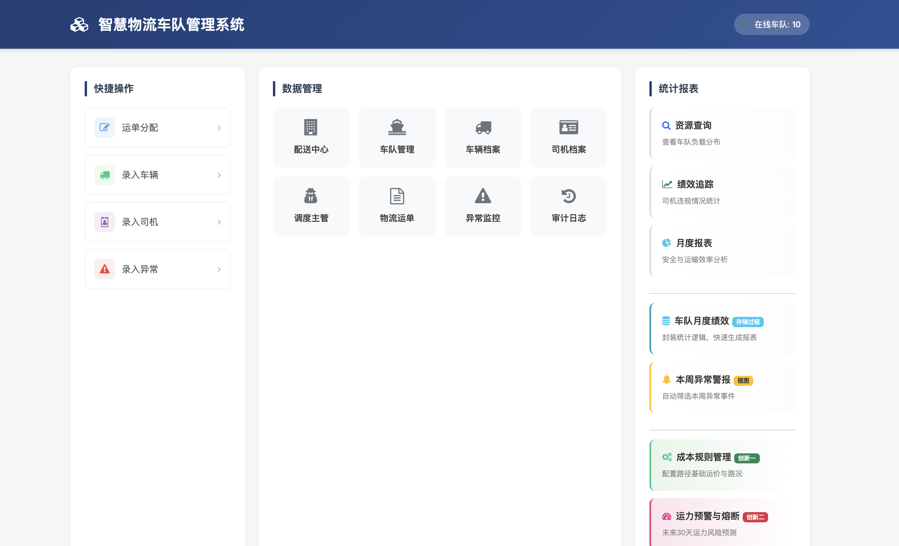

#### 5.3.2 管理页面
> 这里以运单管理做展示，其他同理
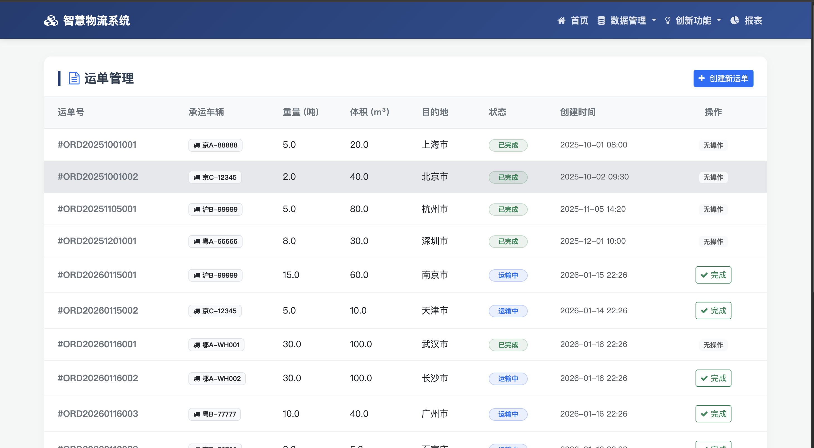

#### 5.3.3 录入信息


#### 5.3.4 资源查询

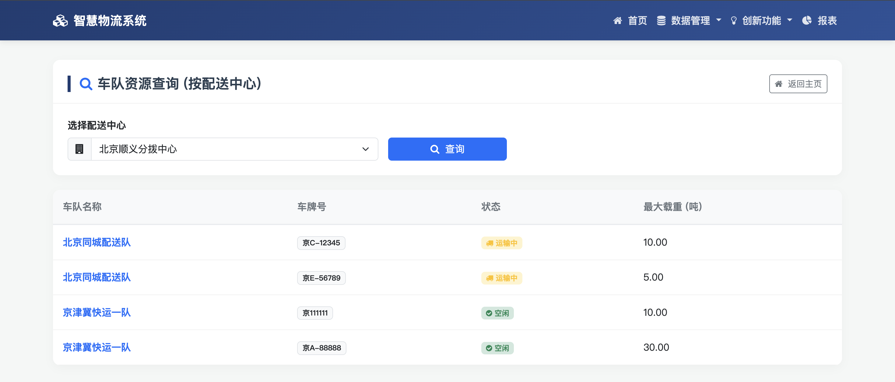

#### 5.3.5.1 触发器功能


#### 5.3.5.2 触发器功能
- 完成订单前，车辆为"运输中"状态
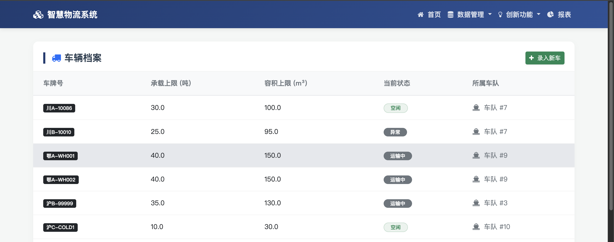

- 完成订单
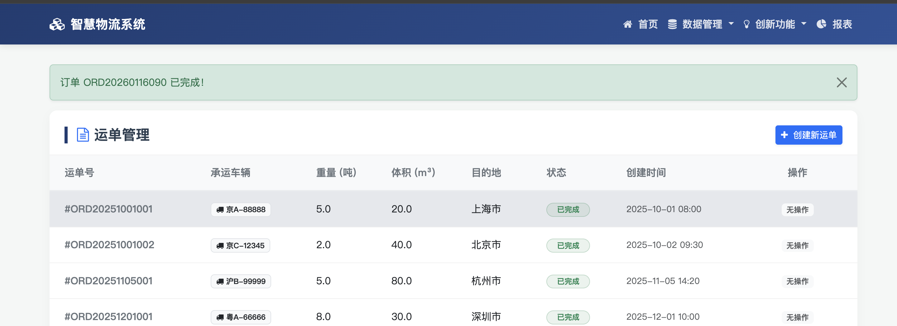

- 完成订单后，车辆变为"空闲"状态
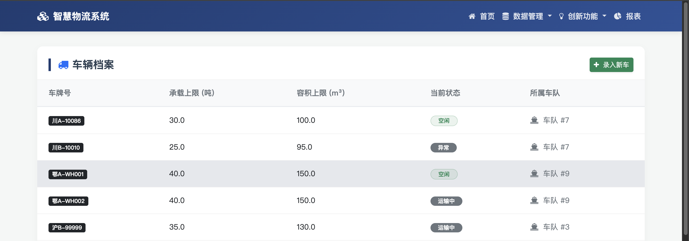


#### 5.3.6 存储过程功能

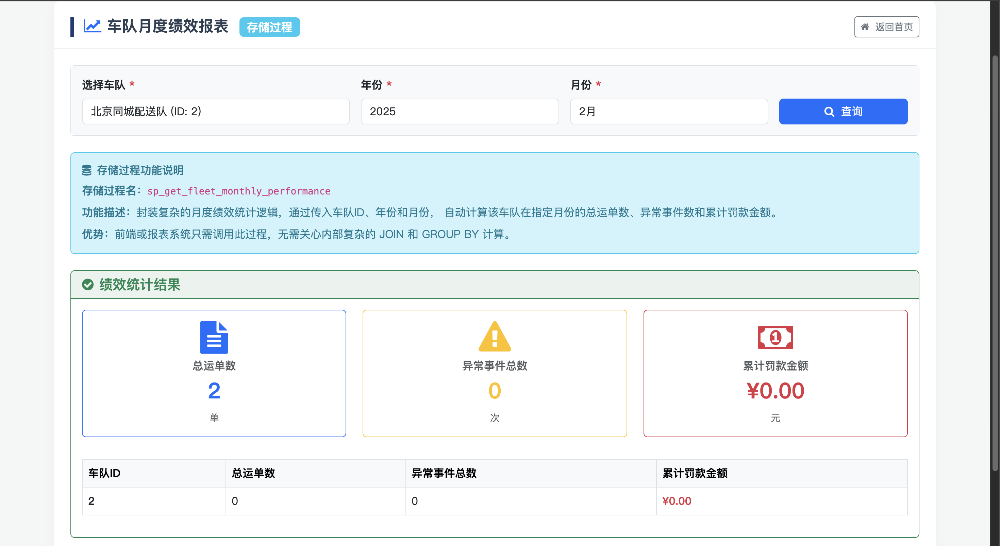


#### 5.3.7 视图功能

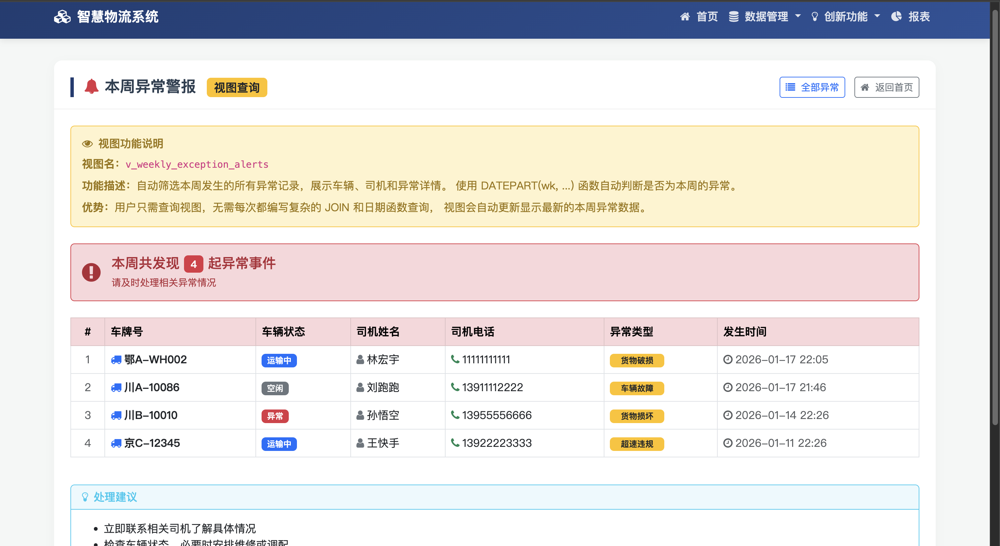

#### 5.3.8 创新功能-成本规则管理
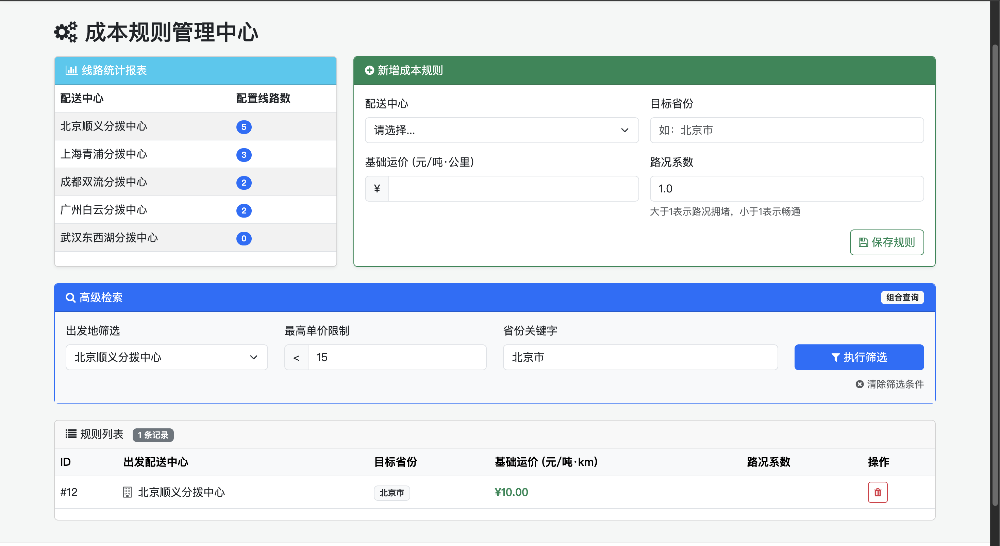

#### 5.3.9 创新功能-运力预警管理

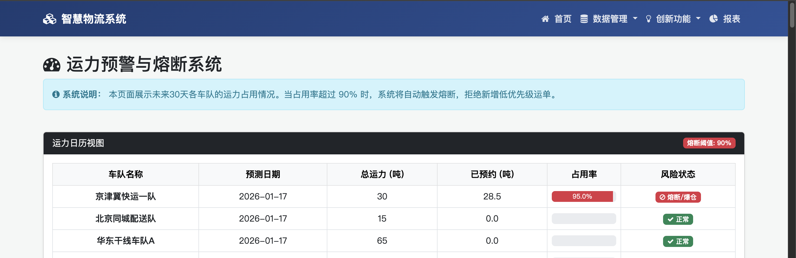

#### 5.3.10 创新功能-系统监控面板

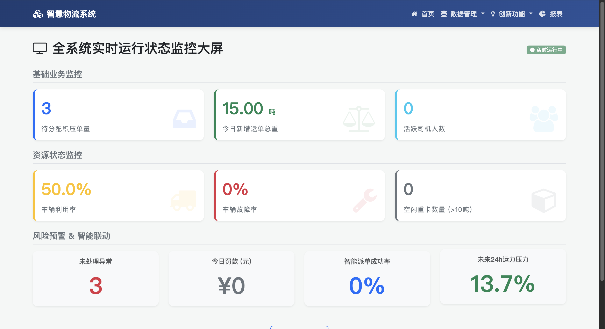

### 5.4 前端技术选型与关键代码

为了构建一个现代化、响应式且交互友好的用户界面，本项目在前端技术选型上并未采用前后端分离的重型框架（如 Vue/React），而是选择了与 Django 结合更为紧密的 **Django Template + Bootstrap 5** 方案。这种选择既降低了开发复杂度，又能快速实现高质量的 UI 效果。

**1. 技术栈一览**：
*   **布局与组件库**：**Bootstrap 5.3**。利用其强大的 Grid 系统实现响应式布局，使用 Card、Badge、Modal 等组件快速构建管理界面。
*   **数据可视化**：**Apache ECharts**。用于实现创新模块中的监控大屏（仪表盘、折线图等）。
*   **图标库**：**Font Awesome 4.7**。提供丰富的语义化图标，增强界面的可读性。
*   **交互逻辑**：**jQuery + 原生 JavaScript**。处理 DOM 操作、AJAX 请求及图表初始化。

**2. 关键代码解析：实时监控大屏的实现**

创新模块三（监控大屏）是前端展示的重头戏。我们通过卡片式布局展示 KPI，并用 CSS 动画增强视觉提醒。

**HTML 结构 (Templates)**：
采用了 Django 的模板继承机制 (``)，确保了导航栏和页脚的统一。

```html
<!-- app/templates/innovation_monitor.html -->



<div class="monitor-container">
    <!-- 头部标题与实时状态 -->
    <div class="d-flex justify-content-between align-items-center mb-4">
        <h2><i class="fa fa-television"></i> 全系统实时运行状态监控大屏</h2>
        <span class="badge bg-success refresh-badge"><i class="fa fa-circle"></i> 实时运行中</span>
    </div>

    <!-- 核心指标卡片区域 (利用 Bootstrap Grid) -->
    <div class="row g-4 mb-4">
        <!-- 待分配积压单量 -->
        <div class="col-md-4">
            <div class="card monitor-card h-100 shadow-sm border-start border-5 border-primary">
                <div class="card-body">
                    <!-- 使用 Django 模板变量渲染后端传来的数据 -->
                    <div class="monitor-val text-primary">{{ monitor.pending_orders }}</div>
                    <div class="monitor-label">待分配积压单量</div>
                    <i class="fa fa-inbox monitor-icon text-primary"></i>
                </div>
            </div>
        </div>
        
        <!-- 车辆利用率 -->
        <div class="col-md-4">
            <div class="card monitor-card h-100 shadow-sm border-start border-5 border-warning">
                <div class="card-body">
                    <div class="monitor-val text-warning">{{ monitor.truck_usage_rate }}</div>
                    <div class="monitor-label">车辆利用率</div>
                </div>
            </div>
        </div>
    </div>
</div>

```

**后端数据交互 (Views & DB Operations)**：
后端并不只是简单地传递模型对象，而是通过 `DatabaseOperations` 类直接调用数据库的存储过程 `usp_RefreshMonitorBoard`，获取最新计算结果，保证了大屏数据的实时性和准确性。

```python
# app/views.py
def innovation_monitor(request):
    """创新模块三：实时监控"""
    monitor_data = {}
    try:
        # 使用自定义的数据库操作上下文管理器
        with DatabaseOperations() as db:
            # 内部调用的是: SELECT * FROM Monitor_Board
            monitor_data = db.get_monitor_board()
    except Exception as e:
        messages.error(request, f"加载监控数据失败: {e}")
        
    return render(request, 'innovation_monitor.html', {'monitor': monitor_data})
```

这种设计模式的优势在于：前端依然保持轻量级，只负责展示；复杂的数据聚合运算完全由数据库层（存储过程）承担，后端 Python 层作为胶水代码进行连接，充分发挥了各类技术的特长。


### 5.5 遇到的一处具体技术难点及解决方案

在实现创新模块时我们遇到了一个技术难点：**如何高效地维护系统监控大屏，以确保其数据的准确性和实时性**。

为了保证监控数据的实时性和计算逻辑的一致性，前端并不直接进行复杂的统计，而是直接调用后端封装好的接口，该接口底层执行了 `usp_RefreshMonitorBoard` 存储过程。

```python
from django.db import connection
from django.shortcuts import render

def monitor_dashboard_view(request):
    """
    监控大屏视图函数
    """
    # 1. 刷新监控数据 (调用存储过程)
    with connection.cursor() as cursor:
        cursor.execute("EXEC usp_RefreshMonitorBoard")
    
    # 2. 从 Monitor_Board 表中拉取最新指标 (Key-Value 模式)
    dashboard_data = {}
    with connection.cursor() as cursor:
        # 使用原生 SQL 查询监控表
        cursor.execute("SELECT monitor_key, monitor_value, description FROM Monitor_Board")
        rows = cursor.fetchall()
        
        for row in rows:
            key, value, desc = row
            dashboard_data[key] = {
                'value': value,
                'desc': desc
            }

    # 3. 渲染模板
    return render(request, 'monitor/dashboard.html', {
        'data': dashboard_data
    })
```

**关键前端实现：基于 ECharts 的数据渲染**

```javascript
// 示例：渲染运力压力仪表盘
var chartDom = document.getElementById('gauge-chart');
var myChart = echarts.init(chartDom);
var option = {
  series: [
    {
      type: 'gauge',
      detail: { formatter: '{value}%' },
      // data.future_pressure.value 来自后端查询 Monitor_Board 的结果
      data: [{ value: {{ data.future_pressure.value|visit_monitor_value }} }] 
    }
  ]
};
myChart.setOption(option);
```

## 6. 总结

### 6.1 课程设计心得

本次课程设计是一次完整的、从理论到实践的数据库应用开发历程。通过这次项目，我深刻体会到数据库系统远不止是简单的“存数据”和“写SQL”。

首先，在**设计阶段**，我认识到规范化理论（如3NF）并非纸上谈兵。E-R 图和关系模式，能够从源头上避免未来开发中可能遇到的无数“坑”。

其次，在**实现阶段**，我真正掌握了高级数据库对象的威力：

* **触发器**让数据库具备了“主动”响应业务变化的能力，实现了载重校验、状态流转等自动化逻辑，将业务规则固化在了数据层，比在应用层做检查更可靠。
* **存储过程**则像一个个黑盒工具，将复杂的统计逻辑封装起来，极大地简化了前端的调用。
* **索引**大大提高了查询效率，是一个很大的优化。

最后，在**创新模块**的设计中，我们学会了如何展示数据，服务于业务。通过构建推荐模型、运力预测和监控面板，我们将静态的数据转化为了能够辅助决策、预警风险的动态“情报”。

### 6.2 对数据库效率优化的思考

本次课程设计也引发了我对数据库效率优化的深入思考，主要集中在以下几点：

1.  **索引的权衡**：实验中我们通过为 `driver.name` 创建索引，直观地看到了执行计划从“全表扫描”优化为“索引查找”带来的巨大性能提升。

2.  **查询语句的优化**：在编写存储过程和视图时，我注意到 `JOIN` 的顺序、`WHERE` 条件的写法都可能影响查询效率。应尽量让条件能够利用到索引（避免在列上使用函数），并且在多表连接时，先用条件筛选掉大部分数据，再进行连接，可以显著减少中间结果集的大小。

3.  **数据库对象的妙用**：
    *   **物化视图**：对于像“监控面板”或复杂报表这类计算量大、但允许有一定数据延迟的场景，可以考虑使用物化视图。它将查询结果物理存储起来，查询时无需重新计算，能极大提升读取性能，代价是需要定期刷新。
    *   **存储过程 vs. 应用层逻辑**：对于复杂的、纯数据密集型的计算（如本次的绩效统计），将其封装在存储过程中，可以减少网络I/O。这样通常比在应用层（如Python/Java）拉取大量数据再进行计算要高效得多。