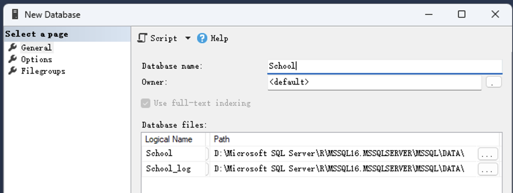
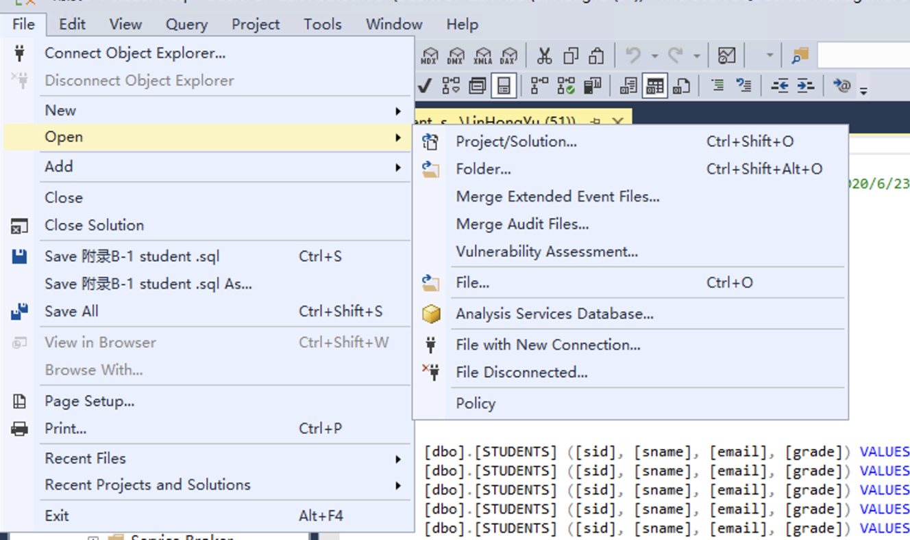
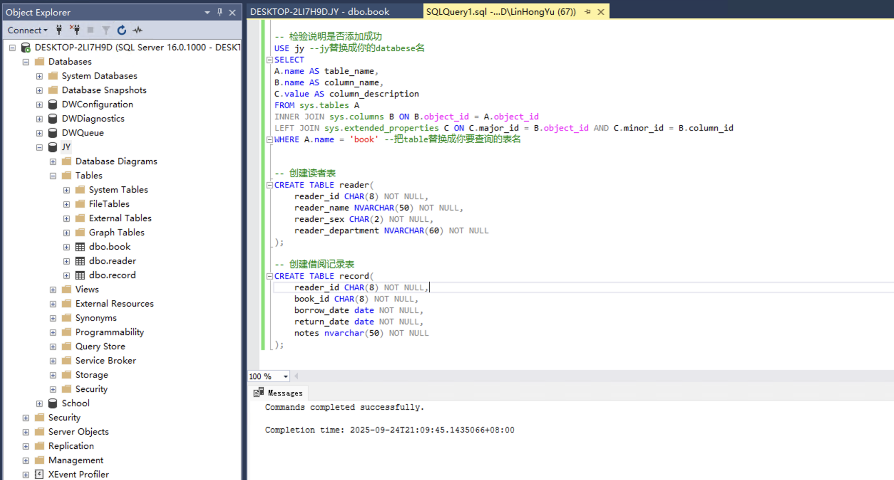
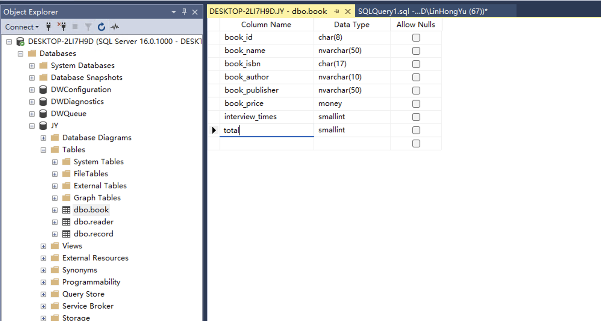

<div align="center">
    

  ---
  **实验名称：** 数据库系统实验     
  **学号：** 23320093  
  **姓名：** 林宏宇  
  **专业：** 计算机科学与技术   
  **班级：** 计科1班  
  **指导教师：** 赖韩江     
  **实验日期：** 2025年9月24日  
  
</div>

---

# 数据库系统实验报告

## 🎯 实验目标
- 掌握数据库的创建与管理
- 熟练使用 SQL Server Management Studio (SSMS)
- 学习表结构设计与修改操作

## 📋 实验内容

### 第一部分：数据库创建与导入

#### 1.1 导入 School 数据库


**操作步骤：**
1. 打开 SSMS，连接到数据库服务器
2. 右键"数据库" → 新建数据库
3. 输入数据库名称"School"
4. 导入相关数据文件

#### 1.2 创建图书借阅数据库 JY

**操作步骤同上**

---

### 第二部分：表结构设计

#### 2.1 创建图书表 (book)

**表结构设计：**

| 列名 | 说明 | 数据类型 | 约束条件 |
|------|------|----------|----------|
| book_id | 图书编号 | char(8) | NOT NULL |
| book_name | 书名 | nvarchar(50) | NOT NULL |
| book_isbn | 图书ISBN号 | char(17) | NOT NULL |
| book_author | 作者 | nvarchar(10) | NOT NULL |
| book_publisher | 出版社 | nvarchar(50) | NOT NULL |
| book_price | 价格 | money | NOT NULL |
| interview_times | 借阅次数 | smallint | NOT NULL |

**创建表 SQL：**
```sql
CREATE TABLE book (
    book_id CHAR(8) NOT NULL,
    book_name NVARCHAR(50) NOT NULL,
    book_isbn CHAR(17) NOT NULL,
    book_author NVARCHAR(10) NOT NULL,
    book_publisher NVARCHAR(50) NOT NULL,
    book_price MONEY NOT NULL,
    interview_times SMALLINT NOT NULL
);
```

**添加列说明：**
```sql
-- 为每列添加说明
EXEC sp_addextendedproperty 
    @name = N'MS_Description', @value = N'图书编号', 
    @level0type = N'SCHEMA', @level0name = 'dbo', 
    @level1type = N'TABLE', @level1name = 'book', 
    @level2type = N'COLUMN', @level2name = 'book_id';

-- ... 其他列的说明添加
```

#### 2.2 创建读者表 (reader)

**表结构设计：**

| 列名 | 说明 | 数据类型 | 约束条件 |
|------|------|----------|----------|
| reader_id | 读者编号 | char(8) | NOT NULL |
| reader_name | 姓名 | nvarchar(50) | NOT NULL |
| reader_sex | 性别 | char(2) | NOT NULL |
| reader_department | 院系 | nvarchar(60) | NOT NULL |

**创建表 SQL：**
```sql
CREATE TABLE reader(
    reader_id CHAR(8) NOT NULL,
    reader_name NVARCHAR(50) NOT NULL,
    reader_sex CHAR(2) NOT NULL,
    reader_department NVARCHAR(60) NOT NULL
);
```

#### 2.3 创建借阅记录表 (record)

**表结构设计：**

| 列名 | 说明 | 数据类型 | 约束条件 |
|------|------|----------|----------|
| reader_id | 读者编号 | char(8) | NOT NULL |
| book_id | 图书编号 | char(8) | NOT NULL |
| borrow_date | 借书时间 | date | NOT NULL |
| return_date | 还书时间 | date | NOT NULL |
| notes | 备注 | nvarchar(50) | NOT NULL |

**创建表 SQL：**
```sql
CREATE TABLE record(
    reader_id CHAR(8) NOT NULL,
    book_id CHAR(8) NOT NULL,
    borrow_date DATE NOT NULL,
    return_date DATE NOT NULL,
    notes NVARCHAR(50) NOT NULL
);
```
#### 表格创建结果截图



---

### 第三部分：表结构修改操作

#### 3.1 添加新列
在图书表中添加 `total` 列：
```sql
ALTER TABLE book ADD total SMALLINT NOT NULL DEFAULT 0;
```
添加结果展示：


#### 3.2 修改列数据类型
修改 `interview_times` 列的数据类型：
```sql
ALTER TABLE book ALTER COLUMN interview_times INT NOT NULL;
```

#### 3.3 删除列
删除 `total` 列：
```sql
ALTER TABLE book DROP COLUMN total;
```

---

## 🔍 实验结果验证

**查看表结构及说明：**
```sql
USE JY;
SELECT
    A.name AS table_name,
    B.name AS column_name,
    C.value AS column_description
FROM sys.tables A
INNER JOIN sys.columns B ON B.object_id = A.object_id
LEFT JOIN sys.extended_properties C ON C.major_id = B.object_id AND C.minor_id = B.column_id
WHERE A.name = 'book';
```

---

## 💡 实验总结

1. **数据库创建：** 成功创建了 School 和 JY 两个数据库
2. **表结构设计：** 完成了图书管理系统的三个核心表设计
3. **表结构修改：** 掌握了 ALTER TABLE 的各种用法
4. **问题解决：** 学会了处理约束依赖问题

## 🎯 实验收获

- 熟练掌握了 SSMS 的基本操作
- 理解了数据库表结构设计的重要性
- 学会了为表字段添加说明文档
- 掌握了表结构修改的常见操作

---

<div align="center">
  <small>实验完成时间：2025年9月24日</small>
</div>