<div align="center">
    

<br><br><br>
</div>
<div style="font-size:1.6em; font-weight:normal; line-height:1.6;">
<div style="text-align:center; font-size:2.9em; font-weight:normal; letter-spacing:0.1em;">实验作业报告</div>
<br/>
<br>
<div style="text-align:center; font-size:1.3em; line-height:1.8;">
  <table style="margin: 0 auto; font-size:1.1em;">
  <tr><td align="right">实验：</td><td align="left">数据库系统实验</td></tr>
  <tr><td align="right">学号：</td><td align="left">23320093</td></tr>
  <tr><td align="right">姓名：</td><td align="left">林宏宇</td></tr>
  <tr><td align="right">专业：</td><td align="left">计算机科学与技术</td></tr>
  <tr><td align="right">班级：</td><td align="left">计科1班</td></tr>
  <tr><td align="right">指导教师：</td><td align="left">赖韩江</td></tr>
  <tr><td align="right"style="border-bottom:1px solid #000;">实验日期：</td><td align="left" style="border-bottom:1px solid #000;">2025年12月7日</td></tr>
  </table>
</div>
</div>

<div STYLE="page-break-after: always;"></div>

# 数据库应用开发实验报告

## ✏️ 实验目的

掌握数据库用户界面开发的能力

使用JaveServlet/JSP/Django/Flask或其它Web应用框架，构建一个web界面程序，实现以用户界面的形式对图书借阅数据库系统JY的图书表的增删改查功能。报告要求附上代码文件、设计过程以及功能测试。

> 为了此次实验，已完整地学习了一遍**Django框架**及其底层原理 [github笔记链接]([link](https://github.com/fulL549/Django_Doc))

## 🛠️ 实验环境
- 操作系统：macOS
- 数据库管理系统：SQL Server
- Web应用框架：Django
- 工具：UV、bootstrap、fontawesome、jquery


## ✍️ 项目设计

构建一个基于Django的Web应用程序，实现对图书借阅数据库系统JY的`reader`、`book`、`record`的增删改查功能。

- 主页面可展示统计数据，和三个表格的入口
- 点击各个表格的入口进入对应的表格显示界面
- 各个表格还需要有增删改查的功能

## 📋 实验内容

### 1. 创建Django项目
```bash
uv init
uv sync
source .venv/bin/activate
uv pip install django
django-admin startproject DatabaseWeb
python manage.py startapp app
```

### 2. 项目结构
```
DatabaseWeb
├── DatabaseWeb
│   ├── __init__.py
│   ├── __pycache__
│   │   ├── __init__.cpython-312.pyc
│   │   └── settings.cpython-312.pyc
│   ├── asgi.py
│   ├── settings.py
│   ├── urls.py
│   └── wsgi.py
├── app
│   ├── __init__.py
│   ├── admin.py
│   ├── apps.py
│   ├── migrations
│   │   └── __init__.py
│   ├── static
│   │   |── css
│   │   |── js
│   │   |── images
│   │   └── plugins
│   ├── templates
│   ├── models.py
│   ├── tests.py
│   └── views.py
└── manage.py
```

### 3. 注册app
`settings.py`文件中添加应用`app`到`INSTALLED_APPS`

### 4. 数据库

> 由于Django不支持直接连接SQL Server数据库，我们使用`pymssql`进行自定义实现，详细操作参考`实验8作业`

#### 4.1 创建类模型

在`models.py`文件中创建图书、读者和借阅记录的模型类，以下展示读者模型类`Reader`的定义：

```python

class Reader:
    """读者模型类"""
    
    def __init__(self, reader_id: str = None, reader_name: str = None,
                 reader_sex: str = None, reader_department: str = None):
        self.reader_id = reader_id
        self.reader_name = reader_name
        self.reader_sex = reader_sex
        self.reader_department = reader_department

    @classmethod
    def from_dict(cls, data: Dict[str, Any]) -> 'Reader':
        """从字典创建Reader实例"""
        return cls(
            reader_id=data.get('reader_id'),
            reader_name=data.get('reader_name'),
            reader_sex=data.get('reader_sex'),
            reader_department=data.get('reader_department')
        )

    def to_dict(self) -> Dict[str, Any]:
        """转换为字典"""
        return {
            'reader_id': self.reader_id,
            'reader_name': self.reader_name,
            'reader_sex': self.reader_sex,
            'reader_department': self.reader_department
        }

    def __str__(self):
        return f"{self.reader_id} - {self.reader_name}"

    def __repr__(self):
        return f"Reader(reader_id='{self.reader_id}', reader_name='{self.reader_name}')"
```

#### 4.2 数据库操作类

在`db_operations.py`文件中创建数据库操作类`DatabaseOperations`，用于连接数据库并执行查询，**代替django封装的函数**：

```python
class DatabaseOperations:
    def __init__(self):
        self.conn = None
        self.cursor = None
        self.connect()
    
    def connect(self):
        """建立数据库连接"""
        try:
            self.conn = pymssql.connect(
                server='192.168.3.76', 
                user='lhy', 
                password='123456..', 
                database='JY'
            )
            self.cursor = self.conn.cursor(as_dict=True)  # 使用字典格式返回结果
        except Exception as e:
            print(f"数据库连接失败: {e}")
            raise
    
    def close(self):
        """关闭数据库连接"""
        if self.cursor:
            self.cursor.close()
        if self.conn:
            self.conn.close()
    
    def fetch_all_readers(self) -> List[Reader]:
        """获取所有读者信息"""
        try:
            self.cursor.execute("SELECT reader_id, reader_name, reader_sex, reader_department FROM reader")
            rows = self.cursor.fetchall()
            readers = [Reader.from_dict(row) for row in rows]
            return readers
        except Exception as e:
            print(f"查询读者信息失败: {e}")
            return []
```

### 5. 基础视图创建

在`views.py`中创建基础视图函数

```python
def lobby(request):
    """展示所有读者信息的主页面"""
    try:
        # 使用上下文管理器自动管理数据库连接
        with DatabaseOperations() as db:
            readers = db.fetch_all_readers()
        
        context = {
            'readers': readers,
            'total_count': len(readers)
        }
        return render(request, 'lobby.html', context)
    
    except Exception as e:
        # 处理数据库连接或查询错误
        error_message = f"获取读者信息时发生错误: {str(e)}"
        context = {
            'error_message': error_message,
            'readers': [],
            'total_count': 0
        }
        return render(request, 'lobby.html', context)
```

### 6. 路由配置

在`urls.py`中配置路由

```python
urlpatterns = [
    # path('admin/', admin.site.urls),
    path('lobby/', views.lobby),
]
```
### 7. 运行项目

```bash
uv run manage.py runserver
```
在浏览器[访问](http://127.0.0.1:8000/lobby/)  `http://127.0.0.1:8000/lobby/` 

### 8. 实验截图

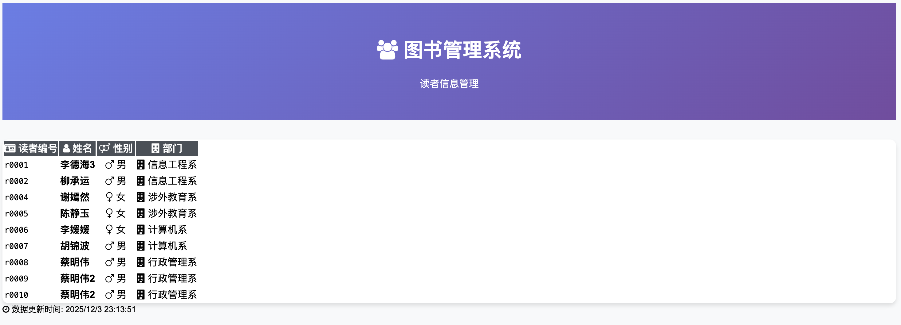
> 以上为一个demo的开发的流程，整体项目开发流程不过多赘述，可参考整体项目代码

## 🖼️ 实验结果展示

运行项目后，浏览器访问`http://127.0.0.1:8000/`可以看到以下页面：
### 主页面

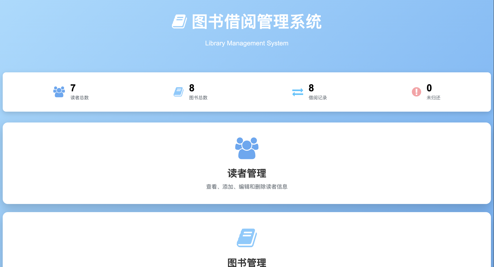
- 主页面展示了系统的**统计数据**，包括读者总数、图书总数和借阅记录总数。
- 提供了进入读者表、图书表和借阅记录表的入口。

### 查看 Reader 表

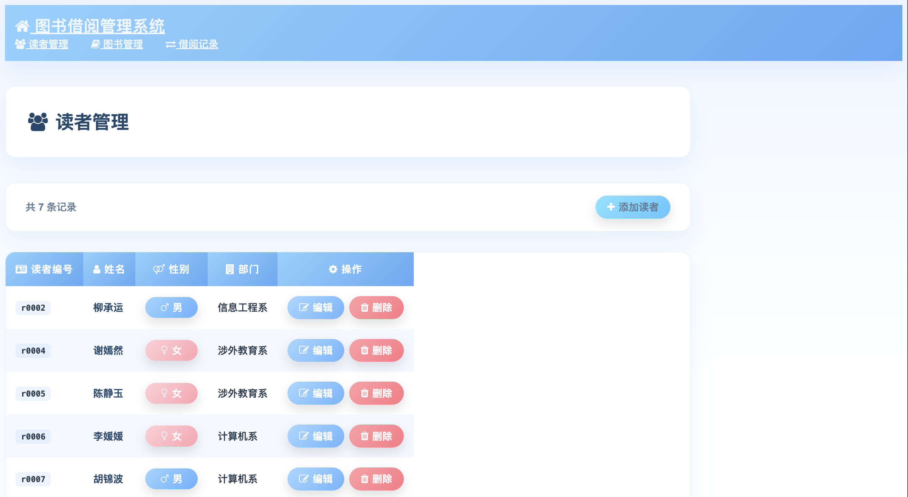

### 查看 Book 表

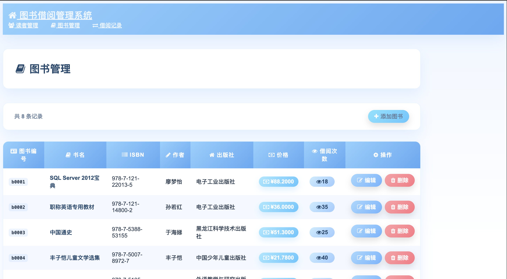

### 查看 Record 表

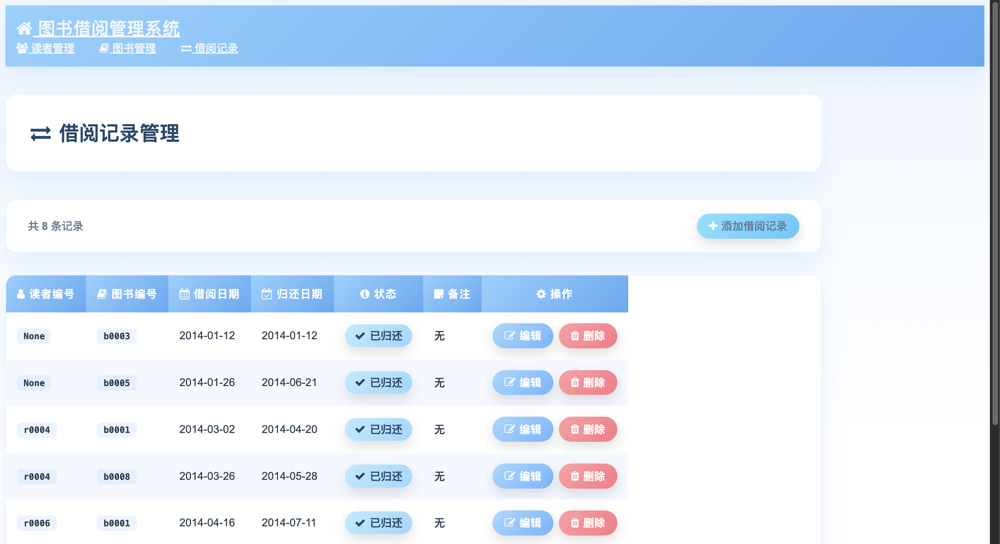

### 增加读者

在Web端增加读者`t0001 林宏宇`：

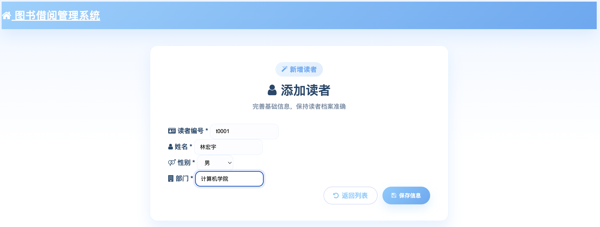

添加后前端显示结果（图中最后一行）的截图如下：

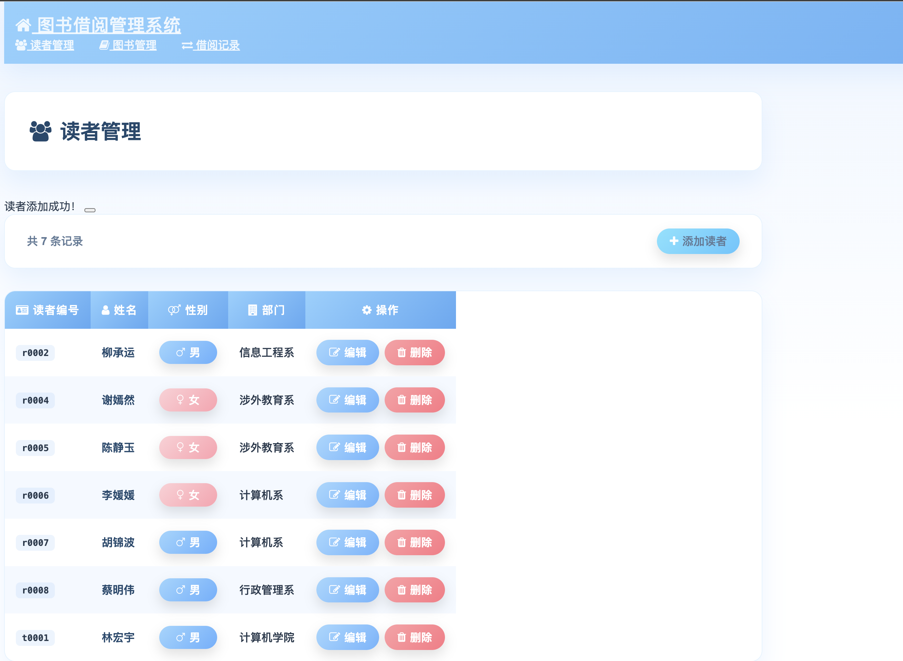

在数据库后端查看增加结果截图如下，证明增加成功：

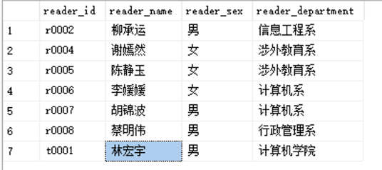

### 删除读者

在Web端删除读者`d0001 林宏宇`（图中第一行）的操作截图如下：

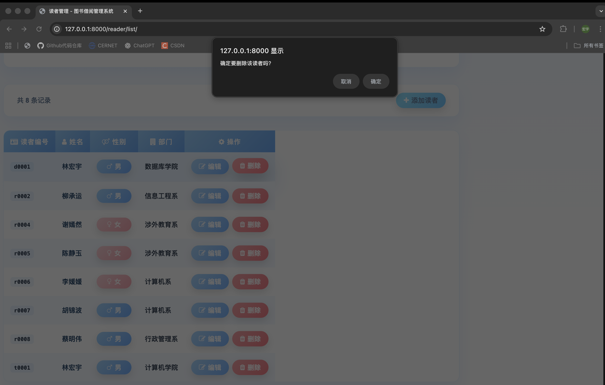

在新的界面可以观察删除结果，证明删除成功：

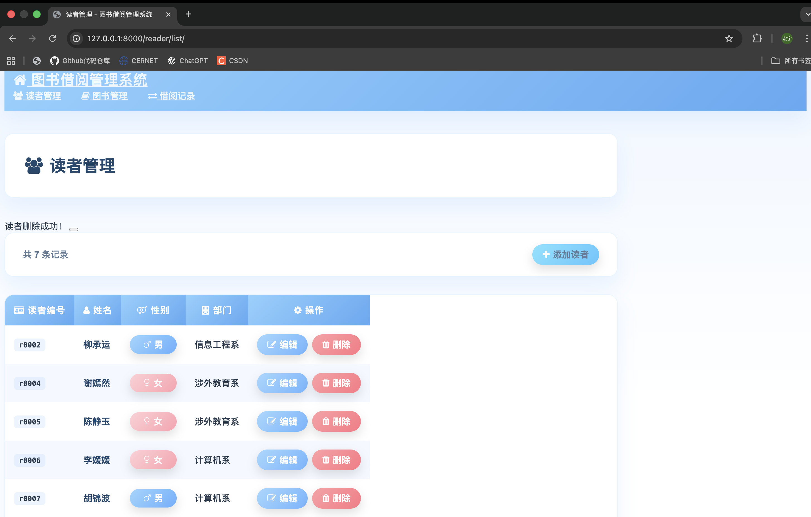

### 修改读者

在Web端修改读者`t0001 林宏宇`的除了编号的数据的操作截图如下：

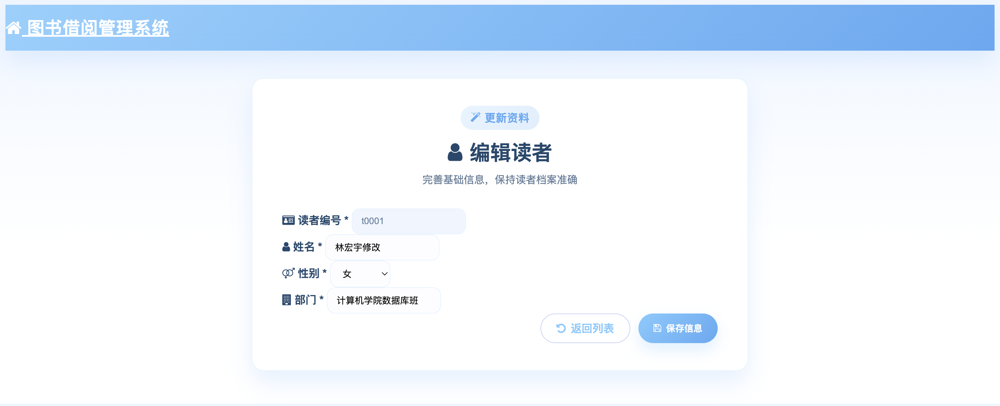

在新的界面可以观察修改结果，证明修改成功：

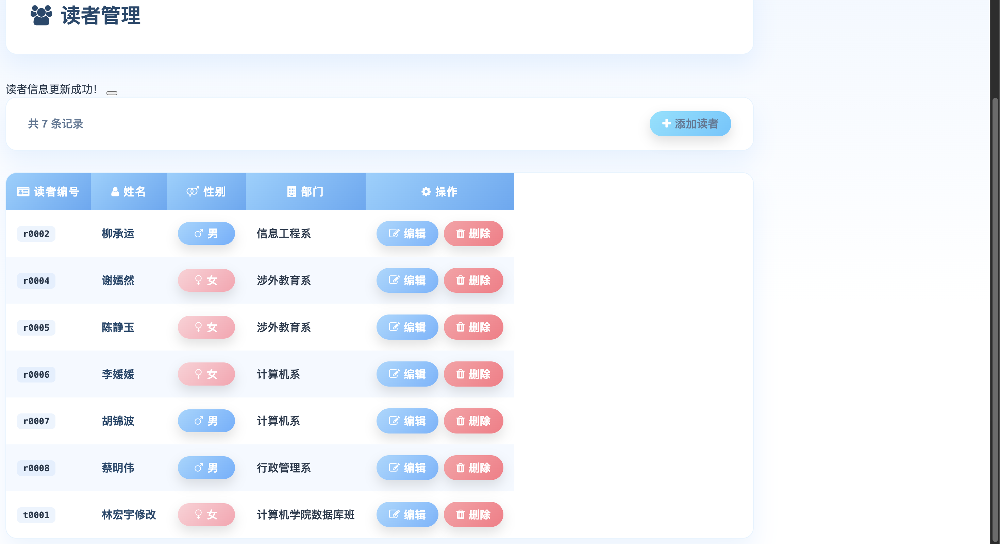

## 💡 实验总结

本次数据库应用开发实验围绕 SQL Server 图书借阅库展开，通过 Django 自定义数据访问层实现了对 reader、book、record 三张表的全流程增删改查，并同步构建了友好的 Web 前端。实验过程的收获主要体现在以下几个方面：

- **掌握 Django 与 pymssql 结合的方法**：未依赖 ORM，而是使用 `pymssql` 自行封装连接、游标及事务管理逻辑，理解了 Web 框架与底层数据库通信的本质流程，也强化了异常处理与资源释放的意识。
- **前后端协同设计能力提升**：围绕列表页和表单页分别完成统计总览、数据表格、表单校验、消息提示等模块，前端样式上统一采用浅蓝配色、渐变按钮与响应式表格，显著改善了用户体验。
- **代码结构与复用意识加强**：通过 `DatabaseOperations` 类将常用的查询与写入操作封装，对应的视图函数保持清晰的职责划分，同时利用 `with` 上下文管理器自动管理连接生命周期，降低了重复代码。
- **调试与部署经验积累**：在开发过程中结合 `uv run manage.py runserver` 快速验证功能，注意到迁移提示、数据库连接异常等常见问题并及时处理，为后续部署上线提供了实践参考。

总体而言，本项目完成了从需求分析、界面设计、后端实现到联调测试的完整闭环，对 Django 框架的运行机制、SQL Server 数据交互以及 Web 端用户体验设计都有了更深入的理解，也为未来扩展更多复杂业务奠定了良好基础。

## 📚 参考资料
- [参考1](https://www.runoob.com/servlet/servlet-database-access.html)
- [参考2](https://www.runoob.com/jsp/jsp-database-access.html)
- [参考3](https://tutorial.helloflask.com/database/)
- [参考4](https://docs.djangoproject.com/zh-hans/5.1/ref/databases/)
- **lab8实验**的`pymssql`操作

## 附件
- DatabaseWeb完整代码文件