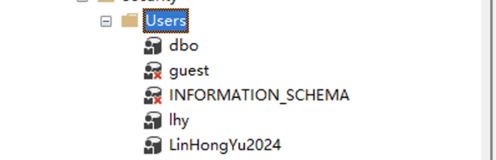
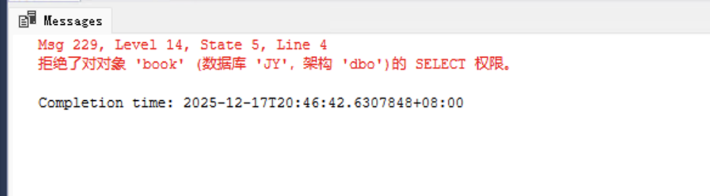
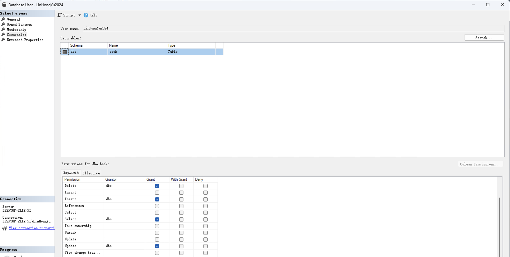
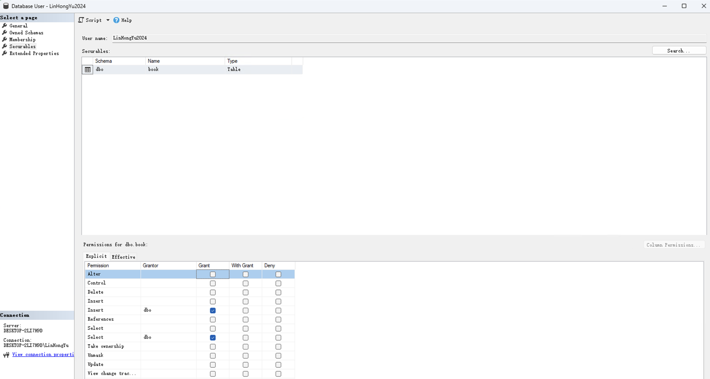
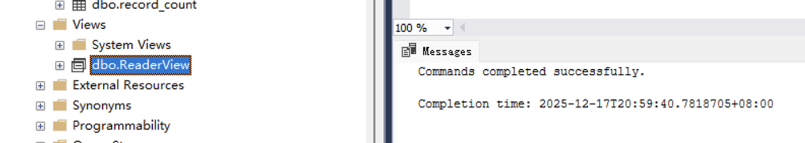
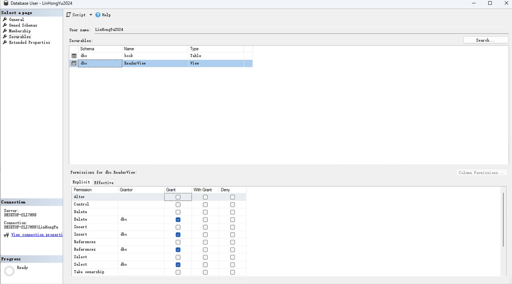
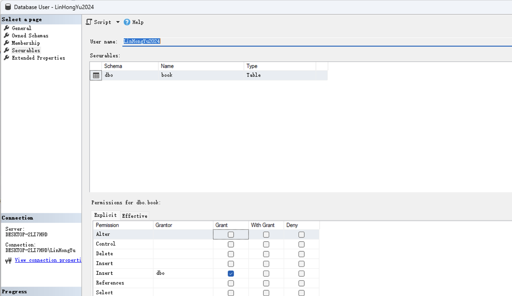
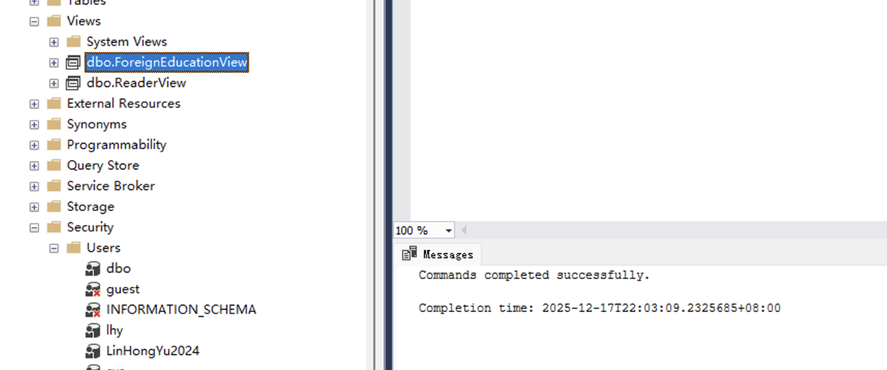
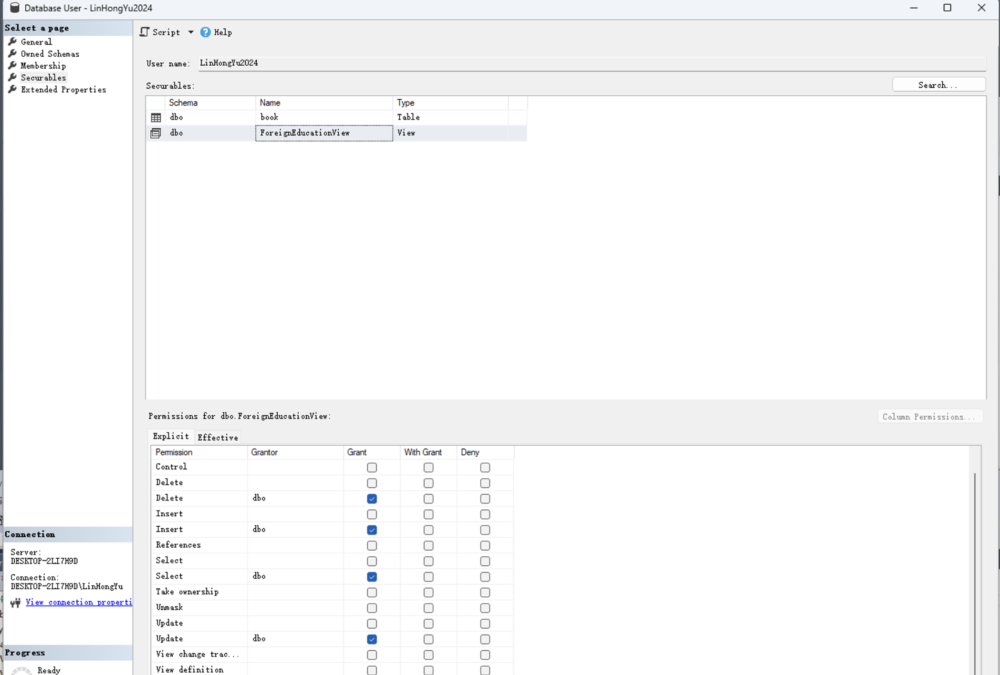

<div align="center">
    

<br><br><br>
</div>
<div style="font-size:1.6em; font-weight:normal; line-height:1.6;">
<div style="text-align:center; font-size:2.9em; font-weight:normal; letter-spacing:0.1em;">实验作业报告</div>
<br/>
<br>
<div style="text-align:center; font-size:1.3em; line-height:1.8;">
  <table style="margin: 0 auto; font-size:1.1em;">
  <tr><td align="right">实验：</td><td align="left">数据库系统实验</td></tr>
  <tr><td align="right">学号：</td><td align="left">23320093</td></tr>
  <tr><td align="right">姓名：</td><td align="left">林宏宇</td></tr>
  <tr><td align="right">专业：</td><td align="left">计算机科学与技术</td></tr>
  <tr><td align="right">班级：</td><td align="left">计科1班</td></tr>
  <tr><td align="right">指导教师：</td><td align="left">赖韩江</td></tr>
  <tr><td align="right"style="border-bottom:1px solid #000;">实验日期：</td><td align="left" style="border-bottom:1px solid #000;">2025年12月17日</td></tr>
  </table>
</div>
</div>

<div STYLE="page-break-after: always;"></div>


# 数据库安全性控制实验报告

## 🔧 实验环境

- 操作系统：Windows 11
- 数据库管理系统：SSMS

## ✏️ 实验目的

掌握数据库安全性控制。

## 📋 实验内容

### 1. 创建 SQL Server 登录 JY 数据库的用户

- 账户: myname2024
- 密码: 123456

#### 语法
```sql
-- 创建登录账户
CREATE LOGIN LinHongYu2024 WITH PASSWORD = '123456'; 
-- 切换到JY数据库
USE JY;
CREATE USER LinHongYu2024 FOR LOGIN LinHongYu2024;
```

#### 结果

可以在SSMS的 “安全性” -> “登录名” 中看到新创建的登录账户LinHongYu2024。



### 2. 使用用户名 LinHongYu2024 登录进系统中，输入 select * from book, 是否可以运行？

#### 语法
```sql
-- 实用JY数据库
USE JY;
-- 使用LinHongYu2024用户登录后查询book表
SELECT * FROM book;
```

#### 结果

拒绝了对对象 'book' (数据库 'JY'，架构 'dbo')的 SELECT 权限。表明该用户没有权限访问book表。



### 3. 将JY数据库book表的操作权限（Select、update、delete、Insert）赋于数据库用户LinHongYu2024

#### 语法
```sql
-- 授予LinHongYu2024用户对book表的操作权限
GRANT SELECT, UPDATE, DELETE, INSERT ON book TO LinHongYu2024;
```

#### 结果

可以在SSMS的“数据库”->“JY”->“安全性”->“用户”->“LinHongYu2024”->“有效权限”中看到对book表的权限。



### 4. 取消LinHongYu2024对book表的更新与删除权限

#### 语法
```sql
-- 撤销LinHongYu2024用户对book表的UPDATE和DELETE权限
REVOKE UPDATE, DELETE ON book FROM LinHongYu2024;
```

#### 结果

可以在SSMS的“数据库”->“JY”->“安全性”->“用户”->“LinHongYu2024”->“有效权限”中看到对book表的UPDATE和DELETE权限已被撤销。



### 5. 创建一个视图，显示reader表中借阅次数>1次的读者信息，并将该视图的SELECT权限授予LinHongYu2024。之后，撤销LinHongYu2024对该视图的所有权限。

#### 语法
```sql
-- 创建视图，显示reader表中借阅次数>1次的读者信息
CREATE VIEW ReaderView AS
SELECT reader.reader_id, reader.reader_name, reader.reader_sex, reader.reader_department
FROM reader
JOIN record ON reader.reader_id = record.reader_id
GROUP BY reader.reader_id, reader.reader_name, reader.reader_sex, reader.reader_department
HAVING COUNT(record.reader_id) > 1;

-- 授予LinHongYu2024用户对ReaderView视图的所有权限(不支持GRANT ALL语法，改为授予增删改查权限)
-- GRANT ALL ON ReaderView TO LinHongYu2024;
GRANT INSERT, UPDATE, DELETE, SELECT ON ReaderView TO LinHongYu2024;

-- 撤销LinHongYu2024用户对ReaderView视图的所有权限
REVOKE INSERT, UPDATE, DELETE, SELECT ON ReaderView FROM LinHongYu2024
```

#### 结果

可以在SSMS的“数据库”->“JY”->“视图”中看到新创建的视图ReaderView。



可以在SSMS的“数据库”->“JY”->“安全性”->“用户”->“LinHongYu2024”中看到对ReaderView视图的SELECT、INSERT、UPDATE、DELETE等权限已被授予。



可以在SSMS的“数据库”->“JY”->“安全性”->“用户”->“LinHongYu2024”中看到对ReaderView视图的所有权限已被撤销，不再显示用户对ReaderView视图的权限。



### 6. 创建一个视图，在reader表中，只能检索“涉外教育系”的读者信息，将该视图的所有权限赋于数据库用户LinHongYu2024

#### 语法
```sql
-- 创建视图，在reader表中，只能检索“涉外教育系”的读者信息
CREATE VIEW ForeignEducationView AS
SELECT *
FROM reader
WHERE reader_department = '涉外教育系';
-- 授予LinHongYu2024用户对ForeignEducationView视图的所有权限(不支持GRANT ALL语法，改为授予增删改查权限)
GRANT INSERT, UPDATE, DELETE, SELECT ON ForeignEducationView TO LinHongYu2024;
```

#### 结果

可以在SSMS的“数据库”->“JY”->“视图”中看到新创建的视图ForeignEducationView。



可以在SSMS的“数据库”->“JY”->“安全性”->“用户”->“LinHongYu2024”中看到对ForeignEducationView视图的所有权限已被授予。



## 💡 实验总结

### 技术总结

本次实验系统地实践了数据库安全性控制的相关技术，包括用户账户的创建、权限的分配与回收、视图的创建及其权限管理等。通过对 SQL Server 登录账户和数据库用户的管理，掌握了如何通过 `CREATE LOGIN`、`CREATE USER`、`GRANT`、`REVOKE` 等语句实现对数据库对象（如表、视图）访问权限的精细控制。实验还涉及了视图的安全性应用，通过为特定用户授予或撤销视图权限，实现了对敏感数据的隔离和访问限制。整个过程中，深刻体会到权限最小化原则和分层授权机制对于保障数据库安全的重要性。

### 心得体会

通过本次实验，我不仅加深了对数据库安全性理论的理解，更在实际操作中体会到权限管理的严谨性和必要性。实验过程中遇到权限不足、权限回收等问题时，能够通过查阅资料和调试 SQL 语句逐步解决，提升了独立分析和解决问题的能力。数据库安全不仅仅是技术问题，更关乎数据资产的保护和系统的稳定运行。今后在实际开发和管理数据库时，会更加注重权限的合理分配和安全策略的制定，确保数据安全和业务合规。

## 📚 参考资料

- 课件资料
- SSMS文档

## 附件

- 无（代码已经在报告中呈现）