<div align="center">
    

<br><br><br>
</div>
<div style="font-size:1.6em; font-weight:normal; line-height:1.6;">
<div style="text-align:center; font-size:2.9em; font-weight:normal; letter-spacing:0.1em;">实验作业报告</div>
<br/>
<br>
<div style="text-align:center; font-size:1.3em; line-height:1.8;">
  <table style="margin: 0 auto; font-size:1.1em;">
  <tr><td align="right">实验：</td><td align="left">数据库系统实验</td></tr>
  <tr><td align="right">学号：</td><td align="left">23320093</td></tr>
  <tr><td align="right">姓名：</td><td align="left">林宏宇</td></tr>
  <tr><td align="right">专业：</td><td align="left">计算机科学与技术</td></tr>
  <tr><td align="right">班级：</td><td align="left">计科1班</td></tr>
  <tr><td align="right">指导教师：</td><td align="left">赖韩江</td></tr>
  <tr><td align="right"style="border-bottom:1px solid #000;">实验日期：</td><td align="left" style="border-bottom:1px solid #000;">2025年12月22日</td></tr>
  </table>
</div>
</div>

<div STYLE="page-break-after: always;"></div>


# 数据库并发事务实验报告

## 🔧 实验环境

- 操作系统：Windows 11
- 数据库管理系统：SSMS（SQL Server Management Studio）

## ✏️ 实验目的

熟悉数据库并发事务的相关操作实验。

## 📋 实验内容
### 1. 创建一个事务

在record表中插入一条新记录，同时修改book表中的interview_times为 interview_times+1，以保证数据的一致性。（参考实验教材4.1）

#### 语法
```sql
BEGIN TRAN;
INSERT INTO record (reader_id, book_id, borrow_date, return_date)
VALUES ('r0001', 'b0001', '2025-12-19', '2025-12-25');
UPDATE book
SET interviews_times = interviews_times + 1
WHERE book_id = 'b0001';
COMMIT TRAN;
```

#### 结果

成功插入新记录并更新了book表中的interview_times字段。

更新前：

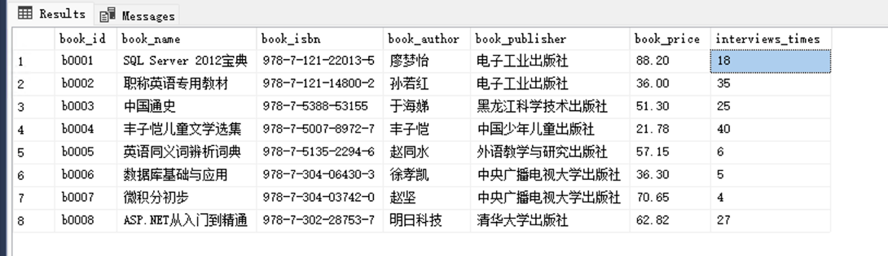

更新后：

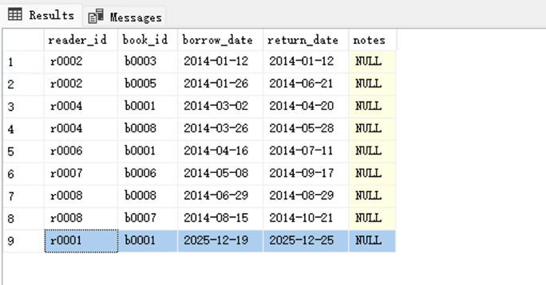

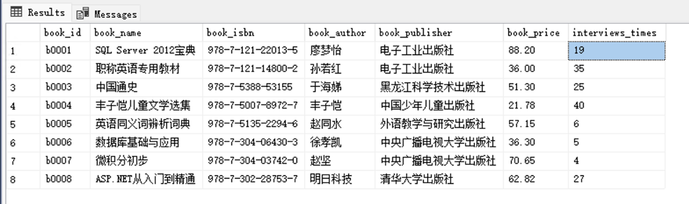


### 2. 编写事务程序

用于更新book表中的SQL Server 2012宝典的信息，观察其事务过程中锁的获得与释放情况，以及锁定资源的类型。（参考4.2）

#### 2.0 执行前查看锁

```sql
EXEC sp_lock;
Go
```

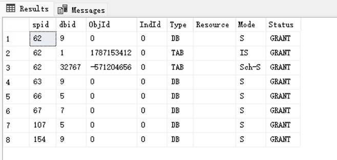

#### 2.1 第一个程序执行更新操作

```sql
BEGIN TRAN;
UPDATE book
SET book_price = 100
WHERE book_id = 'b0001';
-- 不提交也不回滚
```

#### 2.2 第二个程序查看锁：

```sql
EXEC sp_lock;
Go
```
|spid |dbid |ObjId |IndId |Type |Resource     |  Mode |Status|
|-----|-----|------|------|-----|-------------|-------|------|
|154  |9    |0     |0    |DB   |             |   |   |S      |GRANT |
|154  |9    |917578307|0  |PAG  |1:544       |    |IX     |GRANT |
|154  |9    |917578307|0  |RID  |1:544:0     |   |X      |GRANT |
|154  |9    |917578307|0  |TAB  |             |    |IX     |GRANT |

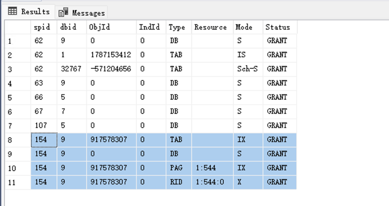

#### 2.3 在第一个程序执行提交后，第二个程序再次查看锁：

```sql
COMMIT;
```

```sql
EXEC sp_lock;
Go
```

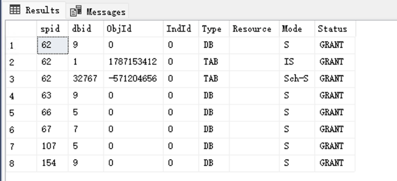

#### 2.4 实验分析与说明

在本实验中，第一个事务对 book 表中的指定记录进行了更新操作，并在未提交或回滚的情况下保持事务处于活动状态。此时，通过第二个会话执行 `sp_lock`，可以观察到 SQL Server 为了保证数据一致性和隔离性，自动为相关资源加上了锁。

从锁表结果来看，涉及到的锁类型包括：
- DB（数据库锁）：对整个数据库加的锁，通常为共享锁（S），保证数据库元数据的安全。
- PAG（页锁）：对数据页加的意向排他锁（IX），用于标识该页上存在更细粒度的排他锁。
- RID（行锁）：对具体数据行加的排他锁（X），确保该行在事务期间不会被其他事务修改。
- TAB（表锁）：对表加的意向排他锁（IX），标识表中存在行级或页级的排他锁。

在事务提交后（COMMIT），再次执行 `sp_lock` 可以发现相关锁已被释放，说明 SQL Server 会在事务结束时自动释放所有持有的锁，从而允许其他事务访问和修改这些资源。

### 3. 编写事务程序

对book表进行实验，设置相应的隔离级别，模拟实现读脏数据、不可重复读以及可重复读。（参考4.3）

#### 3.1 读脏数据（Read Uncommitted）

读脏数据是指一个事务可以读取另一个事务未提交的数据，从而可能导致数据不一致的现象。

为了模拟读脏数据的情况，我们可以使用两个连接来展示这一现象。

连接一：

```sql
BEGIN TRAN
UPDATE book SET book_price = 99 WHERE book_id = 'b0001'
WAITFOR DELAY '00:00:20' --延时20秒
ROLLBACK TRAN
-- 实际无更新
SELECT * FROM book WHERE book_id = 'b0001'
```

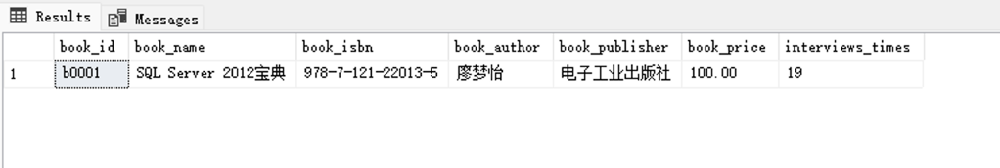

连接二：

```sql
SET TRANSACTION ISOLATION LEVEL READ UNCOMMITTED
-- 模拟实现脏读
SELECT * FROM book WHERE book_id = 'b0001'
```

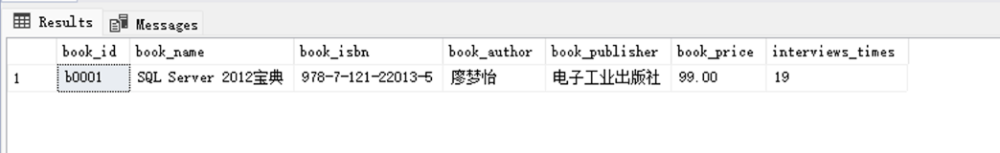

分析：
- 连接一在未提交事务前更新了book_price字段，并延时20秒后回滚，实际并未更新数据。
- 连接二设置隔离级别为READ UNCOMMITTED，可以读取连接一未提交的更新，导致读脏数据。


#### 3.2 不可重复读（Read Committed）

不可重复读是指在同一事务中，前后两次读取同一数据，结果却不同，原因是期间有其他事务对该数据进行了修改并提交。

实验步骤如下：

连接一：

```sql
BEGIN TRAN
SELECT * FROM book WHERE book_id = 'b0001' -- 第一次读取
WAITFOR DELAY '00:00:20' -- 延时20秒
SELECT * FROM book WHERE book_id = 'b0001' -- 第二次读取
COMMIT TRAN
```

连接二：

```sql
SET TRANSACTION ISOLATION LEVEL READ COMMITTED -- 设置隔离级别
BEGIN TRAN
UPDATE book SET book_price = 88 WHERE book_id = 'b0001'
COMMIT TRAN
```

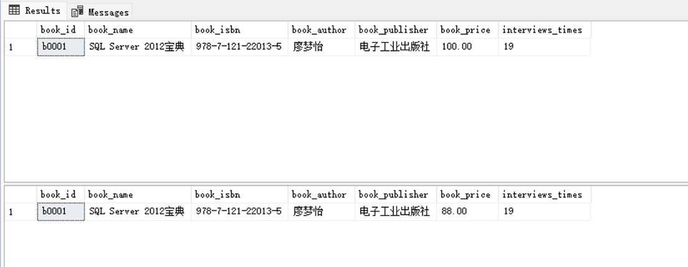

分析：
- 连接一在同一事务中两次读取 book_price，连接二在中间提交了更新。
- 由于 READ COMMITTED 只保证每次读取的是已提交数据，连接一两次读取结果可能不同，出现不可重复读。

#### 3.3 可重复读（Repeatable Read）

可重复读是指在同一事务中多次读取同一数据，结果始终一致，即使有其他事务试图修改该数据，也会被阻塞直到当前事务结束。

实验步骤如下：

连接一：

```sql
SET TRANSACTION ISOLATION LEVEL REPEATABLE READ
BEGIN TRAN
SELECT * FROM book WHERE book_id = 'b0001' -- 第一次读取
WAITFOR DELAY '00:00:20' -- 延时20秒
SELECT * FROM book WHERE book_id = 'b0001' -- 第二次读取
COMMIT TRAN
```

连接二：

```sql
BEGIN TRAN
UPDATE book SET book_price = 77 WHERE book_id = 'b0001'
-- 此处会被阻塞，直到连接一提交
COMMIT TRAN
```

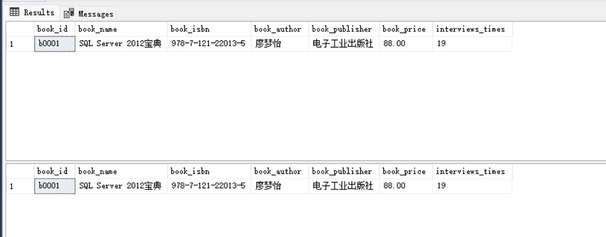

分析：
- 连接一在 REPEATABLE READ 隔离级别下，两次读取结果一致。
- 连接二在连接一事务提交前无法修改该数据，保证了可重复读。

### 4. 编写事务程序

对book表进行实验，设计实验制造事务之间的死锁。（参考4.4）

死锁是指两个或多个事务在等待对方持有的资源，从而导致所有事务都无法继续执行的情况。

#### 4.1 连接一：

```sql
BEGIN TRAN
UPDATE book SET book_price = 60 WHERE book_id = 'b0001'
WAITFOR DELAY '00:00:20' --延时20秒
ROLLBACK TRAN
```

#### 4.2 连接二：

```sql
BEGIN TRAN
SELECT * FROM book WHERE book_id = 'b0001'
COMMIT TRAN
```

#### 4.3 查看死锁情况：

```sql
EXEC sp_who;
GO
```
查看blk列，发现死锁情况（blk为0表示无阻塞，非0表示有阻塞）。

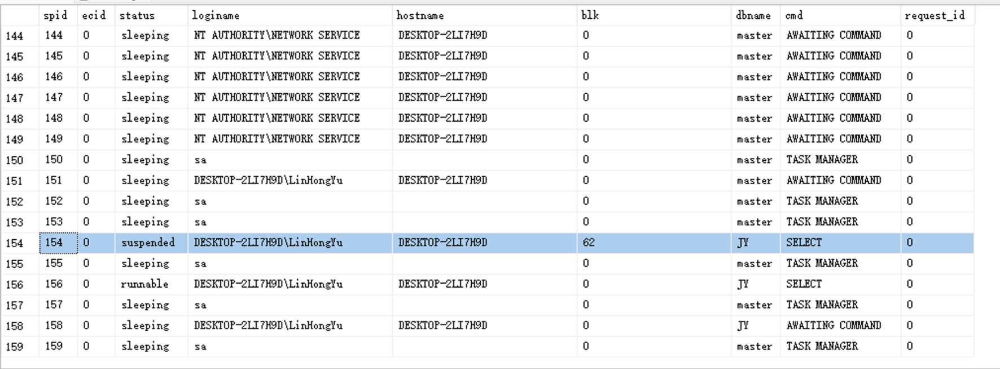

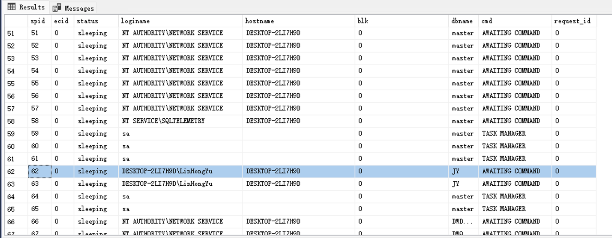

发现进程154被62阻塞，形成死锁。

#### 4.4 使用DBCC命令查看死锁详细信息：

```sql
-- DBCC INPUTBUFFER(spid) 查看指定spid的最后一条语句
DBCC INPUTBUFFER(154) 
```

最后一条语句为
```sql 
BEGIN TRAN  SELECT * FROM book WHERE book_id = 'b0001'  COMMIT TRAN 
```

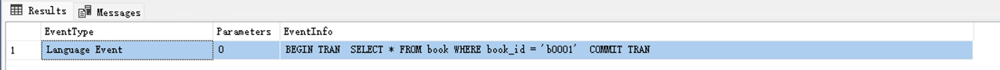


#### 4.5 实验分析与说明

本实验通过两个连接分别对 book 表进行操作，模拟了死锁的产生过程。连接一开启事务并更新 book_id 为 'b0001' 的记录后延时未提交，持有该记录的排他锁。此时，连接二尝试读取同一条记录并开启事务，由于连接一未释放锁，连接二被阻塞，等待连接一提交或回滚。

如果此时连接一又需要等待连接二持有的某些资源（如在更复杂的场景下两个事务分别持有不同资源并互相等待），就会形成死锁。实验中通过 `sp_who` 命令可以看到进程间的阻塞关系，blk 列非0表示存在阻塞。通过 `DBCC INPUTBUFFER` 可以进一步查看被阻塞进程的最后一条语句，辅助定位死锁源头。

#### 4.6 解决死锁的方法

- 设置锁超时：通过设置锁等待时间，超过时间后自动放弃等待，避免长时间死锁。
```sql
SET LOCK_TIMEOUT 5000; -- 设置锁等待时间为5000毫秒
```
- SQL Server 会自动检测死锁并选择一个事务作为牺牲者回滚，以解除死锁。
- 优化事务设计：尽量减少事务持有锁的时间，避免长事务。

## 💡 实验总结

### 技术总结

本次实验系统地实践了数据库并发事务的相关操作，深入理解了事务的ACID特性，尤其是隔离性在并发环境下的重要作用。通过对不同隔离级别（Read Uncommitted、Read Committed、Repeatable Read）的实验，直观体验了脏读、不可重复读和可重复读等现象，掌握了SQL Server中事务隔离级别的设置方法。实验还通过sp_lock、sp_who等命令观察了锁的类型、加锁与释放过程，理解了行锁、表锁、页锁等多种锁机制。最后，设计并分析了死锁场景，学习了死锁的检测与解决方法。整体上，实验提升了对数据库并发控制、事务管理和数据一致性保障的实际操作能力。

### 心得体会

通过本次实验，我不仅加深了对数据库事务理论的理解，更在实际操作中体会到并发控制的复杂性和重要性。实验过程中遇到锁等待、阻塞、死锁等问题时，能够通过分析锁表和进程信息定位原因，提升了独立排查和解决问题的能力。事务隔离级别的选择直接影响数据一致性和系统性能，今后在实际开发和数据库管理中，会更加注重合理设计事务、优化SQL语句和访问顺序，防止并发异常和死锁，保障系统的稳定与高效运行。


## 📚 参考资料

- 课件资料
- SSMS文档
- 实验教材

## 附件

- 无（代码已经在报告中呈现）