<div align="center">
    

<br><br><br>
</div>
<div style="font-size:1.6em; font-weight:normal; line-height:1.6;">
<div style="text-align:center; font-size:2.9em; font-weight:normal; letter-spacing:0.1em;">实验作业报告</div>
<br/>
<br>
<div style="text-align:center; font-size:1.3em; line-height:1.8;">
  <table style="margin: 0 auto; font-size:1.1em;">
  <tr><td align="right">实验：</td><td align="left">数据库系统实验</td></tr>
  <tr><td align="right">学号：</td><td align="left">23320093</td></tr>
  <tr><td align="right">姓名：</td><td align="left">林宏宇</td></tr>
  <tr><td align="right">专业：</td><td align="left">计算机科学与技术</td></tr>
  <tr><td align="right">班级：</td><td align="left">计科1班</td></tr>
  <tr><td align="right">指导教师：</td><td align="left">赖韩江</td></tr>
  <tr><td align="right"style="border-bottom:1px solid #000;">实验日期：</td><td align="left" style="border-bottom:1px solid #000;">2025年10月20日</td></tr>
  </table>
</div>
</div>

<div STYLE="page-break-after: always;"></div>

# 数据库系统实验报告

## ✏️ 实验目的

数据库视图与控制实验
- 熟悉使用 SQL语言支持的有关视图的操作，能够熟练地使用SQL语句来创建需要的视图，对视图进行查询和取消等。
- 熟悉SQL的数据控制功能，能够使用SQL语句来向用户授予和收回权限。

## 📋 实验内容

### 视图

#### 一、更新数据库，将数据库图书表的借阅次数(interviews_times)修改如下：

| book_id | book_name | book_isbn | book_author | book_publisher | interviews_times | book_price |
|---------|-----------|-----------|-------------|----------------|------------------|------------|
| b0001  | SQL Server 2012宝典 | 978-7-121-22013-5 | 廖梦怡 | 电子工业出版社 | 38 | 89.00 |
| b0002  | 职称英语专用教材 | 978-7-121-14800-2 | 孙若红 | 电子工业出版社 | 15 | 45.00 |
| b0003  | 中国通史 | 978-7-5388-53155 | 于海娣 | 黑龙江科学技术出版社 | 60 | 68.00 |
| b0004  | 丰子恺儿童文学选集 | 978-7-5007-8972-7 | 丰子恺 | 中国少年儿童出版社 | 32 | 22.50 |
| b0005  | 英语同义词辨析词典 | 978-7-5135-2294-6 | 赵同水 | 外语教学与研究出版社 | 29 | 55.00 |
| b0006  | 数据库基础与应用 | 978-7-304-06430-3 | 徐孝凯 | 中央广播电视大学出版社 | 5 | 35.00 |
| b0007  | 微积分初步 | 978-7-304-03742-0 | 赵坚 | 中央广播电视大学出版社 | 48 | 17.00 |
| b0008  | ASP.NET从入门到精通 | 978-7-302-28753-7 | 明日科技 | 清华大学出版社 | 17 | 89.80 |

1. 分析
  - 对应表格为图书表book的字段interviews_times需要修改的数据。
  - 只需要修改interviews_times字段
  - 使用UPDATE语句按照id依次更新

2. sql语句
```sql
UPDATE book SET interviews_times = 38 WHERE book_id = 'b0001';
UPDATE book SET interviews_times = 15 WHERE book_id = 'b0002';
UPDATE book SET interviews_times = 60 WHERE book_id = 'b0003';
UPDATE book SET interviews_times = 32 WHERE book_id = 'b0004';
UPDATE book SET interviews_times = 29 WHERE book_id = 'b0005';
UPDATE book SET interviews_times = 5 WHERE book_id = 'b0006';
UPDATE book SET interviews_times = 48 WHERE book_id = 'b0007';
UPDATE book SET interviews_times = 17 WHERE book_id = 'b0008';
```

3. 实验结果展示

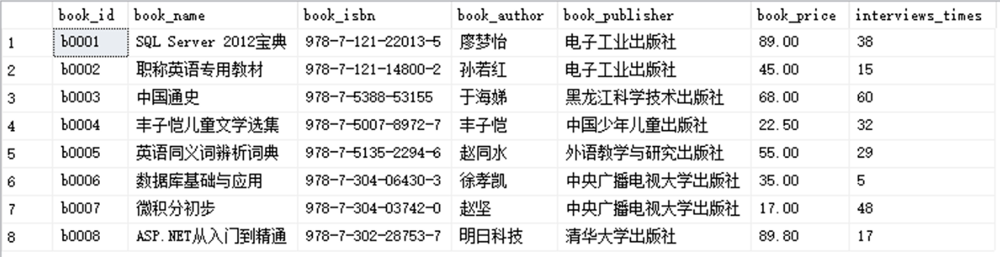

#### 二、创建视图，用于查看借阅次数大于25次的图书信息。

1. 分析
  - 需要创建视图，使用CREATE VIEW语句
  - 为SELECT语句创建视图
  - 内容为借阅次数大于25次的图书信息，使用WHERE子句筛选借阅次数大于25次的图书
2. sql语句
```sql
CREATE VIEW view_book_interviews_times AS
SELECT * FROM book WHERE interviews_times > 25;
```
3. 实验结果展示

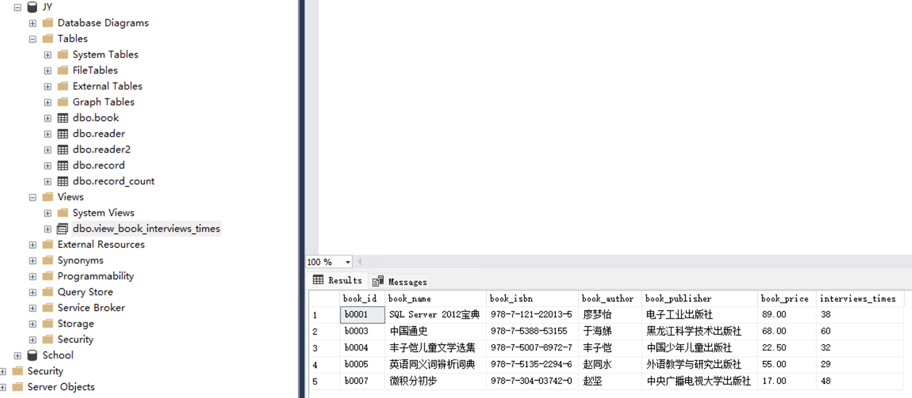

#### 三、创建视图，用于查看借阅了图书的读者姓名，以及他们借阅的图书名称。

1. 分析
  - 借阅了图书的记录在record表，读者的姓名在reader表，图书名称在book表
  - 需要连接三张表，使用JOIN语句
  - 创建视图，使用CREATE VIEW语句
2. sql语句
```sql
CREATE VIEW view_borrow AS
SELECT r.reader_name, b.book_name
FROM record rec
JOIN reader r ON rec.reader_id = r.reader_id
JOIN book b ON rec.book_id = b.book_id;
```
3. 实验结果展示

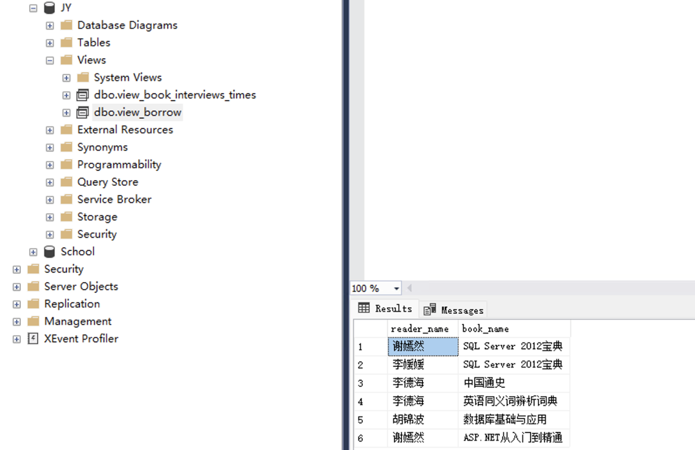

#### 四、创建视图，用于查询借阅次数大于35次的图书名称和借阅次数，并在视图中为列指定别名”BOOKNAME”和“TIMES”。

1. 分析
  - 需要创建视图，使用CREATE VIEW语句
  - 为SELECT语句创建视图
  - 内容为借阅次数大于35次的图书名称和借阅次数，使用WHERE子句筛选借阅次数大于35次的图书
  - 使用AS关键字为列指定别名
2. sql语句
```sql
CREATE VIEW view_borrow_35 AS
SELECT book_name AS BOOKNAME, interviews_times AS TIMES
FROM book
WHERE interviews_times > 35;
```
3. 实验结果展示

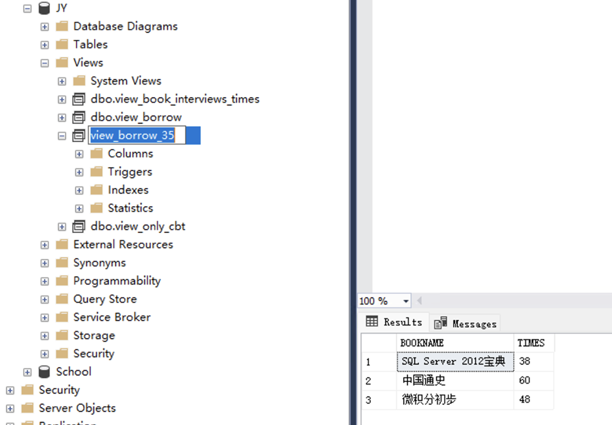

#### 五、创建视图, 使用With Check Option, 创建一个只包含 中央广播电视大学出版社 的图书视图，然后通过该视图分别增加、删除、修改一条 出版社是中央广播电视大学出版社 和 清华大学出版社 的图书记录，验证With Check Option是否起作用。
1. 分析
  - 需要创建视图，使用CREATE VIEW语句
  - 使用WITH CHECK OPTION确保通过视图插入或更新的数据符合视图定义的条件
2. sql语句
```sql
CREATE VIEW view_only_cbt AS
SELECT * 
FROM book
WHERE book_publisher = '中央广播电视大学出版社'
WITH CHECK OPTION; -- add this line to enforce the check option
```
3. 实验结果展示

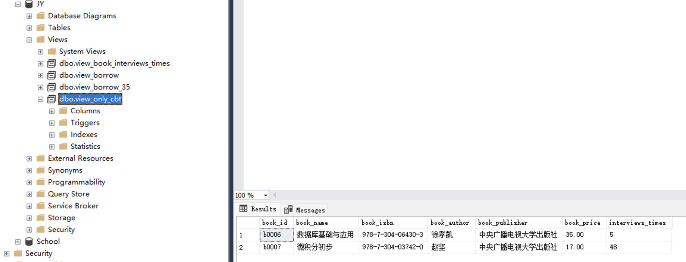
4. 验证插入不符合条件的记录仪确保用WITH CHECK OPTION起作用
```sql
-- 尝试插入出版社为清华大学出版社的记录
INSERT INTO view_only_cbt (book_id, book_name, book_isbn, book_author, book_publisher, interviews_times, book_price)
VALUES ('b0009', '测试图书', '978-7-302-00000-0', '测试作者', '清华大学出版社', 10, 50.00);
```
5. 实验结果展示（应报错，插入被拒绝）

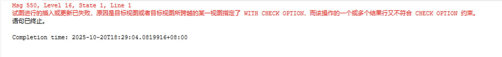

#### 六、上面的四个视图可更新吗？通过SQL更新语句分别进行验证。
1. 分析

只有“简单的”能被明确映射到单个基表的视图才通常可更新；其中聚合、DISTINCT、GROUP BY、UNION、多表 JOIN、子查询衍生列、TOP（或 OFFSET）、计算列等会使视图不可更新或使更新变得不明确。
  - 视图view_book_interviews_times：可更新
  - 视图view_borrow：不可更新，因为是多表JOIN
  - 视图view_borrow_35：可更新，没有WITH CHECK OPTION，可以更新所有记录
  - 视图view_only_cbt：不一定可更新，使用了WITH CHECK OPTION，可以更新符合条件的记录
2. sql语句
```sql
-- 尝试更新view_book_interviews_times视图
UPDATE view_book_interviews_times
SET interviews_times = 40 -- from 60 to 40
WHERE book_id = 'b0003';

-- 尝试更新view_borrow视图
UPDATE view_borrow
SET book_name = '新书名' -- from SQL Server 2012宝典 to 新书名
WHERE reader_name = '谢嫣然';

-- 尝试更新view_borrow_35视图
UPDATE view_borrow_35
SET TIMES = 50 -- from 48 to 50
WHERE BOOKNAME = '微积分初步';

-- 尝试更新view_only_cbt视图
UPDATE view_only_cbt
SET book_price = 40.00 -- from 35.00 to 40.00
WHERE book_id = 'b0006';
```
3. 实验结果展示

- view_book_interviews_times视图可更新
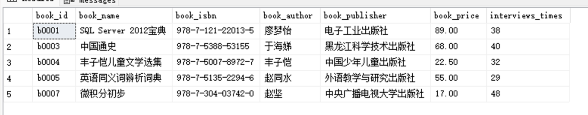

- view_borrow视图不可更新，更新结果出错，与预期不符（“李媛媛”的数据被错误地更新了）
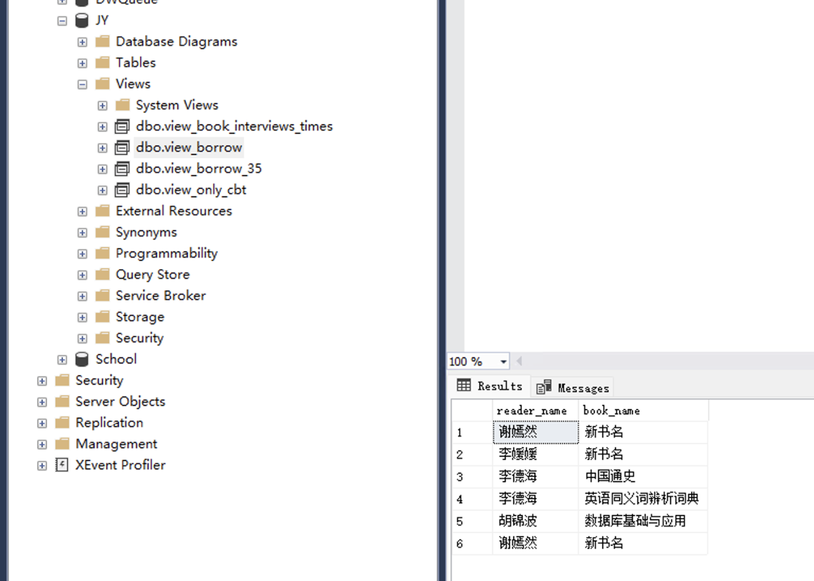

- view_borrow_35视图可更新
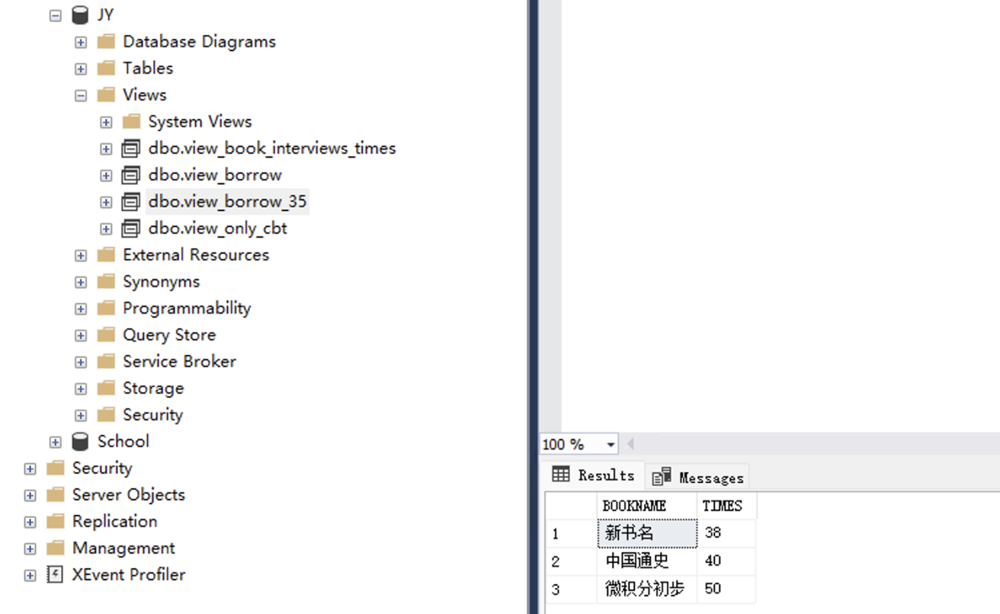

- view_only_cbt视图可更新
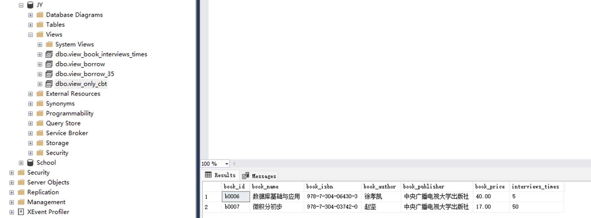

#### 七、删除上面视图
1. 分析
  - 使用DROP VIEW语句删除视图
2. sql语句
```sql
DROP VIEW view_book_interviews_times;
DROP VIEW view_borrow;
DROP VIEW view_borrow_35;
DROP VIEW view_only_cbt;
```
3. 实验结果展示


### 数据控制

#### 创建三个用户USER1, USER2，USER3 
1. 分析
  - 第一步创建登录名（LOGIN），使用CREATE LOGIN语句
  - 第二步创建数据库用户（USER），使用CREATE USER语句创建用户
  - FOR LOGIN指定登录名
2. sql语句
```sql
-- step 1 
CREATE LOGIN USER1_LOGIN WITH PASSWORD = 'Password1';
CREATE LOGIN USER2_LOGIN WITH PASSWORD = 'Password2';
CREATE LOGIN USER3_LOGIN WITH PASSWORD = 'Password3';
-- step 2 
USE JY; 
CREATE USER USER1 FOR LOGIN USER1_LOGIN;
CREATE USER USER2 FOR LOGIN USER2_LOGIN;
CREATE USER USER3 FOR LOGIN USER3_LOGIN;
```
3. 实验结果展示

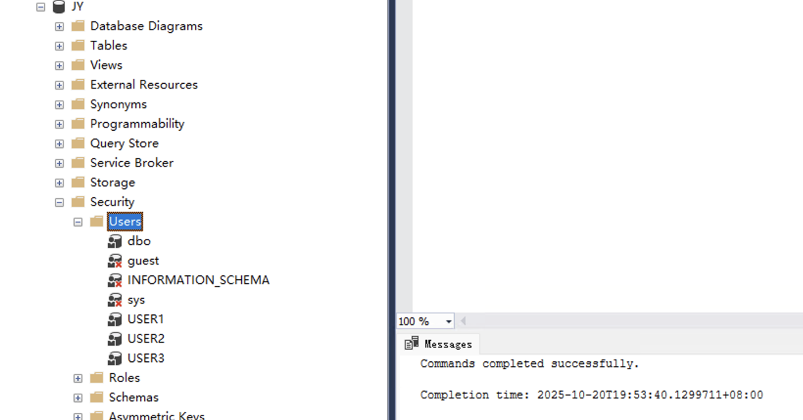

#### 一、授予所有用户对图书表的查询权限。
1. 分析
  - 使用GRANT语句授予权限
  - 授予SELECT权限
2. sql语句
```sql
GRANT SELECT ON book TO USER1, USER2, USER3;
```
3. 实验结果展示(只展示USER1的结果，USER2和USER3类似)

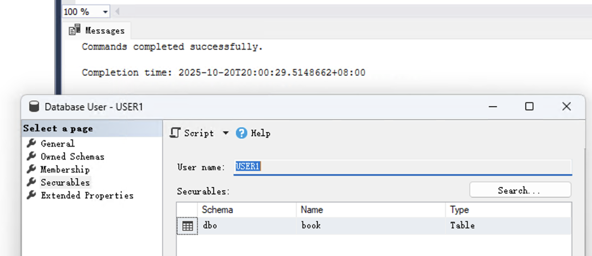

#### 二、授予USER1对读者表的查询，更新的权限，且允许USER1可以传播这些权限。
1. 分析
  - 使用GRANT语句授予权限
  - 授予SELECT和UPDATE权限
  - 使用WITH GRANT OPTION允许传播权限
2. sql语句
```sql
GRANT SELECT, UPDATE ON reader TO USER1 WITH GRANT OPTION;
```
3. 实验结果展示

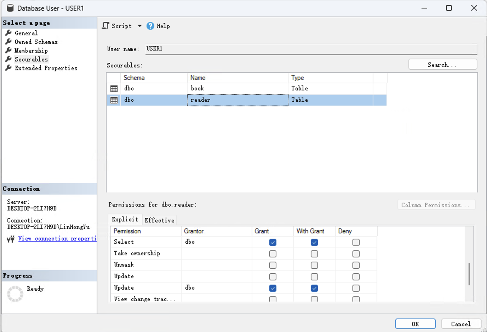

#### 三、授予USER2对图书表的查询，更新book_price的权限，且允许USER2可以传播这些权限。
1. 分析
  - 使用GRANT语句授予权限
  - 授予SELECT和UPDATE权限
  - 使用WITH GRANT OPTION允许传播权限
2. sql语句
```sql
GRANT SELECT ON book TO USER2 WITH GRANT OPTION;
GRANT UPDATE (book_price) ON book TO USER2 WITH GRANT OPTION;
```
3. 实验结果展示

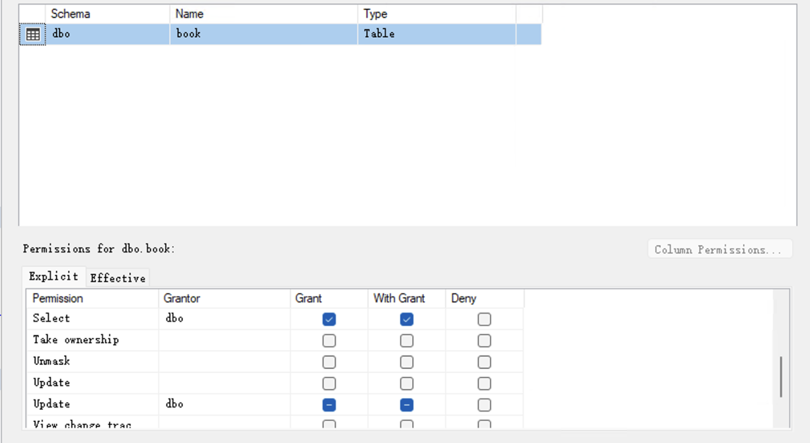
#### 四、由USER1授予USER2对读者表的查询权限和传播此项权限的权利，再由USER2授予USER3对读者表、图书表的查询权限。
1. 分析
  - USER1使用GRANT语句授予USER2权限
  - USER2使用GRANT语句授予USER3权限
2. sql语句
```sql
-- USER1登陆并操作：授予USER2权限
USE JY;
GRANT SELECT ON reader TO USER2 WITH GRANT OPTION;
-- USER2登陆并操作：授予USER3权限
USE JY;
GRANT SELECT ON reader TO USER3;
GRANT SELECT ON book TO USER3;
```
3. 实验结果展示

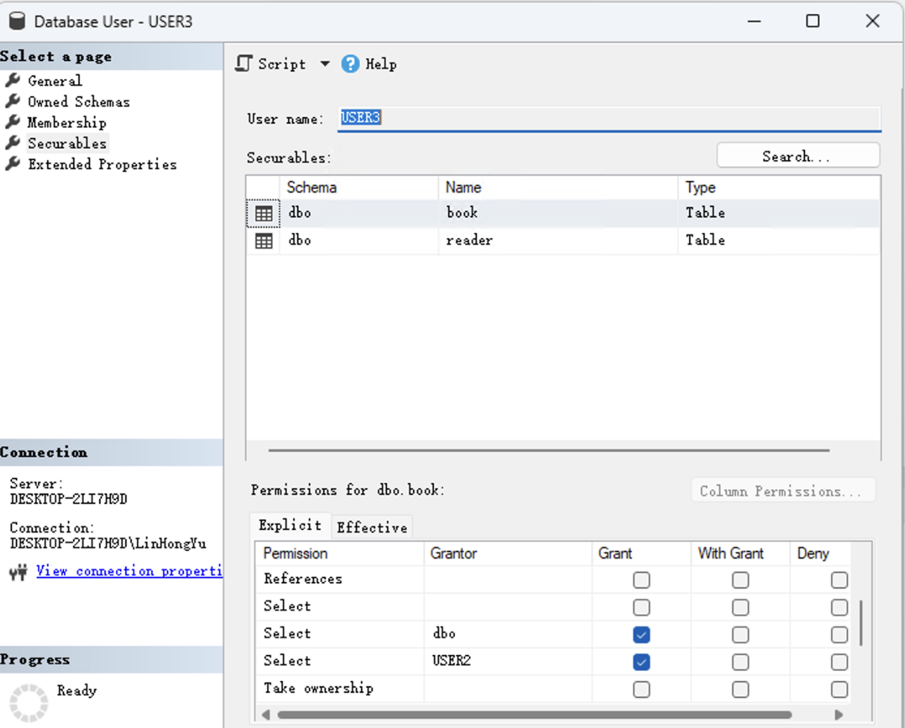

#### 五、取消USER1对读者表的查询，更新的权限，考虑由USER2的身份对读者表进行查询，操作是否成功？为什么？
1. 分析
  - 使用REVOKE语句取消权限，需要使用CASCADE选项，以便撤销通过传播获得的权限
  - 由于USER2是通过USER1传播获得的权限，USER1的权限被撤销后，USER2的权限也会被撤销
2. sql语句
```sql
-- root用户登陆并操作：取消USER1权限
REVOKE SELECT, UPDATE ON reader FROM USER1;
-- USER2登陆并操作：尝试查询读者表
USE JY;
SELECT * FROM reader;
```
3. 实验结果展示

（示例截图：USER2 无法查询读者表）
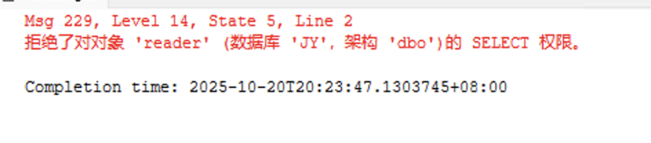

## 💡 实验总结

### 一、语法总结

- 视图（VIEW）相关
  - 创建视图：`CREATE VIEW view_name AS SELECT ...;`。视图是对查询结果的命名封装，便于复用和权限控制。
  - 带检查选项：在创建视图时使用 `WITH CHECK OPTION` 可以保证通过该视图进行的 `INSERT` 或 `UPDATE` 操作只允许产生满足视图定义 `WHERE` 条件的行。
  - 删除视图：`DROP VIEW view_name;`。
  - 别名与列重命名：在视图定义中可以使用 `AS` 为列或表达式指定别名，例如 `SELECT book_name AS BOOKNAME`。
  - 可更新性规则（常见判断原则）：只有能明确映射到单个基表的简单 `SELECT`（无聚合、无 `DISTINCT`、无 `GROUP BY`、无多表 `JOIN`、无 `UNION`、无计算列/子查询衍生列、无 `TOP/OFFSET` 等）才通常是可更新的。具体是否可更新还依赖于所用的数据库实现细节。

- 数据控制（权限）相关
  - 创建登录与用户（以 SQL Server 为例）：`CREATE LOGIN name WITH PASSWORD = 'pwd';`，然后 `CREATE USER user FOR LOGIN login_name;`。
  - 授权：使用 `GRANT` 分配权限，例如 `GRANT SELECT, UPDATE ON reader TO USER1 WITH GRANT OPTION;`。`WITH GRANT OPTION` 允许接收者把该权限再次授予他人（传播）。
  - 收回权限：使用 `REVOKE`，注意传播路径：当上级的传播权限被收回时，通过传播获得的下级权限可能会一并失效（不同数据库对撤销传播的行为有差异，需谨慎验证）。
  - 细粒度权限：可以指定列级权限，例如 `GRANT UPDATE (book_price) ON book TO USER2;`，减少授权面。

### 二、实验心得

- 通过本次实验，系统地掌握了视图的创建、查询、更新和删除流程，尤其理解了 `WITH CHECK OPTION` 在保证数据一致性方面的作用。
- 实验中对视图可更新性的验证让我更直观地理解：表之间的 JOIN 会使更新变得不明确或不可执行；反之，简单的单表视图在大多数情况下是可更新的。
- 权限传播与撤销的实验强化了最小权限原则的重要性：实际项目中应优先使用角色/组来授予权限，而不是直接把权限发放给大量用户。

## 📚 参考资料
- 实验课件
- 作业

## 附件
- 无（代码已经在报告中逐步展示）