<div align="center">
    

<br><br><br>
</div>
<div style="font-size:1.6em; font-weight:normal; line-height:1.6;">
<div style="text-align:center; font-size:2.9em; font-weight:normal; letter-spacing:0.1em;">实验作业报告</div>
<br/>
<br>
<div style="text-align:center; font-size:1.3em; line-height:1.8;">
  <table style="margin: 0 auto; font-size:1.1em;">
  <tr><td align="right">实验：</td><td align="left">数据库系统实验</td></tr>
  <tr><td align="right">学号：</td><td align="left">23320093</td></tr>
  <tr><td align="right">姓名：</td><td align="left">林宏宇</td></tr>
  <tr><td align="right">专业：</td><td align="left">计算机科学与技术</td></tr>
  <tr><td align="right">班级：</td><td align="left">计科1班</td></tr>
  <tr><td align="right">指导教师：</td><td align="left">赖韩江</td></tr>
  <tr><td align="right"style="border-bottom:1px solid #000;">实验日期：</td><td align="left" style="border-bottom:1px solid #000;">2025年10月24日</td></tr>
  </table>
</div>
</div>

<div STYLE="page-break-after: always;"></div>

# 数据库系统实验报告

## ✏️ 实验目的

数据库完整性约束实验
- 掌握数据库完整性约束的知识以及相关实验操作

## 📋 实验内容
- 实验平台：SSMS
- 对于每一个实验问题，都会从**sql语法分析**、**sql代码**、**实验结果**这三个方面进行回答
### 1.添加与删除主键约束

#### 用ALTER TABLE语句对三个表（book、reader、record）删除主键约束
- sql语法分析
  - sys.key_constraints系统表存储了数据库中所有表的约束信息
  - parent_object_id表示表的对象ID，OBJECT_ID函数用于获取指定表的对象ID
  - type = 'PK'表示只查询主键约束
  - 使用ALTER TABLE语句删除主键约束
  - DROP CONSTRAINT子句用于删除指定的约束。
- sql代码
```sql
-- find the primary key constraint name of book table
SELECT name 
FROM sys.key_constraints 
WHERE parent_object_id = OBJECT_ID('book') AND type = 'PK';

-- find the primary key constraint name of reader table
SELECT name 
FROM sys.key_constraints 
WHERE parent_object_id = OBJECT_ID('reader') AND type = 'PK';

-- find the primary key constraint name of record table
SELECT name 
FROM sys.key_constraints 
WHERE parent_object_id = OBJECT_ID('record') AND type = 'PK';
```
- 实验结果

三个表（book、reader、record）都没有主键约束，不需要删除
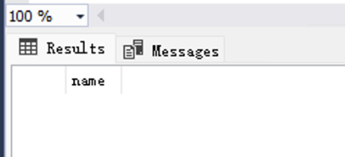

#### 再使用ALTER TABLE语句对三个表添加主键约束，其中book表的主键的约束名为：PRK_Book; reader表约束名为：PRK_Reader; record表的主键约束名为PRK_Record
- sql语法分析
  - 使用ALTER TABLE语句添加主键约束
  - ADD CONSTRAINT子句用于添加新的约束
  - PRIMARY KEY指定该约束为主键约束

- sql代码
```sql
-- add primary key constraint to book, reader and record tables
ALTER TABLE book
ADD CONSTRAINT PRK_Book PRIMARY KEY (book_id);
ALTER TABLE reader
ADD CONSTRAINT PRK_Reader PRIMARY KEY (reader_id);
ALTER TABLE record
ADD CONSTRAINT PRK_Record PRIMARY KEY (borrow_date);
```

- 实验结果

使用问题1中的查询主键的方式，验证三个表的主键约束是否添加成功

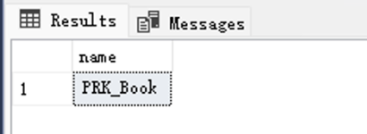

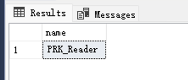

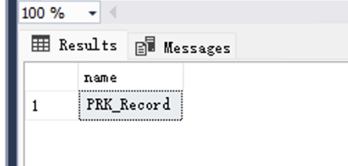

#### 分别在三个表中插入记录，验证三个表的实体完整性约束是否起作用

- sql语法分析
  - 向表中插入记录，验证主键约束是否生效
  - 如果插入的记录违反了主键约束（即主键值重复），则会引发错误，说明主键约束起作用
- sql代码
```sql
-- insert records into book table. book_id = 'b0001' already exists
INSERT INTO book (book_id, book_name, book_isbn, book_author, book_publisher, book_price, interviews_times)
VALUES ('b0001', '新书名', '978-7-121-22013-5', '廖梦怡', '电子工业出版社', 89.00, 38);
-- insert records into reader table. reader_id = 'r0001' already exists
INSERT INTO reader (reader_id, reader_name, reader_sex, reader_department)
VALUES ('r0001', '李德海', '男', '信息工程系');
-- insert records into record table. borrow_date = '2014-01-12' already exists
INSERT INTO record (reader_id, book_id, borrow_date, return_date, notes)
VALUES ('r0001', 'b0003', '2014-01-12', '2014-01-12', NULL);
```
- 实验结果

插入记录时，出现违反主键约束的错误，说明主键约束起作用

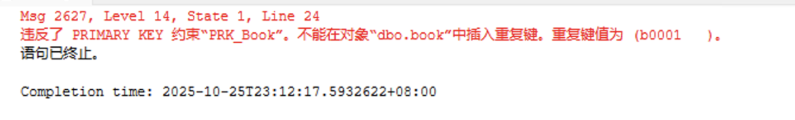

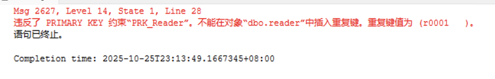

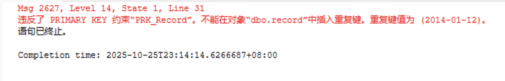

### 2.添加与删除外键约束
#### 用ALTER TABLE语句对 借阅记录表record的外键约束进行删除
- sql语法分析
  - 先查询record表的外键约束名称
  - sys.foreign_keys系统表存储了数据库中所有表的外键约束信息
  - parent_object_id表示表的对象ID，OBJECT_ID函数用于获取指定表的对象ID
  - 使用ALTER TABLE语句删除外键约束
  - DROP CONSTRAINT子句用于删除指定的约束
- sql代码
```sql
-- find the foreign key constraint name of record table
SELECT name 
FROM sys.foreign_keys 
WHERE parent_object_id = OBJECT_ID('record');
```
- 实验结果

record表没有外键约束，所以不需要删除

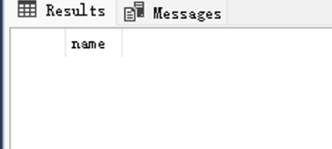

#### 添加record表的外键约束 （book_id 、reader_id），当删除或修改被参照表记录时，设置参照表中相应记录的值为空值。
- sql语法分析
  - 先修改record表中的book_id和reader_id列，允许其为空值，且数据类型保持一致
  - 使用ALTER TABLE语句添加外键约束
  - ADD CONSTRAINT子句用于添加新的约束
  - FOREIGN KEY指定该约束为外键约束
  - ON DELETE SET NULL和ON UPDATE SET NULL指定当被参照表中的记录被删除或更新时，参照表中的相应记录的值将被设置为NULL
- sql代码
```sql
-- modify book_id and reader_id columns to allow NULL values
ALTER TABLE record ALTER COLUMN book_id VARCHAR(8) NULL;
ALTER TABLE record ALTER COLUMN reader_id VARCHAR(8) NULL;
-- add foreign key constraint to record table
ALTER TABLE record
ADD CONSTRAINT FRK_Record_Book FOREIGN KEY (book_id) REFERENCES book(book_id)
ON DELETE SET NULL
ON UPDATE SET NULL;
-- add foreign key constraint to record table
ALTER TABLE record
ADD CONSTRAINT FRK_Record_Reader FOREIGN KEY (reader_id) REFERENCES reader(reader_id)
ON DELETE SET NULL
ON UPDATE SET NULL;
```
- 实验结果

使用之前查询外键约束的代码，验证外键约束是否添加成功

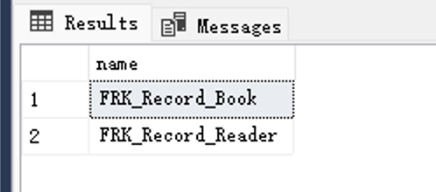

### 3.将图书表book中的book_name列设置为唯一性约束，约束名为un_name
- sql语法分析
  - 上次实验中修改了book_name列，所以有重复的值，在此先恢复book_name列的数据
  - 使用ALTER TABLE语句添加唯一性约束
  - ADD CONSTRAINT子句用于添加新的约束
  - UNIQUE指定该约束为唯一性约束
  - 使用sys.key_constraints系统表查询唯一性约束信息
- sql代码
```sql
-- restore book_name column data to remove duplicates
UPDATE book
SET book_name = 'SQL Server 2012 宝典' 
WHERE book_id = 'b0001';
UPDATE book
SET book_name = 'ASP.NET 从入门到精通' 
WHERE book_id = 'b0008';
-- add unique constraint to book_name column in book table
ALTER TABLE book
ADD CONSTRAINT un_name UNIQUE (book_name);
-- show book table unique constraints
SELECT name 
FROM sys.key_constraints 
WHERE parent_object_id = OBJECT_ID('book') AND type = 'UQ';
```
- 实验结果

数据中book_name出现了重复的值，唯一性约束添加前要确保无重复值，否则会报错

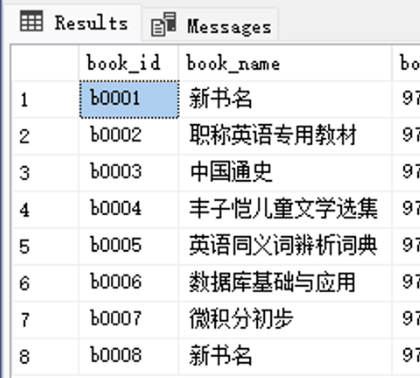

报错信息

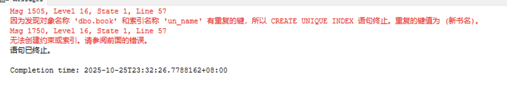

修改重复的book_name后，唯一性约束添加成功

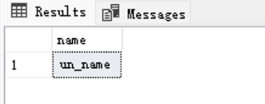
### 4.删除图书表book_name的唯一性约束
- sql语法分析
  - 使用ALTER TABLE语句删除唯一性约束
  - DROP CONSTRAINT子句用于删除指定的约束
- sql代码
```sql
-- delete unique constraint from book_name column in book table
ALTER TABLE book
DROP CONSTRAINT un_name;
-- show book table unique constraints
SELECT name 
FROM sys.key_constraints 
WHERE parent_object_id = OBJECT_ID('book') AND type = 'UQ';
```
- 实验结果

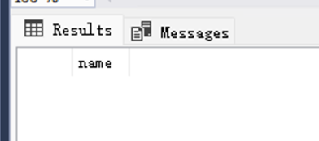

### 5.将图书表book中的book_id列设置为检查约束，约束名为ck_idb。其中book_id LIKE "b[0-9][0-9][0-9][0-9]"
- sql语法分析
  - 使用ALTER TABLE语句添加CHECK约束
  - ADD CONSTRAINT子句用于添加新的约束
  - CHECK指定该约束为检查约束
  - LIKE操作符用于匹配字符串模式
- sql代码
```sql
-- add check constraint to book_id column in book table
ALTER TABLE book
ADD CONSTRAINT ck_idb CHECK (book_id LIKE 'b[0-9][0-9][0-9][0-9]');
-- insert or update a record to verify the CHECK constraint
INSERT INTO book (book_id, book_name, book_isbn, book_author, book_publisher, book_price, interviews_times)
VALUES ('b1', '新书名', '978-7-121-22013-5', '廖梦怡', '电子工业出版社', 89.00, 38);
```
- 实验结果

插入记录时，出现违反CHECK约束的错误，说明CHECK约束起作用

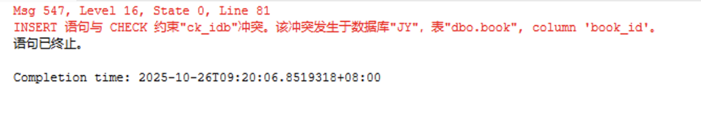

### 6.创建规则rule_sex, 规定插入或更新的值只能是‘男’或‘女’，并绑定到reader表的reader_sex字段。
- sql语法分析
  - 使用CREATE RULE语句创建规则
  - @value表示要插入或更新的值
  - 使用sp_bindrule存储过程将规则绑定到指定的列
- sql代码
```sql
-- create rule to restrict values to '男' or '女'
CREATE RULE rule_sex AS @value IN ('男', '女');
-- bind rule to reader_sex column in reader table
EXEC sp_bindrule 'rule_sex', 'reader.reader_sex';
-- insert or update a record to verify the rule
INSERT INTO reader (reader_id, reader_name, reader_sex, reader_department)
VALUES ('r0010', '张三', '沃尔玛塑料袋', '计算机系');
```
- 实验结果

插入记录时，出现违反规则的错误，说明规则起作用

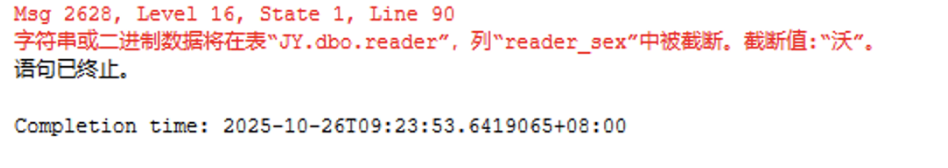

### 7.插入或修改一条记录，分别验证上面5和6的CHECK约束是否起作用。
- sql语法分析
  - 向book表和reader中插入记录，验证CHECK约束是否生效
  - 如果插入的记录违反了CHECK约束或规则，则会引发错误，说明约束或规则起作用
- sql代码
```sql
-- insert or update a record to verify the CHECK constraint
INSERT INTO book (book_id, book_name, book_isbn, book_author, book_publisher, book_price, interviews_times)
VALUES ('b1', '新书名', '978-7-121-22013-5', '廖梦怡', '电子工业出版社', 89.00, 38);
-- insert or update a record to verify the rule
INSERT INTO reader (reader_id, reader_name, reader_sex, reader_department)
VALUES ('r0010', '张三', '沃尔玛塑料袋', '计算机系');
```
- 实验结果

插入记录时，出现违反CHECK约束和规则的错误，说明CHECK约束和规则起作用

  


## 💡 实验总结

### 语法总结
1. 主键约束（PRIMARY KEY）用于唯一标识表中的每一行，主键字段必须唯一且不允许为NULL。
2. 外键约束（FOREIGN KEY）用于保证表与表之间的数据一致性，外键字段的数据类型和主表被引用字段必须完全一致，且只能引用主表的主键或唯一约束。
3. 唯一性约束（UNIQUE）保证某一列（或多列组合）中的值唯一，允许NULL。
4. 检查约束（CHECK）用于限定字段取值范围，SQL Server的LIKE语法仅支持简单通配符，不支持正则表达式。
5. 规则（RULE）可用于限定字段取值，但已被CHECK约束取代，建议优先使用CHECK。
6. 添加外键时，若需ON DELETE/UPDATE SET NULL，外键字段必须允许NULL。
7. 删除或修改约束前需确保无依赖关系，否则会报错。

### 反思
1. record表主键只用borrow_date，实际业务上可能不唯一，建议使用（reader_id, book_id, borrow_date）联合主键更合理。
2. 遇到报错要仔细分析报错信息，逐步排查依赖关系和字段属性。

### 心得体会

通过本次实验，深入理解了数据库完整性约束的作用和实现方法。实际操作中，约束的添加、删除、修改都需要注意字段属性和依赖关系，遇到报错要善于分析原因。掌握了主键、外键、唯一性、检查约束的常见用法和注意事项，对数据库设计的规范性和数据一致性有了更深刻的认识。今后在实际开发中，会更加注重表结构设计和约束条件的合理性，提升数据库应用的健壮性和安全性。

## 📚 参考资料
- 实验课件
- 作业

## 附件
- 无（代码已经在报告中逐步展示）