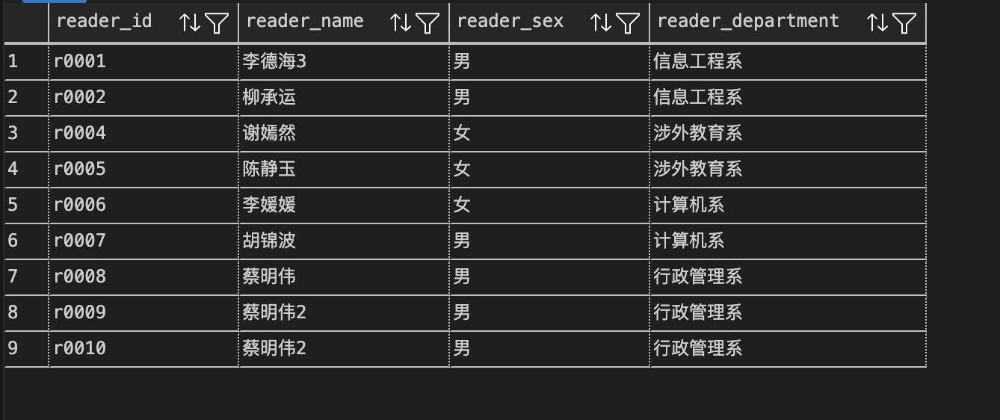
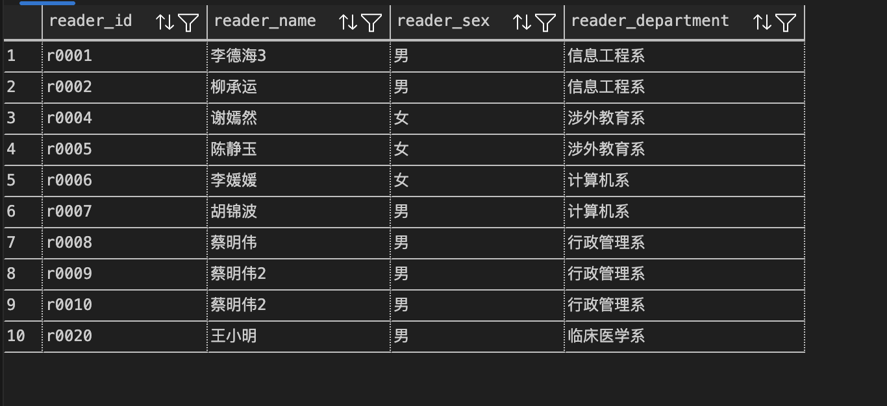
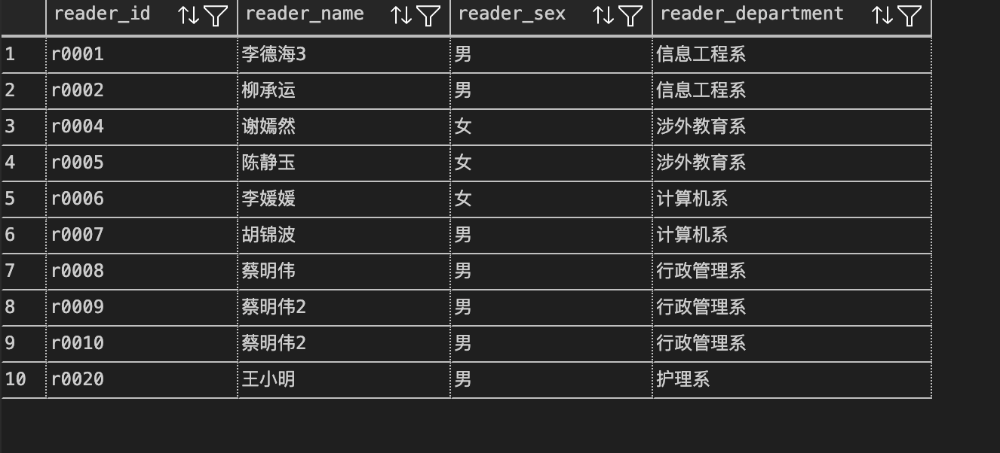
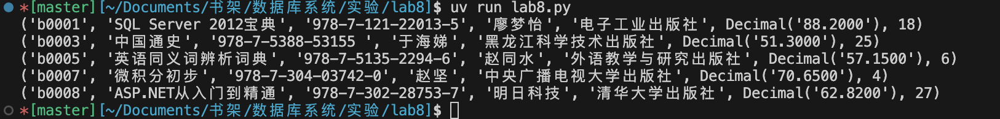
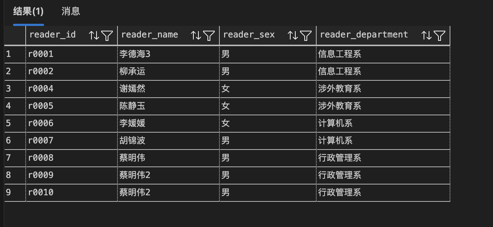
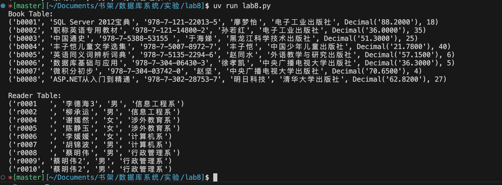

<div align="center">
    

<br><br><br>
</div>
<div style="font-size:1.6em; font-weight:normal; line-height:1.6;">
<div style="text-align:center; font-size:2.9em; font-weight:normal; letter-spacing:0.1em;">实验作业报告</div>
<br/>
<br>
<div style="text-align:center; font-size:1.3em; line-height:1.8;">
  <table style="margin: 0 auto; font-size:1.1em;">
  <tr><td align="right">实验：</td><td align="left">数据库系统实验</td></tr>
  <tr><td align="right">学号：</td><td align="left">23320093</td></tr>
  <tr><td align="right">姓名：</td><td align="left">林宏宇</td></tr>
  <tr><td align="right">专业：</td><td align="left">计算机科学与技术</td></tr>
  <tr><td align="right">班级：</td><td align="left">计科1班</td></tr>
  <tr><td align="right">指导教师：</td><td align="left">赖韩江</td></tr>
  <tr><td align="right"style="border-bottom:1px solid #000;">实验日期：</td><td align="left" style="border-bottom:1px solid #000;">2025年11月13日</td></tr>
  </table>
</div>
</div>

<div STYLE="page-break-after: always;"></div>

# 数据库应用开发实验报告

## ✏️ 实验目的

掌握使用程序设计语言访问数据库，使用pymssql连接图书借阅数据库系统JY，并利用pymssql执行操作

## 📋 实验内容
- 实验平台：SSMS
- 对于每一个实验问题，都会从**语法分析**、**python代码**、**实验结果**这三个方面进行回答

### 1.pymysql库函数
- import pymssql：导入pymssql库
- pymssql.connect(server, user, password, database)：连接到数据库
- cursor()：创建一个游标对象，用于执行SQL语句
- execute()：执行SQL语句
- commit()：提交事务
- close()：关闭游标和连接
> 此次实验除了使用python进行数据库操作，还使用了vscode扩展对SSMS进行连接，以便于简化结果展示流程

### 1. 在reader表增加一条数据：'r0020', '王小明', '男', '临床医学系'；
- 语法分析
  - 使用INSERT INTO语句向reader表中插入一条新的记录
- python代码
```python
import pymssql
# 连接到数据库
conn = pymssql.connect(server='192.168.3.76', user='lhy', password='123456..', database='JY')
cursor = conn.cursor()
# 插入新读者数据
insert_query = "INSERT INTO reader (reader_id, reader_name, reader_sex, reader_department) VALUES (%s, %s, %s, %s)"
new_reader = ('r0020', '王小明', '男', '临床医学系')
cursor.execute(insert_query, new_reader)
conn.commit()
cursor.close()
conn.close()
```
- 实验结果

插入数据之前：  


插入数据之后：  


### 2. 将reader表新增数据 'r0020' 的部门更新为 '护理系' ；
- 语法分析
  - 使用UPDATE语句更新reader表中指定读者的部门信息
- python代码
```python
import pymssql
# 连接到数据库
conn = pymssql.connect(server='192.168.3.76', user='lhy', password='123456..', database='JY')
cursor = conn.cursor()
# 更新读者部门信息
update_query = "UPDATE reader SET reader_department = %s WHERE reader_id = %s"
updated_department = ('护理系', 'r0020')
cursor.execute(update_query, updated_department)
conn.commit()
cursor.close()
conn.close()
```
- 实验结果



### 3. 查询价格高于 50 的书籍，并打印；
- 语法分析
  - 使用SELECT语句从book表中查询价格高于50的书籍
  - 查询结果通过fetchall()方法获取并打印
- python代码
```python
import pymssql
# 连接到数据库
conn = pymssql.connect(server='192.168.3.76', user='lhy', password='123456..', database='JY')
cursor = conn.cursor()
# 查询价格高于50的书籍
select_query = "SELECT * FROM book WHERE book_price > %s"
cursor.execute(select_query, (50,))
# 获取并打印结果
results = cursor.fetchall()
for row in results:
    print(row)
cursor.close()
conn.close()
```
- 实验结果



### 4. 查询信息工程系的读者，并打印；
- 语法分析
  - 使用SELECT语句从reader表中查询信息工程系的读者
  - 查询结果通过fetchall()方法获取并打印
- python代码
```python
import pymssql
# 连接到数据库
conn = pymssql.connect(server='192.168.3.76', user='lhy', password='123456..', database='JY')
cursor = conn.cursor()
# 查询信息工程系的读者
select_query = "SELECT * FROM reader WHERE reader_department = %s"
cursor.execute(select_query, ('信息工程系',))
# 获取并打印结果
results = cursor.fetchall()
for row in results:
    print(row)
cursor.close()
conn.close()
```
- 实验结果


### 5. 删除reader表新增数据'r0020'。
- 语法分析
  - 使用DELETE语句从reader表中删除指定读者的记录
- python代码
```python
import pymssql
# 连接到数据库
conn = pymssql.connect(server='192.168.3.76', user='lhy', password='123456..', database='JY')
cursor = conn.cursor()
# 删除指定读者数据
delete_query = "DELETE FROM reader WHERE reader_id = %s"
cursor.execute(delete_query, ('r0020',))
conn.commit()
cursor.close()
conn.close()
```

- 实验结果



### 6. 打印图书表book、读者表reader的所有数据。
- 语法分析
  - 使用SELECT语句从book表和reader表中查询所有记录
  - 查询结果通过fetchall()方法获取并打印
- python代码
```python
import pymssql
# 连接到数据库
conn = pymssql.connect(server='192.168.3.76', user='lhy', password='123456..', database='JY')
cursor = conn.cursor()
# 查询所有图书数据
select_books_query = "SELECT * FROM book"
cursor.execute(select_books_query)
books = cursor.fetchall()
for book in books:
    print(book)
# 查询所有读者数据
select_readers_query = "SELECT * FROM reader"
cursor.execute(select_readers_query)
readers = cursor.fetchall()
for reader in readers:
    print(reader)
cursor.close()
conn.close()
```
- 实验结果



## 💡 实验总结

### 技术总结
本次实验主要掌握了使用 Python 程序设计语言通过 pymssql 库访问 SQL Server 数据库的基本方法。实验中使用了 pymssql.connect() 建立数据库连接，cursor() 创建游标对象，execute() 执行 SQL 语句，commit() 提交事务，以及 close() 关闭连接等关键函数。同时，结合了 SQL 语句的增删改查操作，包括 INSERT、UPDATE、SELECT 和 DELETE 语句。此外，还在 VS Code 中安装并配置了 mssql 扩展，用于简化数据库连接和查询展示，提高了开发效率。整个过程涉及数据库连接配置、SQL 语法分析、Python 代码编写和结果验证，巩固了数据库应用开发的技能。

### 实验心得
通过本次实验，我深入了解了 Python 与数据库的交互方式，特别是 pymssql 库在连接 SQL Server 时的应用。实验过程中遇到了一些连接配置的挑战，如端口开放、防火墙设置和 SSL 证书信任，但通过逐步排查和配置，最终成功建立了连接。这让我认识到数据库连接的复杂性和重要性。在编写代码时，注意了参数化查询以防止 SQL 注入，提高了代码的安全性。总体而言，这次实验不仅提升了我的编程技能，还增强了对数据库系统的理解和操作信心。未来，我希望能进一步探索更高级的数据库操作，如存储过程和事务管理。

## 📚 参考资料
- 实验课件
- 作业

## 附件
- lab8 code
```python
import pymssql
"""
SQL Server连接配置信息
主机: 192.168.3.76
端口: 1433
用户: lhy
密码: 123456..
数据库: JY
"""
import pymssql
# 连接到数据库
conn = pymssql.connect(server='192.168.3.76', user='lhy', password='123456..', database='JY')
cursor = conn.cursor()

# Q1:插入新读者数据
insert_query = "INSERT INTO reader (reader_id, reader_name, reader_sex, reader_department) VALUES (%s, %s, %s, %s)"
new_reader = ('r0020', '王小明', '男', '临床医学系')
cursor.execute(insert_query, new_reader)
conn.commit()

# Q2: 更新读者部门信息
update_query = "UPDATE reader SET reader_department = %s WHERE reader_id = %s"
updated_department = ('护理系', 'r0020')
cursor.execute(update_query, updated_department)
conn.commit()

# Q3: 查询价格大于50的书籍
select_query = "SELECT * FROM book WHERE book_price > %s"
cursor.execute(select_query, (50,))
# 获取并打印结果
results = cursor.fetchall()
for row in results:
    print(row)

# Q4: 查询信息工程系的读者
select_query = "SELECT * FROM reader WHERE reader_department = %s"
cursor.execute(select_query, ('信息工程系',))
# 获取并打印结果
results = cursor.fetchall()
for row in results:
    print(row)

# Q5: 删除指定读者数据
delete_query = "DELETE FROM reader WHERE reader_id = %s"
cursor.execute(delete_query, ('r0020',))
conn.commit()

# Q6: 显示所有图书和读者数据
# 查询所有图书数据
select_books_query = "SELECT * FROM book"
cursor.execute(select_books_query)
books = cursor.fetchall()
print("Book Table: ")
for book in books:
    print(book)
# 查询所有读者数据
select_readers_query = "SELECT * FROM reader"
cursor.execute(select_readers_query)
readers = cursor.fetchall()
print("\nReader Table: ")
for reader in readers:
    print(reader)

cursor.close()
conn.close()
```