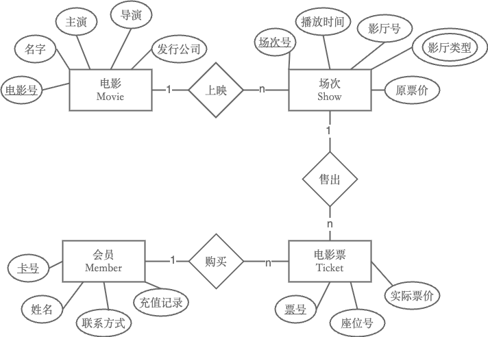
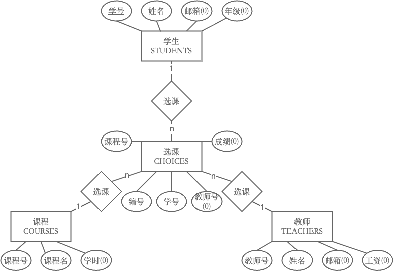

<div align="center">
    

<br><br><br>
</div>
<div style="font-size:1.6em; font-weight:normal; line-height:1.6;">
<div style="text-align:center; font-size:2.9em; font-weight:normal; letter-spacing:0.1em;">实验作业报告</div>
<br/>
<br>
<div style="text-align:center; font-size:1.3em; line-height:1.8;">
  <table style="margin: 0 auto; font-size:1.1em;">
  <tr><td align="right">实验：</td><td align="left">数据库系统实验</td></tr>
  <tr><td align="right">学号：</td><td align="left">23320093</td></tr>
  <tr><td align="right">姓名：</td><td align="left">林宏宇</td></tr>
  <tr><td align="right">专业：</td><td align="left">计算机科学与技术</td></tr>
  <tr><td align="right">班级：</td><td align="left">计科1班</td></tr>
  <tr><td align="right">指导教师：</td><td align="left">赖韩江</td></tr>
  <tr><td align="right"style="border-bottom:1px solid #000;">实验日期：</td><td align="left" style="border-bottom:1px solid #000;">2025年11月20日</td></tr>
  </table>
</div>
</div>

<div STYLE="page-break-after: always;"></div>

# 数据库应用开发实验报告

## ✏️ 实验目的

掌握数据库设计的基本方法（ER图）

## 📋 实验内容

### 0. 数据库ER图绘图要求
- 1、实体（entity）

即数据模型中的数据对象（即数据表），用长方体来表示，每个实体都有自己的实体成员（entity member）或者说实体对象（entity instance），例如学生实体里包括张三、李四等。

- 2、属性（attribute）

即实体所具有的属性，例如学生具有姓名、学号、年级等属性，用椭圆形表示，属性分为唯一属性（ unique attribute）和非唯一属性，唯一属性指的是唯一可用来标识该实体实例或者成员的属性，用下划线表示，一般来讲实体都至少有一个唯一属性。ER图的属性还细分为复合属性、多值属性和派生属性、可选属性，同时还有用来表示联系的属性，称为联系属性。
  - 复合属性是指具有多个属性的组合，例如名字属性，它可以包含姓氏属性和名字属性。复合属性也有唯一属性，例如学生的所在班级属性，由于多个年级都有班级，所以单单班级属性是不唯一的，但是和年级组成的复合属性后则可以匹配成唯一属性。
  - 多值属性：一个实体的某个属性可以有多个不同的取值，称为多值属性。例如一本书的分类属性，这本书有多个分类。
  - 派生属性：是非永久性存于数据库的属性。派生属性的值可以从别的属性值或其他数据（如当前日期）派生出来，用虚线椭圆表示。
  - 可选属性：并不是所有的属性都必须有值，有些属性的可以没有值，这就是可选属性，在椭圆的文字后用（O）来表示。
  - 联系属性：联系属于用户表示多个实体之间联系所具有的属性，一般来讲M:N的两个实体的联系具有联系属性，在1:1和1:M的实体联系中联系属性并不必要。

- 3、关系（relationship）

用来表现数据对象与数据对象之间的联系，例如学生的实体和成绩表的实体之间有一定的联系，每个学生都有自己的成绩表，这就是一种关系，关系用菱形来表示。
关联关系有三种：
  - 1对1（1:1）：指对于实体集A与实体集B，A中的每一个实体至多与B中一个实体有关系；反之，在实体集B中的每个实体至多与实体集A中一个实体有关系。
  - 1对多（1:N）：1对多关系是指实体集A与实体集B中至少有N（N>0）个实体有关系；并且实体集B中每一个实体至多与实体集A中一个实体有关系。
  - 多对多（M:N）：多对多关系是指实体集A中的每一个实体与实体集B中至少有M（M>0）个实体有关系，并且实体集B中的每一个实体与实体集A中的至少N（N>0）个实体有关系。


### 1. 数据库设计

为某电影院设计数据库。每部电影需记录名字、主演、导演、发行公司信息。一部电影上映多个场次，场次要记录播放时间，影厅号，影厅类型（IMAX，杜比、普通厅等）、原票价。每个场次售出多张电影票，电影票要记录座位号、实际票价。影院设有会员制，一个会员可购买多张电影票，会员要记录会员卡号，姓名，联系方式，充值记录。
(1)根据上述语义画出E-R图。 
(2)将该E-R模型转换为关系模型。
> 本次实验使用 [freedgo design](https://zhuanlan.zhihu.com/p/382386934) 绘制ER图，导出图片插入到报告中

#### ER图——实体

- 电影（Movie）：电影号(pk)、名字、主演、导演、发行公司
- 场次（Show）：场次号(pk)、播放时间、影厅号、影厅类型(多值类型)、原票价
- 电影票（Ticket）：票号(pk)、座位号、实际票价
- 会员（Member）：卡号(pk)、姓名、联系方式、充值记录

#### ER图——关系

- 电影与场次：一对多（每部电影有多个场次）
- 场次与电影票：一对多（每个场次有多张票）
- 会员与电影票：一对多（会员可购买多张票）

#### ER图结果展示



### 2. 为实验教材上的 school 数据库画E-R图

#### School数据库的建表语句
- student表
```sql
CREATE TABLE [dbo].[STUDENTS](
	[sid] [char](10) NOT NULL,
	[sname] [char](30) NOT NULL,
	[email] [char](30) NULL,
	[grade] [int] NULL,
	PRIMARY KEY (sid)                
) ON [PRIMARY]
```
- teachers表
```sql  

CREATE TABLE [dbo].[TEACHERS](
	[tid] [char](10) NOT NULL,
	[tname] [char](30) NOT NULL,
	[email] [char](30) NULL,
	[salary] [int] NULL,
	primary key(tid)
) ON [PRIMARY]
```
- courses表
```sql
CREATE TABLE [dbo].[COURSES](
	[cid] [char](10) NOT NULL,
	[cname] [char](30) NOT NULL,
	[hour] [int] NULL,
	primary key(cid)
) ON [PRIMARY]
```
- choices表
```sql
CREATE TABLE [dbo].[CHOICES](
	[no] [int] NOT NULL,
	[sid] [char](10) NOT NULL,
	[tid] [char](10) NULL,
	[cid] [char](10) NOT NULL,
	[score] [int] NULL
	Primary key (no),
	constraint FK_CHOICES_STUDENTS Foreign key(sid) references Students(sid),
	constraint FK_CHOICES_Teachers Foreign key(tid) references Teachers(tid),
	constraint FK_CHOICES_Courses Foreign key(cid) references Courses(cid),
) ON [PRIMARY]
```

#### ER图实体

- 学生（STUDENTS）：学号（sid，主码）、姓名（sname）、邮箱（email，可选）、年级（grade，可选）
- 教师（TEACHERS）：教师号（tid，主码）、姓名（tname）、邮箱（email，可选）、工资（salary，可选）
- 课程（COURSES）：课程号（cid，主码）、课程名（cname）、学时（hour，可选）
- 选课（CHOICES）：编号（no，主码）、学号（sid，外码）、教师号（tid，外码，可选）、课程号（cid，外码）、成绩（score，可选）

#### ER图关系

- 学生-选课（STUDENTS-CHOICES）：一对多（1:N），一个学生可以有多条选课记录
- 教师-选课（TEACHERS-CHOICES）：一对多（1:N），一个教师可以关联多条选课记录
- 课程-选课（COURSES-CHOICES）：一对多（1:N），一门课程可以被多名学生选修

#### ER图结果展示



## 💡 实验总结

### 技术总结

本次实验通过对实际业务场景（如电影院、School数据库）进行ER图建模，深入理解了实体、属性、关系的基本概念及其在数据库设计中的作用。掌握了ER图的绘制规范，包括实体的唯一属性、可选属性、多值属性、联系属性等的表示方法，以及一对多、多对多等关系的建模方式。通过将ER模型转换为关系模型，进一步理解了主码、外码、联系实体等在实际数据库表设计中的体现。实验还锻炼了使用ER图工具（如Freedgo Design、Visio等）进行可视化建模的能力。

### 实验心得

通过本次数据库ER图建模实验，我对数据库设计的理论与实践有了更深刻的认识。ER图不仅帮助理清了各实体之间的联系，也为后续的关系模型设计和SQL实现打下了坚实基础。在分析School数据库时，体会到规范化设计的重要性，合理设置主码、外码和联系实体，有助于数据一致性和完整性的维护。实验过程中遇到的难点主要在于多对多关系的拆分和联系属性的处理，通过查阅资料和动手实践，问题得以顺利解决。整体而言，实验提升了我的数据库建模能力和解决实际问题的综合素养。


## 📚 参考资料
- [CSDN参考链接1](https://blog.csdn.net/William0318/article/details/104348102?fromshare=blogdetail&sharetype=blogdetail&sharerId=104348102&sharerefer=PC&sharesource=FulL_cpp&sharefrom=from_link)
- [CSDN参考链接2](https://blog.csdn.net/2509_90521467/article/details/145472733?fromshare=blogdetail&sharetype=blogdetail&sharerId=145472733&sharerefer=PC&sharesource=FulL_cpp&sharefrom=from_link)
- 实验作业要求

## 附件
- 无