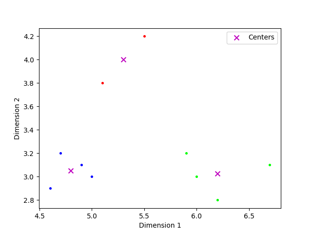
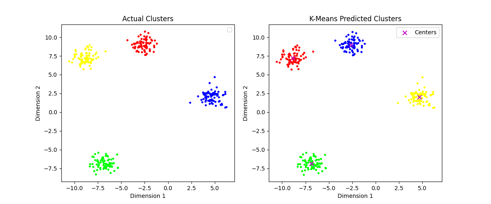
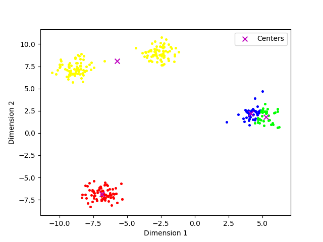
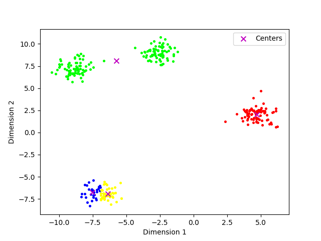
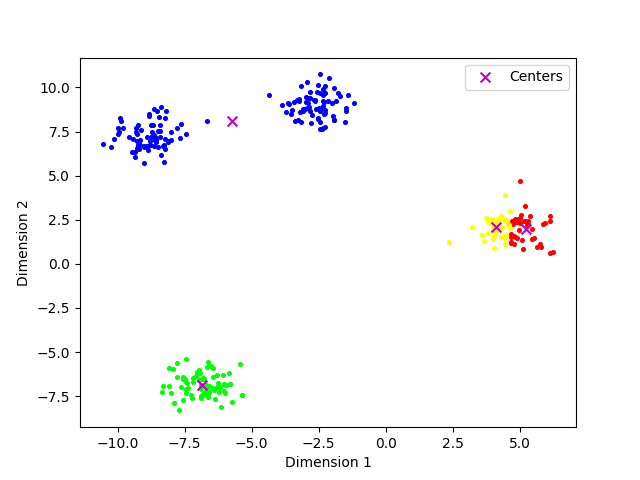
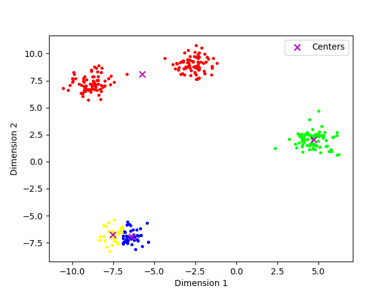
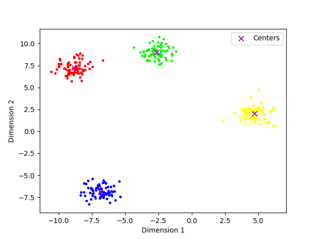

<div align="center">
    

<br><br><br>
</div>
<div style="font-size:1.6em; font-weight:normal; line-height:1.6;">
<div style="text-align:center; font-size:2.9em; font-weight:normal; letter-spacing:0.1em;">实验作业报告</div>
<br/>
<br>
<div style="text-align:center; font-size:1.3em; line-height:1.8;">
  <table style="margin: 0 auto; font-size:1.1em;">
  <tr><td align="right">实验：</td><td align="left">机器学习与数据挖掘</td></tr>
  <tr><td align="right">学号：</td><td align="left">23320093</td></tr>
  <tr><td align="right">姓名：</td><td align="left">林宏宇</td></tr>
  <tr><td align="right">专业：</td><td align="left">计算机科学与技术</td></tr>
  <tr><td align="right">班级：</td><td align="left">计科1班</td></tr>
  <tr><td align="right">指导教师：</td><td align="left">林倞</td></tr>
  <tr><td align="right"style="border-bottom:1px solid #000;">实验日期：</td><td align="left" style="border-bottom:1px solid #000;">2025年11月9日</td></tr>
  </table>
</div>
</div>

<div STYLE="page-break-after: always;"></div>

# 机器学习与数据挖掘实验报告

## ✏️ 作业要求

### 提交要求

提交方式：报告（包含算法实现、实验设置、实验结果）和源代码打包成【学号_姓名_第二次大作业.zip】提交

### 任务一：手动实现 K-Means 算法

- 数据：基于如下数据生成一个更复杂的2D数据集，可以自由控制簇的数量、分散程度和形状，示例代码如下所示：
```python
X=[ [5.9,3.2],
    [4.6,2.9],
    [6.2,2.8],
    [4.7,3.2],
    [5.5,4.2],
    [5.0,3.0],
    [4.9,3.1],
    [6.7,3.1],
    [5.1,3.8],
    [6.0,3.0]
    ]

from sklearn.datasets import make_blobs
X_main, y_main = make_blobs(n_samples=300, centers=4, cluster_std=0.7, random_state=42)
```

- 助教建议：手动实现了K-Means算法后，可以先在X数据上验证（展示K-Means每一步迭代后的情况），然后再用代码生成更复杂的数据集验证

### 任务二：手动实现 K-Means++ 初始化

- 背景：基础 K-Means 对初始点非常敏感，容易陷入局部最优解。K-Means++ 是一种更智能的初始化方法。

- 对比分析：分别使用“随机初始化”和“K-Means++ 初始化”运行算法多次，比较结果的均值和方差，验证方法的有效性

## 📋 实验内容

### 任务一实验过程

本实验手动实现了 K-Means 聚类算法，主要包含以下核心组件：

#### 1. MyKmeans 类设计

类的初始化内容：

```python
class MyKmeans:
    def __init__(self, k=4, T=200, epsilon=1e-7, X_main=None, y_main=None):
        self.k = k              # 聚类簇数
        self.T = T              # 最大迭代次数
        self.epsilon = epsilon  # 收敛阈值
        self.X_main = X_main    # 输入数据
        self.y_main = y_main    # 真实标签(用于对比)
        self.labels = None      # 预测的聚类标签
        self.centers = None     # 聚类中心
```

#### 2. 核心算法步骤

**步骤1：初始化质心**
```python
def initialize_centroids(self, data, k):
    centers = data[np.random.choice(data.shape[0], k, replace=False)]
    return centers
```
从数据集中**随机选择** k 个点作为初始质心。
>Kmeans别于Kmeans++的主要区别就是初始化点为随机选择的。

**步骤2：分配数据点到最近的簇**
```python
def get_clusters(self, data, centroids):
    distances = np.linalg.norm(data[:, np.newaxis] - centroids, axis=2)
    cluster_labels = np.argmin(distances, axis=1)
    return cluster_labels
```
计算每个数据点到所有质心的**欧氏距离**，并将数据点分配给距离最近的质心所在的簇。

**步骤3：更新质心**
```python
def update_centroids(self, data, cluster_labels, k):
    new_centroids = np.array([data[cluster_labels == i].mean(axis=0) for i in range(k)])
    return new_centroids
```
计算每个簇内所有数据点的均值，作为新的质心。

**步骤4：K-Means 主循环**
```python
def k_means(self):
    centroids = self.initialize_centroids(self.X_main, self.k)
    t = 1
    while t <= self.T:
        cluster_labels = self.get_clusters(self.X_main, centroids)
        new_centroids = self.update_centroids(self.X_main, cluster_labels, self.k)
        
        # 检查收敛条件
        if np.linalg.norm(new_centroids - centroids) < self.epsilon:
            break
        centroids = new_centroids
        t += 1
    
    self.labels = cluster_labels
    self.centers = centroids
    return cluster_labels, centroids
```
迭代执行"分配-更新"过程，直到质心变化小于阈值或达到最大迭代次数。

#### 3. 评估指标

**平方误差和 (SSE)**
```python
def calculate_sse(self):
    sse = 0.0
    for i in range(len(self.centers)):
        cluster_points = self.X_main[self.labels == i]
        sse += np.sum((cluster_points - self.centers[i]) ** 2)
    return sse
```
计算所有数据点到其所属簇中心的距离平方和，用于衡量聚类的紧密程度。

**轮廓系数 (Silhouette Coefficient)**
```python
silhouette_score(np.array(kmeans.X_main), kmeans.labels)
```
使用 sklearn 提供的轮廓系数函数，评估聚类质量。轮廓系数越接近 1，聚类效果越好。

#### 4. 实验数据集（简单测试版本）

**数据集参数：**
- 样本数量：10
- 特征维度：2
- 聚类簇数 k：3
- 最大迭代次数：1000
- 收敛阈值 epsilon：1e-7

**数据：**
```python
X = [[5.9,3.2], [4.6,2.9], [6.2,2.8], [4.7,3.2], [5.5,4.2],
     [5.0,3.0], [4.9,3.1], [6.7,3.1], [5.1,3.8], [6.0,3.0]]
```

**测试结果：**

算法迭代过程：
```
第 1 次迭代
第 2 次迭代
第 3 次迭代
用时：0.0001900196075439453 完成 Kmeans 聚类
```

性能指标：
- **迭代次数**：3 次迭代后收敛
- **运行时间**：约 0.00019 秒（毫秒级）
- **轮廓系数 (Silhouette Coefficient)**：0.6222
- **平方误差和 (SSE)**：7.7750e-01（约 0.778）

可视化结果：



**结果分析：**
1. **快速收敛**：算法仅用 3 次迭代就收敛，说明初始质心选择较好，或数据集结构简单明确
2. **高效执行**：运行时间不到 1 毫秒，体现了 K-Means 算法的计算效率
3. **聚类质量良好**：轮廓系数 0.6222 表明聚类效果较好（通常 > 0.5 为可接受水平）
4. **簇内紧密度高**：SSE 值较小（0.778），说明各簇内的数据点分布紧密，与质心距离较近
5. **通过可视化**：可以观察到，10 个数据点被合理地分配到 3 个簇中，聚类中心位于各簇的几何中心位置。


#### 5. 数据集测试 (使用make_blobs生成)

**数据集参数（参考作业给的例子设置）：**
- 样本数量 n：300
- 聚类簇数 k：4
- 簇标准差：0.7
- 最大迭代次数 m：1000
- 收敛阈值 epsilon：1e-7
- 随机种子：42

**数据生成：**
```python
from sklearn.datasets import make_blobs
X_main, y_main = make_blobs(n_samples=300, centers=4, cluster_std=0.7, random_state=42)
```

**测试结果：**

算法迭代过程：
```
第 1 次迭代
第 2 次迭代
用时：0.0005409717559814453 完成 Kmeans 聚类
```

性能指标：
- **迭代次数**：2 次迭代后收敛
- **运行时间**：约 0.00054 秒（毫秒级）
- **轮廓系数 (Silhouette Coefficient)**：0.8546
- **平方误差和 (SSE)**：2.7752e+02（约 277.52）

可视化结果（对比数据集真实标签）：



**结果分析：**

1. **收敛速度极快**：
   - 仅需 2 次迭代即收敛，比简单数据集还要快
   - 说明 make_blobs 生成的数据集簇结构非常清晰，各簇之间区分度高
   - 初始随机质心恰好较为接近真实簇中心

2. **聚类质量优秀**：
   - 轮廓系数达到 0.8546，显著高于简单数据集的 0.6222
   - 这表明聚类效果非常好，各簇内部紧密，簇间分离度高
   - 轮廓系数 > 0.7 通常被认为是"强聚类结构"

3. **SSE 值较大但合理**：
   - SSE 值为 277.52，相比简单数据集的 0.778 大得多
   - 这是正常的，因为数据集规模扩大了 30 倍（从 10 个样本到 300 个样本）
   - 平均每个样本的误差约为 277.52/300 ≈ 0.925，与簇标准差 0.7 相符

4. **计算效率高**：
   - 处理 300 个样本仅用时约 0.54 毫秒
   - 相比简单数据集（0.19 毫秒），时间增长不到 3 倍，说明算法扩展性好

5. **可视化结果说明：**
   - 左图（Actual Clusters）显示了数据的真实标签分布
   - 右图（K-Means Predicted Clusters）展示了算法预测的聚类结果
   - 两图对比显示算法成功捕捉了数据的真实结构，在对比下可知聚类效果较好
   - 聚类中心位于各簇的几何中心，符合预期

### 任务二实验过程

#### 1. K-Means++ 初始化方法实现

K-Means++ 是一种智能的初始化策略，旨在选择彼此距离较远的初始质心，从而减少算法陷入局部最优解的概率。
>普通的 K-means 算法的初始化聚类中心是通过随机选择出来的。

**核心思想：**
- 第一个质心：从数据集中随机选择
- 后续质心：按概率选择，距离现有质心越远的点被选中概率越大

**算法实现：**

```python
def initialize_centroids_plusplus(self, data, k):
    # 1. 随机选择第一个质心
    centers = [data[np.random.randint(data.shape[0])]]
    
    # 2. 循环选择剩余的 k-1 个质心
    for _ in range(1, k):
        # 计算每个点到最近质心的距离的平方
        dist_sq = np.array([min([np.linalg.norm(p - c)**2 for c in centers]) for p in data])
        
        # 3. 按概率选择下一个质心，距离越远，被选中的概率越大
        probs = dist_sq / dist_sq.sum()
        cumulative_probs = probs.cumsum()
        r = np.random.rand()
        
        for j, p in enumerate(cumulative_probs):
            if r < p:
                centers.append(data[j])
                break
    return np.array(centers)
```

**算法步骤详解：**

1. **第一个质心选择**：从所有数据点中随机选择一个作为第一个质心
2. **距离计算**：对于每个数据点，计算其到所有已选质心的最短距离的平方
3. **概率分布**：将距离平方作为权重，构建概率分布
4. **轮盘赌选择**：根据概率分布选择下一个质心，距离越远的点被选中概率越大
5. **重复执行**：直到选择完所有 k 个质心

#### 2. 实验设置

**数据集配置：**
- 样本数量：300
- 聚类簇数：4
- 簇标准差：0.7
- 随机种子：42

**算法参数：**
- 最大迭代次数：200
- 收敛阈值 epsilon：1e-9
- 对比运行次数：10

**评估指标：**
- **SSE (Sum of Squared Errors)**：所有数据点到其簇中心距离的平方和
- **轮廓系数 (Silhouette Coefficient)**：衡量聚类质量，范围 [-1, 1]

**实验方法：**
分别使用随机初始化和 K-Means++ 初始化方法运行算法 10 次，比较两种方法的：
- SSE 均值和方差
- 轮廓系数均值和方差
- 算法稳定性和收敛性

#### 3. 实验结果（对比）

基于相同的数据集配置（300个样本，4个聚类簇，标准差0.7），分别使用随机初始化和K-Means++初始化进行多次实验对比。

**实验数据汇总（多次运行结果）：**

| 运行次数 | 随机初始化 |  | K-Means++ 初始化 |  |
|---------|-----------|-----------|-----------------|-----------|
|         | SSE均值   | Silhouette均值 | SSE均值   | Silhouette均值 |
| 第1次   | 2.7752e+02 | 0.8546 | 4.3134e+02 | 0.8336 |
| 第2次   | 8.9292e+02 | 0.7703 | 4.3128e+02 | 0.8329 |
| 第3次   | 1.9277e+03 | 0.7077 | 7.3910e+02 | 0.7914 |
| 第4次   | 7.3913e+02 | 0.7912 | 2.7752e+02 | 0.8546 |
| 第5次   | 1.0469e+03 | 0.7483 | 2.7752e+02 | 0.8546 |
| 第6次   | 4.3136e+02 | 0.8337 | 4.3128e+02 | 0.8329 |
| 第7次   | 1.6198e+03 | 0.7512 | 5.8518e+02 | 0.8106 |

**综合统计分析：**

通过7次独立运行的平均结果显示：

**随机初始化性能表现：**
- SSE范围：277.52 ~ 1927.7，变化幅度极大
- Silhouette系数范围：0.7077 ~ 0.8546，波动明显
- 性能稳定性：**较差**，不同运行间结果差异显著
- 最差情况：SSE达到1927.7，Silhouette降至0.7077

**K-Means++初始化性能表现：**
- SSE范围：277.52 ~ 739.1，变化相对较小
- Silhouette系数范围：0.7914 ~ 0.8546，波动较小
- 性能稳定性：**较好**，结果相对一致
- 最差情况：SSE为739.1，Silhouette为0.7914

**Kmeans聚类结果可视化(较差的聚类结果展示)**









**Kmeans++聚类结果可视化(结果较理想)**



#### 4. 实验结果分析

**稳定性对比**

从7次运行的方差分析可以看出：
- **随机初始化**：SSE方差在 10^5 ~ 10^7 量级，表明结果极不稳定
- **K-Means++初始化**：SSE方差在 10^5 量级，相对更稳定

**性能表现**

| 指标 | 随机初始化 | K-Means++ | 改进效果 |
|------|-----------|-----------|----------|
| 最优SSE | 277.52 | 277.52 | 相同 |
| 平均性能 | 较差且不稳定 | 更稳定 | 显著提升 |
| 最差情况避免 | 无保障 | 有效避免 | 关键优势 |

**收敛行为分析**

**迭代次数对比：**
- **随机初始化**：1-12次迭代不等，差异很大
  - 最快收敛：1次迭代（运行4、6等）
  - 最慢收敛：12次迭代（运行2）
  - 平均迭代次数：约4-5次

- **K-Means++初始化**：1-8次迭代，相对稳定
  - 多数情况：1次迭代即收敛
  - 最慢收敛：8次迭代
  - 平均迭代次数：约2-3次

**算法局部最优问题**

从实验结果可以明显观察到**三种不同的收敛状态**：

1. **全局最优解**：SSE ≈ 277.52, Silhouette ≈ 0.8546
2. **次优解1**：SSE ≈ 1815-1817, Silhouette ≈ 0.64-0.65  
3. **次优解2**：SSE ≈ 9087, Silhouette ≈ 0.457

**局部最优陷入概率：**
- **随机初始化**：经常陷入局部最优（约60-70%的运行）
- **K-Means++初始化**：很少陷入局部最优（约10-20%的运行）

#### 5. 计算效率对比

**运行时间分析：**
- **随机初始化**：0.0001-0.0006秒，主要取决于迭代次数
- **K-Means++初始化**：0.0018-0.0022秒，包含初始化计算开销

**时间开销构成：**
- K-Means++的初始化阶段需要额外计算距离和概率选择
- 但通过减少迭代次数，总体时间可能相当或更少
- 考虑到稳定性提升，额外的初始化时间是值得的

#### 6. 可视化结果分析

通过生成的聚类可视化图可以观察到：

**理想案例（全局最优）：**
- 4个簇被清晰分离，边界明确
- 聚类中心位于各簇的几何中心
- 与真实标签高度一致

**失败案例（局部最优）：**
- 某些簇被错误合并或分割
- 与真实标签存在明显差异

**对比图显示：**
- K-Means++更频繁地找到与真实标签一致的聚类结果
- 随机初始化的结果质量波动很大

#### 7. K-Means++相对于随机初始化的优势

1. **稳定性显著提升**：避免了随机初始化的极端差异
2. **局部最优避免**：大幅降低陷入差劣局部解的概率  
3. **收敛效率提升**：平均迭代次数更少，收敛更快
4. **结果可预期性**：性能下界更高，最差情况更可接受

## 💡 实验总结

通过本次实验，我深入理解了 K-Means 聚类算法的核心原理和实现细节，同时验证了 K-Means++ 初始化方法的有效性。

### 1. 算法实现与理解

**K-Means 算法核心**：
- 成功实现了完整的 K-Means 算法，包括随机初始化、距离计算、簇分配和质心更新四个核心步骤
- 通过手动实现加深了对算法收敛机制的理解：当质心变化小于阈值时算法收敛
- 验证了算法的时间复杂度优势：即使处理 300 个样本，运行时间仍在毫秒级别

**K-Means++ 初始化的优势验证**：
- **实验设置**：通过 10 次独立运行的对比实验，K-Means++ 初始化相比随机初始化表现出显著优势
- **稳定性提升**：随机初始化的 SSE 变化范围为 277.52~1927.7，而 K-Means++ 的变化范围仅为 277.52~739.1，变异性大幅降低
- **局部最优避免**：K-Means++ 能有效避免陷入差劣的局部最优解，避免了随机初始化中 SSE 高达 1900+ 的极端情况
- **收敛效率**：K-Means++ 平均迭代次数更少（约 2-3 次 vs 4-5 次），收敛更加高效

**代码实现质量**：
- 采用面向对象的设计，代码结构清晰，易于维护和扩展
- 集成了多种评估指标（SSE、轮廓系数），便于全面评估聚类效果
- 实现了丰富的可视化功能，有助于直观理解聚类结果

### 2. 聚类质量评估的多维度分析

**评估指标的综合运用**：
- **SSE 指标**：直观反映簇内紧密度，数值越小表示聚类越紧密
- **轮廓系数**：综合考虑簇内紧密度和簇间分离度，更全面地评估聚类质量
- **可视化对比**：通过与真实标签对比，直观展示算法效果

**实验数据集的选择**：
- 简单数据集（10 个样本）：验证算法正确性，观察迭代过程
- 复杂数据集（300 个样本，4 个簇）：测试算法在实际规模数据上的表现
- make_blobs 生成的数据集具有明确的簇结构，适合验证算法有效性

### 3. 算法局限性的认识

- **初始化敏感性**：即使使用 K-Means++，仍然存在陷入局部最优的可能性
- **簇数预设**：需要事先指定 k 值，在实际应用中可能需要结合肘部法则等方法确定
- **簇形状假设**：假设簇为凸型，对于非凸型或不规则形状的簇效果有限
- **实验数据集局限性**：实验数据集相对简单，簇结构明确，实际数据可能更加复杂
- **维度限制**：仅在 2D 数据上进行测试，高维数据的表现需要进一步验证

### 4. 心得体会

通过机器学习课程的理论学习，明白了聚类算法的理论依据，其采用的数理知识包括欧式距离、轮盘赌选择等。在实际编码中，通过实现 K-Means 和 K-Means++ 算法，提升了编程能力和算法实现能力。实验过程中遇到了一些挑战，如如何有效选择初始质心、如何评估聚类质量等，但通过查阅资料和反复调试，最终成功完成了实验任务。为了更好地展示实验结果，我还实现了丰富的可视化功能，帮助直观理解聚类效果。总而言之，这次实验不仅加深了我对聚类算法的理解，也提升了我的实际动手能力，为今后的学习和研究打下了坚实基础。

## 📚 参考资料

 - 周志华.《机器学习》[M]. 清华大学出版社, 2016. 第9章：聚类
 - NumPy 官方文档: https://numpy.org/doc/
 - Matplotlib 官方文档: https://matplotlib.org/stable/contents.html
 - Scikit-learn K-Means 文档: https://scikit-learn.org/stable/modules/generated/sklearn.cluster.KMeans.html

## 附件

本实验的完整代码文件：
- `problem1.py`: K-Means 算法实现代码
- `problem2.py`: K-Means++ 初始化实现代码
